Approximate time: 45 minutes

## Learning Objectives:

* Understand the general steps leading to generation of the count matrix

# Single-cell RNA-seq

## Why single-cell RNA-seq

Across human tissues there is an incredible diversity of cell types, states, and interactions. To better understand these tissues and the cell types present, single-cell RNA-seq (scRNA-seq) offers a glimpse into what genes are being expressed at the level of individual cells. 

_**Image credit:** courtesy of Dr. Ayshwarya Subramanian_

This exciting and cutting-edge method can be used to:

- explore which cell types are present in a tissue
- identify unknown/rare cell types or states
- elucidate the changes in gene expression during differentiation processes or across time or states
- identify genes that are differentially expressed in particular cell types between conditions (e.g. treatment or disease)
- explore changes in expression among a cell type while incorporating spatial, regulatory, and/or protein information

Popular methods to address some of the more common investigations include:

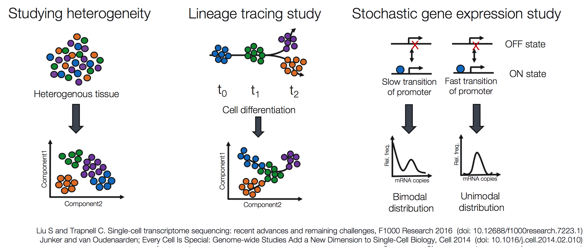

## Challenges of scRNA-seq analysis

Prior to scRNA-seq, transcriptome analysis was performed using bulk RNA-seq, which is straight-forward method for comparing the **averages of cellular expression**. This can be the best choice of method if looking for disease biomarkers and not expecting or not concerned with a lot of cellular heterogeneity in the sample.

While bulk RNA-seq can explore differences in gene expression between conditions (e.g. treatment or disease), the differences at the cellular level are not adequately captured. For instance, in the images below, if analyzed in bulk (left) we would not detect the correct association between the expression of gene A and gene B. However, if we properly group the cells by cell type or cell state, we can see the correct correlation between the genes.

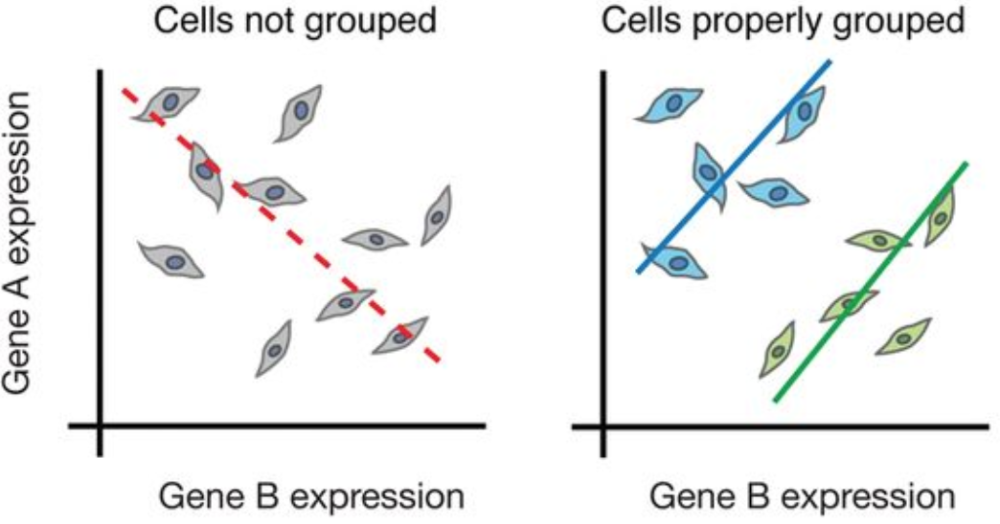

_**Image credit:** 2015 Trapnell; Published by Cold Spring Harbor Laboratory Press_

Despite scRNA-seq being able to capture expression at the cellular level, sample generation and library preparation is more expensive and the analysis is much **more complicated and more difficult to interpret**. The complexity of analysis of scRNA-seq data involves:

- Large volume of data
- Low depth of sequencing per cell
- Technical variability across cells/samples
- Biological variability across cells/samples

### Large volume of data

Expression data from scRNA-seq experiments represent ten or hundreds of thousands of reads for thousands of cells. The data output is much larger, requiring higher amounts of memory to analyze, larger storage requirements, and more time to run the analyses.

### Low depth of sequencing per cell

For the droplet-based methods of scRNA-seq, the depth of sequencing is shallow, often detecting only 10-50% of the transcriptome per cell. This results in cells showing zero counts for many of the genes, or **zero inflation**. However, in a particular cell, a zero count for a gene could either mean that the gene was **not being expressed** or the transcripts were just **not detected**. Across cells, genes with higher levels of expression tend to have fewer zeros. Due to this feature, many genes will not be detected in any cell and gene expression will be highly variable between cells.

### Biological variability across cells/samples

Uninteresting sources of biological variation can result in gene expression between cells being more similar/different than the actual biological cell types/states, which can obscure the cell type identities. Uninteresting sources of biological variation (unless part of the experiment's study) include:

- **Transcriptional bursting:** Gene transcription is not turned on all of the time for all genes. Time of harvest will determine whether gene is on or off in each cell.
- **Varying rates of RNA processing:** Different RNAs are processed at different rates.
- **Continuous or discrete cell identities (e.g. the pro-inflammatory potential of each individual T cell):** Continuous phenotypes are by definitition variable in gene expression, and separating the continuous from the discrete can sometimes be difficult.
- **Environmental stimuli:** The local environment of the cell can influence the gene expression depending on spatial position, signaling molecules, etc.
- **Temporal changes:** Fundamental fluxuating cellular processes, such as cell cycle, can affect the gene expression profiles of individual cells.

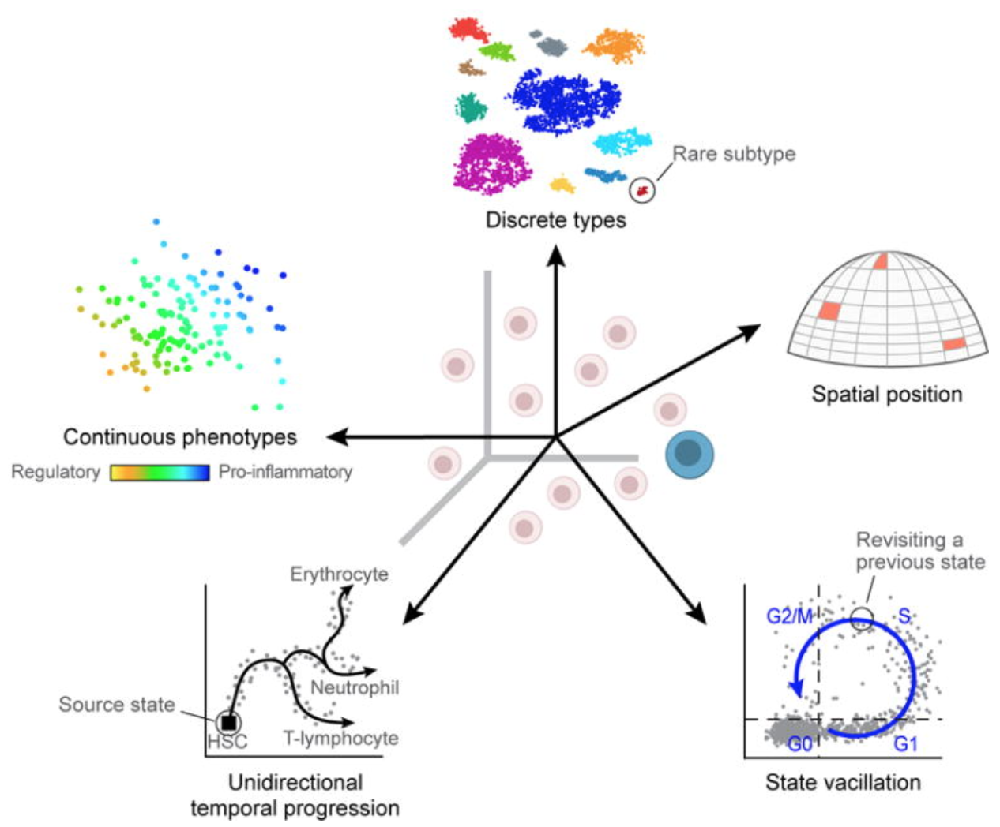

### Technical variability across cells/samples

Technical sources of variation can result in gene expression between cells being more similar/different based on technical sources instead of biological cell types/states, which can obscure the cell type identities. Technical sources of variation include:

- **Cell-specific capture efficiency:** Different cells will have differing numbers of transcripts captured resulting in differences in sequencing depth (e.g. 10-50% of transcriptome).
- **Library quality:** Degraded RNA, low viability/dying cells, lots of free floating RNA, poorly dissociated cells, and inaccurate quantitation of cells can result in low quality metrics
- **Amplification bias:** During the amplification step of library preparation, not all transcripts are amplified to the same level.
- **Batch effects:** Batch effects are a significant issue for scRNA-Seq analyses, since you can see significant differences in expression due solely to the batch effect. 

	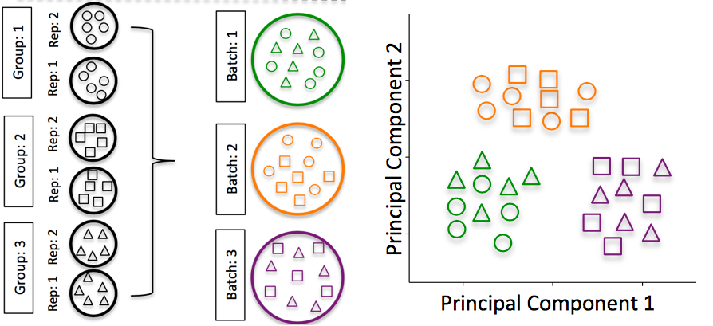
	
	*Image credit: [Hicks SC, et al., bioRxiv (2015)](https://www.biorxiv.org/content/early/2015/08/25/025528)*

	To explore the issues generated by poor batch study design, they are highlighted nicely in [this paper](https://f1000research.com/articles/4-121/v1).
	
	**How to know whether you have batches?**
	
	- Were all RNA isolations performed on the same day?
	
	- Were all library preparations performed on the same day?
	
	- Did the same person perform the RNA isolation/library preparation for all samples?
	
	- Did you use the same reagents for all samples?
	
	- Did you perform the RNA isolation/library preparation in the same location?
	
	If *any* of the answers is **‘No’**, then you have batches.
	
	**Best practices regarding batches:**
	
	- Design the experiment in a way to **avoid batches**, if possible.
	
	- If unable to avoid batches:
	
	  - **Do NOT confound** your experiment by batch:
	
	   	 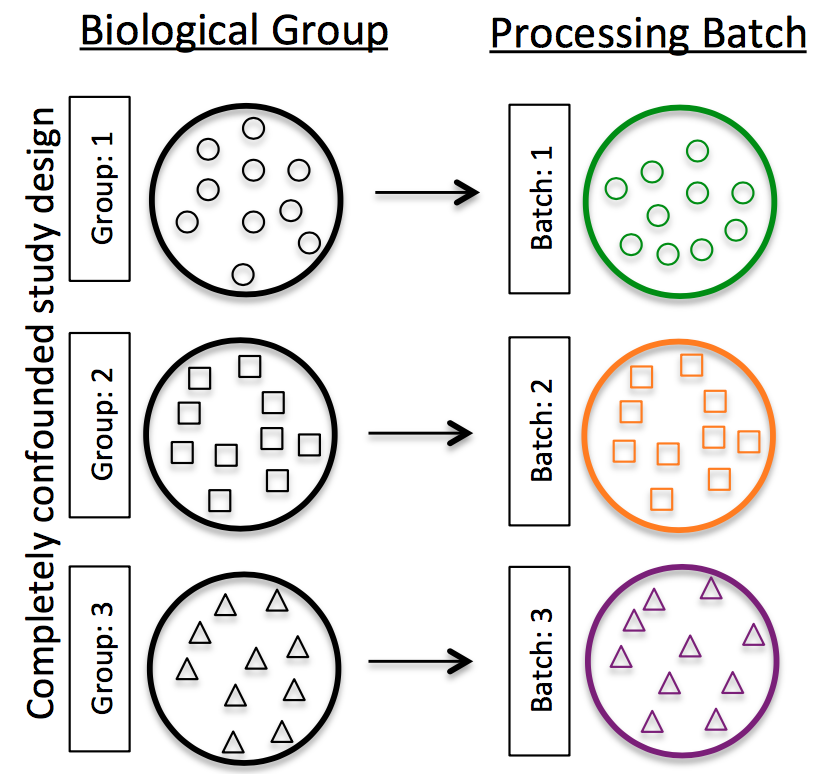
	    
	    *Image credit: [Hicks SC, et al., bioRxiv (2015)](https://www.biorxiv.org/content/early/2015/08/25/025528)*
	  
	  - **DO** split replicates of the different sample groups across batches. The more replicates the better (definitely more than 2).
	  
	    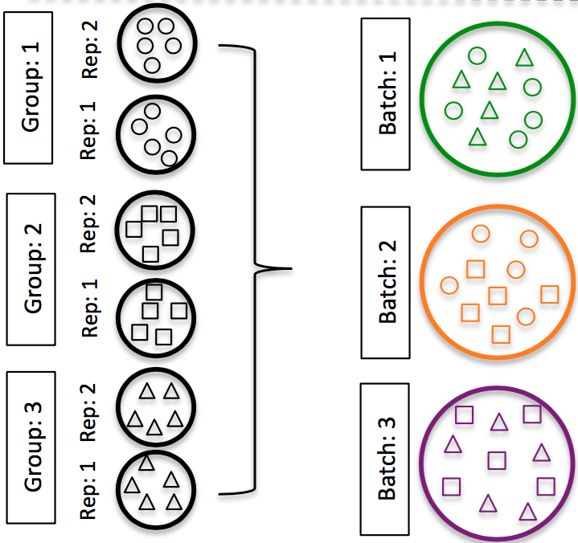
	
	    *Image credit: [Hicks SC, et al., bioRxiv (2015)](https://www.biorxiv.org/content/early/2015/08/25/025528)*
	    
	  - **DO** include batch information in your **experimental metadata**. During the analysis, we can regress out the variation due to batch so it doesn’t affect our results if we have that information.
	    

These characteristics make the **analysis of the data more difficult** than bulk RNA-seq. In addition, the analyses can vary depending whether the goal is marker identification, lineage tracing, or some other custom analysis. Therefore, tools specific for scRNA-seq and the different methods of library preparation are needed. 

## Single-cell RNA-seq data - raw counts to count matrix

Depending on the library preparation method used, the RNA sequences (also referred to as reads or tags), will be derived either from the 3' ends (or 5' ends) of the transcripts (10X Genomics, CEL-seq2, Drop-seq, inDrops) or from full-length transcripts (Smart-seq). 

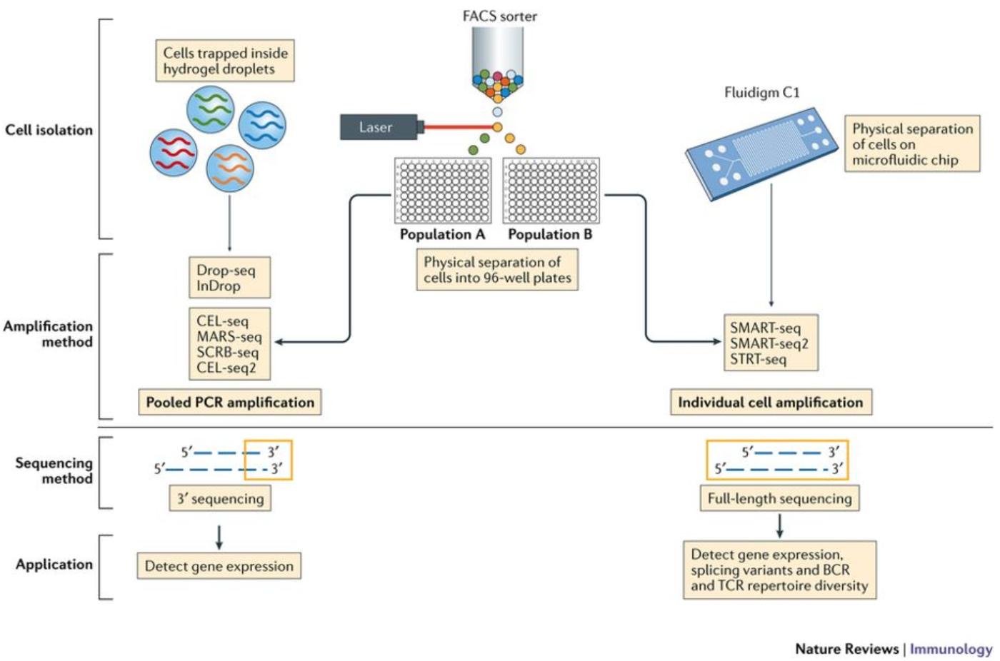

*Image credit: Papalexi E and Satija R. Single-cell RNA sequencing to explore immune cell heterogeneity, Nature Reviews Immunology 2018 (https://doi.org/10.1038/nri.2017.76)*

The choice of method involves the biological question of interest. The following advantages are listed below for the methods:

- **3' or 5'-end sequencing:** 
	- More accurate quantification through use of unique molecular identifiers distinguishing biological duplicates from amplification (PCR) duplicates
	- Larger number of cells sequenced allows better identity of cell type populations
	- Cheaper per cell cost

- **Full length sequencing:**
	- Detection of isoform-level differences in expression
	- Identification of allele-specific differences in expression
	- Deeper sequencing of a smaller number of cells  

Many of the same analysis steps need to occur for 3'-end sequencing as for full-length, but 3' protocols have been increasing in popularity and consist of a few more steps in the analysis. Therefore, our materials are going to detail the analysis of data from these 3' protocols with a focus on the droplet-based methods (inDrops, Drop-seq, 10X Genomics).

## 3'-end reads (includes all droplet methods)

For the 3'-end sequencing methods, reads originating from different molecules of the same transcript would have originated only from the 3' end of the transcripts, so would have a high likelihood of having the same sequence. However, the PCR step during library preparation could also generate read duplicates. To determine whether a read is a biological or technical duplicate, these methods use unique molecular identifiers, or UMIs. 

- Reads with **different UMIs** mapping to the same transcript were derived from **different molecules** and are biological duplicates - each read should be counted.
- Reads with the **same UMI** originated from the **same molecule** and are technical duplicates - the UMIs should be collapsed to be counted as a single read.
- In image below, the reads for ACTB should be collapsed and counted as a single read, while the reads for ARL1 should each be counted.

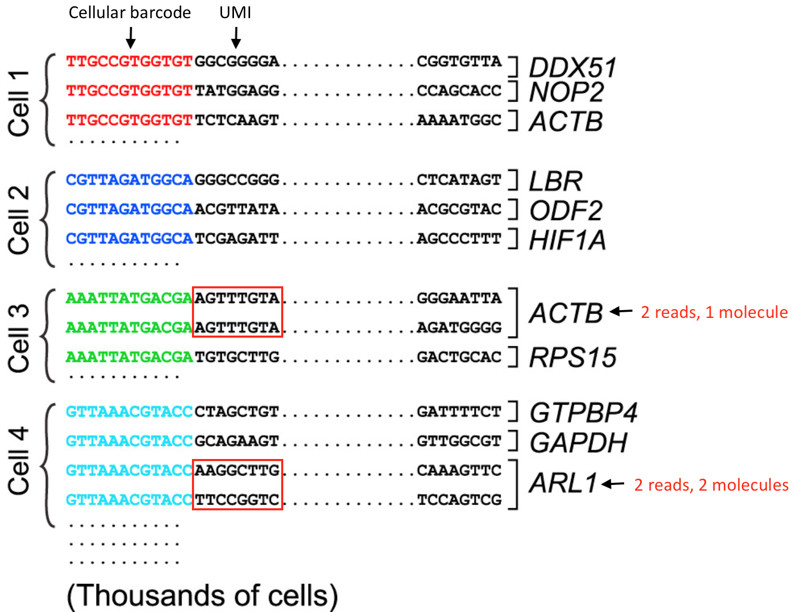

*Image credit: modified from Macosko EZ et al. Highly Parallel Genome-wide Expression Profiling of Individual Cells Using Nanoliter Droplets, Cell 2015 (https://doi.org/10.1016/j.cell.2015.05.002)*

So we know that we need to keep track of the UMIs, but what other information do we need to properly quanitify the expression in each gene in each of the cells in our samples? Regardless of droplet method, the following are required for proper quantification at the cellular level:

- **Sample index:** determines which sample the read originated from 
	- Added during library preparation - needs to be documented
- **Cellular barcode:** determines which cell the read originated from
	- Each library preparation method has a stock of cellular barcodes used during the library preparation
- **Unique molecular identifier (UMI):** determines which transcript molecule the read originated from
	- The UMI will be used to collapse PCR duplicates 
- **Sequencing read1:** the Read1 sequence
- **Sequencing read2:** the Read2 sequence

For example, when using the inDrops v3 library preparation method, the following represents how all of the information is acquired in four reads:
	

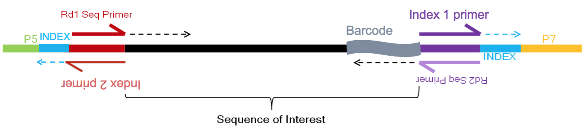

*Image credit: [Sarah Boswell](https://scholar.harvard.edu/saboswell), Director of the Single Cell Sequencing Core at HMS*

- **R1 (61 bp Read 1):** sequence of the read (Red top arrow)
- **R2 (8 bp Index Read 1 (i7)):** cellular barcode - which cell read originated from (Purple top arrow)
- **R3 (8 bp Index Read 2 (i5)):** sample/library index - which sample read originated from (Red bottom arrow)
- **R4 (14 bp Read 2):** read 2 and remaining cellular barcode and UMI - which transcript read originated from (Purple bottom arrow)

The analysis workflow for scRNA-seq is similar for the different droplet-based scRNA-seq methods, but the parsing of the UMIs, cell IDs, and sample indices, will differ between them. For example, below is a schematic of the 10X sequence reads, where the indices, UMIs and barcodes are placed differently:

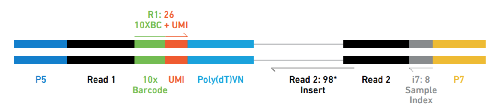

*Image credit: [Sarah Boswell](https://scholar.harvard.edu/saboswell), Director of the Single Cell Sequencing Core at HMS*

## Single-cell RNA-seq workflow

The scRNA-seq method will determine how to parse the barcodes and UMIs from the sequencing reads. So, although a few of the specific steps will slightly differ, the overall workflow will generally follow the same steps regardless of method. The general workflow is shown below:

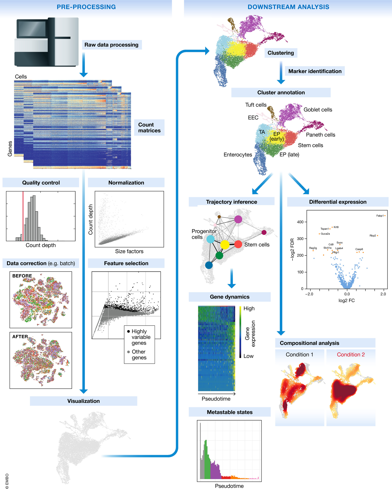

The steps of the workflow are:

- **Generation of the count matrix (method-specific steps):** formating reads, demultiplexing samples, mapping and quantification
- **Quality control of the raw counts:** filtering of poor quality cells 
- **Clustering of filtered counts:** clustering cells based on similarities in transcriptional activity (cell types = different clusters)
- **Marker identification:** identifying gene markers for each cluster
- **Optional downstream steps**

Regardless of the analysis being done, conclusions about a population based on a single sample per condition are not trustworthy. **BIOLOGICAL REPLICATES ARE STILL NEEDED!** That is, if you want to make conclusions that correspond to the population and not just the single sample. 

## Generation of count matrix

We are going to start by discussing the first part of this workflow, which is generating the count matrix from the raw sequencing data. We will focus on the 3' end sequencing used by droplet-based methods, such as inDrops, 10X Genomics, and Drop-seq.

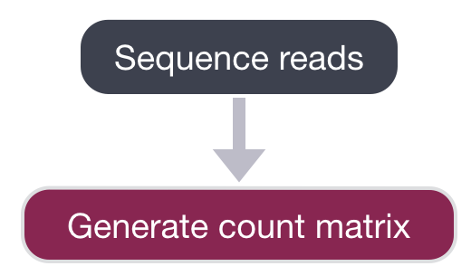

After sequencing, the sequencing facility will either output the raw sequencing data as **BCL or FASTQ format**. If the reads are in BCL format, then we will need to convert to FASTQ format. There is a useful command-line tool called `bcl2fastq` that can easily perform this conversion. 

> **NOTE:** We do not demultiplex at this step in the workflow. You may have sequenced 6 samples, but the reads for all samples may be present all in the same BCL or FASTQ file.

The generation of the count matrix from the raw sequencing data will go through similar steps for many of the scRNA-seq methods. 

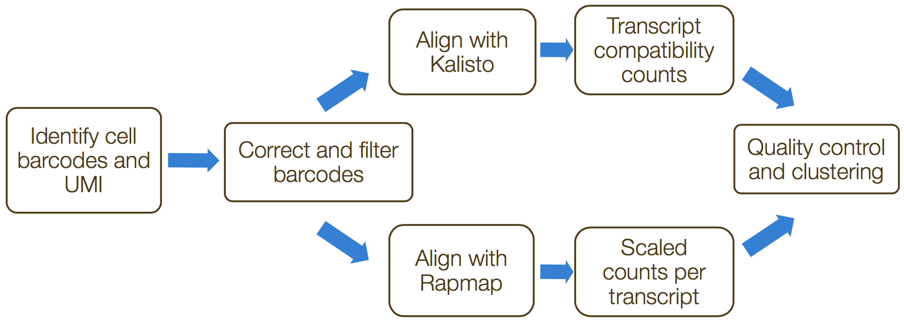

[**umis**](https://github.com/vals/umis) and [**zUMIs**](https://github.com/sdparekh/zUMIs) are command-line tools that estimate expression of scRNA-seq data for which the 3' ends of transcripts were sequenced. Both tools incorporate collapsing of UMIs to
correct for amplification bias. The steps in this process include the following:

 1. Formatting reads and filtering noisy cellular barcodes
 2. Demultiplexing the samples
 3. Mapping/pseudo-mapping to cDNAs
 4. Collapsing UMIs and quantification of reads

If using 10X Genomics library preparation method, then the [Cell Ranger pipeline](https://support.10xgenomics.com/single-cell-gene-expression/software/pipelines/latest/what-is-cell-ranger) would be used for all of the above steps. 

## 1. Formatting reads and filtering noisy cellular barcodes

The FASTQ files can then be used to parse out the cell barcodes, UMIs, and sample barcodes. For droplet-based methods, many of the cellular barcodes will match a low number of reads (< 1000 reads) due to:

- encapsulation of free floating RNA from dying cells
- uncomplex small cells (RBCs, etc.)
- cells that failed for some reason

These excess barcodes need to be filtered out of the sequence data prior to read alignment. To do this filtering the 'cellular barcode' and the 'molecular barcode' are extracted and saved for each cell. For example, if using 'umis' tools, the information is added to the header line for each read, with the following format:

    @HWI-ST808:130:H0B8YADXX:1:1101:2088:2222:CELL_GGTCCA:UMI_CCCT
    AGGAAGATGGAGGAGAGAAGGCGGTGAAAGAGACCTGTAAAAAGCCACCGN
    +
    @@@DDBD>=AFCF+<CAFHDECII:DGGGHGIGGIIIEHGIIIGIIDHII#

Known cellular barcodes used in the library preparation method should be known, and unknown
barcodes would be dropped, while allowing for an acceptable number of mismatches to the known cellular barcodes.

## 2. Demultiplexing sample reads

The next step of the process is to demultiplex the samples, if sequencing more than a single sample. This is the one step of this process not handled by the 'umis' tools, but is accomplished by 'zUMIs'. We would need to parse the reads to determine the sample barcode associated with each cell.

## 3. Mapping/pseudo-mapping to cDNAs

To determine which gene the read originated from, the reads are aligned using traditional (STAR) or light-weight methods (Kallisto/RapMap).

## 4. Collapsing UMIs and quantification of reads

The duplicate UMIs are collapsed, and only the unique UMIs are quantified using a tool like Kallisto or featureCounts. The resulting output is a cell by gene matrix of counts:

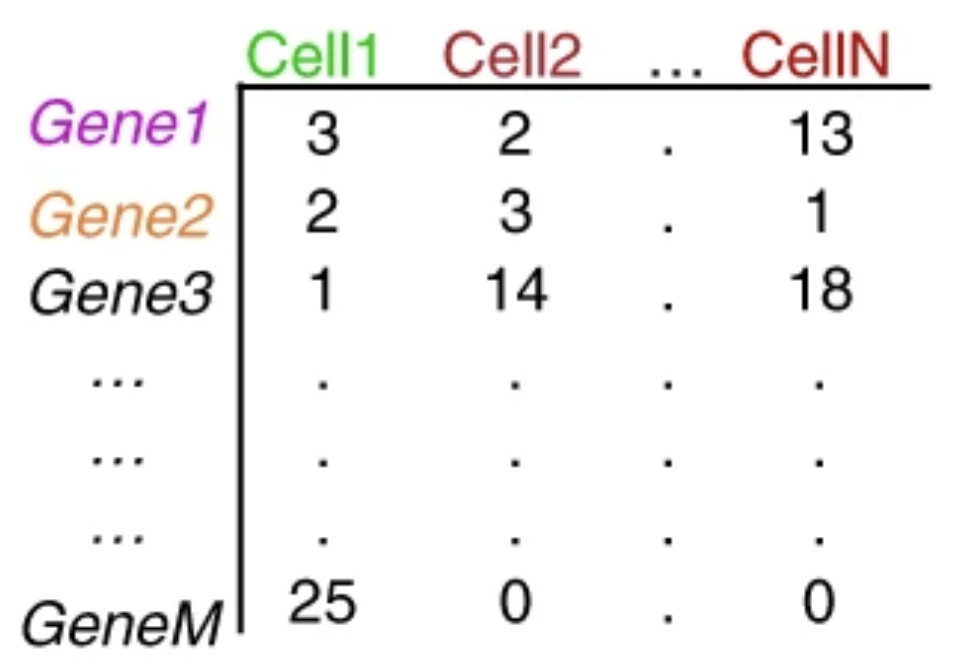

*Image credit: extracted from Lafzi et al. Tutorial: guidelines for the experimental design of single-cell RNA sequencing studies, Nature Protocols 2018 (https://doi.org/10.1038/s41596-018-0073-y)*

Each value in the matrix represents the number of reads in a cell originating from the corresponding gene. Using the count matrix, we can explore and filter our data, keeping only the higher quality cells.

***

*This lesson has been developed by members of the teaching team at the [Harvard Chan Bioinformatics Core (HBC)](http://bioinformatics.sph.harvard.edu/). These are open access materials distributed under the terms of the [Creative Commons Attribution license](https://creativecommons.org/licenses/by/4.0/) (CC BY 4.0), which permits unrestricted use, distribution, and reproduction in any medium, provided the original author and source are credited.*
