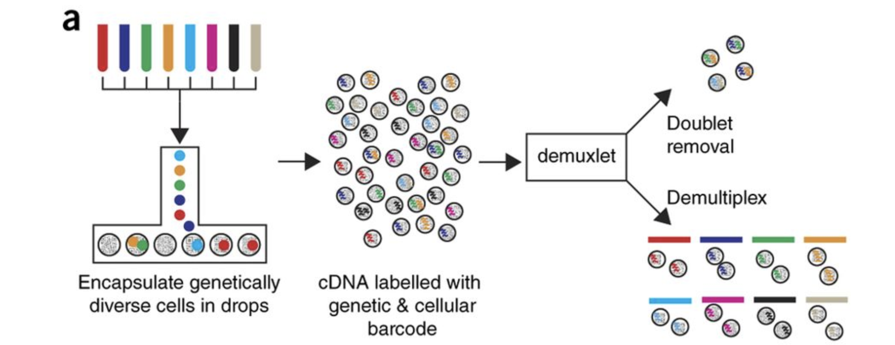

Approximate time: 90 minutes

## Learning Objectives:

* Understand how to bring in data from single-cell RNA-seq experiments
* Construct QC metrics and associated plots to visually explore the quality of the data
* Evaluate the QC metrics and set filters to remove low quality cells

# Single-cell RNA-seq: Quality control


<p align="center">

</p>

***

Each step of this workflow has its own goals and challenges. For QC of our raw count data, they include:

_**Goals:**_ 
 
 - _To **filter the data to only include true cells that are of high quality**, so that when we cluster our cells it is easier to identify distinct cell type populations_
 - _To **identify any failed samples** and either try to salvage the data or remove from analysis, in addition to, trying to understand why the sample failed_

_**Challenges:**_
 
 - _Delineating cells that are **poor quality from less complex cells**_
 - _Choosing appropriate thresholds for filtering, so as to **keep high quality cells without removing biologically relevant cell types**_

_**Recommendations:**_
 
 - _Have a good idea of your expectations for the **cell types to be present** prior to performing the QC. For instance, do you expect to have low complexity cells or cells with higher levels of mitochondrial expression in your sample? If so, then we need to account for this biology when assessing the quality of our data._

***

## Exploring the example dataset

For this workshop we will be working with a single-cell RNA-seq dataset which is part of a larger study from [Kang et al, 2017](https://www.nature.com/articles/nbt.4042). In this paper, the authors present a a computational algorithm that harnesses genetic variation (eQTL) to determine the genetic identity of each droplet containing a single cell (singlet) and identify droplets containing two cells from different individuals (doublets).

The data used to test their algorithm is comprised of pooled Peripheral Blood Mononuclear Cells (PBMCs) taken from eight lupus patients, split into control and interferon beta-treated conditions. 


<p align="center">

</p>

*Image obtained from [Kang et al, 2017](https://www.nature.com/articles/nbt.4042)*


### Raw data

This dataset is available on GEO ([GSE96583](https://www.ncbi.nlm.nih.gov/geo/query/acc.cgi?acc=GSE96583)), however the available counts matrix lacked mitochondrial reads, so we downloaded the BAM files from the SRA ([SRP102802](https://www-ncbi-nlm-nih-gov.ezp-prod1.hul.harvard.edu/sra?term=SRP102802)). These BAM files were converted back to FASTQ files, then run through Cell Ranger to obtain the count data that we will be using. 

> **NOTE:**  The counts for this dataset is also freely available from 10X Genomics and is used as part of the [Seurat tutorial](https://satijalab.org/seurat/v3.0/immune_alignment.html). 

### Metadata

In addition to the raw data we also need to collect **information about the data**; this is known as metadata. We are usually quick to start exploring our data, but it is not very meaningful if we know nothing about the samples that this data originated from.

Some relevant metadata for our dataset is provided below:

* The libraries were prepared using 10X Genomics version 2 chemistry
* The samples were sequenced on the Illumina NextSeq 500
* PBMC samples from eight individual lupus patients were separated into two aliquots each. 
  * One aliquot of PBMCs was activated by 100 U/mL of recombinant IFN-β for 6 hours. 
  * The second aliquot was left untreated. 
  * After 6 hours, the eight samples for each condition were pooled together in two final pools (stimulated cells and control cells). 
  * *In the interest of time, we have selected only two samples - 1 control and 1 treated (stimulated) - to demonstrate the analysis workflow.*

* Since the samples are PBMCs, we will expect immune cells, such as:
  * B cells
  * T cells
  * NK cells
  * monocytes
  * macrophages
  * possibly megakaryocytes

None of these cell types are low complexity or anticipated to have high mitochondrial content.


## Setting up the R environment

One of the most important parts of research that involves large amounts of data, is how best to manage it. We tend to prioritize the analysis, but there are many other important aspects of **data management that are often overlooked** in the excitement to get a first look at new data. The [HMS Data Management Working Group](https://datamanagement.hms.harvard.edu/hms-data-management-working-group), discusses in-depth some things to consider beyond the data creation and analysis.

One important aspect of data management is organization. For each experiment you work on and analyze data for, it is considered best practice to get organized by creating **a planned storage space (directory structure)**. We will do that for our single-cell analysis. 

Create a new R project entitled `single_cell_rnaseq`. Then, create the following directories:

```
single_cell_rnaseq/
├── data
├── results
└── figures
```

### Download data

**Right-click** the links below to download the output folders from Cell Ranger for each sample into the `data` folder:

- [Control sample](https://www.dropbox.com/sh/73drh0ipmzfcrb3/AADMlKXCr5QGoaQN13-GbeKSa?dl=1)
- [Stimulated sample](https://www.dropbox.com/sh/cii4j356moc08w5/AAC2c3jfvh2hHWPmEaVsZKRva?dl=1) 

Now, let's unzip the two "zipped" folders that we just downloaded, so we can see their contents from within RStudio.**

### New script

Next, open a new Rscript file, and start with some comments to indicate what this file is going to contain:

```r
# July 17th, 2019
# HBC single-cell RNA-seq workshop

# Single-cell RNA-seq analysis - QC
```

Save the Rscript as `quality_control.R`. Your working directory should look something like this:

<p align="center">

</p>

### Loading libraries 

Now, we can load the necessary libraries:

```r
# Load libraries
library(Matrix.utils)
library(SingleCellExperiment)
library(Seurat)
library(tidyverse)
library(Matrix)
library(AnnotationHub)
library(ensembldb)
library(scales)
library(cowplot)
library(RCurl)
```

## Loading single-cell RNA-seq count data 

Regardless of the technology or pipeline used to process your single-cell RNA-seq sequence data, the output will generally be the same. That is, for each individual sample you will have the following **three files**:

1. a file with the **gene IDs**, representing all genes quantified
2. a file with the **cell IDs**, representing all cells quantified
3. a **matrix of counts** per gene for every cell

We can explore these files in our own dataset by clicking on the `data/ctrl_raw_feature_bc_matrix` folder:

### 1. `barcodes.tsv` 
This is a text file which contains all cellular barcodes present for that sample. Barcodes are listed in the order of data presented in the matrix file (i.e. these are the column names). 

  <p align="center">
  
  </p>
  

### 2. `genes.tsv`
This is a text file which contains the identifiers of the quantified genes. The source of the identifier can vary depending on what reference (i.e. Ensembl, NCBI, UCSC) you use in the quantification methods, but most often these are official gene symbols. The order of these genes corresponds to the order of the rows in the matrix file (i.e. these are the row names).

  <p align="center">
  
  </p>


### 3. `matrix.mtx`
This is a text file which contains a matrix of count values. The rows are associated with the gene IDs above and columns correspond to the cellular barcodes. Note that there are **many zero values** in this matrix.

  <p align="center">
  
  </p>


Loading this data into R requires us to **use functions that allow us to efficiently combine these three files into a single count matrix.** However, instead of creating a regular matrix data structure, we will create a **sparse matrix** to improve the amount of space, memory and CPU required to work with our huge count matrix. 

Different methods for reading in data include:

1. **`readMM()`**: This function is from the **Matrix** package and will turn our standard matrix into a sparse matrix. The `genes.tsv` file and `barcodes.tsv` must first be individually loaded into R and then they are combined. For specific code and instructions on how to do this please see [our additional material](https://hbctraining.github.io/scRNA-seq/lessons/readMM_loadData).
2. **`Read10X()`**: This function is from the **Seurat** package and will use the Cell Ranger output directory as input. In this way individual files do not need to be loaded in, instead the function will load and combine them into a sparse matrix for you. *We will be using this function to load in our data!*


### Reading in a single sample (`read10X()`)

When working with 10X data and its proprietary software Cell Ranger, you will always have an `outs` directory. Within this directory you will find a number of different files including:

- **`web_summary.html`:** report that explores different QC metrics, including the mapping metrics, filtering thresholds, estimated number of cells after filtering, and information on the number of reads and genes per cell after filtering.
- **BAM alignment files:** files used for visualization of the mapped reads and for re-creation of FASTQ files, if needed
- **`filtered_feature_bc_matrix`:** folder containing all files needed to construct the count matrix using data filtered by Cell Ranger
- **`raw_feature_bc_matrix`:** folder containing all files needed to construct the count matrix using the raw unfiltered data

We are mainly interested in the `raw_feature_bc_matrix` as we wish to perform our own QC and filtering while accounting about the biology of our experiment.

If we had a single sample, we could generate the count matrix and then subsequently create [a Seurat object](https://github.com/satijalab/seurat/wiki/Seurat):

```r
# How to read in 10X data for a single sample
ctrl_counts <- Read10X(data.dir = "data/ctrl_raw_feature_bc_matrix")

# Turn count matrix into a Seurat object
ctrl <- CreateSeuratObject(counts = ctrl_counts,
                           min.features = 100)
```

> **NOTE**: The `min.features` argument specifies the minimum number of genes that need to be detected per cell. This argument will filter out poor quality cells that likely just have random barcodes encapsulated without any cell present. We would not be interested in analyzing any cells with less than 100 genes detected.


**Seurat automatically creates some metadata** for each of the cells when you use the `Read10X()` function to read in data. This information is stored in the `meta.data` slot within the Seurat object. You can find more information about the slots in the Seurat object [on their Wiki page](https://github.com/satijalab/seurat/wiki/Seurat)

```r
# Explore the metadata
head(ctrl@meta.data)
```

What do the columns of metadata mean?

- `orig.ident`: this often contains the sample identity if known, but will default to "SeuratProject"
- `nCount_RNA`: number of UMIs per cell
- `nFeature_RNA`: number of genes detected per cell


### Reading in multiple samples with a `for loop`

In practice, you likely have many samples that you want to read the data in for using the `Read10X()` or the `readMM()` functions. So, to make the data import into R more efficient we can use a `for` loop. 

A `for` loop interates over a series of commands for each of the inputs given. In R, it has the following structure/syntax:

```r
for (variable in input){
	command1
	command2
	command3
}
```

Our `for` loop will iterate over the two samples (`input`) and execute two commands for each sample - (1) read in the count data and (2) create the Seurat objects:

```r
# Create each individual Seurat object for every sample
for (file in c("ctrl_raw_feature_bc_matrix", "stim_raw_feature_bc_matrix")){
        seurat_data <- Read10X(data.dir = paste0("data/", file))
        seurat_obj <- CreateSeuratObject(counts = seurat_data, 
                                         min.features = 100, 
                                         project = file)
        assign(file, seurat_obj)
}
```

Now, let's break down the `for loop` to describe the different steps:

#### Step 1: Specify inputs

For our experiment, we have two samples that we would like to read into R using the `Read10X()` function:

- `ctrl_raw_feature_bc_matrix` 
- `stim_raw_feature_bc_matrix`

We can specify these samples in the *input* part for our `for loop` as elements of a vector using `c()`. We are assigning these to a *variable* and we can call that variable anything we would like (try to give it a name that makes sense). In this example, we called the *variable* `file`:

```r
# Create each individual Seurat object
for (file in c("ctrl_raw_feature_bc_matrix", "stim_raw_feature_bc_matrix")){
```

#### Step 2: Read in data for the input

We can continue our `for loop` by:

- Using the `Read10X()` function. We need to specify the path to the file, so we will prepend the `data/` directory to our sample folder name using the `paste0()` function.

```r
# Create each individual Seurat object
for (file in c("ctrl_raw_feature_bc_matrix", "stim_raw_feature_bc_matrix")){
        seurat_data <- Read10X(data.dir = paste0("data/", file))
```

#### Step 3: Create Seurat object from the 10X count data

Now, we can create the Seurat object by using the `CreateSeuratObject()` function, adding in the argument `project`, where we can add the sample name.

```r
for (file in c("ctrl_raw_feature_bc_matrix", "stim_raw_feature_bc_matrix")){
        seurat_data <- Read10X(data.dir = paste0("data/", file))
        seurat_obj <- CreateSeuratObject(counts = seurat_data, 
                                         min.features = 100, 
                                         project = file)        
```

#### Step 4: Assign Seurat object to a new variable based on sample

The last command `assign`s the Seurat object created (`seurat_obj`) to a new variable. In this way, when we iterate and move on to the next sample in our `input` we will not overwrite the Seurat object created in the previous iteration:

```r
for (file in c("ctrl_raw_feature_bc_matrix", "stim_raw_feature_bc_matrix")){
        seurat_data <- Read10X(data.dir = paste0("data/", file))
        seurat_obj <- CreateSeuratObject(counts = seurat_data, 
                                         min.features = 100, 
                                         project = file)        
        assign(file, seurat_obj)
}
```

Now that we have created both of these objects, let's take a quick look at the metadata to see how it looks:

```r
# Check the metadata in the new Seurat objects
head(ctrl_raw_feature_bc_matrix@meta.data)
head(stim_raw_feature_bc_matrix@meta.data)
```

Now that we have our Seurat objects for each sample, we need to merge them together into a single Seurat object. This will make it easier to run QC on the entire dataset rather than one sample at a time. We can use the `merge()` function to do this:

```r
# Create a merged Seurat object
merged_seurat <- merge(x = ctrl_raw_feature_bc_matrix, 
                       y = stim_raw_feature_bc_matrix, 
                       add.cell.id = c("ctrl", "stim"))
```

Because the same cell IDs can be used for different samples, we add a sample-specific prefix to each of our cell IDs using the `add.cell.id` argument. If we look at the metadata of the merged object we should be able to see the prefixes in the rownames:

```r
# Check that the merged object has the appropriate sample-specific prefixes
head(merged_seurat@meta.data)
tail(merged_seurat@meta.data)
```

[Click here for next lesson](03_SC_quality_control.md)

---
*This lesson has been developed by members of the teaching team at the [Harvard Chan Bioinformatics Core (HBC)](http://bioinformatics.sph.harvard.edu/). These are open access materials distributed under the terms of the [Creative Commons Attribution license](https://creativecommons.org/licenses/by/4.0/) (CC BY 4.0), which permits unrestricted use, distribution, and reproduction in any medium, provided the original author and source are credited.*
