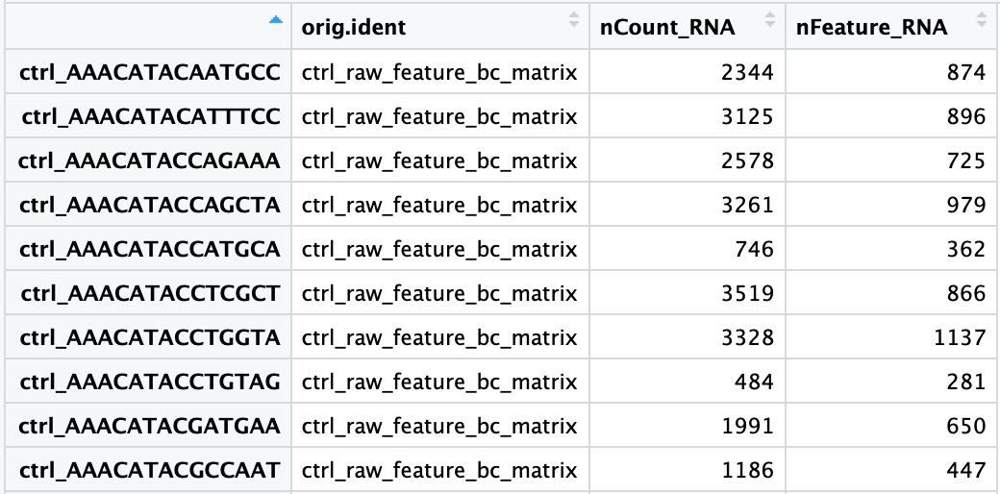
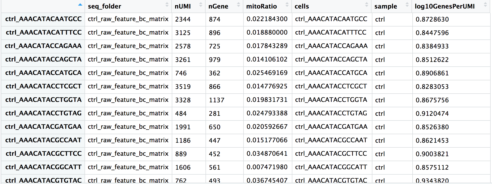

Approximate time: 90 minutes

## Learning Objectives:

* Understand how to bring in data from single-cell RNA-seq experiments
* Construct QC metrics and associated plots to visually explore the quality of the data
* Evaluate the QC metrics and set filters to remove low quality cells

# Single-cell RNA-seq: Quality control


<p align="center">

</p>

***

Each step of this workflow has its own goals and challenges. For QC of our raw count data, they include:

_**Goals:**_ 
 
 - _To **filter the data to only include true cells that are of high quality**, so that when we cluster our cells it is easier to identify distinct cell type populations_
 - _To **identify any failed samples** and either try to salvage the data or remove from analysis, in addition to, trying to understand why the sample failed_

_**Challenges:**_
 
 - _Delineating cells that are **poor quality from less complex cells**_
 - _Choosing appropriate thresholds for filtering, so as to **keep high quality cells without removing biologically relevant cell types**_

_**Recommendations:**_
 
 - _Have a good idea of your expectations for the **cell types to be present** prior to performing the QC. For instance, do you expect to have low complexity cells or cells with higher levels of mitochondrial expression in your sample? If so, then we need to account for this biology when assessing the quality of our data._

***

## Generating quality metrics

Remember that Seurat automatically creates some metadata for each of the cells:

```r
# Explore merged metadata
View(merged_seurat@meta.data)
```

<p align="center">

</p>

The added columns include:

- `orig.ident`: this often contains the sample identity if known, but will default to `project` as we had assigned it
- `nCount_RNA`: number of UMIs per cell
- `nFeature_RNA`: number of genes detected per cell

We need to calculate some additional metrics for plotting:

- **number of genes detected per UMI:** this metric with give us an idea of the complexity of our dataset (more genes detected per UMI, more complex our data)
- **mitochondrial ratio:** this metric will give us a percentage of cell reads originating from the mitochondrial genes

The number of genes per UMI for each cell is quite easy to calculate, and we will log10 transform the result for better comparison between samples.

```r
# Add number of UMIs per gene for each cell to metadata
merged_seurat$log10GenesPerUMI <- log10(merged_seurat$nFeature_RNA) / log10(merged_seurat$nCount_RNA)
```

Seurat has a convenient function that allows us to calculate the **proportion of transcripts mapping to mitochondrial genes**. The `PercentageFeatureSet()` will take a pattern and search the gene identifiers. For each column (cell) it will take the sum of the counts slot for features belonging to the set, divide by the column sum for all features and multiply by 100. *Since we want the ratio value for plotting, we will reverse that step by then dividing by 100*.

```r
# Compute percent mito ratio
merged_seurat$mitoRatio <- PercentageFeatureSet(object = merged_seurat, pattern = "^MT-")
merged_seurat$mitoRatio <- merged_seurat@meta.data$mitoRatio / 100

```
> **NOTE:** The pattern provided ("^MT-") works for human gene names. You may need to adjust depending on your organism of interest. If you weren't using gene names as the gene ID, then this function wouldn't work. We have [code available to compute this metric on your own](https://github.com/hbctraining/scRNA-seq/blob/master/lessons/mitoRatio.md).


*We need to add additional information to our metadata for our QC metrics, such as the cell IDs, condition information, and various metrics.* While it is quite easy to **add information directly to the metadata slot in the Seurat object using the `$` operator**, we will extract the dataframe into a separate variable instead. In this way we can continue to insert additional metrics that we need for our QC analysis without the risk of affecting our `merged_seurat` object.

We will create the metadata dataframe by extracting the `meta.data` slot from the Seurat object: 

```r
# Create metadata dataframe
metadata <- merged_seurat@meta.data
```

You should see each cell ID has a `ctrl_` or `stim_` prefix as we had specified when we merged the Seurat objects. These prefixes should match the sample listed in `orig.ident`. Let's begin by **adding a column with our cell IDs** and **changing the current column names** to be more intuitive:

```r
# Add cell IDs to metadata
metadata$cells <- rownames(metadata)

# Rename columns
metadata <- metadata %>%
        dplyr::rename(seq_folder = orig.ident,
                      nUMI = nCount_RNA,
                      nGene = nFeature_RNA)
```

Now, let's get **sample names for each of the cells** based on the cell prefix:

```r
# Create sample column
metadata$sample <- NA
metadata$sample[which(str_detect(metadata$cells, "^ctrl_"))] <- "ctrl"
metadata$sample[which(str_detect(metadata$cells, "^stim_"))] <- "stim"
```


Now you are **all setup with the metrics you need to assess the quality of your data**! Your final metadata table will have rows that correspond to each cell, and columns with information about those cells:

<p align="center">

</p>


### Saving the updated metadata to our Seurat object

Before we assess our metrics we are going to save all of the work we have done thus far back into our Seurat object. We can do this by simply assigning the dataframe into the `meta.data` slot:

```r
# Add metadata back to Seurat object
merged_seurat@meta.data <- metadata
                           
# Create .RData object to load at any time
save(merged_seurat, file="data/raw_seurat.RData")
```

## Assessing the quality metrics

Now that we have generated the various metrics to assess, we can explore them with visualizations. We will assess various metrics and then decide on which cells are low quality and should be removed from the analysis:

- Cell counts
- UMI counts per cell
- Genes detected per cell
- UMIs vs. genes detected
- Mitochondrial counts ratio
- Novelty


### Cell counts

The cell counts are determined by the number of unique cellular barcodes detected. 

You expect the number of unique cellular barcodes to be around the number of sequenced cells or greater. In single-cell protocols using hydrogels, like inDrops, some hydrogels may have more than one cellular barcode (see details in note below). After we remove the low quality cells by filtering, we will expect the number of cells to be at or a bit below the number of sequenced cells.

> **NOTE:** During the **inDrops** protocol, the cellular barcodes are present in the hydrogels, which are encapsulated in the droplets with a single cell and lysis/reaction mixture. Upon treatment of UV and cell lysis, all components mix together inside the droplet and reverse transcription proceeds, followed by droplet breakup and linear amplification for library preparation. While each hydrogel should have a single cellular barcode associated with it, occasionally a hydrogel can have more than one cellular barcode. We often see all possible combinations of cellular barcodes at a low level, leading to a higher number of cellular barcodes than cells.

```r
# Visualize the number of cell counts per cell
metadata %>% 
  	ggplot(aes(x=sample, fill=sample)) + 
  	geom_bar() +
  	theme_classic() +
  	theme(axis.text.x = element_text(angle = 45, vjust = 1, hjust=1)) +
  	theme(plot.title = element_text(hjust=0.5, face="bold")) +
  	ggtitle("NCells")
```

<p align="center">

</p>


### UMI counts (transcripts) per cell

The UMI counts per cell should generally be above 500, although usable, it's still low if between 500-1000 counts. If UMIs per cell is 500-1000 counts, then the cells probably should have been sequenced more deeply. 

```r
# Visualize the number UMIs/transcripts per cell
metadata %>% 
  	ggplot(aes(color=sample, x=nUMI, fill= sample)) + 
  	geom_density(alpha = 0.2) + 
  	scale_x_log10() + 
  	theme_classic() +
  	ylab("log10 cell density") +
  	geom_vline(xintercept = 500)
```

<p align="center">

</p>
   
### Genes detected per cell

Seeing gene detection in the range of 500-5000 is normal for **inDrop** analysis. Similar expectations for gene detection as for UMI detection, although may be a bit lower than UMIs.

```r
# Visualize the distribution of genes detected per cell via histogram
metadata %>% 
  	ggplot(aes(color=sample, x=nGene, fill= sample)) + 
  	geom_density(alpha = 0.2) + 
  	theme_classic() +
  	scale_x_log10() + 
  	geom_vline(xintercept = 300)

# Visualize the distribution of genes detected per cell via boxplot
metadata %>% 
  	ggplot(aes(x=sample, y=log10(nGene), fill=sample)) + 
  	geom_boxplot() + 
  	theme_classic() +
  	theme(axis.text.x = element_text(angle = 45, vjust = 1, hjust=1)) +
  	theme(plot.title = element_text(hjust=0.5, face="bold")) +
  	ggtitle("NCells vs NGenes")
```

<p align="center">

</p>

<p align="center">

</p>

### UMIs vs. genes detected

Poor quality cells are likely to have low genes and UMIs per cell. Therefore, a poor sample is likely to have cells in the lower left of the graph. Good cells should exhibit both higher number of genes per cell and higher numbers of UMIs. We also expect similar lines with similar slopes for all samples.

```r
# Visualize the correlation between genes detected and number of UMIs and determine whether strong presence of cells with low numbers of genes/UMIs
metadata %>% 
  	ggplot(aes(x=nUMI, y=nGene, color=mitoRatio)) + 
  	geom_point() + 
  	stat_smooth(method=lm) +
  	scale_x_log10() + 
  	scale_y_log10() + 
  	theme_classic() +
  	geom_vline(xintercept = 500) +
  	geom_hline(yintercept = 250) +
  	facet_wrap(~sample)
```

<p align="center">

</p>

### Mitochondrial counts ratio

This metric can identify whether there is a large amount of mitochondrial contamination from dead or dying cells. Poor quality samples for mitochondrial counts would have larger peaks above the 0.1 mitochondrial ratio mark, unless it is expected based on sample type.

```r
# Visualize the distribution of mitochondrial gene expression detected per cell
metadata %>% 
  	ggplot(aes(color=sample, x=mitoRatio, fill=sample)) + 
  	geom_density(alpha = 0.2) + 
  	scale_x_log10() + 
  	theme_classic() +
  	geom_vline(xintercept = 0.2)
```

<p align="center">

</p>

### Novelty

We can see the samples where we sequenced each cell less have a higher overall novelty, that is because we have not started saturating the sequencing for any given gene for these samples. Outlier cells in these samples might be cells that have a less complex RNA species than other cells. Sometimes we can detect contamination with low complexity cell types like red blood cells via this metric. Generally, we expect the novelty score to be above 0.80.

```r
# Visualize the overall novelty of the gene expression by visualizing the genes detected per UMI
metadata %>%
  	ggplot(aes(x=log10GenesPerUMI, color = sample, fill=sample)) +
  	geom_density(alpha = 0.2) +
  	theme_classic() +
  	geom_vline(xintercept = 0.8)
```

<p align="center">

</p>

> **NOTE:** **Reads per cell** is another metric that can be useful to explore; however, the workflow used would need to save this information to assess. Generally, with this metric you hope to see all of the samples with peaks in relatively the same location between 10,000 and 100,000 reads per cell. 

## Filtering

Now that we have visualized the various metrics, we can decide on the thresholds to apply which will result in the removal of low quality cells. Often the recommendations mentioned earlier are a rough guideline, and the specific experiment needs to inform the exact thresholds chosen. We will use the following thresholds:

- nUMI > 500
- nGene > 250
- log10GenesPerUMI > 0.8
- mitoRatio < 0.2

To filter, we wil go back to our Seurat object and use the `subset()` function:

```r
# Filter out low quality reads using selected thresholds - these will change with experiment
filtered_seurat <- subset(x = merged_seurat, 
                         subset= (nUMI >= 500) & 
                           (nGene >= 250) & 
                           (log10GenesPerUMI > 0.80) & 
                           (mitoRatio < 0.25))
			                          
```

We will do some additional filtering to **keep only genes which are expressed in 10 or more cells.**

```r

# Output a logical vector for every gene on whether the more than zero counts per cell
# Extract counts
counts <- GetAssayData(object = filtered_seurat, slot = "counts")

# Output a logical vector for every gene on whether the more than zero counts per cell
nonzero <- counts > 0L

# Sums all TRUE values and returns TRUE if more than 10 TRUE values per gene
keep_genes <- rowSums(as.matrix(nonzero)) >= 10

# Only keeping those genes expressed in more than 10 cells
filtered_counts <- counts[keep_genes, ]

# Create a new Seurat object
clean_seurat <- CreateSeuratObject(filtered_counts, meta.data = filtered_seurat@meta.data)

```

## Re-assess QC metrics

After performing the filtering, it's recommended to look back over the metrics to make sure that your data matches your expectations and is good for downstream analysis. 

***

**[Exercises]()**

1. Extract the new metadata from the filtered Seurat object to go through the same plots as with the unfiltered data

```r
# Save filtered subset to new metadata
metadata_clean <- clean_seurat@meta.data
```

2. Perform all of the same plots as with the unfiltered data and determine whether the thresholds used were appropriate.

***

## Saving filtered cells

Based on these QC metrics we would identify any failed samples and move forward with our filtered cells. Often we iterate through the QC metrics using different filtering criteria; it is not necessarily a linear process. When satisfied with the filtering criteria, we would save our filtered cell object for clustering and marker identification.

```r
# Create .RData object to load at any time
save(clean_seurat, file="data/clean_seurat.RData")

```

[Click here for next lesson](SC_clustering_analysis.md)

---
*This lesson has been developed by members of the teaching team at the [Harvard Chan Bioinformatics Core (HBC)](http://bioinformatics.sph.harvard.edu/). These are open access materials distributed under the terms of the [Creative Commons Attribution license](https://creativecommons.org/licenses/by/4.0/) (CC BY 4.0), which permits unrestricted use, distribution, and reproduction in any medium, provided the original author and source are credited.*
