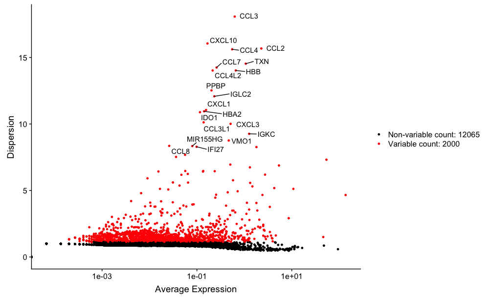
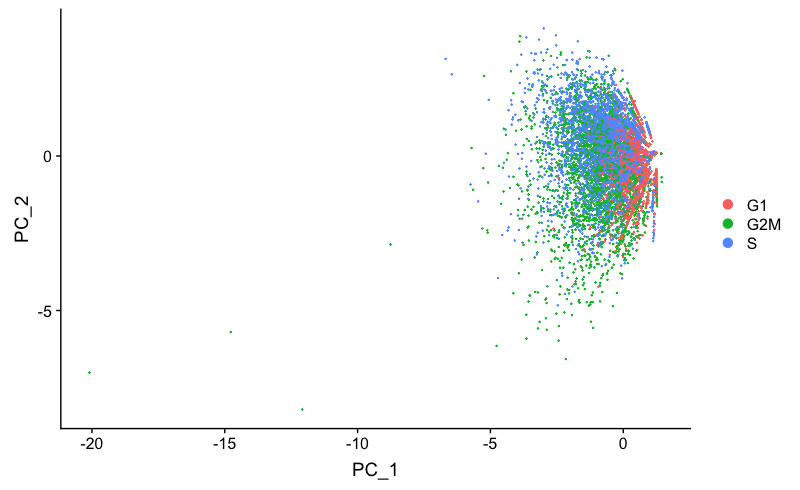
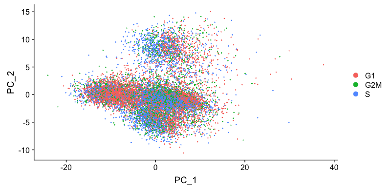
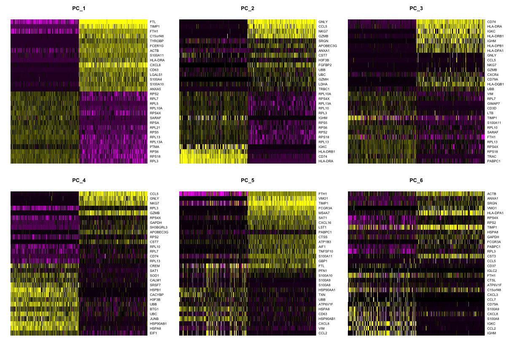
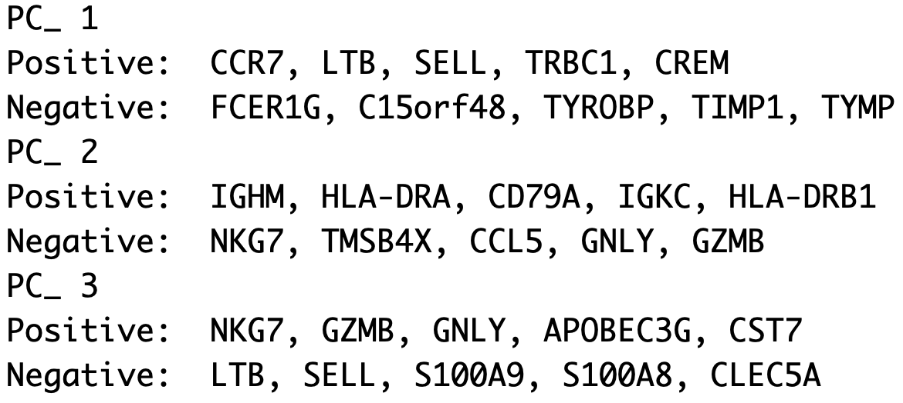
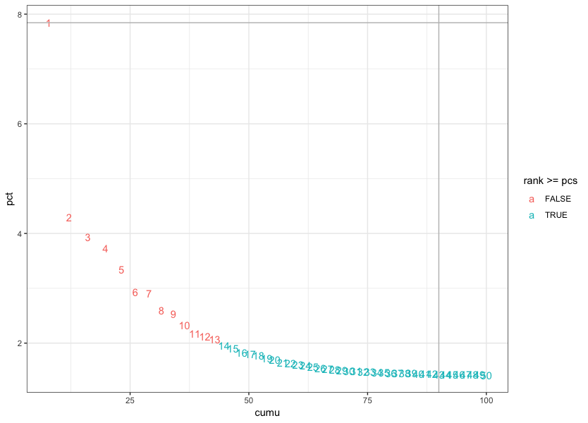
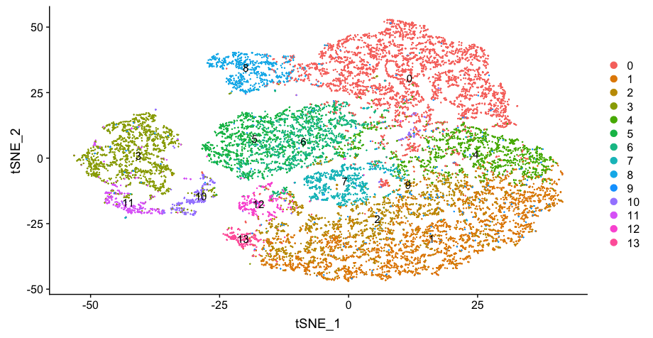
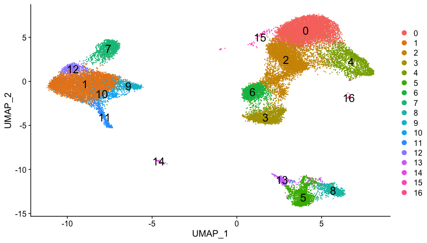
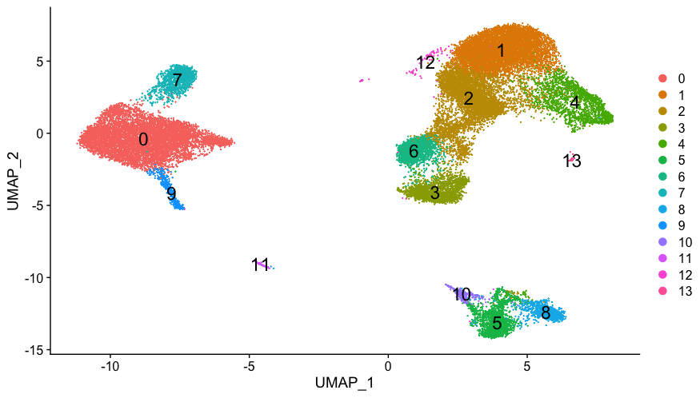
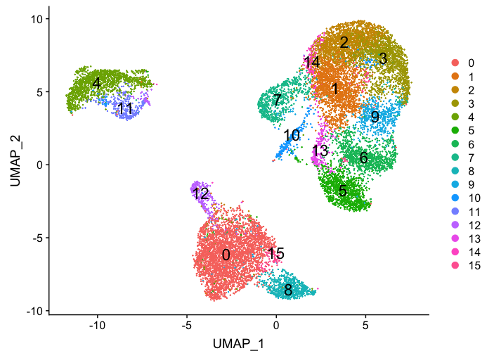

Approximate time: 90 minutes

## Learning Objectives:

* Understand how to determine the most variable genes for the gene expression
* Utilize methods for evaluating the selection of PCs to use for clustering
* Perform clustering of cells based on significant PCs

# Single-cell RNA-seq clustering analysis


Now that we have our high quality cells, we want to know the different cell types present within our population of cells. 


***

_**Goals:**_ 
 
 - _To **generate cell type-specific clusters** and use known markers to determine the identities of the clusters._
 - _To **determine whether clusters represent true cell types or cluster due to biological or technical variation**, such as clusters of cells in the S phase of the cell cycle, clusters of specific batches, or cells with high mitochondrial content._

_**Challenges:**_
 
 - _Clustering so that **cells of the same cell type from different conditions cluster together**_
 - _**Removing unwanted variation** so that we do not have cells clustering by artifacts_
 - _**Identifying the cell types** of each cluster_
 - _Maintaining patience as this can be a highly iterative process between clustering and marker identification (sometimes even going back to the QC filtering)_

_**Recommendations:**_
 
 - _Have a good idea of your expectations for the **cell types to be present** prior to performing the clustering. Know whether you expect cell types of low complexity or higher mitochondrial content AND whether the cells are differentiating_
 - _If you have **more than one condition**, it's often helpful to perform integration to align the cells_
 - _**Regress out** number of UMIs, mitochondrial content, and cell cycle, if needed and appropriate for experiment, so not to drive clustering_
 - _Identify any junk clusters for removal. Possible junk clusters could include those with high **mitochondrial content** and low UMIs/genes_
 - _If **not detecting all cell types as separate clusters**, try changing the resolution or the number of PCs used for clustering_
 
***

## Clustering workflow

To determine the cell types present, we are going to perform a clustering analysis. Since we have two conditions, `Control` and `Stimulated`, we will work through the workflow for the `Control` sample to determine the cell types present, then integrate with the `Stimulated` to identify the cell types present in both of the samples. 

The workflow for this analysis is adapted from the following sources:

- Satija Lab: [Seurat v3 Guided Integration Tutorial](https://satijalab.org/seurat/v3.0/immune_alignment.html)
- Paul Hoffman: [Cell-Cycle Scoring and Regression](http://satijalab.org/seurat/cell_cycle_vignette.html)

To identify clusters, the following steps will be performed:

1. **Normalization** and **identification of high variance genes** in each sample
2. **Integration** of the samples using shared highly variable genes (optional, but recommended to align cells from different samples)
3. **Scaling** and **regression** of sources of unwanted variation (e.g. number of UMIs per cell, mitochondrial transcript abundance, cell cycle phase)
4. **Clustering cells** based on top PCs (metagenes)
5. Exploration of **quality control metrics**: determine whether clusters unbalanced wrt UMIs, genes, cell cycle, mitochondrial content, samples, etc.
6. Searching for expected cell types using **known markers**
7. **Marker identification** for each cluster

## Set-up

To perform this analysis, we will be mainly using functions available in the Seurat package. Therefore, we need to load the Seurat library in addition to the tidyverse library, if not already loaded. Create the script `clustering_analysis.R` and load the libraries:

```r
# Single-cell RNA-seq analysis - clustering analysis

# Load libraries
library(Seurat)
library(tidyverse)
library(RCurl)
```

To perform the analysis, Seurat requires the data to be present as a `seurat` object. We have created this object in the QC lesson, so we can use that and just reassign it to a new variable name:

```r
seurat_raw <- clean_seurat
```

We are interested in only analyzing the `ctrl` sample by itself as a first pass. To do this we need to subset the Seurat object. We can use the `subset()` function to extract a subset of samples, cells, or genes. To extract only the cells from the `ctrl` sample we can run the following:

```r
# Get cell IDs for control cells
control_cell_ids <- rownames(seurat_raw@meta.data[which(seurat_raw@meta.data$sample == "ctrl"), ])

head(control_cell_ids)

# Subset Seurat object to only contain control cells
seurat_control <- subset(seurat_raw, 
                         cells = control_cell_ids)
```

To perform clustering of our data, we must identify the sources of variation present in our data based on the most variable genes. The assumption being that the most variable genes will determine the principal components (PCs) distinguishing the differences between cell types. After normalization of the expression values, we extract the 2000 most variable genes to determine the major sources of variation in the data, or significant PCs.

## **Normalization** and **identification of high variance genes** in each sample

The first step in the analysis is to normalize the raw counts to account for differences in sequencing depth per cell **for each sample**. By default, the raw counts are normalized using global-scaling normalization by performing the following:

1. normalizing the gene expression measurements for each cell by the total expression 
2. multiplying this by a scale factor (10,000 by default)
3. log-transforming the result

```r
# Normalize the data for read depth
seurat_control <- NormalizeData(seurat_control,
                                normalization.method = "LogNormalize",
                                scale.factor = 10000)
```

Following normalization, we want to **identify the most variable genes** (highly expressed in some cells and lowly expressed in others) to use for downstream clustering analyses. 

The mean-variance relationship of the data is modeled, and the 2,000 most variable genes are returned.

```r
# Identify the 2000 most variable genes
seurat_control <- FindVariableFeatures(object = seurat_control,
                                       selection.method = "vst",
                                       nfeatures = 2000)
```

We can plot these most variable genes highlighting the 20 most highly variable. The labeled genes should look familiar given the experiment.

```r
# Identify the 20 most highly variable genes
top20 <- head(x = VariableFeatures(object = seurat_control), 
              n =20)

# Plot variable features with labels
plot1 <- VariableFeaturePlot(object = seurat_control)

LabelPoints(plot = plot1, 
            points = top20, 
            repel = TRUE)
```

<p align="center">

</p>

Our sample contains PBMCs, so we would expect to see immune-related cells, and many of the top 20 variable genes do appear to be immune-related.

After identification of variable genes for each dataset, we will scale the data and regress out sources of unwanted variation. If we had more than a single sample, we would likely integrate our data at this step.

> **NOTE:** Seurat has just incorporated the `sctransform` tool for better normalization, scaling, and finding of variable genes. There is a new [vignette](https://satijalab.org/seurat/v3.0/sctransform_vignette.html) and [preprint](https://www.biorxiv.org/content/biorxiv/early/2019/03/18/576827.full.pdf) available to explore this new methodology.

## Scaling and regression of sources of unwanted variation

In addition to the interesting variation in your dataset that separates the different cell types, there is also "uninteresting" sources of variation present that can obscure the cell type-specific differences. This can include technical noise, batch effects, and/or uncontrolled biological variation (e.g. cell cycle). 

To identify sources of uninteresting variation, we can explore the possible sources using PCA. Prior to performing any dimensionality reduction visualization, it is a good idea to scale your data. Since highly expressed genes exhibit the highest amount of variation and we don't want our 'highly variable genes' only to reflect high expression, we need to scale the data to scale variation with expression level. The Seurat `ScaleData()` function will scale the data by:

- adjusting the expression of each gene to give a mean expression across cells to be 0
- scaling expression of each gene to give a variance across cells to be 1


```r
# Scale data
all_genes <- rownames(x = seurat_control)

seurat_control <- ScaleData(object = seurat_control,
                            features = all_genes)
```

***

**Exercises**

1. From the `seurat_raw` object, use the `subset()` function to subset out the cells corresponding to the stimulated condition (`seurat_stim`). 

2. Normalize the `seurat_stim` data for read depth and identify the 2000 most variable genes.

3. Plot the `seurat_stim` variable genes with labels.

4. Scale the `seurat_stim` data.

***

### Cell cycle scoring

Cell cycle variation is a common source of uninteresting variation in single-cell RNA-seq data. To examine cell cycle variation in our data, we assign each cell a score, based on its expression of G2/M and S phase markers. 

> An overview of the cell cycle phases is given in the image below:
> 
> <p align="center">
>
></p> 	
> 
> _Adapted from [Wikipedia](https://en.wikipedia.org/wiki/Cell_cycle) (Image License is [CC BY-SA 3.0](https://en.wikipedia.org/wiki/Wikipedia:Text_of_Creative_Commons_Attribution-ShareAlike_3.0_Unported_License))_
> 
> - **G0:** Quiescence or resting phase. The cell is not actively dividing, which is common for cells that are fully differentiated. Some types of cells enter G0 for long periods of time (many neuronal cells), while other cell types never enter G0 by continuously dividing (epithelial cells).
> - **G1:** Gap 1 phase represents the **beginning of interphase**. During G1 there is growth of the non-chromosomal components of the cells. From this phase, the cell may enter G0 or S phase.
> - **S:** Synthesis phase for the replication of the chromosomes (also part of interphase).
> - **G2:** Gap 2 phase represents the **end of interphase**, prior to entering the mitotic phase. During this phase th cell grows in preparation for mitosis and the spindle forms.
> - **M:** M phase is the nuclear division of the cell (consisting of prophase, metaphase, anaphase and telophase).
	

The [Cell-Cycle Scoring and Regression tutorial](https://satijalab.org/seurat/v3.0/cell_cycle_vignette.html) from Seurat makes available a list of cell cycle phase marker genes for humans and performs phase scoring based on the paper from [Tirosh, I. et al.](https://www.ncbi.nlm.nih.gov/pmc/articles/PMC4944528/). We have used this list to perform orthology searches to create [compiled cell cycle gene lists](https://github.com/hbc/tinyatlas/tree/master/cell_cycle) for other organisms, as well.

After scoring each gene for cell cycle phase, we can perform PCA using the expression of cell cycle genes. If the cells group by cell cycle in the PCA, then we would want to regress out cell cycle variation, **unless cells are differentiating**. 

> **NOTE:** If cells are known to be differentiating and there is clear clustering differences between G2M and S phases, then you may want to regress out by the difference between the G2M and S phase scores as described in the [Seurat tutorial](https://satijalab.org/seurat/v3.0/cell_cycle_vignette.html), thereby still differentiating the cycling from the non-cycling cells.

```r
# Download cell cycle genes for organism at https://github.com/hbc/tinyatlas/tree/master/cell_cycle. Read it in with:

cc_file <- getURL("https://raw.githubusercontent.com/hbc/tinyatlas/master/cell_cycle/Homo_sapiens.csv") 
cell_cycle_genes <- read.csv(text = cc_file)

```

All of the cell cycle genes are Ensembl IDs, but our gene IDs are the gene names. To score the genes in our count matrix for cell cycle, we need to obtain the gene names for the cell cycle genes. 

We can use annotation databases to acquire these IDs. While there are many different options, including BioMart, AnnotationDBI, and AnnotationHub. We will use the `AnnotationHub` R package to query Ensembl using the `ensembldb` R package.

```r
# Connect to AnnotationHub
ah <- AnnotationHub()

# Access the Ensembl database for organism
ahDb <- query(ah, 
              pattern = c("Homo sapiens", "EnsDb"), 
              ignore.case = TRUE)

# Acquire the latest annotation files
id <- ahDb %>%
        mcols() %>%
        rownames() %>%
        tail(n = 1)

# Download the appropriate Ensembldb database
edb <- ah[[id]]

# Extract gene-level information from database
annotations <- genes(edb, 
                     return.type = "data.frame")

# Select annotations of interest
annotations <- annotations %>%
        dplyr::select(gene_id, gene_name, seq_name, gene_biotype, description)
```

Now we can use these annotations to get the corresponding gene names for the Ensembl IDs of the cell cycle genes.


```r
# Get gene names for Ensembl IDs for each gene
cell_cycle_markers <- dplyr::left_join(cell_cycle_genes, annotations, by = c("geneID" = "gene_id"))

# Acquire the S phase genes
s_genes <- cell_cycle_markers %>%
        dplyr::filter(phase == "S") %>%
        pull("gene_name")
        
# Acquire the G2M phase genes        
g2m_genes <- cell_cycle_markers %>%
        dplyr::filter(phase == "G2/M") %>%
        pull("gene_name")
```

Taking the gene names for the cell cycle genes we can score each cell based which stage of the cell cycle it is most likely to be in.

```r        
# Perform cell cycle scoring
seurat_control <- CellCycleScoring(seurat_control,
                                   g2m.features = g2m_genes,
                                   s.features = s_genes)

# Perform PCA and color by cell cycle phase
seurat_control <- RunPCA(seurat_control)

# Visualize the PCA, grouping by cell cycle phase
DimPlot(seurat_control,
        reduction = "pca",
        group.by= "Phase")
```

<p align="center">

</p>

We do see differences on PC1, with the G1 cells to the left of the other cells on PC1. Based on this plot, we would regress out the variation due to cell cycle. 

> **NOTE:** Alternatively, we could wait and perform the clustering without regression and see if we have clusters separated by cell cycle phase. If we do, then we could come back and perform the regression.

### Apply regression variables

**Regressing variation due to uninteresting sources can improve downstream identification of principal components and clustering.** To mitigate the effects of these signals, Seurat constructs linear models to predict gene expression based on the variables to regress.

We generally recommend regressing out **number of UMIs, mitochondrial ratio, and possibly cell cycle** if needed, as a standard first-pass approach. However, if the differences in mitochondrial gene expression represent a biological phenomenon that may help to distinguish cell clusters, then we advise not regressing the mitochondrial expression.

When regressing out the effects of cell-cycle variation, include S-phase score and G2M-phase score for regression.

> **NOTE:** If using the `sctransform` tool, there is no need to regress out number of UMIs as it is corrected for in the function.

```r
# Define variables in metadata to regress
vars_to_regress <- c("nUMI", "S.Score", "G2M.Score", "mitoRatio")

# Regress out the uninteresting sources of variation in the data
seurat_control <- ScaleData(object = seurat_control,
                            vars.to.regress = vars_to_regress, 
                            verbose = FALSE)

# Re-run the PCA
seurat_control <- RunPCA(object = seurat_control)

DimPlot(object = seurat_control, 
        reduction = "pca",
        group.by = "Phase")

```

<p align="center">

</p>

Regressing out cell cycle has resulted in more overlap of cells in the different phases of the cell cycle.

***

**Exercises**

1. Perform cell cycle scoring for the `seurat_stim` sample, then, run and visualize PCA, coloring by cell cycle phase.

2. Regress out the uninteresting sources of variation in the data for the `seurat_stim` sample.

3. Re-run and visualize the PCA, colored by cell cycle phase.

***

## Clustering cells based on top PCs (metagenes)

### Identify significant PCs

To overcome the extensive technical noise in the expression of any single gene for scRNA-seq data, Seurat clusters cells based on their PCA scores, with each PC essentially representing a "metagene" that combines information across a correlated gene set. Determining how many PCs to include downstream is therefore an important step. Often it is useful to explore the PCs prior to identifying the significant principal components to include for the downstream clustering analysis.

One way of exploring the PCs is using a heatmap to visualize the most variant genes for select PCs with the genes and cells ordered by PCA scores. The `cells` argument specifies the number of cells with the most negative or postive PCA scores to use for the plotting.

```r
# Explore heatmap of PCs
DimHeatmap(seurat_control, 
           dims = 1:6, 
           cells = 500, 
           balanced = TRUE)
```



We can see which genes appear to be driving the PCs, but this method can be slow and hard to visualize individual genes if we would like to explore a large number of PCs.

For exploring a large number of PCs, we could print out the top 5 positive and negative genes by PCA scores driving the PCs.

```r
# Printing out the most variable genes driving PCs
print(x = seurat_control[["pca"]], 
      dims = 1:10, 
      nfeatures = 5)
```

We only specified 10 dimensions, but we could easily include as many as we wish to explore. It is often useful to look at the PCs and determine whether the genes driving them make sense for differentiating the different cell types. However, we won't use this method alone to pick the significant PCs to use for the clustering analysis.

<p align="center">

</p>


The elbow plot is helpful when determining how many PCs to use for the downstream analysis. The elbow plot visualizes the standard deviation of each PC, and where the elbow appears is usually the threshold for identifying the significant PCs. However, this method can be a bit subjective about where the elbow is located.

```r
# Plot the elbow plot
ElbowPlot(object = seurat_control, 
          ndims = 30)
```

<p align="center">

</p>


Based on this plot, we could choose where the elbow occurs (touches the ground) to be between PC12-PC16. While this gives us a good rough idea of the number of PCs to include, a **more quantitative approach** may be a bit more reliable. We will identify a PC threshold by calculating where the principal components start to elbow by **taking the larger value of**:

1. The point where the principal components only contribute 5% of standard deviation and the principal components cumulatively contribute 90% of the standard deviation.
2. The point where the percent change in variation between the consequtive PCs is less than 0.1%.

We will start by calculating the first metric:

```r
# Determine percent of variation associated with each PC
pct <- seurat_control[["pca"]]@stdev / sum(seurat_control[["pca"]]@stdev) * 100

# Calculate cumulative percents for each PC
cumu <- cumsum(pct)

# Determine which PC exhibits cumulative percent greater than 90% and % variation associated with the PC as less than 5
co1 <- which(cumu > 90 & pct < 5)[1]

co1
```
The first metric returns PC43 as the PC matching these requirements. Let's check the second metric, which identifies the PC where the percent change in variation between consequtive PCs is less than 0.1%:

```r
# Determine the difference between variation of PC and subsequent PC
co2 <- sort(which((pct[1:length(pct) - 1] - pct[2:length(pct)]) > 0.1), decreasing = T)[1] + 1

# last point where change of % of variation is more than 0.1%.

co2
```

The second metric returned PC14. Now, to determine the selection of PCs, we will use the minimum of the two metrics:

```r
# Minimum of the two calculation
pcs <- min(co1, co2)

pcs
```

Based on these metrics, for the clustering of cells in Seurat we will use the first **fourteen PCs** to generate the clusters. We can plot the elbow plot again and overlay the information determined using our metrics:

```r
# Create a dataframe with values
plot_df <- data.frame(pct = pct, 
           cumu = cumu, 
           rank = 1:length(pct))

# Elbow plot to visualize 
  ggplot(plot_df, aes(cumu, pct, label = rank, color = rank > pcs)) + 
  geom_text() + 
  geom_vline(xintercept = 90, color = "grey") + 
  geom_hline(yintercept = min(pct[pct > 5]), color = "grey") +
  theme_bw()
 
 ```
 
 <p align="center">

</p>


However, it's often a good idea to check the genes associated with some higher PCs to make sure that other PCs shouldn't be included due to association with some rarer cell populations.

```r
# Printing out the most variable genes driving PCs
print(x = seurat_control[["pca"]], 
      dims = 1:25, 
      nfeatures = 5)
```

If we saw the highest positive and negative PCA scores for genes associated with a particular PC corresponding to known marker genes for a rare cell type, then we would include all PCs up to that one. 

### Cluster the cells

We can now use these significant PCs to determine which cells exhibit similar expression patterns for clustering. To do this, Seurat uses a graph-based clustering approach, which embeds cells in a graph structure, using a K-nearest neighbor (KNN) graph (by default), with edges drawn between cells with similar gene expression patterns. Then, it attempts to partition this graph into highly interconnected ‘quasi-cliques’ or ‘communities’ [[Seurat - Guided Clustering Tutorial](https://satijalab.org/seurat/v3.0/pbmc3k_tutorial.html)].

We will use the `FindClusters()` function to perform the graph-based clustering. The `resolution` is an important argument that sets the "granularity" of the downstream clustering and will need to be optimized to the experiment.  For datasets of 3,000 - 5,000 cells, the `resolution` set between `0.4`-`1.4` generally yields good clustering. Increased resolution values lead to a greater number of clusters, which is often required for larger datasets. 

We often provide a series of resolution options during clustering, which can be used downstream to choose the best resolution.


```r
# Determine the K-nearest neighbor graph
seurat_control <- FindNeighbors(object = seurat_control, 
                                dims = 1:14)
                                
# Determine the clusters for various resolutions                                
seurat_control <- FindClusters(object = seurat_control,
                               resolution = c(0.4, 0.6, 0.8, 1.0, 1.2, 1.8))
```

If we look at the metadata of our Seurat object(`seurat_control@metadata`), there is a separate column for each of the different resolutions calculated.

```r
# Explore resolutions
seurat_control@meta.data %>% 
        View()
```

To choose a resolution to start with, we often pick something in the middle of the range like 0.6 or 0.8. We will start with a resolution of 0.6 by assigning the identity of the clusters using the `Idents()` function.

```r
# Assign identity of clusters
Idents(object = seurat_control) <- "RNA_snn_res.0.8"
```

To visualize the cell clusters, there are a few different dimensionality reduction techniques that can be helpful. The most popular methods include t-distributed stochastic neighbor embedding (t-SNE) and Uniform Manifold Approximation and Projection (UMAP) techniques. 

Both methods aim to place cells with similar local neighborhoods in high-dimensional space together in low-dimensional space. As input, we suggest using the same PCs as input to the clustering analysis. **Note that distance between clusters in the t-SNE plot does not represent degree of similarity between clusters, whereas in the UMAP plot it does**, but we will explore both techniques.

```r
# Calculation of t-SNE
seurat_control <- RunTSNE(object = seurat_control)

# Plotting t-SNE
DimPlot(object = seurat_control,
        label = TRUE,
        reduction = "tsne",
        plot.title = "t-SNE")
```

<p align="center">

</p>

**How does your tSNE plot compare to the one above?** An alternative visualization to the tSNE is the UMAP method, as it can be difficult to distinguish the boundaries of the clusters. We can explore the UMAP method, which should separate the clusters more based on similarity.

```r
# Calculation of UMAP
seurat_control <- RunUMAP(seurat_control, 
                  reduction = "pca", 
                  dims = 1:14)

# Plot the UMAP
DimPlot(seurat_control,
        reduction = "umap",
        label = TRUE,
        label.size = 6,
        plot.title = "UMAP")
```

<p align="center">

</p>

The UMAP looks quite a bit nicer, with the clusters more clearly defined. Also, because distance between clusters is meaningful, the UMAP provides more information than t-SNE. 

It can be useful to **explore other resolutions as well**. It will give you a quick idea about how the clusters would change based on the resolution parameter. For example, let's take a look at 0.4 resolution:

```r
# Assign identity of clusters
Idents(object = seurat_control) <- "RNA_snn_res.0.4"

# Plot the UMAP
DimPlot(seurat_control,
        reduction = "umap",
        label = TRUE,
        label.size = 6,
        plot.title = "UMAP")
```

<p align="center">

</p>


**How does your UMAP plot compare to the one above?**

What you may have noticed is that there is some variability in the way your plots look compared to those in the lesson. In particular you may see a difference in the labeling of clusters. This is an unfortunate consequence of slight variations in the versions you are using (of the Seurat package and/or dependency packages).

In order to maintain consistency in the downstream analysis and interpretation of this dataset, we will ask you to [download a new R object](https://www.dropbox.com/s/7m71je2s21kxwcf/seurat_control.rds?dl=1) to the `data` folder. Once downloaded, you will need to **load in the object to your R session and overwrite the existing one**: 

```r
seurat_control <- readRDS("data/seurat_control.rds")
```

Using this new R object we will continue with the UMAP method and the 0.8 resolution to check the quality control metrics and known markers for anticipated cell types. Plot the UMAP again to make sure your image now matches what you see in the lesson:

```r
# Assign identity of clusters
Idents(object = seurat_control) <- "RNA_snn_res.0.8"

# Plot the UMAP
DimPlot(seurat_control,
        reduction = "umap",
        label = TRUE,
        label.size = 6,
        plot.title = "UMAP")
```

<p align="center">

</p>

***

**Exercises**

1. Identify significant PCs for the `seurat_stim` object.
2. Perform clustering for `seurat_stim` using the resolutions: 0.4, 0.6, 0.8, 1.0, 1.2, 1.8.
3. Assign resolution of the `seurat_stim` clusters to `RNA_snn_res.0.8`.
4. Plot the UMAP for `seurat_stim`.

***

[Click here for next lesson]()

***

*This lesson has been developed by members of the teaching team at the [Harvard Chan Bioinformatics Core (HBC)](http://bioinformatics.sph.harvard.edu/). These are open access materials distributed under the terms of the [Creative Commons Attribution license](https://creativecommons.org/licenses/by/4.0/) (CC BY 4.0), which permits unrestricted use, distribution, and reproduction in any medium, provided the original author and source are credited.*

* *A portion of these materials and hands-on activities were adapted from the [Satija Lab's](https://satijalab.org/) [Seurat - Guided Clustering Tutorial](https://satijalab.org/seurat/pbmc3k_tutorial.html)*
