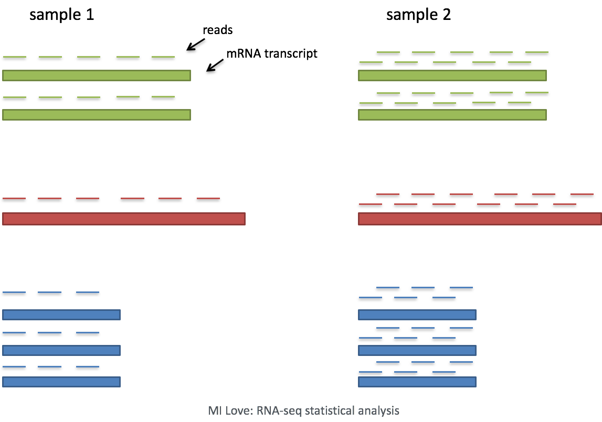
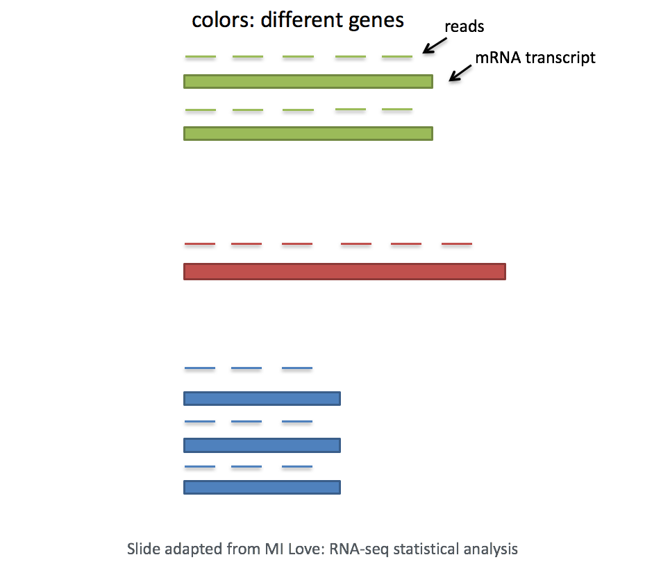
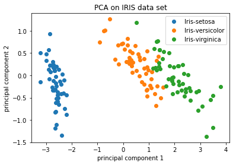

Approximate time: 90 minutes

## Learning Objectives 

* Normalizing counts for accurate comparison between cells
* Evaluating similarity in cellular gene expression using Principal Components Analysis

## Count Normalization and Principal Component Analysis

After attaining our high quality single cells, the next step in the single-cell RNA-seq (scRNA-seq) analysis workflow is to perform clustering. The goal of clustering is to separate different cell types into unique clusters of cells. To perform clustering, we determine the genes that are most different in their expression between cells. Then, we use these genes to determine which correlated genes sets are responsible for the largest differences in expression between cells.

However, before we move onto clustering, there are a few concepts that we want to talk about.

### Count normalization

First one is count normalization, which is essential to make accurate comparisons of gene expression between cells (or samples). The counts of mapped reads for each gene is proportional to the expression of RNA ("interesting") in addition to many other factors ("uninteresting"). Normalization is the process of scaling raw count values to account for the "uninteresting" factors. In this way the expression levels are more comparable between and/or within cells.

The main factors often considered during normalization are:
 
 - **Sequencing depth:** Accounting for sequencing depth is necessary for comparison of gene expression between cells. In the example below, each gene appears to have doubled in expression in cell 2, however this is a consequence of cell 2 having twice the sequencing depth.
 
    
    
Each cell in scRNA-seq will have a differing number of reads associated with it. So to accurately compare expression between cells, it is necessary to normalize for sequencing depth.
 
 - **Gene length:** Accounting for gene length is necessary for comparing expression between different genes within the same cell. The number of reads mapped to a longer gene can appear to have equal count/expression as a shorter gene that is more highly expressed. 
 
    
 
In scRNA-seq analysis, we will be comparing the expression of different genes within the cells to cluster the cells. *If using a 3' or 5' droplet-based method, the length of the gene will not affect the analysis because only the 5' or 3' end of the transcript is sequenced.* However, if using full-length sequencing, the transcript length should be accounted for.

### Principal Component Analysis (PCA)

Principal Component Analysis (PCA) is a technique used to emphasize variation as well as similarity, and to bring out strong patterns in a dataset (dimensionality reduction). We will briefly go over PCA in this lesson (adapted from StatQuests/Josh Starmer's YouTube video), but we strongly encourage you to explore the video [StatQuest's video](https://www.youtube.com/watch?v=_UVHneBUBW0) for a more thorough explanation/understanding. 

If you had quantified the expression of four genes in two samples (or cells), you could plot the expression values of those genes with one sample represented on the x-axis and the other sample on the y-axis as shown below:

You could draw a line through the data in the direction representing the most variation, which is on the diagonal in this example. The maximum variation in the dataset is between the genes that make up the two endpoints of this line.  

We also see the genes vary somewhat above and below the line. We could draw another line through the data representing the second most amount of variation in the data, since this plot is in 2D (2 axes).

The genes near the ends of each line would be those with the highest variation between the two samples (high expression in one sample and low expression in the other). These genes have the greatest influence on the direction of the line, mathematically. 

For example, a small change in the value of *Gene C* would greatly change the direction of the longer line, whereas a small change in *Gene A* or *Gene D* would have little affect on it.

We could also rotate the entire plot and view the lines representing the variation as left-to-right and up-and-down. We see most of the variation in the data is left-to-right (longer line) and the second most variation in the data is up-and-down (shorter line). You can now think of these lines as the axes that represent the variation. These axes are essentially the "Principal Components", with PC1 representing the most variation in the data and PC2 representing the second most variation in the data. 

If we had three samples/cells, then we would have an extra direction in which we could have variation (3D). Therefore, if we have *N* samples/cells we would have *N*-directions of variation or principal components (PC)! Once these PCs have been calculated, the PC that can explain the largest variation in the dataset is PC1, and the next one is PC2 and so on. 

Once the PCs have been determined for an dataset, we have to figure out how each sample/cell fits back into that context to enable us to visualize the similarities/dissimilaties in an intuitive manner. The question here is "what is sample_X's score for a given PC based on the gene expression in sample_X?". Scores are calculate for all sample-PC pairs as described in the steps below: 

(1) First, each gene is assigned an "influence" score based on how much it influenced each PC. Genes that did not have any influence on a given PC get scores near zero, while genes with more influence receive larger scores. Genes on the ends of a PC line will have a larger influence, so they would receive larger scores but with opposite signs.

(2) Once the influence has been determined, the score for each sample is calculated using the following equation:
	
	Sample1 PC1 score = (read count * influence) + ... for all genes
	
For our 2-sample example, the following is how the scores would be calculated: 

	## Sample1
	PC1 score = (4 * -2) + (1 * -10) + (8 * 8) + (5 * 1) = 51
	PC2 score = (4 * 0.5) + (1 * 1) + (8 * -5) + (5 * 6) = -7
	
	## Sample2
	PC1 score = (5 * -2) + (4 * -10) + (8 * 8) + (7 * 1) = 21
	PC2 score = (5 * 0.5) + (4 * 1) + (8 * -5) + (7 * 6) = 8.5
	
(3) Once these scores are calculated for all the PCs they can be plotted on a simple scatter plot. Below is the plot for the example here:

For datasets with a larger number of samples or cells, PC1 and PC2 scores for each sample/cell are plotted usually. Since these PCs explain the most variation in the dataset, and the expectation is samples/cells that are more similar to each other will cluster together with PC1 and PC2. See example below:

*image adapted from [https://github.com/AshwiniRS/Medium_Notebooks/blob/master/PCA/PCA_Iris_DataSet.ipynb](https://github.com/AshwiniRS/Medium_Notebooks/blob/master/PCA/PCA_Iris_DataSet.ipynb)

> Sometimes higher PCs are also used for this visualization, expecially if the variation explained by PC1 and PC2 is not very high and the dataset has several factors contirbuting to variations among the dataset.

***

*This lesson has been developed by members of the teaching team at the [Harvard Chan Bioinformatics Core (HBC)](http://bioinformatics.sph.harvard.edu/). These are open access materials distributed under the terms of the [Creative Commons Attribution license](https://creativecommons.org/licenses/by/4.0/) (CC BY 4.0), which permits unrestricted use, distribution, and reproduction in any medium, provided the original author and source are credited.*
