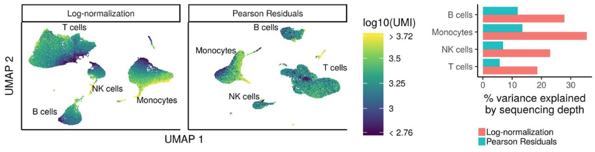
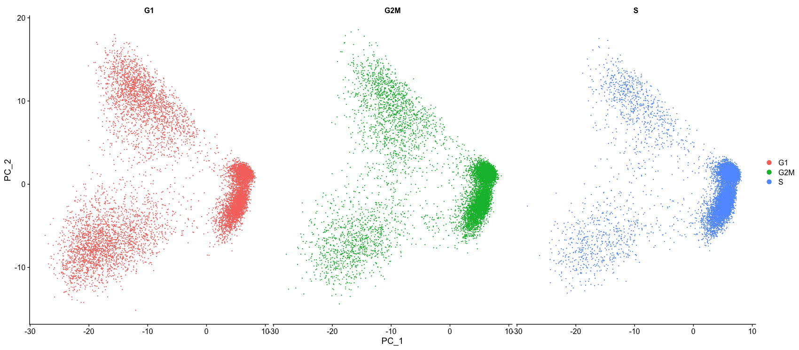
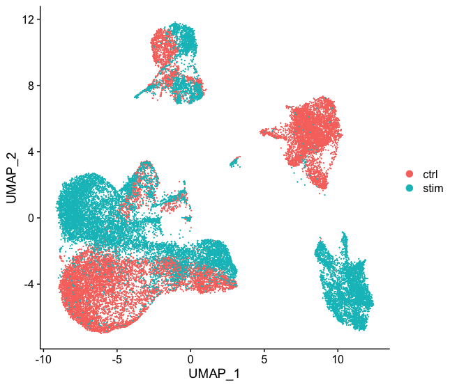
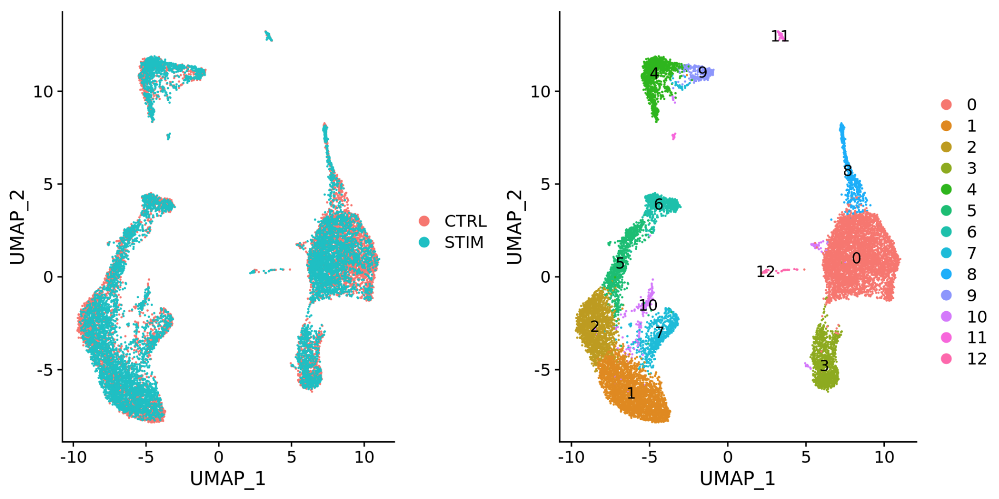
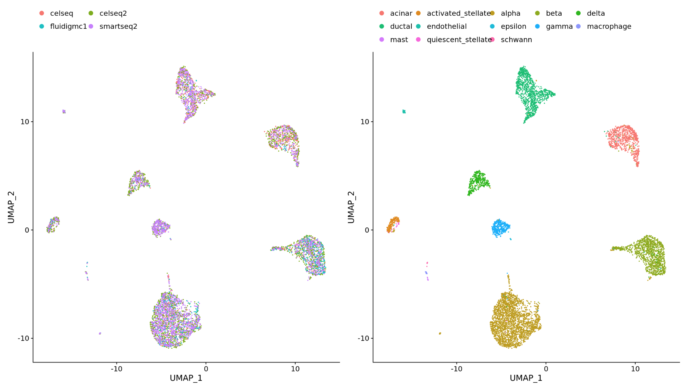
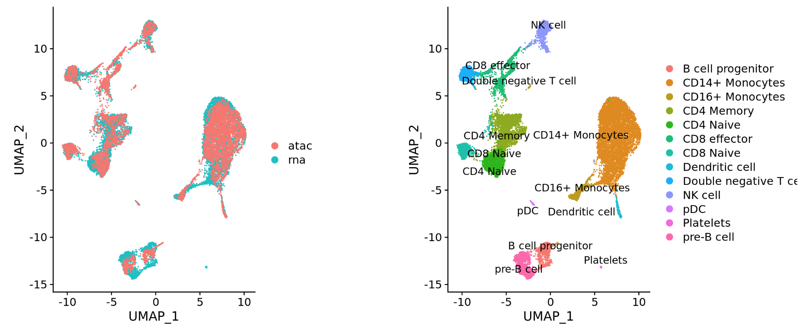
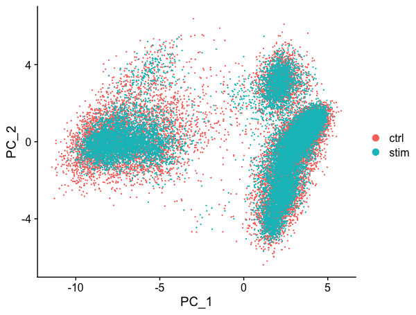
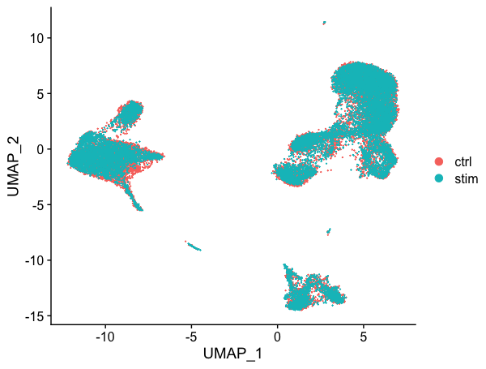
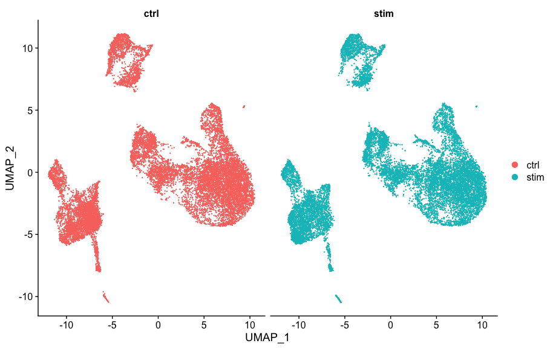

Approximate time: 90 minutes

## Learning Objectives:

* Execute the normalization, variance estimation, and identification of the most variable genes for each sample
* Perform integration of cells across conditions using the most variant genes to identify cells most similar to each other


# Single-cell RNA-seq clustering analysis: aligning cells across conditions

Now that we have our high quality cells, we have a few steps before we can cluster cells and identify different potential celltypes. Our dataset has two samples from two different conditions (Control and Stimulated), so it may be helpful to integrate these samples to better make comparisons between them. We will need to **normalize our gene expression values and align our cells across conditions** based on the greatest sources of variation in our dataset. In this lesson, we will discuss and perform these initial steps prior to clustering.


***

_**Goals:**_ 
 
 - _To accurately **normalize and scale the gene expression values** to account for differences in sequencing depth and overdispersed count values._
 - _To **identify the most variant genes** likely to be indicative of the different cell types present._
 - _To **align similar cells** across conditions._

_**Challenges:**_
 
 - _**Checking and removing unwanted variation** so that we do not have cells clustering by artifacts downstream_
 - _**Aligning cells of similar cell types** so that we do not have cell-type specific clustering downstream_

_**Recommendations:**_
 
 - _Have a good idea of your expectations for the **cell types to be present** prior to performing the clustering. Know whether you expect cell types of low complexity or higher mitochondrial content AND whether the cells are differentiating_
 - _**Regress out** number of UMIs (default using sctransform), mitochondrial content, and cell cycle, if needed and appropriate for experiment, so not to drive clustering downstream_
 
***

## Clustering workflow

For something to be informative, it needs to exhibit variation, but not all variation is informative. The goal of our clustering analysis is to keep the major sources of variation in our dataset that should define our cell types, while restricting the variation due to uninteresting sources of variation (sequencing depth, cell cycle differences, mitochondrial expression, batch effects, etc.).

Then, to determine the cell types present, we will perform a clustering analysis using the most variable genes to define the major sources of variation in the dataset. 

The workflow for this analysis is adapted from the following sources:

- Satija Lab: [Seurat v3 Guided Integration Tutorial](https://satijalab.org/seurat/v3.0/immune_alignment.html)
- Paul Hoffman: [Cell-Cycle Scoring and Regression](http://satijalab.org/seurat/cell_cycle_vignette.html)

To identify clusters, the following steps will be performed:

1. **Normalization**, **variance stabilization**, and **regression of unwanted variation** (e.g. mitochondrial transcript abundance, cell cycle phase, etc.) for each sample
2. **Integration** of the samples using shared highly variable genes (optional, but recommended to align cells from different samples/conditions if cell types are separating by sample/condition)
3. **Clustering cells** based on top PCs (metagenes)
4. Exploration of **quality control metrics**: determine whether clusters are unbalanced wrt UMIs, genes, cell cycle, mitochondrial content, samples, etc.
5. Searching for expected cell types using **known cell type-specific gene markers**

**In this lesson, we will cover the first two steps of the clustering workflow.**

## Set-up

To perform this analysis, we will be mainly using functions available in the Seurat package. Therefore, we need to load the Seurat library in addition to the tidyverse library, if not already loaded. Create the script `SCT_integration_analysis.R` and load the libraries:

```r
# Single-cell RNA-seq analysis - clustering analysis

# Load libraries
library(Seurat)
library(tidyverse)
library(RCurl)
library(cowplot)
```

To perform the analysis, Seurat requires the data to be present as a `seurat` object. We have created this object in the QC lesson (`filtered_seurat`), so we can just use that. 

## **Normalization**, **variance stabilization**, and **regression of unwanted variation** for each sample

The first step in the analysis is to normalize the raw counts to account for differences in sequencing depth per cell **for each sample**. Seurat recently introduced a new method for **normalization and variance stabilization** of scRNA-seq data called _**sctransform**_.

The sctransform method models the UMI counts using a **regularized negative binomial model** to remove the variation due to sequencing depth (total nUMIs per cell), while adjusting the variance based on pooling information across genes with similar abundances (similar to some bulk RNA-seq methods). 

<p align="center">

</p>

_**Image credit:** Hafemeister C and Satija R. Normalization and variance stabilization of single-cell RNA-seq data using regularized negative binomial regression, bioRxiv 2019 (https://doi.org/10.1101/576827)_

The **output of the model** (residuals) is the normalized expression levels for each transcript tested.

Sctransform automatically regresses out sequencing depth (nUMIs); however, there are other sources of uninteresting variation in the data that is often specific to the dataset. For example, for some datasets, cell cycle phase may be a source of significant variation, while for other datasets it isn't. Before you would regress out variation due to cell cycle phase, you would need to check whether cell cycle phase is a major source of variation in the data.

### Cell cycle scoring

It is **recommended to check the cell cycle phase before performing the sctransform method**. Since the counts need to be comparable between cells and each cell has a different number of total UMIs, we do a rough normalization by dividing by total counts per cell and taking the natural log. This method isn't as accurate as the sctransform method that we will use ultimately to identify cell clusters, but it is sufficient to explore sources of variation in our data. 

```r
# Normalize the counts
seurat_phase <- NormalizeData(filtered_seurat)
```

Once the data is normalized for sequencing depth, we can assign each cell a score, based on its expression of G2/M and S phase markers. 

We have provided a list of human cell cycle markers for you to download. Right click on [this link](https://www.dropbox.com/s/hus4mrkueh1tfpr/cycle.rda?dl=1) to "Save link as ..." directly into your `data` directory. However, if you are not working with human data we have [additional materials](../lessons/cell_cycle_scoring.md) detailing how to acquire cell cycle markers for other organisms of interest.

```r
# Load cell cycle markers
load("data/cycle.rda")

# Score cells for cell cycle
seurat_phase <- CellCycleScoring(seurat_phase, 
                                 g2m.features = g2m_genes, 
                                 s.features = s_genes)

# View cell cycle scores and phases assigned to cells                                 
View(seurat_phase@meta.data)                                
```

After scoring the cells for cell cycle, we would like to determine whether cell cycle is a major source of variation in our dataset using PCA. To perform PCA, we need to **first choose the most variable features, then scale the data**. Since highly expressed genes exhibit the highest amount of variation and we don't want our 'highly variable genes' only to reflect high expression, we need to scale the data to scale variation with expression level. The Seurat `ScaleData()` function will scale the data by:

* adjusting the expression of each gene to give a mean expression across cells to be 0
* scaling expression of each gene to give a variance across cells to be 1

```r
# Identify the most variable genes
seurat_phase <- FindVariableFeatures(seurat_phase, 
                     selection.method = "vst",
                     nfeatures = 2000, 
                     verbose = FALSE)
		     
# Scale the counts
seurat_phase <- ScaleData(seurat_phase)
```

> _**NOTE:** For the `selection.method` and `nfeatures` arguments the values specified are the default settings. Therefore, you do not necessarily need to include these in your code. We have included it here for transparency and inform you what you are using._	

Now, we can perform the PCA analysis and plot the top PCs:

```r
# Perform PCA
seurat_phase <- RunPCA(seurat_phase)

# Plot the PCA colored by cell cycle phase
DimPlot(seurat_phase,
        reduction = "pca",
        group.by= "Phase",
        split.by = "Phase")
```

<p align="center">

</p>

We do not see large differences due to cell cycle phase. Based on this plot, we would not regress out the variation due to cell cycle. 

### SCTransform

Now we can use the sctransform method as a **more accurate method of normalizing, estimating the variance of the raw filtered data, and identifying the most variable genes**. By default, sctransform accounts for cellular sequencing depth, or nUMIs.

We already checked cell cycle and decided that it didn't represent a major source of variation in our data, but mitochondrial expression is another factor which can greatly influence clustering. Oftentimes, it is useful to regress out variation due to mitochondrial expression. However, if the differences in mitochondrial gene expression represent a biological phenomenon that may help to distinguish cell clusters, then we advise not regressing the mitochondrial expression.

We can **use a 'for loop'** to run the `NormalizeData()`, `CellCycleScoring()`, and `SCTransform()` on each sample, and regress out mitochondrial expression by specifying in the `vars.to.regress` argument of the `SCTransform()` function.

Before we run this `for loop`, we know that the output can generate large R objects/variables in terms of memory. If we have a large dataset, then we might need to **adjust the limit for allowable object sizes within R** (*Default is 500 * 1024 ^ 2 = 500 Mb*) using the following code:

```r
options(future.globals.maxSize = 4000 * 1024^2)
```

Now, to **perform the cell cycle scoring and sctransform on all samples**. This may take some time (~10 minutes):

```r
# Split seurat object by condition to perform cell cycle scoring and SCT on all samples
split_seurat <- SplitObject(filtered_seurat, split.by = "sample")

split_seurat <- split_seurat[c("ctrl", "stim")]

for (i in 1:length(split_seurat)) {
    split_seurat[[i]] <- NormalizeData(split_seurat[[i]], verbose = TRUE)
    split_seurat[[i]] <- CellCycleScoring(split_seurat[[i]], g2m.features=g2m_genes, s.features=s_genes)
    split_seurat[[i]] <- SCTransform(split_seurat[[i]], vars.to.regress = c("mitoRatio"))
    }
```

> _**NOTE:** By default, after normalizing, adjusting the variance, and regressing out uninteresting sources of variation, SCTransform will rank the genes by residual variance and output the 3000 most variant genes. If the dataset has larger cell numbers, then it may be beneficial to adjust this parameter higher using the `variable.features.n` argument._ 

Note, the last line of output specifies "Set default assay to SCT". We can view the different assays that we have stored in our seurat object.

```r
# Check which assays are stored in objects
split_seurat$ctrl@assays
```

Now we can see that in addition to the raw RNA counts, we now have a SCT component in our `assays` slot. The most variable features will be the only genes stored inside the SCT assay. As we move through the scRNA-seq analysis, we will choose the most appropriate assay to use for the different steps in the analysis. 

Generally, we always look at our cells before deciding whether we need to perform integration. If we had performed the normalization on both conditions together in a Seurat object, we would have seen condition-specific clustering:

<p align="center">

</p>

Condition-specific clustering of the cells indicates that we need to integrate the cells across conditions. 

> _**NOTE:** Seurat has a [vignette](https://satijalab.org/seurat/v3.1/sctransform_vignette.html) for how to run through the workflow without integration. The workflow is fairly similar to this workflow, but the samples would not be split in the beginning and integration would not be performed._

## **Integrate** samples using shared highly variable genes

_**If the cells cluster by sample, condition, dataset, or modality, this step can greatly improve your clustering and your downstream analyses**. It can help to first run conditions individually if unsure what clusters to expect (e.g. tumor and control samples), then run them together to see whether there are condition-specific clusters. Oftentimes, when clustering cells from multiple conditions there are condition-specific clusters and integration can help ensure the same cell types cluster together._

To integrate, we will use the shared highly variable genes from each condition identified using SCTransform, then, we will "integrate" or "harmonize" the conditions to overlay cells that are similar or have a "common set of biological features" between groups. These groups can represent:

- Different **conditions** (e.g. control and stimulated)
	

- Different **datasets** (e.g. scRNA-seq from datasets generated using different library preparation methods on the same samples)
	

- Different **modalities** (e.g. scRNA-seq and scATAC-seq)
	
	
Integration is a powerful method that uses these shared sources of greatest variation to identify shared subpopulations across conditions or datasets [[Stuart and Bulter et al. (2018)](https://www.biorxiv.org/content/early/2018/11/02/460147)]. The goal of integration is to ensure that the cell types of one condition/dataset align with the same celltypes of the other conditions/datasets (e.g. control macrophages align with stimulated macrophages).

Specifically, this integration method expects "correspondences" or **shared biological states** among at least a subset of single cells across the groups. The steps in the integration analysis are outlined in the figure below:

<p align="center">

</p>

_**Image credit:** Stuart T and Butler A, et al. Comprehensive integration of single cell data, bioRxiv 2018 (https://doi.org/10.1101/460147)_

The different steps applied are as follows:

1. Perform **canonical correlation analysis (CCA):**
	
	CCA identifies shared sources of variation between the conditions/groups. It is a form of PCA, in that it **identifies the greatest sources of variation** in the data, but only if it is **shared or conserved** across the conditions/groups (using the 3000 most variant genes from each sample).
	
	This step roughly aligns the cells using the greatest shared sources of variation.

	> _**NOTE:** The shared highly variable genes are used because they are the most likely to represent those genes distinguishing the different cell types present._

2. **Identify anchors** or mutual nearest neighbors (MNNs) across datasets (sometimes incorrect anchors are identified):
	
	MNNs can be thought of as 'best buddies'. For each cell in one condition:
	- The cell's closest neighbor in the other condition is identified based on gene expression values - it's 'best buddy'.
	- The reciprical analysis is performed, and if the two cells are 'best buddies' in both directions, then those cells will be marked as **anchors** to 'anchor' the two datasets together.
	
	> "The difference in expression values between cells in an MNN pair provides an estimate of the batch effect, which is made more precise by averaging across many such pairs. A correction vector is obtained and applied to the expression values to perform batch correction." [[Stuart and Bulter et al. (2018)](https://www.biorxiv.org/content/early/2018/11/02/460147)]. 

3. **Filter anchors** to remove incorrect anchors:
	
	Assess the similarity between anchor pairs by the overlap in their local neighborhoods (incorrect anchors will have low scores) - do the adjacent cells have 'best buddies' that are adjacent to each other?

4. **Integrate** the conditions/datasets:

	Use anchors and corresponding scores to transform the cell expression values, allowing for the integration of the conditions/datasets (different samples, conditions, datasets, modalities)

	> _**NOTE:** Transformation of each cell uses a weighted average of the two cells of each anchor across anchors of the datasets. Weights determined by cell similarity score (distance between cell and k nearest anchors) and anchor scores, so cells in the same neighborhood should have similar correction values._

	**If cell types are present in one dataset, but not the other, then the cells will still appear as a separate sample-specific cluster.**


Now, using our SCTransform object as input, let's perform the integration across conditions.

First, we need to specify that we want to use all of the 3000 most variable genes identified by SCTransform for the integration. By default, this function only selects the top 2000 genes.

```r
# Select the most variable features to use for integration
integ_features <- SelectIntegrationFeatures(object.list = split_seurat, 
                                            nfeatures = 3000) 
```

Then, we need to **prepare the SCTransform object** for integration.

```r                                          
# Prepare the SCT list object for integration
split_seurat <- PrepSCTIntegration(object.list = split_seurat, 
                                   anchor.features = integ_features)
```

Now, we are going to **perform CCA, find the best buddies or anchors and filter incorrect anchors**. For our dataset, this will take up to 15 minutes to run. *Also, note that the progress bar in your console will stay at 0%, but know that it is actually running.*

```r
# Find best buddies - can take a while to run
integ_anchors <- FindIntegrationAnchors(object.list = split_seurat, 
                                        normalization.method = "SCT", 
                                        anchor.features = integ_features)
```

Finally, we can **integrate across conditions**.

```r
# Integrate across conditions
seurat_integrated <- IntegrateData(anchorset = integ_anchors, 
                                   normalization.method = "SCT")
```

This would often be a good place to **save the R object**.

```r
# Save integrated seurat object
saveRDS(seurat_integrated, "results/integrated_seurat.rds")
```

### UMAP visualization

After integration, to visualize the integrated data we can use dimensionality reduction techniques, such as PCA and Uniform Manifold Approximation and Projection (UMAP). While PCA will determine all PCs, we can only plot two at a time. In contrast, UMAP will take the information from any number of top PCs to arrange the cells in this multidimensional space. It will take those distances in multidimensional space, and try to plot them in two dimensions. In this way, the distances between cells represent similarity in expression.

To generate these visualizations we need to first run PCA and UMAP methods. Let's start with PCA.

```r
# Run PCA
seurat_integrated <- RunPCA(object = seurat_integrated)

# Plot PCA
PCAPlot(seurat_integrated,
        split.by = "sample")  
```

<p align="center">

</p>

We can see with the PCA mapping that we have a good overlay of both conditions by PCA. 

Now, we can also visualize with UMAP. Let's run the method and plot.

```r
# Run UMAP
seurat_integrated <- RunUMAP(seurat_integrated, 
                             dims = 1:40)

# Plot UMAP                             
DimPlot(seurat_integrated)                             
```

<p align="center">

</p>

Again, we see good alignment of the two conditions using both methods. Sometimes it's easier to see whether all of the cells align well if we **split the plotting between conditions**, which we can do by adding the `split.by` argument to the `DimPlot()` function:

```r
DimPlot(seurat_integrated,
        split.by = "sample")  
```

<p align="center">

</p>

> In this workshop, we dived into integrating this dataset, and when we compare to the unintegrated dataset, it is clear that this dataset benefitted from the integration!
> 
> <p align="center">
> 
> </p>

***

[Click here for next lesson](07_SC_clustering_cells_SCT.md)

***

*This lesson has been developed by members of the teaching team at the [Harvard Chan Bioinformatics Core (HBC)](http://bioinformatics.sph.harvard.edu/). These are open access materials distributed under the terms of the [Creative Commons Attribution license](https://creativecommons.org/licenses/by/4.0/) (CC BY 4.0), which permits unrestricted use, distribution, and reproduction in any medium, provided the original author and source are credited.*

* *A portion of these materials and hands-on activities were adapted from the [Satija Lab's](https://satijalab.org/) [Seurat - Guided Clustering Tutorial](https://satijalab.org/seurat/pbmc3k_tutorial.html)*
