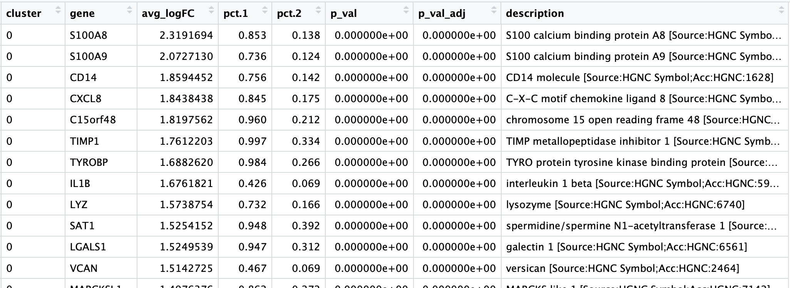
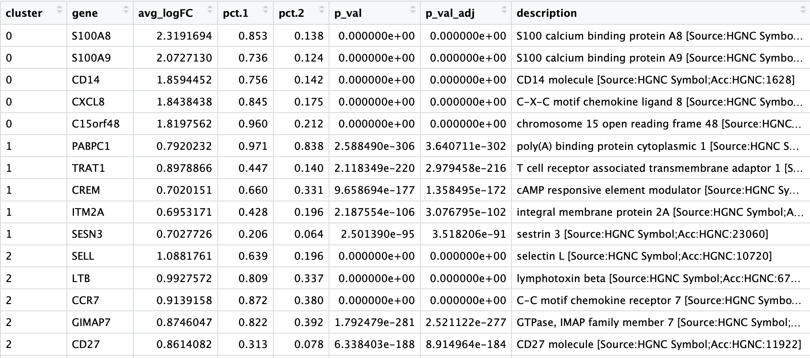
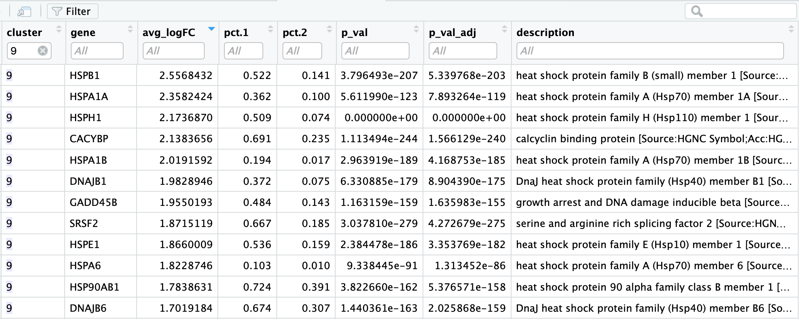
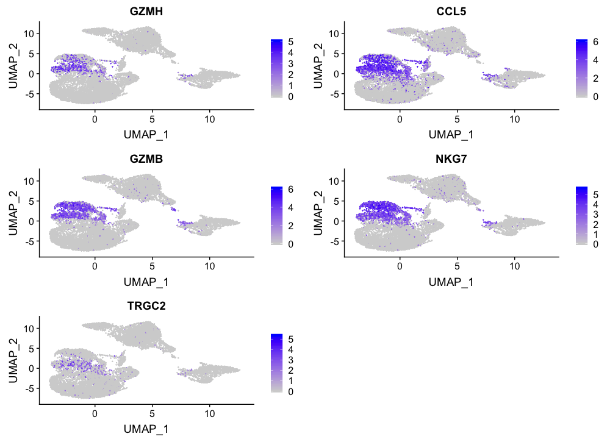
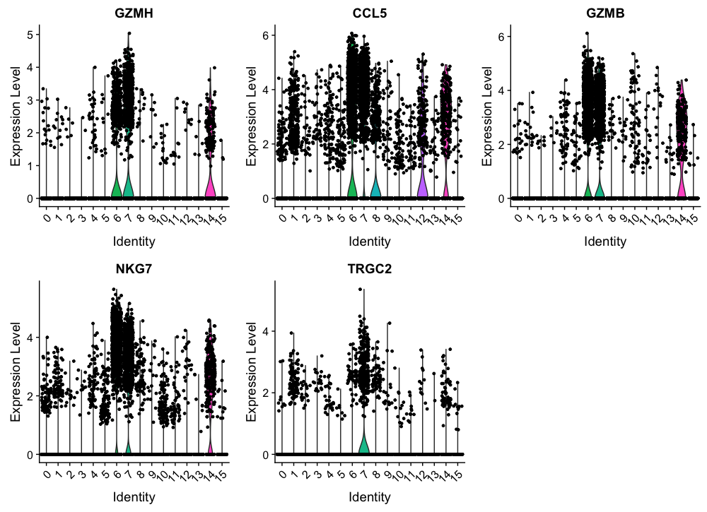
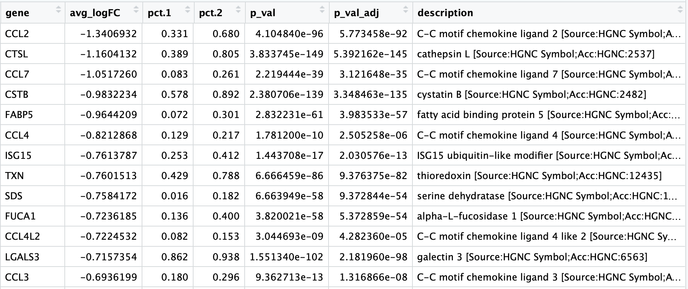
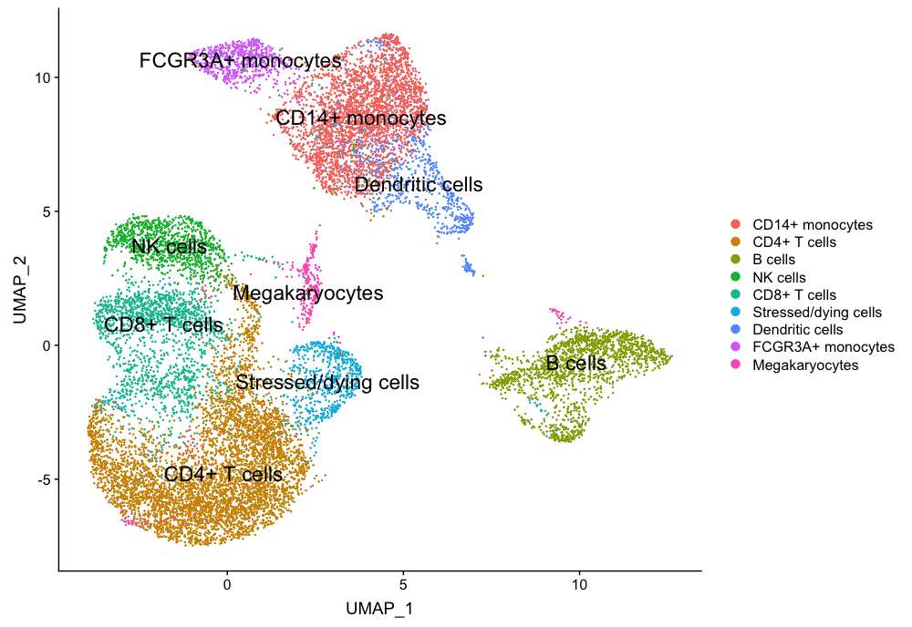
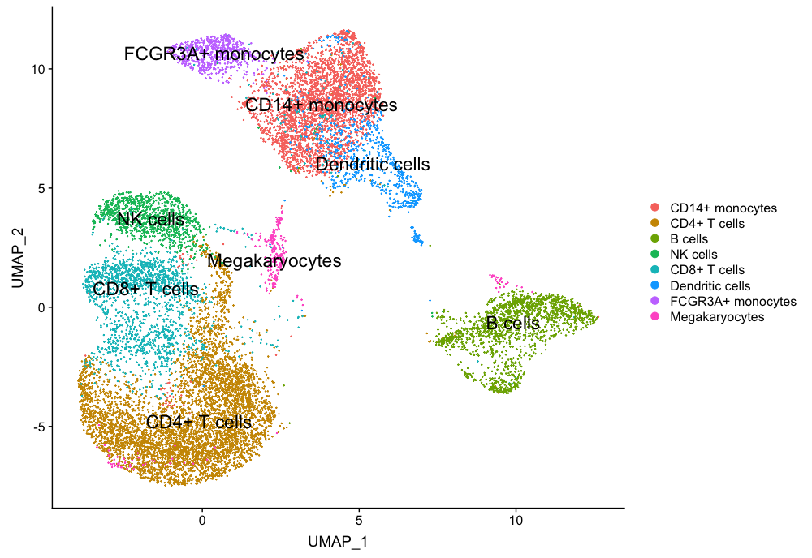

Approximate time: 45 minutes

## Learning Objectives:

* Understand how to determine markers of individual clusters
* Understand the iterative processes of clustering and marker identification

# Single-cell RNA-seq marker identification

Now that we have identified our desired clusters, we can move on to marker identification, which will allow us to verify the identity of certain clusters and help surmise the identity of any unknown clusters. 


***

_**Goals:**_ 
 
 - _To **determine the gene markers** for each of the clusters_
 - _To **identify cell types** of each cluster using markers_
 - _To determine whether need to **re-cluster based on cell type markers**, perhaps clusters need to be merged or split_

_**Challenges:**_
 
 - _Over-interpretation of the results_
 - _Combining different types of marker identification_

_**Recommendations:**_
 
 - _Think of the results as hypotheses that need verification. Inflated p-values can lead to over-interpretation of results (essentially each cell is used as a replicate). Top markers are most trustworthy._
 _Identify all markers conserved between conditions for each cluster_
 - _Identify markers that are differentially expressed between specific clusters_

***

Remember that we had the following questions from the clustering analysis:

1. *What is the cell type identity of cluster 9?*
2. *Is cluster 7 a CD8+ T cell or an NK cell? Perhaps an NK T cell?*
3. *Do the clusters corresponding to the same cell types have biologically meaningful differences? Are there subpopulations of these cell types?*
4. *Can we acquire higher confidence in these cell type identities by identifying other marker genes for these clusters?*

There are a few different types of marker identification that we can explore using Seurat to get to the answer of these questions. Each with their own benefits and drawbacks:

1. **Identification of all markers for each cluster:** this analysis compares each cluster against all others and outputs the genes that are differentially expressed/present. 
	- *Useful for identifying unkown clusters and improving confidence in hypothesized cell types.*

2. **Identification of conserved markers for each cluster regardless of condition:** This analysis looks for those genes that are conserved in the cluster across all conditions. This analysis will output genes that are consistently differentially expressed/present for all of the sample groups. These genes can help to figure out the identity for the cluster. Often, this analysis is performed only for those clusters whose identity is uncertain or novel.
	- *Useful when more than one condition to identify cell type markers that are conserved across conditions.*  	
3. **Marker identification between specific clusters:** this analysis explores differentially expressed genes between specific clusters. 
	- *Useful for determining differences in gene expression between clusters with markers that are similar in the above analyses.*

Since we only are exploring a single sample, we do not need to explore conserved markers, but we will investigate all markers for each cluster and tease out markers differentiating specific clusters.

## Identification of all markers for each cluster

For this analysis we are comparing each cluster against all other clusters to identify cluster markers using the ` FindAllMarkers()` function. This function has two important arguments which provide thresholds for determining whether a gene is a marker:

- `logfc.threshold`: minimum log2 foldchange for average expression of gene in cluster relative to the average expression in all other clusters combined
	- **Cons:** 
		- could miss those cell markers that are expressed in the cluster being compared, but not in the other clusters, if the average log2FC doesn't meet the threshold
		- could return a lot of metabolic/ribosomal genes due to slight differences in metabolic output by different cell types, which are not as useful to distinguish cell type identities
- `min.diff.pct`: minimum percent difference between the percent of cells expressing the gene in the cluster and the percent of cells expressing gene in all other clusters combined
	- **Cons:** could miss those cell markers that are expressed in all cells, but are highly up-regulated in this specific cell type
	
You could use one or the other of these arguments or both. We will be a bit lenient and use only the log2 fold change threshold greater than 0.25. We will also specify to return only the positive markers for each cluster

```r
# Find markers for every cluster compared to all remaining cells, report only the positive ones
markers <- FindAllMarkers(object = seurat_control, 
                          only.pos = TRUE,
                          logfc.threshold = 0.25)
                          
View(markers)                          
```

The order of the columns doesn't seem the most intuitive, so we will reorder the columns with the `cluster` first followed by the `gene`.

```r
# Combine markers with gene descriptions 
ann_markers <- inner_join(x = markers, 
                          y = annotations[, c("gene_name", "description")],
                          by = c("gene" = "gene_name")) %>%
        unique()

# Rearrange the columns to be more intuitive
ann_markers <- ann_markers[ , c(6, 7, 2:4, 1, 5,8)]

# Order the rows by p-adjusted values
ann_markers <- ann_markers %>%
        dplyr::arrange(cluster, p_val_adj)

View(ann_markers)
```

<p align="center">

</p>

**Usually the top markers are relatively trustworthy, but because of inflated p-values, many of the less significant genes are not so trustworthy as markers.**

When looking at the output, we suggest looking for markers with large differences in expression between `pct.1` and `pct.2` and larger fold changes. For instance if `pct.1` = 0.90 and `pct.2` = 0.80, I might not be as excited about that marker. However, if `pct.2` = 0.1 instead, then I would be much more excited about it. Also, I look for the majority of cells expressing marker in my cluster of interest. If `pct.1` is low, such as 0.3, I again might not be as interested in it.

- **cluster:** number corresponding to cluster
- **gene:** gene id
- **avg_logFC:** average log2 fold change. Positive values indicate that the gene is more highly expressed in the cluster.
- **pct.1**: The percentage of cells where the gene is detected in the cluster
- **pct.2**: The percentage of cells where the gene is detected on average in the other clusters
- **p_val:** p-value not adjusted for multiple test correction
- **p_val\_adj:** Adjusted p-value, based on bonferroni correction using all genes in the dataset, used to determine significance


If the format looks good, we can save our marker analysis results to file.

```r
# Save markers to file
write.csv(ann_markers, 
          file = "results/control_all_markers.csv", 
          quote = FALSE, 
          row.names = FALSE)
```

We can also output the top 5 markers by log2 fold change for each cluster for a quick perusal.

```r
# Extract top 5 markers per cluster
top5 <- ann_markers %>% 
        group_by(cluster) %>% 
        top_n(n = 5, 
              wt = avg_logFC)

# Visualize top 5 markers per cluster
View(top5)

```

<p align="center">

</p>

Based on these marker results, we can determine whether the markers make sense for our hypothesized identities for each cluster:

| Cell Type | Clusters |
|:---:|:---:|
| CD14+ Monocytes | 0, 5 | 
| FCGR3A+ Monocytes | 11 |
| Dendritic Cells | 10 |
| B cells | 4, 13 |
| T cells | 1, 2, 3, 7, 8, 14, 15 |
| CD4+ T cells | 1, 2, 3, 14, 15 |
| CD8+ T cells| 7, 8 |
| NK cells | 6, 7 |
| Megakaryocytes | 12 |
| Unknown | 9 |

If there were any questions about the identity of any clusters, exploring the cluster's markers would be the first step. Let's look at the `ann_markers`, filtering for cluster 9.

<p align="center">

</p>

We see a lot of heat shock and DNA damage genes appear. Based on these markers, it is likely that these are stressed or dying cells. We could explore the quality metrics for these cells in more detail before removing just to support that argument. 

We also had questions regarding the identity of cluster 7. Is cluster 7 a CD8+ T cell, an NK cell, or an NK T cell?

We can look at the markers of cluster 7 to try to resolve the identity:

<p align="center">

</p>

There are definitely T cell receptors that are enriched among cluster 7; therefore, it cannot be an NK cell. Likely it represents activated CD8+ T cells (cytotoxic T cells).

To get a better idea of cell type identity we can explore the expression of different identified markers by cluster using the `FeaturePlot()` function. For example, we can look at the cluster 7 markers:

```r
# Plot top 5 markers for cluster 7
FeaturePlot(object = seurat_control, 
            features = top5[top5$cluster == 7, "gene"] %>%
                    pull(gene))
```

<p align="center">

</p>

We can also explore the range in expression of specific markers by using violin plots:

```r
# Vln plot - cluster 7
VlnPlot(object = seurat_control, 
        features = top5[top5$cluster == 7, "gene"] %>%
                    pull(gene))
```        

<p align="center">

</p>

These results and plots can help us determine the identity of these clusters or verify what we hypothesize the identity to be after exploring the canonical markers of expected cell types previously.

## Identifying gene markers for each cluster

The last set of questions we had regarding the analysis involved whether the clusters corresponding to the same cell types have biologically meaningful differences. Sometimes the list of markers returned don't sufficiently separate some of the clusters. For instance, we had previously identified clusters 0 and 5 as CD14+ monocytes, but are there biologically relevant differences between these two clusters of cells? We can use the `FindMarkers()` function to determine the genes that are differentially expressed between these specific clusters. 

```r
# Determine differentiating markers for CD14+ monocytes - clusters 0 versus 5
cd14_monos <- FindMarkers(seurat_control,
                          ident.1 = 0,
                          ident.2 = 5)                     

# Add gene symbols to the DE table
cd14_monos_markers <- cd14_monos %>%
        rownames_to_column("gene") %>%
        inner_join(y = annotations[, c("gene_name", "description")],
                   by = c("gene" = "gene_name")) %>%
        unique()

# Reorder columns and sort by log2 fold change        
cd14_monos_markers <- cd14_monos_markers[, c(1, 3:5,2,6:7)]

cd14_monos_markers <- cd14_monos_markers %>%
        dplyr::arrange(avg_logFC)
        
# View data
View(cd14_monos_markers)
```

<p align="center">

</p>

When looking through the results, there appear to be many `CCL` genes that are differentially expressed between the clusters. If this were biologically meaningful we would keep the two distinct clusters, but if not, we would merge them.

While we are not going to explore these genes in more depth, you would probably want to explore the expression of these genes in more depth visually using feature plots and violin plots.

Now taking all of this information, we can surmise the cell types of the different clusters and plot the cells with cell type labels. We would have done comparisons between all of the clusters that represent the same cell type (i.e. between clusters 1, 2, and 3 for CD4+ T cells); however, for this lesson, we will merge all of the clusters of the same cell type.


| Cluster ID	| Cell Type |
|:-----:|:-----:|
|0	| CD14+ Monocytes|
|1	| CD4+ T cells |
|2	| CD4+ T cells|
|3	| CD4+ T cells|
|4	| B cells |
|5	| CD14+ Monocytes|
|6	| NK cells |
|7	| CD8+ T cells (activated)|
|8	| CD8+ T cells |
|9	| Stressed / dying cells |
|10	| Dendritic cells |
|11	| FCGR3A+ Monocytes |
|12	| Megakaryocytes |
|13	| B cells |
|14	| CD4+ T cells |
|15| CD4+ T cells |

We can then reassign the identity of the clusters to these cell types:

```r
seurat_control <- RenameIdents(object = seurat_control, 
                                "0" = "CD14+ monocytes",
                                "1" = "CD4+ T cells",
                                "2" = "CD4+ T cells",
                                "3" = "CD4+ T cells",
                                "4" = "B cells",
                                "5" = "CD14+ monocytes",
                                "6" = "NK cells",
                                "7" = "CD8+ T cells",
                                "8" = "CD8+ T cells",
                                "9" = "Stressed/dying cells",
                                "10" = "Dendritic cells",
                                "11" = "FCGR3A+ monocytes",
                                "12" = "Megakaryocytes",
                                "13" = "B cells",
                                "14" = "CD4+ T cells",
                                "15" = "CD4+ T cells")

DimPlot(object = seurat_control, 
        reduction = "umap", 
        label = TRUE,
        label.size = 6)
```

<p align="center">

</p>

If we wanted to remove the stressed cells, we could use the `SubsetData()` function:

```r
# Remove the stressed or dying cells
control_labelled <- subset(seurat_control,
                               idents = "Stressed/dying cells", invert = TRUE)

# Re-visualize the clusters
DimPlot(object = control_labelled, 
        reduction = "umap", 
        label = TRUE,
        label.size = 6)
```

<p align="center">

</p>

Now we would want to save our final labelled Seurat object:

```r        
# Save final R object
write_rds(control_labelled,
          path = "results/seurat_control_labelled.rds")       
```

We have completed the first round of the analysis for the `control` sample. Based on our results, we may need to proceed back to prior steps to optimize our parameters:

- Clusters were not separated well enough (i.e. CD4+ and CD8+ T cells were in same cluster):  adjust the clustering resolution or number of PCs used.
- Too many low quality cells observed: go back and perform more stringent QC by filtering out the low quality cells. 

If we validated the stressed/dying cells were indeed low quality, we may want to remove those cells in the QC and re-cluster. However, we are going to just leave those cells removed and move on to include the `stimulated` sample.

***


*This lesson has been developed by members of the teaching team at the [Harvard Chan Bioinformatics Core (HBC)](http://bioinformatics.sph.harvard.edu/). These are open access materials distributed under the terms of the [Creative Commons Attribution license](https://creativecommons.org/licenses/by/4.0/) (CC BY 4.0), which permits unrestricted use, distribution, and reproduction in any medium, provided the original author and source are credited.*

* *A portion of these materials and hands-on activities were adapted from the [Satija Lab's](https://satijalab.org/) [Seurat - Guided Clustering Tutorial](https://satijalab.org/seurat/pbmc3k_tutorial.html)*
