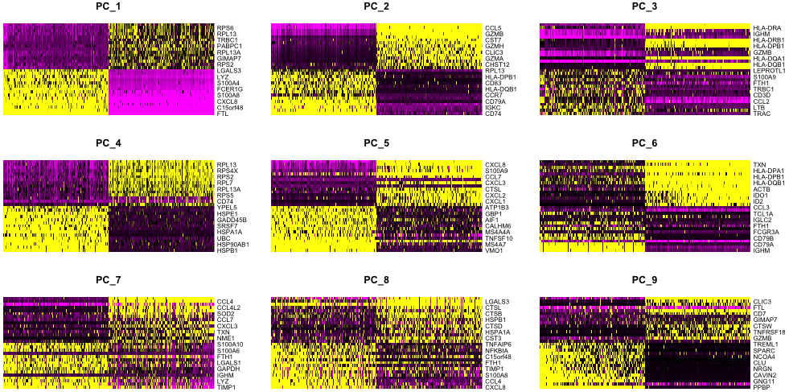

Approximate time: 90 minutes

## Learning Objectives:

* Utilize methods for evaluating the selection of PCs to use for clustering
* Perform clustering of cells based on significant PCs

# Single-cell RNA-seq clustering analysis

Now that we have our high quality cells integrated, we want to know the different cell types present within our population of cells. 

**UPDATE THIS WORKFLOW IMAGE!**


***

_**Goals:**_ 
 
 - _To **generate cell type-specific clusters** and use known cell type marker genes to determine the identities of the clusters._
 - _To **determine whether clusters represent true cell types or cluster due to biological or technical variation**, such as clusters of cells in the S phase of the cell cycle, clusters of specific batches, or cells with high mitochondrial content._

_**Challenges:**_
 
 - _**Identifying poor quality clusters** that may be due to uninteresting biological or technical variation_
 - _**Identifying the cell types** of each cluster_
 - _Maintaining patience as this can be a highly iterative process between clustering and marker identification (sometimes even going back to the QC filtering)_

_**Recommendations:**_
 
 - _Have a good idea of your expectations for the **cell types to be present** prior to performing the clustering. Know whether you expect cell types of low complexity or higher mitochondrial content AND whether the cells are differentiating_
 - _If you have **more than one condition**, it's often helpful to perform integration to align the cells_
 - _**Regress out** number of UMIs (by default with sctransform), mitochondrial content, and cell cycle, if needed and appropriate for experiment, so not to drive clustering_
 - _Identify any junk clusters for removal or re-visit QC filtering. Possible junk clusters could include those with high **mitochondrial content** and low UMIs/genes. If comprised of a lot of cells, then may be helpful to go back to QC to filter out, then re-integrate/cluster._
 - _If **not detecting all cell types as separate clusters**, try changing the resolution or the number of PCs used for clustering_
 
***

## Clustering cells based on top PCs (metagenes)

### Identify significant PCs

To overcome the extensive technical noise in the expression of any single gene for scRNA-seq data, Seurat assigns cells to clusters based on their PCA scores derived from the expression of the integrated most variable genes, with each PC essentially representing a "metagene" that combines information across a correlated gene set. Determining how many PCs to include downstream is therefore an important step to ensure that we are capturing the majority of the variation, or cell types, present in our dataset. Often it is useful to explore the PCs prior to deciding which PCs to include for the downstream clustering analysis.

One way of exploring the PCs is using a heatmap to visualize the most variant genes for select PCs with the **genes and cells ordered by PCA scores**. The `cells` argument specifies the number of cells with the most negative or postive PCA scores to use for the plotting.

```r
# Explore heatmap of PCs
DimHeatmap(seurat_integrated, 
           dims = 1:9, 
           cells = 500, 
           balanced = TRUE)
```
<p align="center">

</p>

We can see which genes appear to be driving the PCs, but this method can be slow and hard to visualize individual genes if we would like to explore a large number of PCs.

For exploring a large number of PCs, we could print out the top 5 positive and negative genes by PCA scores driving the PCs.

```r
# Printing out the most variable genes driving PCs
print(x = seurat_integrated[["pca"]], 
      dims = 1:10, 
      nfeatures = 5)
```

We only specified 10 dimensions, but we could easily include as many as we wish to explore. It is often useful to look at the PCs and determine whether the genes driving them make sense for differentiating the different cell types. However, we won't use this method alone to choose the PCs to use for the clustering analysis.

<p align="center">

</p>

The **elbow plot** is helpful when determining how many PCs we need to capture the majority of the variation in the data. The elbow plot visualizes the standard deviation of each PC. **Where the elbow appears is usually the threshold for identifying the majority of the variation**. However, this method can be a bit subjective about where the elbow is located. 

We will try the elbow plot using the top 40 dimensions:

```r
# Plot the elbow plot
ElbowPlot(object = seurat_integrated, 
          ndims = 40)
```

<p align="center">

</p>


Based on this plot, we could roughly determine the majority of the variation by where the elbow occurs (touches the ground) to be somewhere between PC12-PC16. While this gives us a good rough idea of the number of PCs needed to be included, you can also use a [**more quantitative approach**](elbow_plot_metric.md) which may be a bit more reliable.  

Since the SCTransform method is more accurate than some of the older Seurat methods of normalization and identification of variable genes, it is not as imperative to determine a specific PC value. As long as we choose a PC that is large enough to capture the majority of the variation, we can choose that value and move forward with it. The more PCs we choose, the more variation is accounted for when performing the clustering, but also, the longer it will take to perform the clustering. For our analysis, we will use the first **40 PCs** to generate the clusters. 

> #### Why is selection of PCs more important for older methods?
> The older methods incorporated some technical sources of variation into some of the higher PCs, so selection of PCs was more important. SCTransform better estimates the variance and adjusts does not frequently identify these sources of technical variation in the higher PCs. We could in theory use all of the PCs for clustering, but the main reason not to use them is the computational resources and time that would require. 

### Cluster the cells

We can now use these chosen PCs to determine which cells exhibit similar expression patterns for clustering. To do this, Seurat uses a graph-based clustering approach, which embeds cells in a graph structure, using a K-nearest neighbor (KNN) graph (by default), with edges drawn between cells with similar gene expression patterns. Then, it attempts to partition this graph into highly interconnected ‘quasi-cliques’ or ‘communities’ [[Seurat - Guided Clustering Tutorial](https://satijalab.org/seurat/v3.1/pbmc3k_tutorial.html)].

We will use the `FindClusters()` function to perform the graph-based clustering. The `resolution` is an important argument that sets the "granularity" of the downstream clustering and will need to be optimized to the experiment.  For datasets of 3,000 - 5,000 cells, the `resolution` set between `0.4`-`1.4` generally yields good clustering. Increased resolution values lead to a greater number of clusters, which is often required for larger datasets. 

We often provide a series of resolution options during clustering, which can be used downstream to choose the best resolution for the data.


```r
# Determine the K-nearest neighbor graph
seurat_integrated <- FindNeighbors(object = seurat_integrated, 
                                dims = 1:40)
                                
# Determine the clusters for various resolutions                                
seurat_integrated <- FindClusters(object = seurat_integrated,
                               resolution = c(0.4, 0.6, 0.8, 1.0, 1.4))
```

If we look at the metadata of our Seurat object(`seurat_integrated@metadata`), there is a separate column for each of the different resolutions calculated.

```r
# Explore resolutions
seurat_integrated@meta.data %>% 
        View()
```

To choose a resolution to start with, we often pick something in the middle of the range like 0.6 or 0.8. We will start with a resolution of 0.6 by assigning the identity of the clusters using the `Idents()` function.

```r
# Assign identity of clusters
Idents(object = seurat_integrated) <- "integrated_snn_res.0.8"
```

To visualize the cell clusters, there are a few different dimensionality reduction techniques that can be helpful. The most popular methods include t-distributed stochastic neighbor embedding (t-SNE) and Uniform Manifold Approximation and Projection (UMAP) techniques. 

Both methods aim to place cells with similar local neighborhoods in high-dimensional space together in low-dimensional space. As input, we suggest using the same PCs as input to the clustering analysis. **Note that distance between clusters in the t-SNE plot does not represent degree of similarity between clusters, whereas in the UMAP plot it does**. Therefore, we will proceed with the UMAP method for visualizations, which should separate the clusters more based on similarity.

```r
# Calculation of UMAP
seurat_integrated <- RunUMAP(seurat_integrated, 
                  reduction = "pca", 
                  dims = 1:40)

# Plot the UMAP
DimPlot(seurat_integrated,
        reduction = "umap",
        label = TRUE,
        label.size = 6,
        plot.title = "UMAP")
```

> **Need help with UMAP?** Click the [link for helpful code](https://hbctraining.github.io/scRNA-seq/lessons/umap-installation.html)

<p align="center">

</p>

The UMAP looks quite a bit nicer, with the clusters more clearly defined. Also, because distance between clusters is meaningful, the UMAP provides more information than t-SNE. 

It can be useful to **explore other resolutions as well**. It will give you a quick idea about how the clusters would change based on the resolution parameter. For example, let's take a look at 0.4 resolution:

```r
# Assign identity of clusters
Idents(object = seurat_integrated) <- "integrated_snn_res.0.4"

# Plot the UMAP
DimPlot(seurat_integrated,
        reduction = "umap",
        label = TRUE,
        label.size = 6,
        plot.title = "UMAP")
```

<p align="center">

</p>


**How does your UMAP plot compare to the one above?**

What you may have noticed is that there is some variability in the way your plots look compared to those in the lesson. In particular you may see a difference in the labeling of clusters. This is an unfortunate consequence of slight variations in the versions you are using (of the Seurat package and/or dependency packages).

In order to maintain consistency in the downstream analysis and interpretation of this dataset, we will ask you to [download a new R object](https://www.dropbox.com/s/7m71je2s21kxwcf/seurat_control.rds?dl=1) to the `data` folder. Once downloaded, you will need to **load in the object to your R session and overwrite the existing one**: 

```r
seurat_integrated <- readRDS("data/seurat_integrated.rds")
```

Using this new R object we will continue with the UMAP method and the 0.8 resolution to check the quality control metrics and known markers for anticipated cell types. Plot the UMAP again to make sure your image now matches what you see in the lesson:

```r
# Assign identity of clusters
Idents(object = seurat_integrated) <- "integrated_snn_res.0.8"

# Plot the UMAP
DimPlot(seurat_integrated,
        reduction = "umap",
        label = TRUE,
        label.size = 6,
        plot.title = "UMAP")
```

<p align="center">

</p>

***

**[Exercises](https://hbctraining.github.io/scRNA-seq/lessons/sc_exercises_clustering_analysis.html#clustering-cells-based-on-top-pcs-metagenes)**

***

[Click here for next lesson](06_SC_clustering_quality_control.md)

***

*This lesson has been developed by members of the teaching team at the [Harvard Chan Bioinformatics Core (HBC)](http://bioinformatics.sph.harvard.edu/). These are open access materials distributed under the terms of the [Creative Commons Attribution license](https://creativecommons.org/licenses/by/4.0/) (CC BY 4.0), which permits unrestricted use, distribution, and reproduction in any medium, provided the original author and source are credited.*

* *A portion of these materials and hands-on activities were adapted from the [Satija Lab's](https://satijalab.org/) [Seurat - Guided Clustering Tutorial](https://satijalab.org/seurat/pbmc3k_tutorial.html)*
