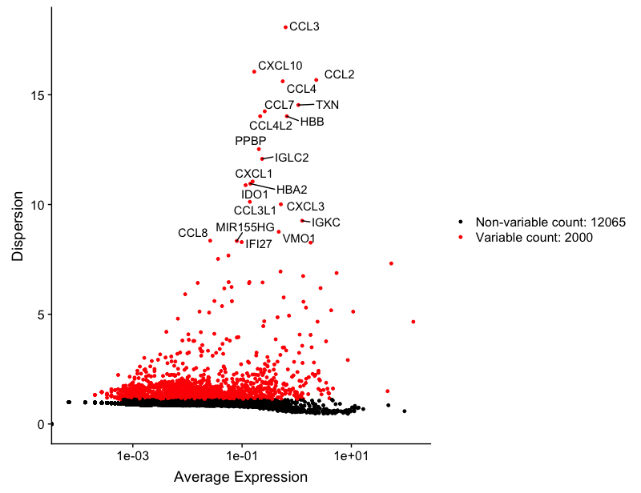
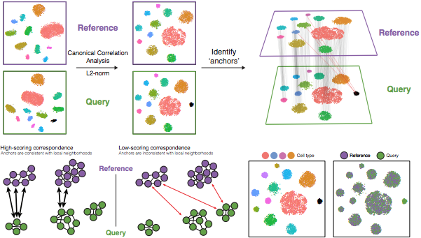
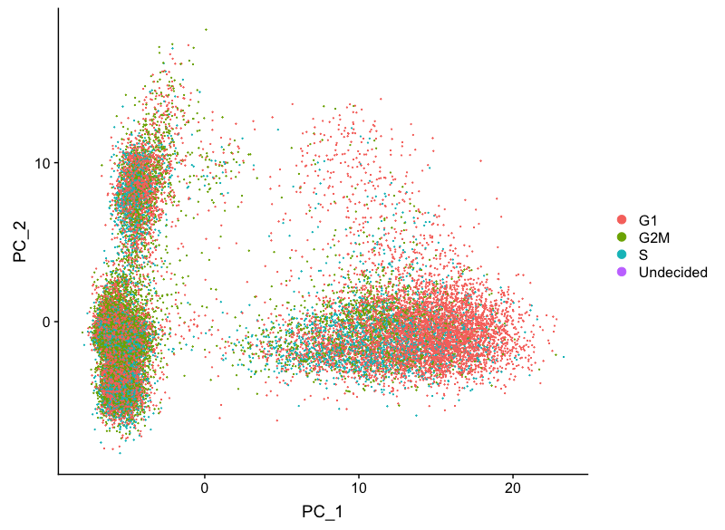
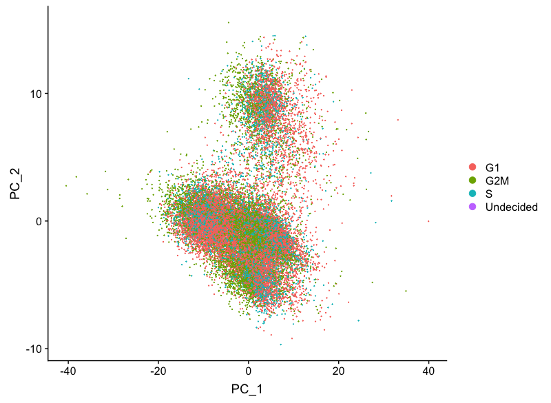
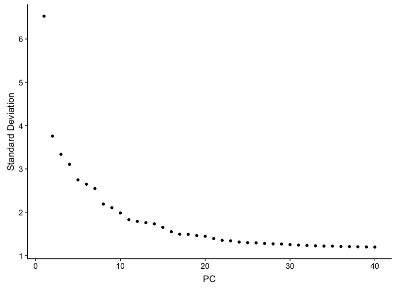
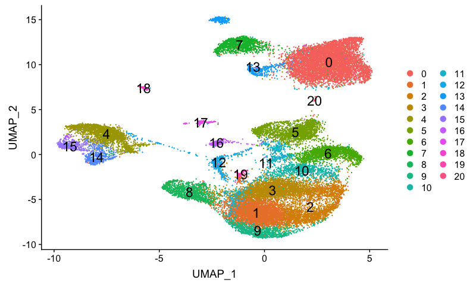

Approximate time: 90 minutes

## Learning Objectives:

* Utilize integration methods to generate cell type-specific clusters across conditions, batches, or technologies
* Perform clustering and marker identification workflow with integrated data

# Single-cell RNA-seq clustering analysis

After determining the cell types expected in the control sample, we would like to include the interferon-stimulated sample together with the control to compare the cell types present and/or genes differentially expressed between conditions. 

Oftentimes, if samples are created using different conditions (or batches), the effect of the condition can be so great that the cells will cluster by condition instead of cell type. To ensure the same cell types cluster together, we can perform an integration analysis detailed in the paper by [Stuart and Bulter et al. (2018)](https://www.biorxiv.org/content/early/2018/11/02/460147). 
Therefore, we are going to integrate the cells from our control and stimulated samples together.


*** 

_**Goals:**_ 
 
- _To **align the cells** corresponding to the same cell types across conditions, batches or technologies_

_**Challenges:**_
 
 - _Clustering so that **cells of the same cell type from different conditions cluster together**_
 - _Ensuring the alignment of cells is appropriate with respect to the metadata of the cells_

_**Recommendations:**_
 
 - _For multi-sample experiments, err on the side of **aligment of cells** rather than not aligning. Generally, alignment shouldn't negatively affect the analysis, although less processing is always preferred_
 - _Following integration, err on the side of using **more PCs for clustering** than fewer PCs. Usually use at least 20 - 30 PCs for clustering; additional PCs do not affect the clustering very much after ~30 PCs depending on the size of the dataset and the variability present._

***
 
## Integration


To integrate multiple samples together, we need to perform the following steps:

1. **Extract each sample** as a Seurat object
2. **Normalize** the cell counts for library depth and identify **highly variable genes** for each sample
4. **Integrate** samples using shared highly variable genes

### Extract each sample as a Seurat object

The first thing we do is extract each sample as an individual Seurat object.

```r
# Extract each sample into a separate Seurat object (stored in a list)
seurat_list <- SplitObject(seurat_raw, split.by = "sample")
```

We should now have a list variable with two Seurat object components called `ctrl` and `stim`.

### Normalize the cell counts for library depth and identify highly variable genes

Before comparing expression profiles of cells to determine similarity, we need to normalize the cell counts for sequencing depth per cell for each sample separately. We perform this step as done previously using the `LogNormalize` method.

Then, to align similar cells across samples we need to identify the most variable genes for each of the samples. Similar to previously, the mean-variance relationship of the data is modeled and the 2,000 most variable genes are returned.

```r

# Normalize and find variable features
for (i in 1:length(seurat_list)) {
        seurat_list[[i]] <- NormalizeData(seurat_list[[i]], 
                                          verbose = FALSE)
        seurat_list[[i]] <- FindVariableFeatures(seurat_list[[i]], 
                                                 selection.method = "vst", 
                                                 nfeatures = 2000,
                                                 verbose = FALSE)
}                         
```

We can check the most highly variable genes for each sample, to see if the genes make sense regarding the cell types expected.

**Control**

```r
# Identify the 20 most highly variable genes
top20 <- head(x = VariableFeatures(object = seurat_list$ctrl), 
              n = 20)

# Variable gene plot
unlabelled <- VariableFeaturePlot(object = seurat_list$ctrl)

# With labels
LabelPoints(plot = unlabelled,
            points = top20,
            repel = TRUE)
```

<p align="center">

</p>

**Interferon-stimulated**

```r
# Identify the 20 most highly variable genes
top20 <- head(x = VariableFeatures(object = seurat_list$stim), 
              n = 20)

# Variable gene plot
unlabelled <- VariableFeaturePlot(object = seurat_list$stim)

# With labels
LabelPoints(plot = unlabelled,
            points = top20,
            repel = TRUE)
```

<p align="center">

</p>

You will notice that many of the most highly variable genes are present between the two samples, which is a good sign for aligning cells.


### **Integrate** samples using shared highly variable genes

_**This step can greatly improve your clustering when you have multiple samples**. It can help to first run samples individually if unsure what clusters to expect, but when clustering the cells from multiple conditions, integration can help ensure the same cell types cluster together._

Using the shared highly variable genes from each sample, we integrate the samples to overlay cells that are similar or have a "common set of biological features". The process of integration uses canonical correlation analysis (CCA) and mutual nearest neighbors (MNN) methods to identify shared subpopulations across samples or datasets [[Stuart and Bulter et al. (2018)](https://www.biorxiv.org/content/early/2018/11/02/460147)]. 

Specifically, this integration method expects "correspondences" or **shared biological states** among at least a subset of single cells across the samples. The steps applied are as follows:

1. Canonical correlation analysis (CCA) is performed, which uses **shared highly variable genes** to reduce the dimensionality of the data and align the cells in each sample into the maximally correlated space (based on sets of genes exhibiting robust correlation in expression). **Shared highly variable genes are most likely to represent those genes distinguishing the different cell types present.**
2. Identify mutual nearest neighbors (MNNs), or 'anchors' across datasets (sometimes incorrect anchors are identified)
	
	> MNNs identify the cells that are most similar to each other across samples or conditions. "The difference in expression values between cells in an MNN pair provides an estimate of the batch effect, which is made more precise by averaging across many such pairs. A correction vector is obtained from the estimated batch effect and applied to the expression values to perform batch correction. Our approach automatically identifies overlaps in population composition between batches and uses only the overlapping subsets for correction, thus avoiding the assumption of equal composition required by other methods." [[Stuart and Bulter et al. (2018)](https://www.biorxiv.org/content/early/2018/11/02/460147)]. 

3. Assess the similarity between anchor pairs by the overlap in their local neighborhoods (incorrect anchors will have low scores)
4. Use anchors and corresponding scores to transform cell expression values, allowing for the integration of the datasets (different samples, datasets, modalities)
	- Transformation of each cell uses a weighted average of the two cells of each anchor across anchors of the datasets. Weights determined by cell similarity score (distance between cell and k nearest anchors) and anchor scores, so cells in the same neighborhood should have similar correction values.

If cell types are present in one dataset, but not the other, then the cells will still appear as a separate sample-specific cluster.

<p align="center">

</p>

_**Image credit:** Stuart T and Butler A, et al. Comprehensive integration of single cell data, bioRxiv 2018 (https://doi.org/10.1101/460147)_

To perform the integration it is necessary to specify the number of dimensions or correlated components (CCs) to use. 

> In CCA "the canonical correlation vectors...capture correlated gene modules that are present in both datasets, representing genes that define a shared biological state. In contrast, PCA will identify sources of variation even if they are only present in an individual experiment."

Generally Seurat recommends using 
```r
# Identify anchors
anchors <- FindIntegrationAnchors(object.list = seurat_list, 
                                  dims = 1:30)

# Integrate samples
combined <- IntegrateData(anchorset = anchors, 
                          dims = 1:30)
                          
DefaultAssay(object = combined) <- "integrated"                                                            
```

## Scaling and regression of sources of unwanted variation

In addition to there being interesting variation that separates the different cell types in your dataset, there is also "uninteresting" sources of variation present that can obscure the cell type-specific differences. This can include technical noise, batch effects, and/or uncontrolled biological variation (e.g. cell cycle).

### Cell cycle scoring

Let's score each gene for cell cycle phase, then perform PCA using the expression of cell cycle genes. Remember, if the cells group by cell cycle in the PCA, then we would want to regress out cell cycle variation, **unless cells are differentiating**. 

```r
combined <- ScaleData(object = combined, 
                      verbose = FALSE)

cell_cycle_genes <- inner_join(cell_cycle_genes, annotations, by = c("geneID" = "gene_id"))

g2m_genes <- cell_cycle_genes %>%
        dplyr::filter(phase == "G2/M") %>%
        pull(gene_name)

s_genes <- cell_cycle_genes %>%
        dplyr::filter(phase == "S") %>%
        pull(gene_name)


# Perform cell cycle scoring
combined <- CellCycleScoring(
        combined,
        g2m.features = g2m_genes,
        s.features = s_genes)

# Perform PCA and color by cell cycle phase
combined <- RunPCA(combined,
                   verbose = FALSE)

DimPlot(object = combined, 
        reduction = "pca",
        group.by= "Phase")

```

<p align="center">

</p>

### Apply regression variables

Similar to the analysis with the `control` sample, we will regress the uninteresting sources of variation, including number of UMIs, mitochondrial ratio, and cell cycle scores to **improve downstream identification of principal components and clustering.** 

```r
# Define variables in metadata to regress
vars_to_regress <- c("nUMI", "mitoRatio", "S.Score", "G2M.Score")

# Regress out the uninteresting sources of variation in the data
combined <- ScaleData(combined, 
                      vars.to.regress = vars_to_regress)
                      
# Perform PCA and color by cell cycle phase
combined <- RunPCA(combined,
                   verbose = FALSE)

DimPlot(object = combined, 
        reduction = "pca",
        group.by= "Phase")
```

<p align="center">

</p>

## Clustering cells based on top PCs (metagenes)

### Identify significant PCs

For integrated data, we usually use the number of PCs utilized in the integration of the data. In addition, having a higher number of PCs does not normally change the clustering drastically after about 30 PCs. However, it's always a good idea to double-check to make sure that the majority of the variation is explained.

Let's to make sure that 30 PCs capture the most significant PCs by plotting the elbow plot.

```r
ElbowPlot(object = combined, 
           ndims = 40)
```

<p align="center">

</p>

Based on this elbow plot, it appears that 30 PCs capture the majority of the variation. We will continue to use the 30 PCs that we had initially used for the integration.

## Cluster the cells

We can now use these PCs to determine which cells exhibit similar expression patterns for clustering using the K-nearest neighbor (KNN) graph, with edges drawn between cells with similar gene expression patterns partitioned into highly interconnected ‘quasi-cliques’ or ‘communities’.

```r
# Determine the K-nearest neighbor graph
combined <- FindNeighbors(object = combined, 
                                dims = 1:30)

# Determine the clusters for various resolutions                                
combined <- FindClusters(object = combined,
                               resolution = c(0.4, 0.6, 0.8, 1.2, 1.8))
```                               


### Creating non-linear dimensional reduction (UMAP/tSNE)

To visualize the clusters, we will use UMAP and PCA. The goals of these methods is to have similar cells closer together in low-dimensional space.

```r
# Choose clustering resolution for first round of analysis
colnames(combined@meta.data)

Idents(object = combined) <- "integrated_snn_res.0.8"

# Calculate UMAP coordinates
combined <- RunUMAP(combined,
                    reduction = "pca",
                    dims = 1:30)

# Plot UMAP
DimPlot(combined,
        reduction = "umap",
        label = TRUE,
        label.size = 6,
        plot.title = "UMAP")
```


<p align="center">

</p>

Again, we see that our results are not all the same, so to work with the same object for exploration of the clusters we are going to read in the same object.

[Download](https://www.dropbox.com/s/q2vuotwkn6i0dvh/combined_for_markerID_integ.rds?dl=1) the object to the `data` folder.

```r
# Read in clustered Seurat object
combined <- readRDS("data/combined_for_markerID_integ.rds")

# Ensure assignment of resolution 0.8
Idents(object = combined) <- "integrated_snn_res.0.8"

# Plot UMAP
DimPlot(combined,
        reduction = "umap",
        label = TRUE,
        label.size = 6,
        plot.title = "UMAP")
```

<p align="center">

</p>

***

**Exercises**

1. **Exploration of quality control metrics:**

	To determine whether our clusters might be due to artifacts such as cell cycle phase or mitochondrial expression, it can be useful to explore these metrics visually to see if any clusters exhibit enrichment or are different from the other clusters. However, if enrichment or differences are observed for particular clusters it may not be worrisome if it can be explained by the cell type. 
	
	Using the `control` sample as a reference, perform all of the following QC checks on the clusters:
	
	- Extract identity and sample information from seurat object to determine the number of cells per cluster per sample.
	
	- Visualize whether we have any sample-specific clusters by using `DimPlot()` with the `split.by` argument.
	
	- Visualize whether any of the clusters are enriched for cell cycle genes by cluster by using `DimPlot()` and splitting by `Phase`. 
	
	- Explore how well our clusters separate by the different PCs, coloring by PC score for each respective principal component.

2. **Evaluating clustering:**
	

	<p align="center">
	
	</p>


	Based on our above clusters, we will determine whether our clustering and resolution are appropriate for our experiment. To do this let's explore a handful of markers for each of the major cell types that we expect to be in our data and see how they segregate.
	
	- Explore known immune cell markers for expected clusters:
	
		| Cell Type | Marker |
		|:---:|:---:|
		| CD14+ monocytes | CD14, LYZ | 
		| FCGR3A+ monocytes | FCGR3A, MS4A7 |
		| Conventional dendritic cells | FCER1A, CST3 |
		| Plasmacytoid dendritic cells | IL3RA, GZMB, SERPINF1, ITM2C |
		| B cells | CD79A, MS4A1 |
		| T cells | CD3D |
		| CD4+ T cells | CD3D, IL7R, CCR7 |
		| CD8+ T cells| CD3D, CD8A |
		| NK cells | GNLY, NKG7 |
		| Megakaryocytes | PPBP |
		| Erythrocytes | HBB, HBA2 |
		
	
		
	
	- Let's also explore cell states. Based on the analysis with the `Control` sample, we have some additional cell markers to determine **immune cell activation status** and **stressed/dying** cells:
	
		| Cell State | Marker |
		|:---:|:---:|
		| Naive T cells | CCR7, SELL | 
		| Activated B and T cells | CREM, CD69 |
		| Stressed/dying cells | HSPB1, DNAJB6, HSPH1, GADD45B |
	
	- Based on these results, try to assign each cluster to one of the following categories: 
	
		| Cell Type | Clusters |
		|:---:|:---:|
		| CD14+ Monocytes |  | 
		| FCGR3A+ Monocytes |   |
		| Conventional dendritic cells |   |
		| Plasmacytoid dendritic cells |   |
		| Naive B cells |   |
		| Activated B cells |   |
		| Naive CD4+ T cells |  |
		| Activated CD4+ T cells |  |
		| Naive CD8+ T cells|   |
		| Activated (cytotoxic) CD8+ T cells|   |
		| NK cells |   |
		| Megakaryocytes |   |
		| Erythrocytes |   |
		| Stressed / dying cells |   |
		| Unknown |  |
	
	While we have a good idea of the cell types for the different clusters, it's always a good idea to perform marker identification to ensure the hypothesized cell identities make sense with the enriched genes. Also, we can explore identities for the unknown clusters.
	
	[Click here for next lesson]()
	
***

*This lesson has been developed by members of the teaching team at the [Harvard Chan Bioinformatics Core (HBC)](http://bioinformatics.sph.harvard.edu/). These are open access materials distributed under the terms of the [Creative Commons Attribution license](https://creativecommons.org/licenses/by/4.0/) (CC BY 4.0), which permits unrestricted use, distribution, and reproduction in any medium, provided the original author and source are credited.*

* *A portion of these materials and hands-on activities were adapted from the [Satija Lab's](https://satijalab.org/) [Seurat - Guided Clustering Tutorial](https://satijalab.org/seurat/pbmc3k_tutorial.html)*

