Approximate time: 90 minutes

## Learning Objectives:

* Evaluate whether clustering artifacts are present 
* Determine the quality of clustering with PCA, tSNE and UMAP plots and understand when to re-cluster
* Assess known cell type markers to hypothesize cell type identities of clusters

# Single-cell RNA-seq clustering analysis


Now that we have our high quality cells, we want to know the different cell types present within our population of cells. 


***

_**Goals:**_ 
 
 - _To **generate cell type-specific clusters** and use known markers to determine the identities of the clusters._
 - _To **determine whether clusters represent true cell types or cluster due to biological or technical variation**, such as clusters of cells in the S phase of the cell cycle, clusters of specific batches, or cells with high mitochondrial content._

_**Challenges:**_
 
 - _Clustering so that **cells of the same cell type from different conditions cluster together**_
 - _**Removing unwanted variation** so that we do not have cells clustering by artifacts_
 - _**Identifying the cell types** of each cluster_
 - _Maintaining patience as this can be a highly iterative process between clustering and marker identification (sometimes even going back to the QC filtering)_

_**Recommendations:**_
 
 - _Have a good idea of your expectations for the **cell types to be present** prior to performing the clustering. Know whether you expect cell types of low complexity or higher mitochondrial content AND whether the cells are differentiating_
 - _If you have **more than one condition**, it's often helpful to perform integration to align the cells_
 - _**Regress out** number of UMIs, mitochondrial content, and cell cycle, if needed and appropriate for experiment, so not to drive clustering_
 - _Identify any junk clusters for removal. Possible junk clusters could include those with high **mitochondrial content** and low UMIs/genes_
 - _If **not detecting all cell types as separate clusters**, try changing the resolution or the number of PCs used for clustering_

***

## Exploration of quality control metrics

To determine whether our clusters might be due to artifacts such as cell cycle phase or mitochondrial expression, it can be useful to explore these metrics visually to see if any clusters exhibit enrichment or are different from the other clusters. However, if enrichment or differences are observed for particular clusters it may not be worrisome if it can be explained by the cell type. 

To explore and visualize the various quality metrics, we will use the versatile `DimPlot()` and `FeaturePlot()` functions from Seurat. 

### Segregation of clusters by sample

We can start by exploring the distribution of cells per cluster in each sample:

```r
# Extract identity and sample information from seurat object to determine the number of cells per cluster per sample
n_cells <- FetchData(seurat_integrated, 
                     vars = c("ident", "orig.ident")) %>%
        dplyr::count(ident, orig.ident) %>%
        tidyr::spread(ident, n)

# View table
View(n_cells)
```

<p align="center">
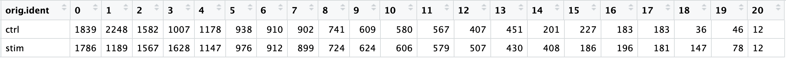
</p>

We can visualize the cells per cluster for each sample using the UMAP:

```r
# UMAP of cells in each cluster by sample
DimPlot(seurat_integrated, 
        label = TRUE, 
        split.by = "sample")  + NoLegend()
```
<p align="center">
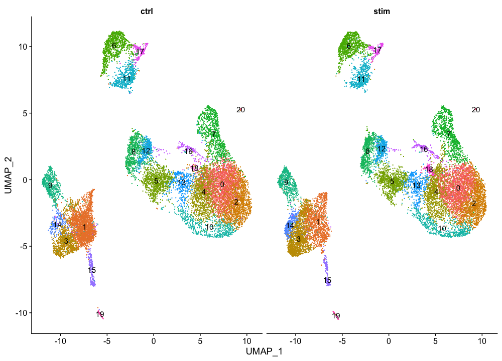
</p>

### Segregation of clusters by cell cycle phase

Next we can explore whether the **cells cluster by the different cell cycle phases**. We did not regress out variation due to cell cycle phase when we performed the SCTransform normalization and regression of uninteresting sources of variation. If our cell clusters showed large differences in mitochondrial expression, this would be an indication we would want to re-run the SCTransform and add the `S.Score` and `G2M.Score` to our variables to regress, then re-run the rest of the steps.


```r
# Explore whether clusters segregate by cell cycle phase
DimPlot(seurat_integrated,
        label = TRUE, 
        split.by = "Phase")  + NoLegend()
```

<p align="center">
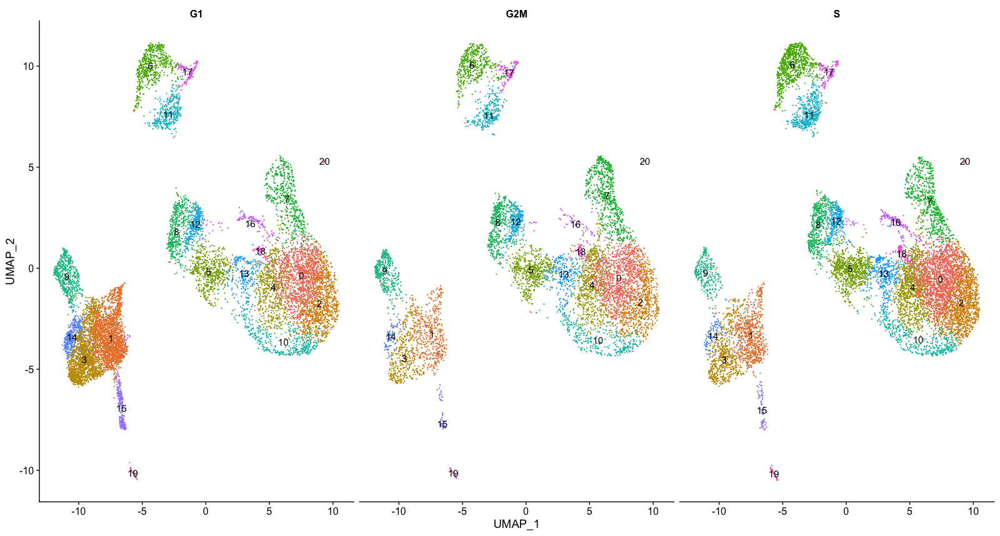
</p>

We do not see much clustering by cell cycle score, so we can proceed with the QC.

### Segregation of clusters by various sources of uninteresting variation

Next we will explore additional metrics, such as the number of UMIs and genes per cell, S-phase and G2M-phase markers, and mitochondrial gene expression by UMAP. Looking at the individual S and G2M scores can give us additional information to checking the phase as we did previously.

```r
# Determine metrics to plot present in seurat_integrated@meta.data
metrics <-  c("nUMI", "nGene", "S.Score", "G2M.Score", "mitoRatio")

FeaturePlot(seurat_integrated, 
            reduction = "umap", 
            features = metrics,
            pt.size = 0.4, 
            sort.cell = TRUE,
            min.cutoff = 'q10',
            label = TRUE)
```

<p align="center">
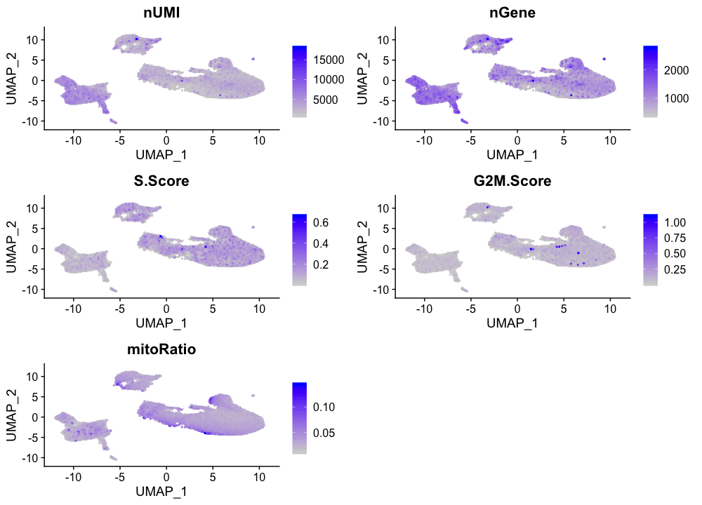
</p>

> _**NOTE:** The `sort.cell` argument will plot the positive cells above the negative cells, while the `min.cutoff` argument will determine the threshold for shading. A `min.cutoff` of `q10` translates to the 10% of cells with the lowest expression of the gene will not exhibit any purple shading (completely gray)._

The metrics seem to be relatively even across the clusters, with the exception of the `nUMIs` and `nGene` exhibiting higher values in clusters 3, 9, 14, and 15, and, perhaps, cluster 17. We will keep an eye on these clusters to see whether the cell types may explain the increase.

### Exploration of the PCs driving the different clusters

We can also explore how well our clusters separate by the different PCs; we hope that the defined PCs separate the cell types well. To visualize this information, we need to extract the UMAP coordinate information for the cells along with their corresponding scores for each of the PCs to view by UMAP. 

First, we identify the information we would like to extract from the Seurat object, then, we can use the `FetchData()` function to extract it.

```r
# Defining the information in the seurat object of interest
columns <- c(paste0("PC_", 1:16),
            "ident",
            "UMAP_1", "UMAP_2")

# Extracting this data from the seurat object
pc_data <- FetchData(seurat_integrated, 
                     vars = columns)
```

> **NOTE:** How did we know in the `FetchData()` function to include `UMAP_1` to obtain the UMAP coordinates? The [Seurat cheatsheet](https://satijalab.org/seurat/essential_commands.html) describes the function as being able to pull any data from the expression matrices, cell embeddings, or metadata. 
> 
> For instance, if you explore the `seurat_integrated@reductions` list object, the first component is for PCA, and includes a slot for `cell.embeddings`. We can use the column names (`PC_1`, `PC_2`, `PC_3`, etc.) to pull out the coordinates or PC scores corresponding to each cell for each of the PCs. 
> 
> We could do the same thing for UMAP:
> 
> ```r
> # Extract the UMAP coordinates for the first 10 cells
> seurat_integrated@reductions$umap@cell.embeddings[1:10, 1:2]
>```
>
> The `FetchData()` function just allows us to extract the data more easily.

In the UMAP plots below, the cells are colored by their PC score for each respective principal component. 

Let's take a quick look at the top 16 PCs:

```r
# Plotting a UMAP plot for each of the PCs
map(paste0("PC_", 1:16), function(pc){
        ggplot(pc_data, 
               aes(UMAP_1, UMAP_2)) +
                geom_point(aes_string(color=pc), 
                           alpha = 0.7) +
                scale_color_gradient(guide = FALSE, 
                                     low = "grey90", 
                                     high = "blue")  +
                geom_text(data=umap_label, 
                          aes(label=ident, x, y)) +
                ggtitle(pc)
}) %>% 
        plot_grid(plotlist = .)
```

<p align="center">
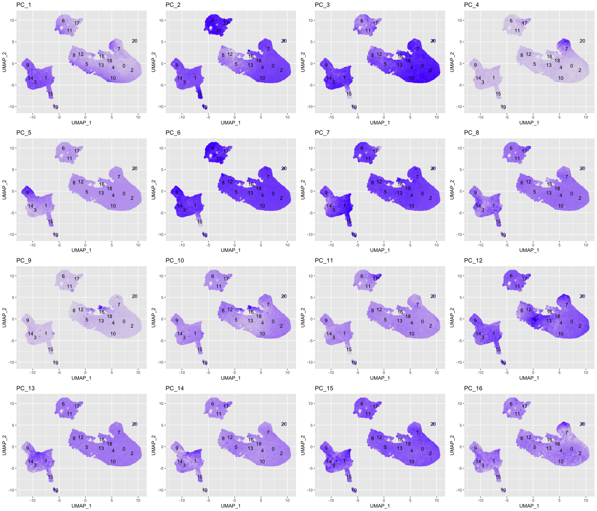
</p>

We can see how the clusters are represented by the different PCs. For instance, the genes driving `PC_2` exhibit higher expression in clusters 6, 11, and 17 (maybe a bit higher in 15, too). We could look back at our genes driving this PC to get an idea of what the cell types might be:

```r
# Examine PCA results 
print(seurat_integrated[["pca"]], dims = 1:5, nfeatures = 5)
```

<p align="center">
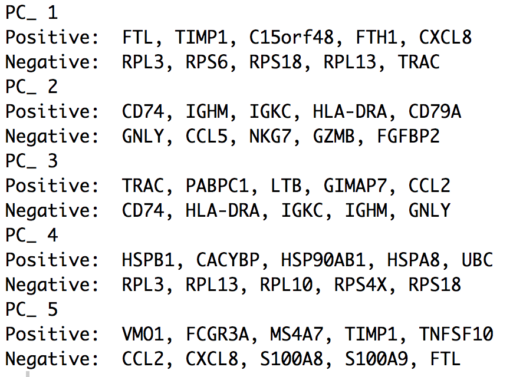
</p>

With the CD79A gene and the HLA genes as positive markers of `PC_2`, we can hypothesize that clusters 6, 11, and 17 correspond to B cells. This just hints at what the clusters identity could be, with the identities of the clusters being determined through a combination of the PCs. 

To truly determine the identity of the clusters and whether the `resolution` is appropriate, it is helpful to explore a handful of known markers for the cell types expected. 

## Exploring known cell type markers

With the cells clustered, we can explore the cell type identities by looking for known markers. The UMAP plot with clusters marked is shown, followed by the different cell types expected.

```r
DimPlot(object = seurat_integrated, 
        reduction = "umap", 
        label = TRUE) + NoLegend()
```

<p align="center">
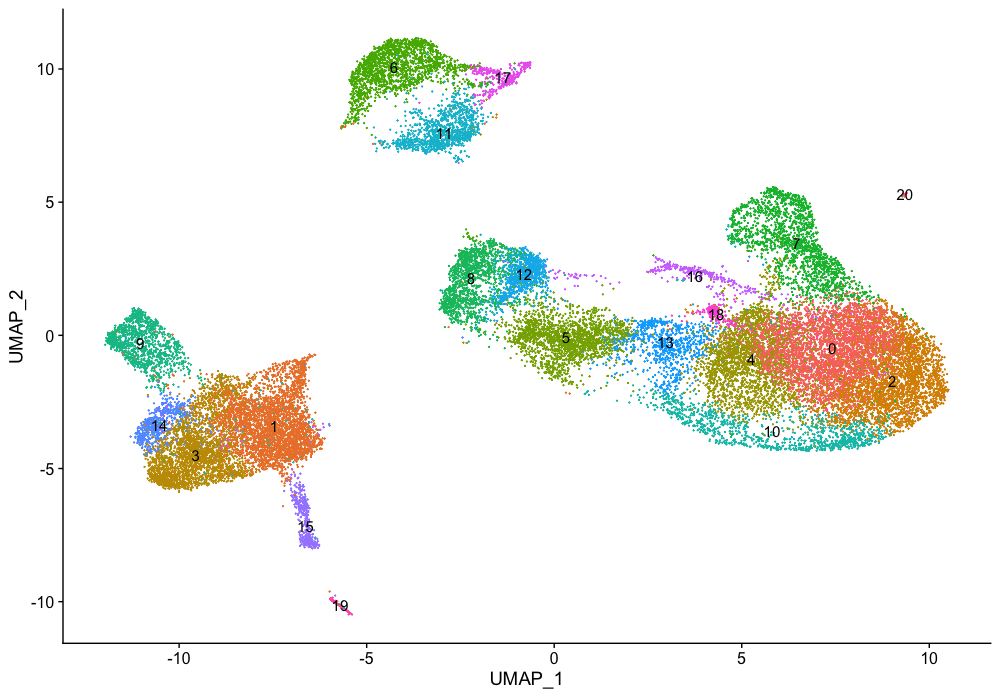
</p>


The `FeaturePlot()` function from seurat makes it easy to visualize a handful of genes using the gene IDs stored in the Seurat object. For example if we were interested in exploring known immune cell markers, such as:

| Cell Type | Marker |
|:---:|:---:|
| CD14+ monocytes | CD14, LYZ | 
| FCGR3A+ monocytes | FCGR3A, MS4A7 |
| Conventional dendritic cells | FCER1A, CST3 |
| Plasmacytoid dendritic cells | IL3RA, GZMB, SERPINF1, ITM2C |
| B cells | CD79A, MS4A1 |
| T cells | CD3D |
| CD4+ T cells | CD3D, IL7R, CCR7 |
| CD8+ T cells| CD3D, CD8A |
| NK cells | GNLY, NKG7 |
| Megakaryocytes | PPBP |
| Erythrocytes | HBB, HBA2 |

Seurat's `FeaturePlot()` function let's us easily explore the known markers on top of our UMAP visualizations. Let's go through and determine the identities of the clusters. To access the expression levels of all genes, rather than just the 3000 most highly variable genes, we can use the normalized count data stored in the `RNA` assay slot.

```r
# Select the RNA counts slot to be the default assay
DefaultAssay(seurat_integrated) <- "RNA"

# Normalize RNA data for visualization purposes
seurat_integrated <- NormalizeData(seurat_integrated, verbose = FALSE)
```

We are looking for consistency of expression of the markers across the clusters. For example, if there are two markers for a cell type and only one of them is expressed in a cluster - then we cannot reliably assign that cluster to the celltype.


**CD14+ monocyte markers**

```r
FeaturePlot(seurat_integrated, 
            reduction = "umap", 
            features = c("CD14", "LYZ"), 
            sort.cell = TRUE,
            min.cutoff = 'q10', 
            label = TRUE)
```

<p align="center">

</p>

CD14+ monocytes appear to correspond to clusters 1, 3, and 14. We wouldn't include clusters 9 and 15 because they do not highly express both of these markers.

**FCGR3A+ monocyte markers**

```r
FeaturePlot(seurat_integrated, 
            reduction = "umap", 
            features = c("FCGR3A", "MS4A7"), 
            sort.cell = TRUE,
            min.cutoff = 'q10', 
            label = TRUE)
```

<p align="center">

</p>

FCGR3A+ monocytes markers distinctly highlight cluster 9. 

**Macrophages**

```r
FeaturePlot(seurat_integrated, 
            reduction = "umap", 
            features = c("MARCO", "ITGAM", "ADGRE1"), 
            sort.cell = TRUE,
            min.cutoff = 'q10', 
            label = TRUE)
```

<p align="center">

</p>

No clusters appear to correspond to macrophages; perhaps cell culture conditions negatively selected for macrophages (more highly adherent).

**Conventional dendritic cell markers**

```r
FeaturePlot(seurat_integrated, 
            reduction = "umap", 
            features = c("FCER1A", "CST3"), 
            sort.cell = TRUE,
            min.cutoff = 'q10', 
            label = TRUE)
```

<p align="center">
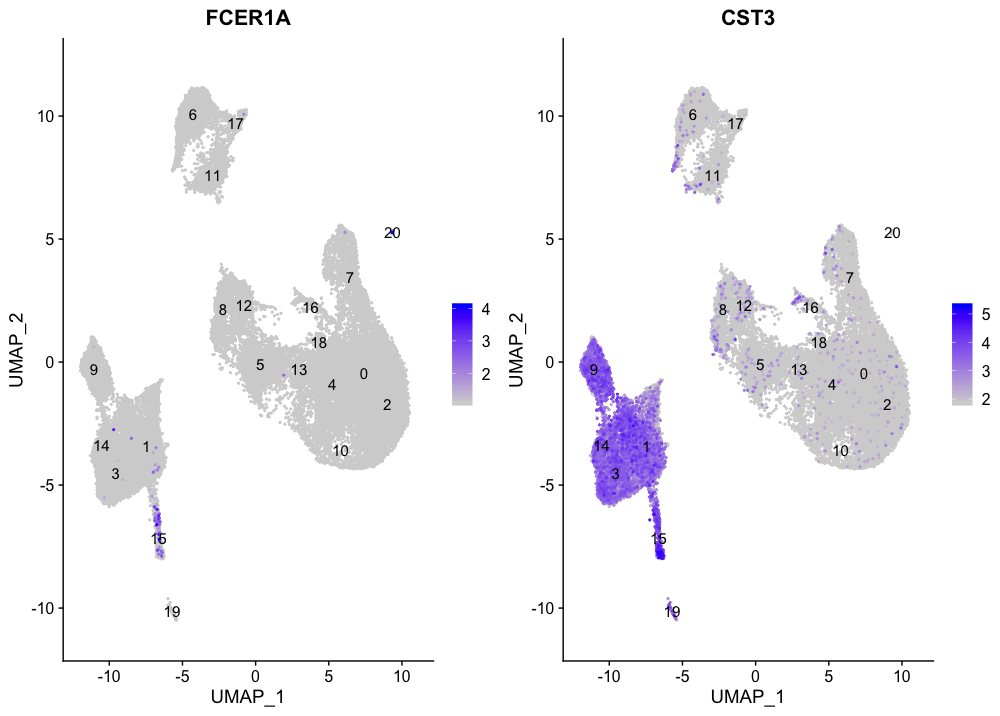
</p>

The markers corresponding to conventional dendritic cells identify cluster 15 (both markers consistently show expression).

**Plasmacytoid dendritic cell markers**

```r
FeaturePlot(seurat_integrated, 
            reduction = "umap", 
            features = c("IL3RA", "GZMB", "SERPINF1", "ITM2C"), 
            sort.cell = TRUE,
            min.cutoff = 'q10', 
            label = TRUE)
```

<p align="center">
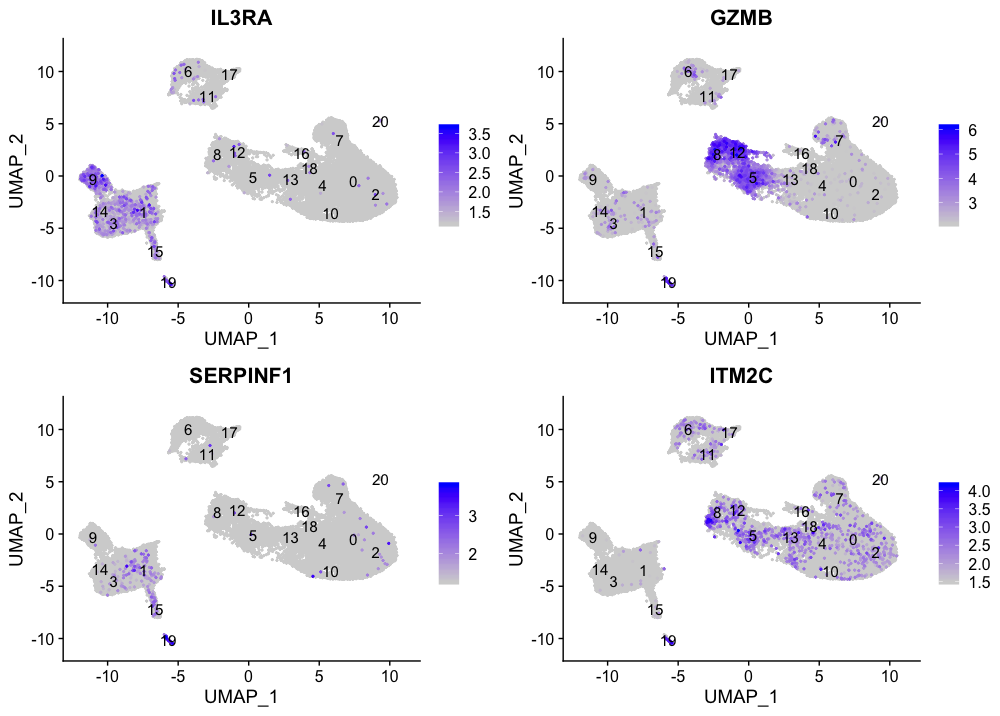
</p>

Plasmacytoid dendritic cells represent cluster 19. While there are a lot of differences in the expression of these markers, we see cluster 19 is consistently expressed.

**B cell markers**

```r
FeaturePlot(seurat_integrated, 
            reduction = "umap", 
            features = c("CD79A", "MS4A1"), 
            sort.cell = TRUE,
            min.cutoff = 'q10', 
            label = TRUE)
```

<p align="center">
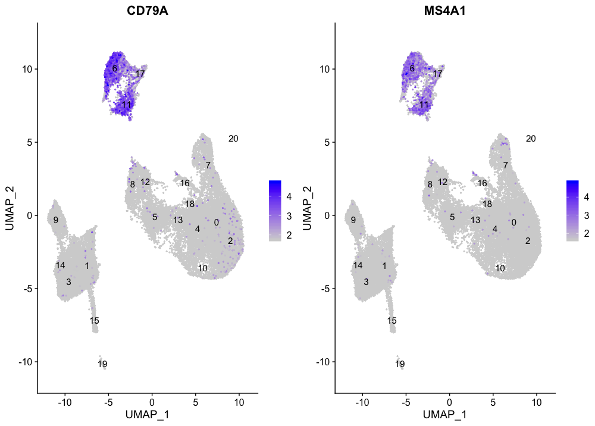
</p>

Clusters 6, 11, and 17 have good expression of the B cell markers. This corresponds to the hypothesized identity based on the genes driving PC2.

**T cell markers**

```r
FeaturePlot(seurat_integrated, 
            reduction = "umap", 
            features = c("CD3D"), 
            sort.cell = TRUE,
            min.cutoff = 'q10', 
            label = TRUE)
```

<p align="center">

</p>

All T cells markers concentrate in the large group of clusters on the right-hand side of the plot, with the exception of clusters 7, 8, 12, and 16. 

**CD4+ T cell markers**

```r
FeaturePlot(seurat_integrated, 
            reduction = "umap", 
            features = c("CD3D", "IL7R", "CCR7"), 
            sort.cell = TRUE,
            min.cutoff = 'q10', 
            label = TRUE)
```

<p align="center">

</p>

The subset of T cells corresponding to the CD4+ T cells are clusters 0, 2, 4, 10, and 18. We see expression in other clusters, as well, but these weren't expressing high levels of the T cell marker CD3D.

**CD8+ T cell markers**

```r
FeaturePlot(seurat_integrated, 
            reduction = "umap", 
            features = c("CD3D", "CD8A"), 
            sort.cell = TRUE,
            min.cutoff = 'q10', 
            label = TRUE)
```

<p align="center">

</p>

For CD8+ T cells the only consistent expression for both markers is observed for clusters 5 and 13.

**NK cell markers**

```r
FeaturePlot(seurat_integrated, 
            reduction = "umap", 
            features = c("GNLY", "NKG7"), 
            sort.cell = TRUE,
            min.cutoff = 'q10', 
            label = TRUE)
```

<p align="center">
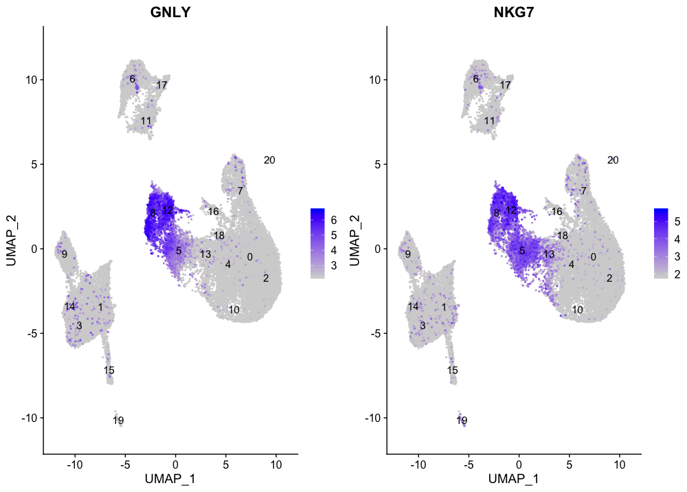
</p>

The NK cell markers are expressed in clusters 8 and 12, in addition to cluster 5; however, we know cluster 5 expresses T cell markers. We would hypothesize that cluster 5 may be an activated CD8+ T cell.

**Megakaryocyte markers**

```r
FeaturePlot(seurat_integrated, 
            reduction = "umap", 
            features = c("PPBP"), 
            sort.cell = TRUE,
            min.cutoff = 'q10', 
            label = TRUE)
```

<p align="center">

</p>

The megakaryocyte markers seem to be expressed mainly in cluster 16.

**Erythrocyte markers**

```r
FeaturePlot(seurat_integrated, 
            reduction = "umap", 
            features = c("HBB", "HBA2"), 
            sort.cell = TRUE,
            min.cutoff = 'q10', 
            label = TRUE)
```

<p align="center">
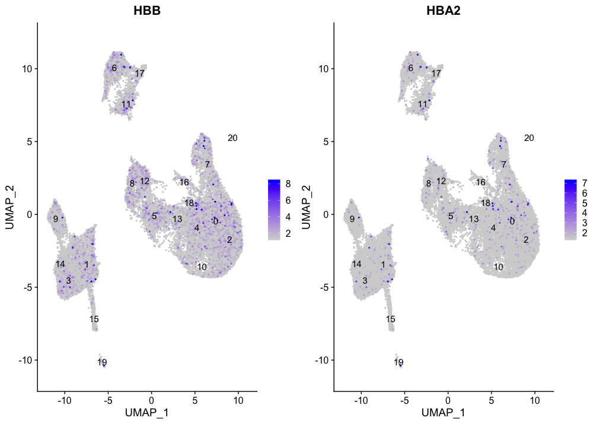
</p>

There does not seem to be a cluster of erythrocytes, as the markers are spread around the different cell types. This is not a bad thing as the blood cells are often cell types to be excluded from the analysis, since they are not often informative about the condition of interest.

Based on these results, we can associate clusters with the cell types. However, we would like to perform a deeper analysis using marker identification before performing a final assignment of the clusters to a cell type.


| Cell Type | Clusters |
|:---:|:---:|
| CD14+ monocytes | 1, 3, 14 | 
| FCGR3A+ monocytes | 9 |
| Conventional dendritic cells | 15 |
| Plasmacytoid dendritic cells | 19 |
| B cells | 6, 11, 17 |
| T cells | 0, 2, 4, 5, 10, 13, 18 |
| CD4+ T cells | 0, 2, 4, 10, 18 |
| CD8+ T cells| 5, 13 |
| NK cells | 8, 12 |
| Megakaryocytes | 16 |
| Erythrocytes | - |
| Unknown | 7, 20 |

> **NOTE:** If any cluster appears to contain two separate cell types, it's helpful to increase our clustering resolution to properly subset the clusters. Alternatively, if we still can't separate out the clusters using increased resolution, then it's possible that we had used too few principal components such that we are just not separating out these cell types of interest. To inform our choice of PCs, we could look at our PC gene expression overlapping the UMAP plots and determine whether our cell populations are separating by the PCs included.

Now we have a decent idea as to the cell types corresponding to the majority of the clusters, but some questions remain:

1. *What are the cell type identities of clusters 7 and 20?*
2. *Do the clusters corresponding to the same cell types have biologically meaningful differences? Are there subpopulations of these cell types?*
3. *Can we acquire higher confidence in these cell type identities by identifying other marker genes for these clusters?*

Marker identification analysis can help us address all of these questions!! 

The next step will be to perform marker identification analysis, which will output the genes that significantly differ in expression between clusters. Using these genes we can determine or improve confidence in the identities of the clusters/subclusters.

[Click here for next lesson](07_SC_marker_identification.md)

***

*This lesson has been developed by members of the teaching team at the [Harvard Chan Bioinformatics Core (HBC)](http://bioinformatics.sph.harvard.edu/). These are open access materials distributed under the terms of the [Creative Commons Attribution license](https://creativecommons.org/licenses/by/4.0/) (CC BY 4.0), which permits unrestricted use, distribution, and reproduction in any medium, provided the original author and source are credited.*

* *A portion of these materials and hands-on activities were adapted from the [Satija Lab's](https://satijalab.org/) [Seurat - Guided Clustering Tutorial](https://satijalab.org/seurat/pbmc3k_tutorial.html)*
