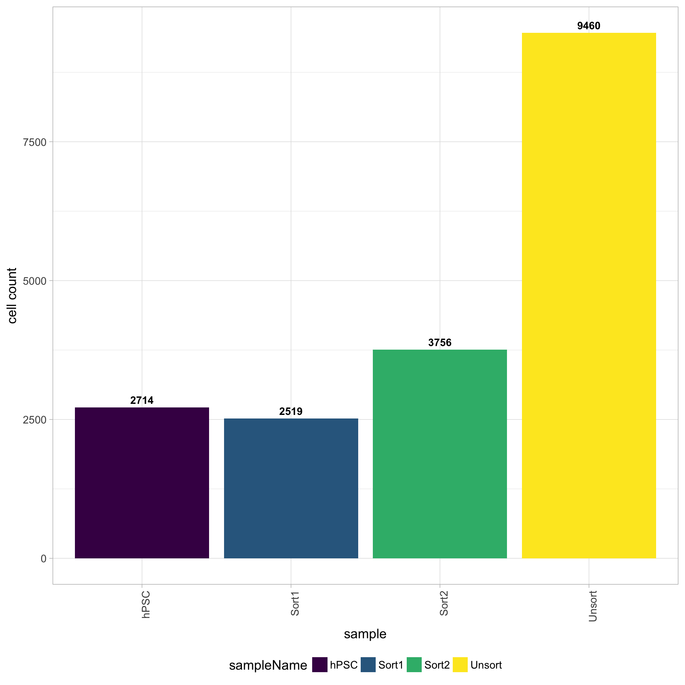
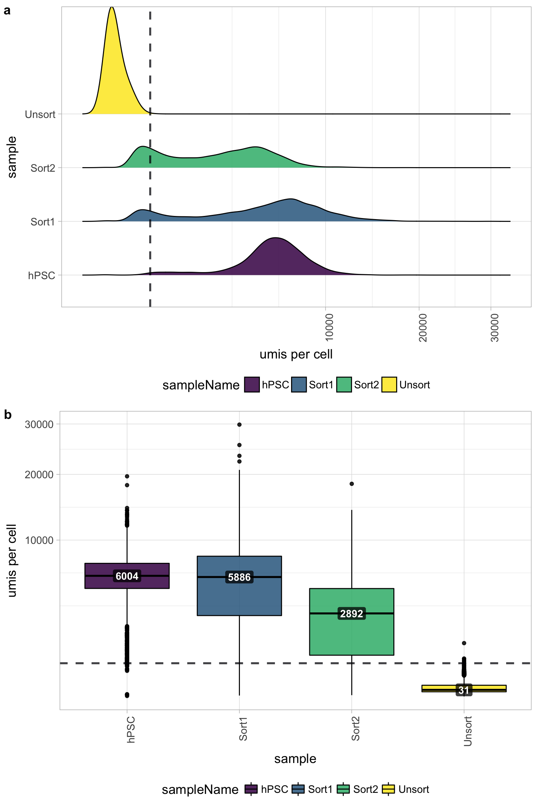
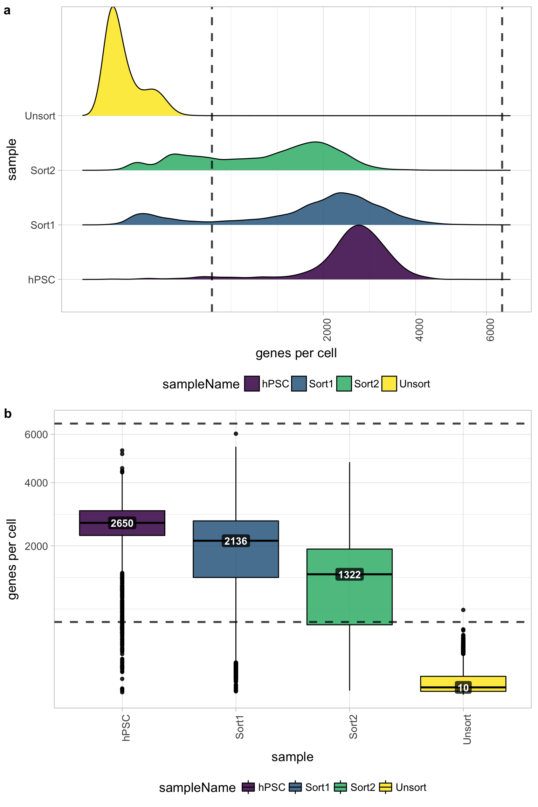
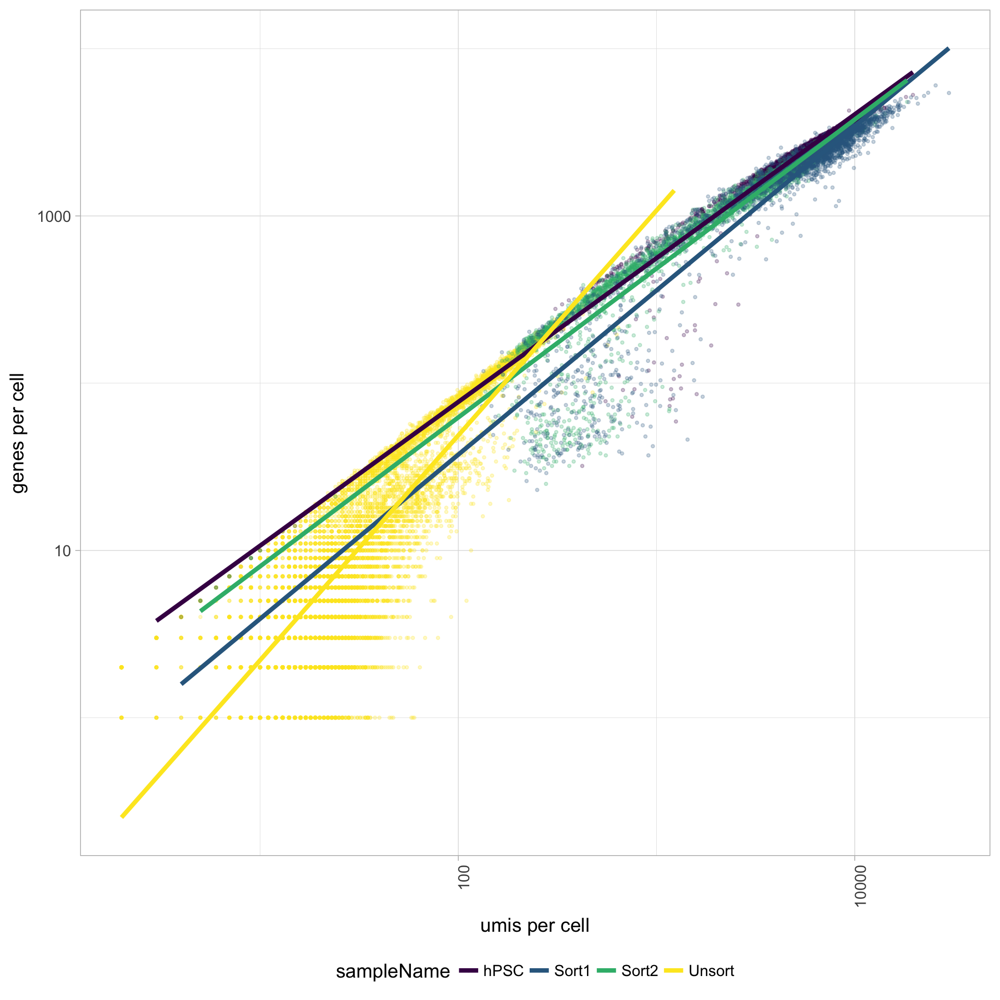
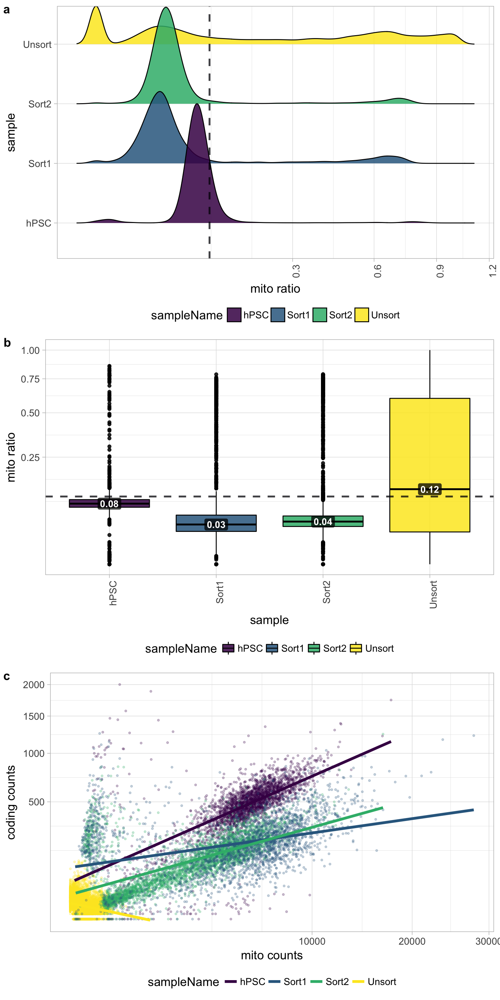
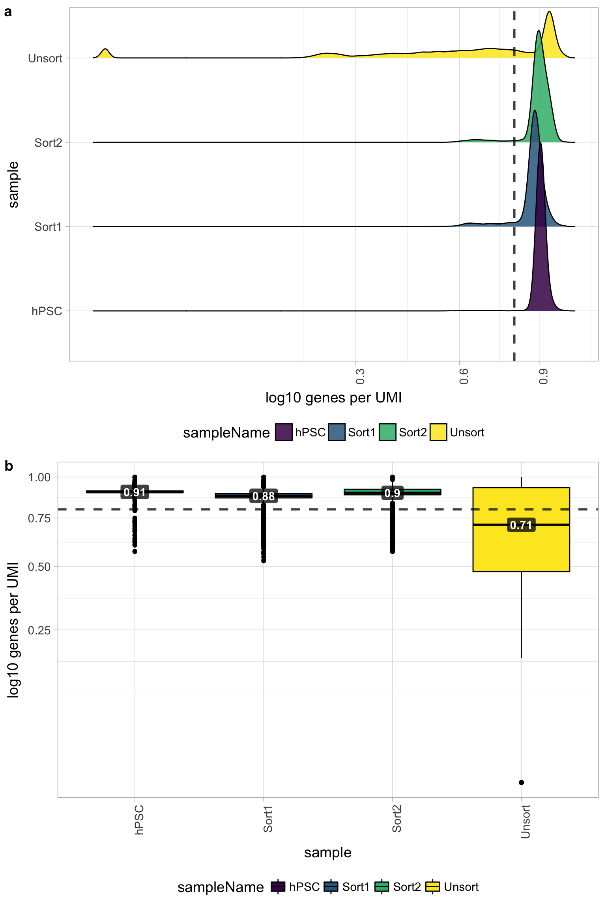
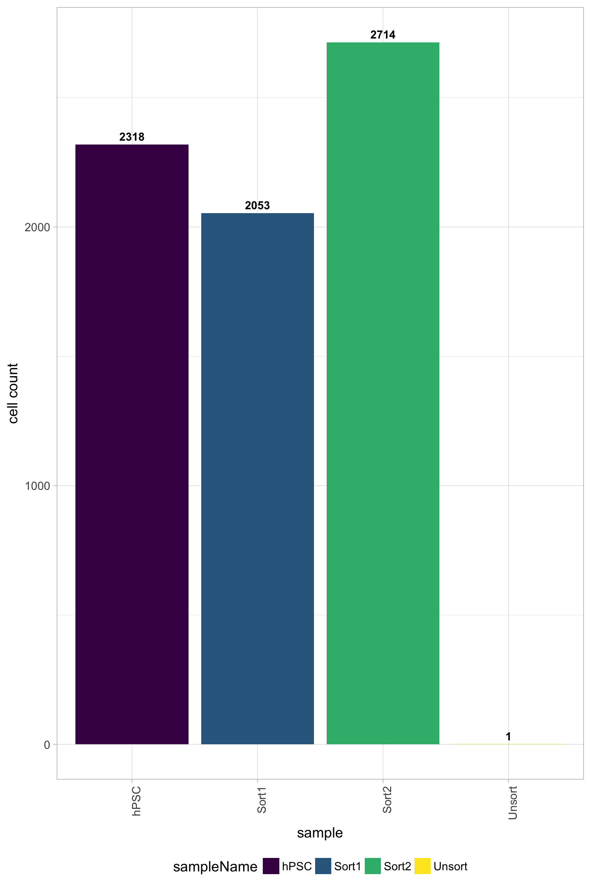

# Exploring a Poor Quality Sample
	
## Cell counts

The cell counts are determined by the number of unique cellular barcodes detected. During the droplet-based protocols, the cellular barcodes are present in the hydrogels, which are encapsulated in the droplets with a single cell and lysis/reaction mixture. While each hydrogel should have a single cellular barcode associated with it, occasionally a hydrogel can have more than one cellular barcode. We often see all possible combinations of cellular barcodes at a low level, leading to a higher number of cellular barcodes than cells.

You expect the number of unique cellular barcodes to be often greater than the number of seuqenced cells due to some hydrogels having more than one cellular barcode. The yellow sample below seems to have at least double the number of cellular barcodes as the other samples.

## UMI counts per cell

The number of UMIs per cell tends to be very low for the Unsorted sample (yellow). The other samples have good numbers of UMIs per cell, indicating a problem only with the Unsorted sample. Using this cutoff, we will lose the majority of the Unsorted cells.
	

	
## Genes detected per cell

Seeing gene detection in the range of 500-5000 is normal for inDrop/10X analyses. However, expectations can vary depending on the complexity of the cells expected in the experiment. Similar expectations for gene detection as for UMI detection.

All samples other than the Unsorted sample have a good number of genes detected (with medians between 1,000 - 3,000 genes), which correspond to the numbers of UMIs per cell for each sample. However, the Unsorted sample has a very low median number of genes per cell, indicating a sample failure.

	
## UMIs vs. genes detected

Poor quality cells are likely to have low genes and UMIs per cell. Therefore, a poor sample is likely to have cells in the lower left of the graph. Good cells should exhibit both higher number of genes per cell and higher numbers of UMIs. We also expect similar lines with similar slopes for all samples.
	
The Unsorted sample has many cells with few UMIs and low number of genes per cell. The other samples look fine.
	

	
## Mitochondrial counts ratio
	
Poor quality samples for mitochondrial counts would have larger peaks above the 0.1 mitochondrial ratio mark, unless it is expected based on sample type. 
	
There was just a very low number of genes detected for the Unsorted sample, so mitochondrial expression appears higher mainly due to this fact. The poor quality of the Unsorted sample does not appear to be due to dead or dying cells. The other samples have little mitochondrial expression, although hPSC sample has a bit more than the Sorted samples. Since the hPSC sample was expected to have cell types with higher levels of mitochondrial expression, it may have been advisable to not to use a threshold for this metric.

	
## Novelty
	
We can see the samples where we sequenced each cell less have a higher overall novelty, that is because we have not started saturated the sequencing for any given gene for these samples. Outlier cells in these samples might be cells that we have a less complex RNA species than other cells. Sometimes we can detect contamination with low complexity cell types like red blood cells via this metric.
	
All of the samples look fine for complexity, except for the Unsorted sample, so it is unlikely that there is contamination with low complexity cell types in these of the samples. The Unsorted sample has a larger shoulder than desired, but is not bad by this metric.
	

	

## Filtered results

One main plot to look at to determine the success of the filtering criteria is the number of cell counts. The number of cells to expect depends on the library preparation method, but for inDrops we see ~80% or less of the total sequenced cells per sample and for 10X it is often ~50% or less. 
	
**Cell counts**
	

	
In addition, it is a good idea to explore all of the quality plots for the filtered data. All plots should be much improved for the number of reads per cell, genes detected, UMIs per cell, mitochondrial ratio, and novelty. Since the `Unsorted` sample was a poor quality sample, the filter will remove a large number of the cells for this sample; in this case all cells except 1 were filtered out. 
