Approximate time: 90 minutes

## Learning Objectives:

* Understand how to determine the most variable genes for the gene expression
* Utilize methods for evaluating the selection of PCs to use for clustering
* Perform clustering of cells based on significant PCs
* Evaluate whether clustering artifacts are present 
* Determine the quality of clustering with PCA and tSNE plots and understand when to re-cluster

# Single-cell RNA-seq clustering analysis


Now that we have our high quality cells, we want to know the different cell types present within our population of cells. 


To do this we are going to perform a clustering analysis. The workflow for this analysis is adapted from the following sources:

- Satija Lab: [Seurat v2 Guided Clustering Tutorial](http://satijalab.org/seurat/pbmc3k_tutorial.html)
- Paul Hoffman: [Cell-Cycle Scoring and Regression](http://satijalab.org/seurat/cell_cycle_vignette.html)

To identify clusters, the following steps will be performed:

1. **Normalization and transformation** of the raw gene counts per cell to account for **differences in sequencing depth** per cell.
2. Identification of high variance genes.
3. **Regression of sources of unwanted variation** (e.g. number of UMIs per cell, mitochondrial transcript abundance, cell cycle phase).
4. **Identification of the primary sources of heterogeneity** using principal component (PC) analysis and heatmaps.
5. **Clustering cells** based on significant PCs (metagenes).

## Set-up

To perform this analysis, we will be mainly using functions available in the Seurat package. Therefore, we need to load the Seurat library in addition to the tidyverse library. Create the script `clustering_analysis.R` and load the libraries:

```r
# Single-cell RNA-seq analysis - clustering analysis

# Load libraries
library(Seurat)
library(tidyverse)
```

To perform the analysis, Seurat requires the data to be present as a `seurat` object. To create the `seurat` object, we will be extracting the **filtered counts** and **metadata** stored in our `se_c` SingleCellExperiment object created during quality control. 
To access the counts from our SingleCellExperiment, we can use the `counts()` function:

```r
# Create Seurat object from filtered SingleCellExperiment object
seurat_raw <- CreateSeuratObject(raw.data = counts(se_c),
                                 meta.data = colData(se_c) %>% data.frame())
```

>**NOTE:** Often we only want to analyze a subset of samples, cells, or genes. To subset the Seurat object, the `SubsetData()` function can be easily used. For example, to only cluster cells using a single sample group, `control`, we could run the following:
>
>```r
> pre_regressed_seurat <- SubsetData(seurat_raw, 
>                                    cells.use = rownames(seurat_raw@meta.data[which(seurat_raw@meta.data$interestingGroups == "control"), ])
>```

## Normalizing counts, finding variable genes, and scaling the data

The first step in the analysis is to normalize the raw counts to account for differences in sequencing depth per cell. The raw counts are normalized using global-scaling normalization with the `NormalizeData()` function, which performs the following:

1. normalizes the gene expression measurements for each cell by the total expression 
2. multiplies this by a scale factor (10,000 by default)
3. log-transforms the result

```r
# Normalize counts for total cell expression and take log value                            
pre_regressed_seurat <- seurat_raw %>%
  NormalizeData(normalization.method = "LogNormalize",
                scale.factor = 10000)  
```

Following normalization, we want to identify the most variable genes to use for downstream clustering analyses. The `FindVariableGenes()` function can be called, which performs the following calculations:

1. calculates the average expression and dispersion for each gene
2. places these genes into bins
3. calculates a z-score for dispersion within each bin

This helps control for the relationship between variability and average expression. 

```r
# Find variable genes based on the mean-dispersion relationship based on z-score for dispersion. 
pre_regressed_seurat <-  pre_regressed_seurat %>%
                          FindVariableGenes(
                            mean.function = ExpMean,
                            dispersion.function = LogVMR,
                            do.plot = FALSE)
```

It's recommended to set parameters as to mark visual outliers on dispersion plot - default parameters are for ~2,000 variable genes. There are some additional arguments, such as `x.low.cutoff`, `x.high.cutoff`, `y.cutoff`, and `y.high.cutoff` that can be modified to change the number of variable genes identified. Generally, we might be a bit concerned if we are returning 500 or 4,000 variable genes.

We can check the number of variable genes to see if it meets expectations. 

```r
# Check number of variable genes to determine if correct parameters used  
length(x = pre_regressed_seurat@var.genes)
```

We can plot dispersion (a normalized measure of to cell-to-cell variation) as a function of average expression for each gene to **identify a set of high-variance genes**. To check that the dispersions behave as expected, decreasing with increasing mean, and to identify the most variable genes, we can visualize the dispersions with the `VariableGenePlot()` function.

```r
# Plot variable genes
VariableGenePlot(pre_regressed_seurat)
```

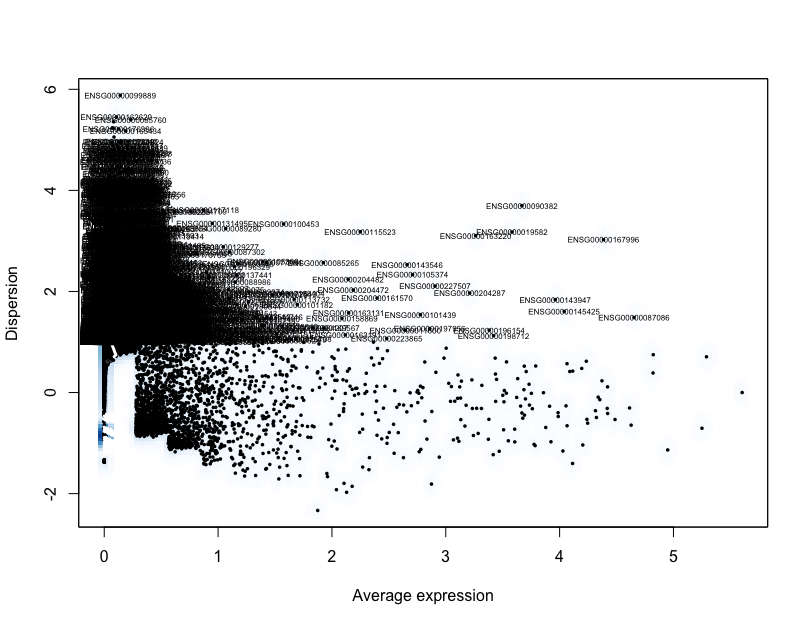

The identified variable genes are going to be the genes used to **identify significant principal components** used to determine the **how similar individual cells are to each other for clustering analysis**. 

However, to identify the significant principal components the expression values need to be centered and scaled. Centering each gene will center the expression of each gene by subtracting the average expression of the gene for each cell. Scaling will divide the centered gene expression levels by the standard deviation. To perform the centering and scaling, we can use Seurat's `ScaleData()` function.

```r
# Scale and center data
pre_regressed_seurat <- pre_regressed_seurat %>%
                        ScaleData(model.use = "linear")
```

## Examining sources of variation in the data

Your single-cell dataset likely contains "uninteresting" sources of variation. This can include technical noise, batch effects, and/or uncontrolled biological variation (e.g. cell cycle). Similar to bulk RNA-seq analysis, we can use PCA to identify these sources of variation, which can then be regressed out prior to further analysis.

### Cell cycle scoring

Cell cycle variation is a common source of uninteresting variation in single-cell RNA-seq data. To examine cell cycle variation in our data, we assign each cell a score, based on its expression of G2/M and S phase markers. 

> An overview of the cell cycle phases is given in the image below:
> 
> 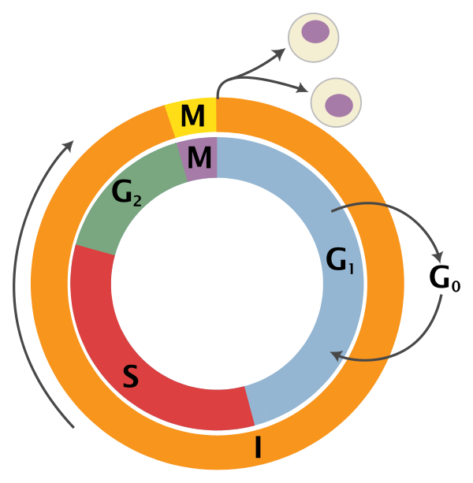
> 	
> *Adapted from [Wikipedia](https://en.wikipedia.org/wiki/Cell_cycle) (Image License is [CC BY-SA 3.0](https://en.wikipedia.org/wiki/Wikipedia:Text_of_Creative_Commons_Attribution-ShareAlike_3.0_Unported_License))*
> 
> - **G0:** Quiescence or resting phase. The cell is not actively dividing, which is common for cells that are fully differentiated. Some types of cells enter G0 for long periods of time (many neuronal cells), while other cell types never enter G0 by continuously dividing (epithelial cells).
> - **G1:** Gap 1 phase represents the **beginning of interphase**. During G1 there is growth of the non-chromosomal components of the cells. From this phase, the cell may enter G0 or S phase.
> - **S:** Synthesis phase for the replication of the chromosomes (also part of interphase).
> - **G2:** Gap 2 phase represents the **end of interphase**, prior to entering the mitotic phase. During this phase th cell grows in preparation for mitosis and the spindle forms.
> - **M:** M phase is the nuclear division of the cell (consisting of prophase, metaphase, anaphase and telophase).
	

At the HBC core, we have accumulated a nice list of genes associated with particular cell cycle phases. We are going to download the list of cell cycle phase marker genes by **right-clicking** [here](https://github.com/hbc/tinyatlas/raw/master/cell_cycle/Homo_sapiens.csv) and saving to the `data` folder.

To save the genes in the G2M and S phases as character vectors, we can subset the data frame:

```r
# Read in cell cycle genes
cell_cycle <- read.csv("data/Homo_sapiens.csv")

# Extract the G2/M genes
g2m_genes <- dplyr::filter(cell_cycle, phase == "G2/M") %>%
  pull(geneID) %>%
  as.character() 
  
# Extract the S genes
s_genes <- dplyr::filter(cell_cycle, phase == "S") %>%
  pull(geneID) %>%
  as.character() 
```

Now to score each gene for cell cycle, we can use Seurat's `CellCycleScoring()` function. The function scores cells based on their expression of the G2M and S phase marker genes, which should be anticorrelated in their expression levels, and cells expressing neither are likely not cycling and in G0/G1 phase. 

The `CellCycleScoring()` function stores S and G2/M scores in `seurat@meta.data` in the `S.Score` and `G2M.Score` columns, along with the predicted classification of each cell in either G2M, S or G1 phase in the `Phase` column.

```r
# Perform cell cycle scoring
pre_regressed_seurat <- CellCycleScoring(
  pre_regressed_seurat,
  g2m.genes = g2m_genes,
  s.genes = s_genes)
```

To determine whether the cells group by cell cycle, we can perform PCA using the expression of cell cycle genes. If the cells group by cell cycle in the PCA, then we would want to regress out cell cycle variation, unless cells are differentiating.  

```r
# Perform PCA and color by cell cycle phase
pre_regressed_seurat = RunPCA(
  pre_regressed_seurat,
  pc.genes = c(s_genes, g2m_genes),
  do.print = FALSE)

PCAPlot(pre_regressed_seurat, 
        group.by= "Phase")
```

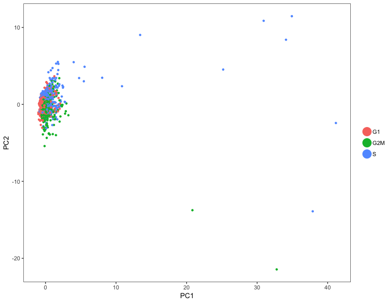

In our data, the cells don't really cluster by cell cycle, so we do not need to include `S.Score` and `G2M.Score` as variables for regression.

Before moving on to regressing out variation due to uninteresting sources, let's save the pre-regressed Seurat object so that we can come back to it later if needed:

```r
# Save pre-regression Seurat object
saveRDS(pre_regressed_seurat, 
        file = "data/seurat_pre_regress.rds")
```

## Apply regression variables

Regressing variation due to uninteresting sources can improve downstream identification of principal components and clustering. To mitigate the effect of these signals, Seurat constructs linear models to predict gene expression based on the variables to regress.

To regress out these variables of uninteresting variation, we will use the `vars.to.regress` argument in the `ScaleData()` function. 

We generally recommend minimizing the effects of variable read count depth (`nUMI`) and mitochondrial gene expression (`mitoRatio`) as a standard first-pass approach. However, if the differences in mitochondrial gene expression represent a biological phenomenon that may help to distinguish cell clusters, then we advise not passing in `mitoRatio`.

When regressing out the effects of cell-cycle variation, include `S.Score` and `G2M.Score` in the `vars.to.regress` argument. Cell-cycle regression is generally recommended but should be avoided for samples containing cells undergoing differentiation.

In our data, the cell cycle phase did not appear to be a large source of variation in the data, so we do not need to regress it out. Therefore, we will only regress out variation due to `nUMI` and `mitoRatio`.

```r
# Define variables in metadata to regress
vars_to_regress <- c("nUMI", "mitoRatio")

# Regress out the uninteresting sources of variation in the data
seurat <- ScaleData(pre_regressed_seurat, 
                    vars.to.regress = vars_to_regress)
```


## Linear dimensionality reduction

Next, we perform principal component analysis (PCA) on the scaled data with `RunPCA()`. `ProjectPCA()` scores each gene in the dataset (including genes not included in the PCA) based on their correlation with the calculated components.

```r
# Perform the scoring for all genes
seurat <- seurat %>%
  RunPCA(do.print = FALSE) %>%
  ProjectPCA(do.print = FALSE)
```

## Determine significant principal components

To overcome the extensive technical noise in any single gene for scRNA-seq data, Seurat clusters cells based on their PCA scores, with each PC essentially representing a "metagene" that combines information across a correlated gene set. Determining how many PCs to include downstream is therefore an important step. Often it is useful to explore the PCs prior to identifying the significant principal components to include for the downstream clustering analysis.

We can print out the top most variant genes for select PCs using the `PrintPCA()` function. Here we are identifying the five most positively and negatively variant genes for the top 10 PCs:

```r
# Print out the top 5 most variant genes (up and down) for top 10 PCs
PrintPCA(object = seurat, 
         pcs.print = 1:10, 
         genes.print = 5, 
         use.full = FALSE)
```

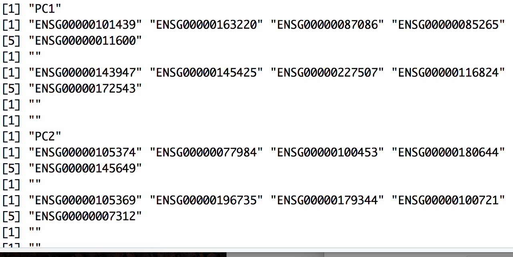

We can also explore the expression of the top most variant genes for select PCs using the `PCHeatmap()` function. The genes and cells are ordered by PC scores:

```r
# Explore expression of most extreme genes per PC
PCHeatmap(object = seurat, 
          pc.use = 1:10, 
          cells.use = 500, 
          do.balanced = TRUE, 
          label.columns = FALSE, 
          use.full = FALSE)
```

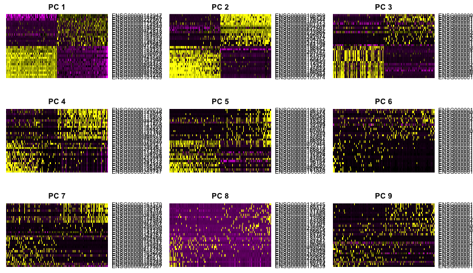

In this heatmap it is easy to see the first few PCs have clear-cut expression differences for the genes most affecting the principal components. The distinction becomes less clear for more distant principal components and these plots can inform the selection of PCs to use for downstream analysis.

However, the main analysis used to determine how many PCs to use for the downstream analysis is done through plotting the standard deviation of each PC as an elbow plot with Seurat's `plotPCElbow()` function. Where the elbow appears is usually the threshold for identifying the most significant PCs to include.

```r
# Create elbow plot
PCElbowPlot(seurat)
```

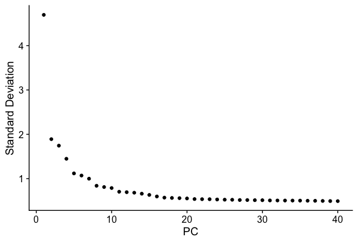

Based on this plot, we can eye the plot, and guess that the elbow appears to be around PC 7 or 8. While this gives us a good idea of the number of PCs to include, a more quantitative approach may be a bit more reliable.

PC selection — identifying the true dimensionality of a dataset — is an important step for our clustering analysis, but can be challenging/uncertain. While there are a variety of ways to choose a threshold, we're going to calculate where the principal components start to elbow by taking the larger value of:

1. The point where the principal components only contribute 5% of standard deviation and the principal components cumulatively contribute 90% of the standard deviation.
2. The point where the percent change in variation between the consequtive PCs is less than 0.1%.

We will start by calculating the first metric:

```r
# Determine percent of variation associated with each PC
pct <- seurat@dr$pca@sdev / sum(seurat@dr$pca@sdev) * 100

# Calculate cumulative percents for each PC
cum <- cumsum(pct)

# Determine which PC exhibits cumulative percent greater than 90% and % variation associated with the PC as less than 5
co1 <- which(cum > 90 & pct < 5)[1]

co1
```
The first metric returns PC18 as the PC matching these requirements. Let's check the second metric, which identifies the PC where the percent change in variation between consequtive PCs is less than 0.1%:

```r
# Determine the difference between variation of PC and subsequent PC
co2 <- sort(which((pct[1:length(pct)-1] - pct[2:length(pct)]) > 0.1),  decreasing = T)[1] + 1 # last point where change of % of variation is more than 0.1%.

co2
```

The second metric returned PC8. Now, to determine the selection of PCs, we will use the minimum of the two metrics:

```r
# Minimum of the two calculation
pcs <- min(co1, co2) # change to any other number

pcs
```

Based on these metrics, for the clustering of cells in Seurat we will use the first **eight PCs** to generate the clusters.

## Cluster the cells

We can now use these significant PCs to determine which cells exhibit similar expression patterns for clustering. To do this, Seurat uses a graph-based clustering approach, which embeds cells in a graph structure, using a K-nearest neighbor (KNN) graph (by default), with edges drawn between cells with similar gene expression patterns. Then, it attempts to partition this graph into highly interconnected ‘quasi-cliques’ or ‘communities’. Details on this clustering methods are available in the Seurat paper.
We will use the `FindClusters()` function to perform the graph-based clustering. The `resolution` argument that sets the "granularity" of the downstream clustering, will need to be optimized to the experiment, with increased values leading to a greater number of clusters. We find that setting this parameter between `0.6`-`1.2` typically returns good results for single cell datasets of around 3K cells. Optimal resolution often increases for larger datasets. The cluster IDs are saved in the `seurat@ident` slot.

We provide a series of resolution options during clustering, which can be used downstream to choose the best resolution.


```r
# Find cell clusters
seurat <- FindClusters(
  seurat,
  dims.use = 1:pcs,
  force.recalc = TRUE,
  print.output = TRUE,
  resolution = c(0.6, 0.8, 1.0, 1.2),
  save.SNN = TRUE)
```

## Creating t-SNE plots

Seurat continues to use t-distributed stochastic neighbor embedding (t-SNE) as a powerful tool to visualize and explore these datasets. While we no longer advise clustering directly on t-SNE components, cells within the graph-based clusters determined above should co-localize on the t-SNE plot. This is because the t-SNE aims to place cells with similar local neighborhoods in high-dimensional space together in low-dimensional space. As input to the t-SNE, we suggest using the same PCs as input to the clustering analysis, although computing the t-SNE based on scaled gene expression is also supported using the `genes.use` argument. **Note that distance between clusters on the t-SNE plots does not represent degree of similarity between clusters.**

```r
# Choose a resolution
seurat <- SetAllIdent(object = seurat, id = "res.0.8")

# Run the TSNE to determine the clusters
seurat <- RunTSNE(
  seurat,
  dims.use = 1:pcs,
  do.fast = TRUE)

# Plot the TSNE
DimPlot(seurat,
        "tsne",
        do.label = TRUE,
        do.return = TRUE,
        label.size = 6,
        plot.title = "tSNE") 
```

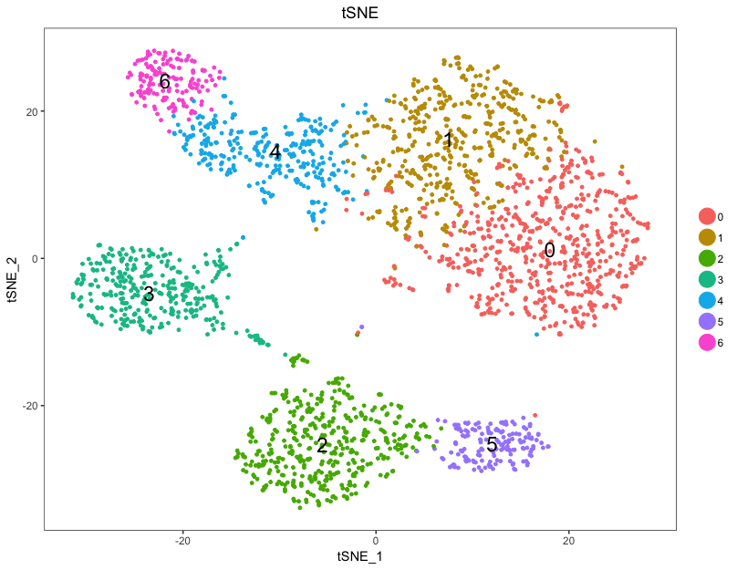

To explore similarity in gene expression between the clusters, plotting the clusters in PCA space can be more informative.

```r
# Plot the PCA
DimPlot(seurat,
        "pca",
        do.label = TRUE,
        do.return = TRUE,
        label.size = 6,
        plot.title = "PCA")
```

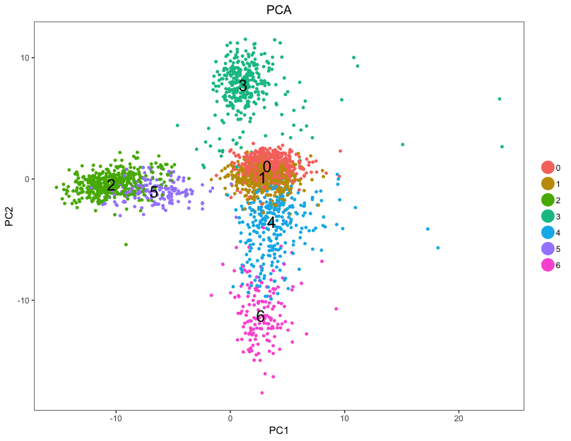

For example, in the PCA plot, we can see the clusters 0 and 1 to be more similar to each other, while cluster 3 is quite different.

A useful feature in Seurat is the ability to recall the parameters that were used in the latest function calls for commonly used functions. For `FindClusters()`, the authors provide the function `PrintFindClustersParams()` to print a nicely formatted summary of the parameters that were chosen.

```r
PrintFindClustersParams(seurat, 
                        resolution = 0.8)
```

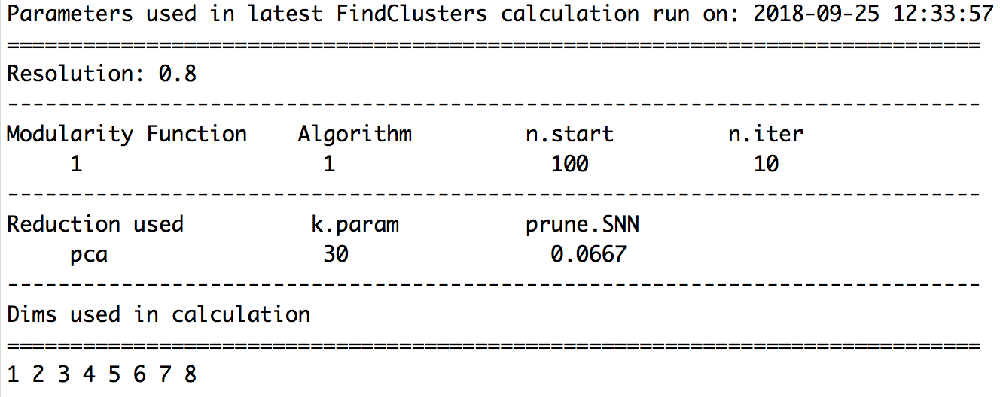

Before continuing with any further identification, it can be useful to save the regressed seurat object if needed in the future.

```r
# Save clustered cells
saveRDS(seurat, file = file.path(data_dir, "pbmcs_seurat_tsne.rds"))
```

> **NOTE:** If we were to load this object into the environment, we would need to again choose the resolution parameter to use going forward before doing any analysis:
> 
> ```r
> # Choose a resolution
> seurat <- SetAllIdent(object = seurat, id = "res.0.8")
> ```

# Exploration of quality control metrics

To determine whether our clusters might be due to artifacts such as cell cycle phase or mitochondrial expression, it can be useful to explore these metrics visually to see if any clusters exhibit enrichment or are different from the other clusters. However, if enrichment or differences are observed for particular clusters it may not be worrisome if it can be explained by the cell type. A useful function for extracting data from the `seurat` object is the `FetchData()` function.

We can start by exploring the distribution of cells per cluster for each sample:

```r
# Extract identity and sample information from seurat object to determine the number of cells per cluster per sample
n_cells <- FetchData(seurat, vars.all = c("ident", "sample")) %>% 
  dplyr::count(sample, ident) %>% 
  spread(ident, n)

# View table
View(n_cells)
```

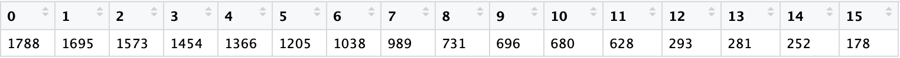

Then, we can acquire the different cluster QC metrics. First we will explore sample and cell cycle to view by tSNE:

```r
# Establishing groups to color plots by
group_by <- c("Phase", "sample")

# Getting coordinates for cells to use for tSNE and associated grouping variable information
class_tsne_data <- FetchData(seurat, vars.all = c("ident", "tSNE_1", "tSNE_2", group_by))

# Adding cluster label to center of cluster on tSNE
tsne_label <- FetchData(seurat, 
                        vars.all = c("ident", "tSNE_1", "tSNE_2"))  %>% 
  as.data.frame() %>% 
  group_by(ident) %>%
  summarise(x=mean(tSNE_1), y=mean(tSNE_2))
```

In addition, we can get the same metrics to view by PCA:

```r
# Getting coordinates for cells to use for PCA and associated grouping variable information
class_pca_data <- FetchData(seurat, vars.all = c("ident", "PC1", "PC2", group_by))

# Adding cluster label to center of cluster on PCA
pca_label <- FetchData(seurat, vars.all = c("ident", "PC1", "PC2"))  %>% 
  as.data.frame() %>% 
  mutate(ident = seurat@ident) %>% 
  group_by(ident) %>%
  summarise(x=mean(PC1), y=mean(PC2))
```

Then, we can plot the samples and cell cycle by tSNE and PCA

```r
# Function to plot tSNE and PCA as grids
map(group_by, function(metric) {
  cat("\n\n###", metric, "\n\n")
  p <- plot_grid(
    ggplot(class_tsne_data, aes(tSNE_1, tSNE_2)) +
      geom_point(aes_string(color = metric), alpha = 0.7) +
      scale_color_brewer(palette = "Set2")  +
      geom_text(data=tsne_label, aes(label=ident, x, y)),
    ggplot(class_pca_data, aes(PC1, PC2)) +
      geom_point(aes_string(color = metric), alpha = 0.7) +
      scale_color_brewer(palette = "Set2")  +
      geom_text(data=pca_label, aes(label=ident, x, y)),
    nrow = 1, align = "v"
  ) 
  print(p)
}) %>% invisible()
```

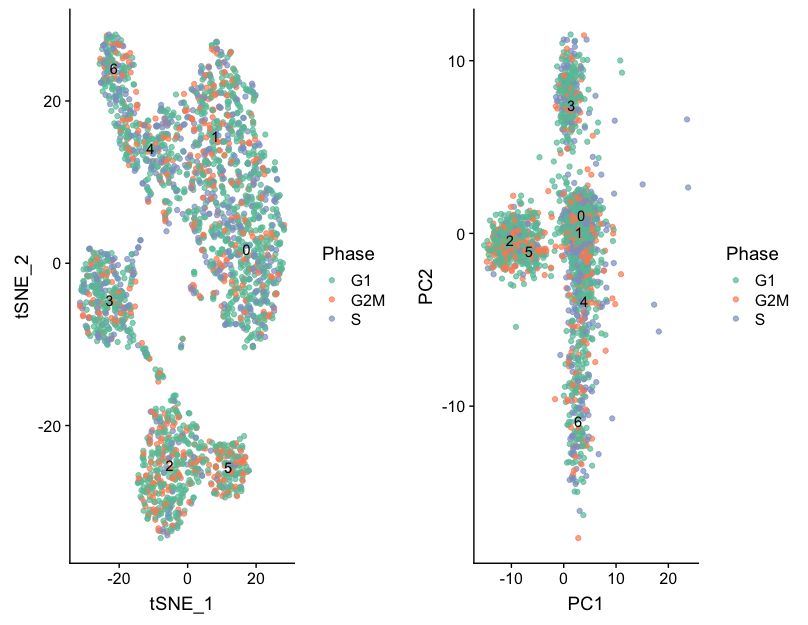

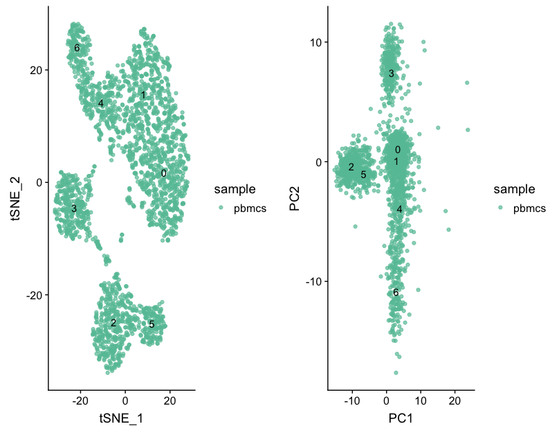

Next we will explore additional metrics, such as the number of UMIs and genes per cell, S-phase and G2M-phase markers, and mitochondrial gene expression by tSNE:

```r
# Determine metrics to plot present in seurat@meta.data
metrics <-  c("nUMI", "nGene", "S.Score", "G2M.Score", "mitoRatio")

# Extract the TSNE coordinates for each cell and include information about the metrics to plot
qc_data <- FetchData(seurat, vars.all = c(metrics, "ident", "tSNE_1", "tSNE_2"))

# Plot a tSNE plot for each metric
map(metrics, function(qc){
  ggplot(qc_data, aes(tSNE_1, tSNE_2)) +
    geom_point(aes_string(color=qc), alpha = 0.7) +
    scale_color_gradient(guide = FALSE, low = "grey90", high = "blue")  +
    geom_text(data=tsne_label, aes(label=ident, x, y)) +
    ggtitle(qc)
}) %>% 
  plot_grid(plotlist = .)
```

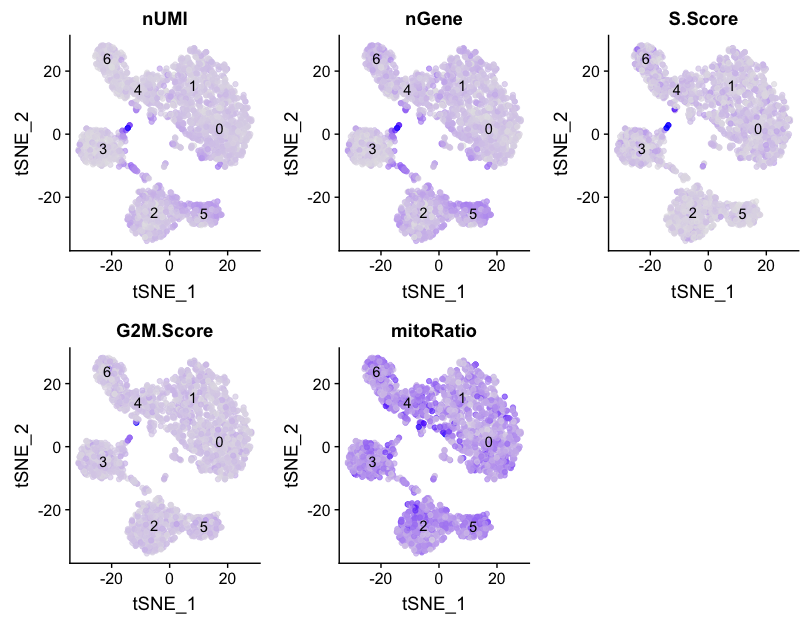

We can also explore how well our clusters separate by the different PCs; we hope that the defined PCs separate the cell types well. In the tSNE plots below, the cells are colored by their PC score for each respective principal component.

```r
# Defining the information in the seurat object of interest
columns <- c(paste0("PC", 1:pcs),
            "ident",
            "tSNE_1", "tSNE_2")

# Extracting this data from the seurat object
pc_data <- FetchData(seurat, vars.all = columns)

# Plotting a tSNE plot for each of the PCs
map(paste0("PC", 1:pcs), function(pc){
  ggplot(pc_data, aes(tSNE_1, tSNE_2)) +
    geom_point(aes_string(color=pc), alpha = 0.7) +
    scale_color_gradient(guide = FALSE, low = "grey90", high = "blue")  +
    geom_text(data=tsne_label, aes(label=ident, x, y)) +
    ggtitle(pc)
}) %>% plot_grid(plotlist = .)
```

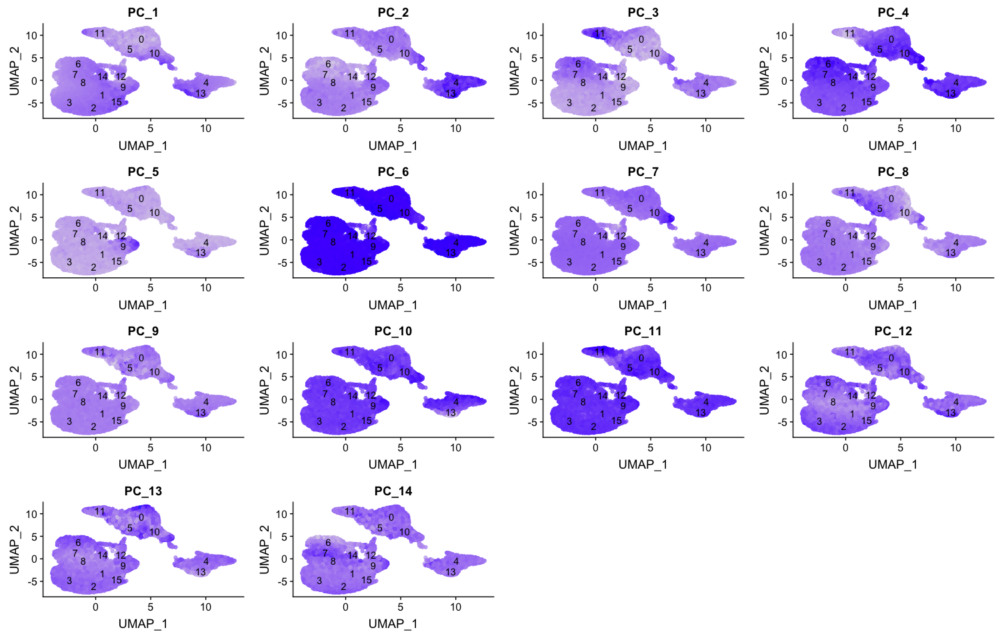

# Evaluating clustering

In order to determine whether our clustering and resolution are appropriate for our experiment, it is helpful to explore a handful of markers for each of the major cell types that we expect to be in our data and see how they segregate.

The `FeaturePlot()` function from seurat makes it easy to visualize a handful of genes using the gene IDs stored in the Seurat object. For example if we were interested in exploring known immune cell markers, such as:

|Marker| Cell Type|
|:---:|:---:|
|IL7R	|CD4 T cells|
|CD14, LYZ|	CD14+ Monocytes|
|MS4A1|	B cells|
|CD8A|	CD8 T cells|
|FCGR3A, MS4A7	|FCGR3A+ Monocytes|
|GNLY, NKG7|	NK cells|
|FCER1A, CST3	|Dendritic Cells|
|PPBP|	Megakaryocytes|

We could use the Seurat function, `FeaturePlot()` to easily plot those genes. Since our dataset uses Ensembl ID identifiers, we would need those identifiers for our genes to plot with this function.

To get the Ensembl identifiers, we can use our annotations table:

```r
colnames(annotations)

custom_genes <- annotations %>% 
  dplyr::filter(gene_name  %in% c("IL7R", "CD14", "LYZ", "MS4A1", "CD8A", "FCGR3A", "MS4A7", "GNLY", "NKG7", "FCER1A", "CST3", "PPBP")) %>%
  dplyr::select(gene_id, gene_name) 
```

Unfortunately, we return duplicates for some genes. We are only interested in those genes with Ensembl IDs starting with 'ENSG', so we are going to only return those lines by using the `grep()` function. The `grep()` function will return the indices for lines that match the pattern, which we can use to subset our list of genes. 

```r
custom_genes <- custom_genes[grepl(pattern = "ENSG", x=custom_genes$gene_id), ]
```


```r
FeaturePlot(object = seurat, 
            features.plot = custom_genes$gene_id)
```

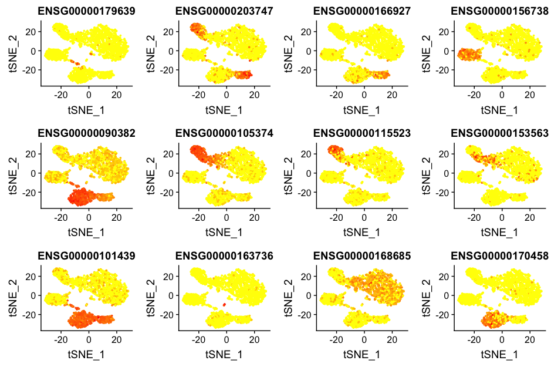

However, it is hard to interpret these plots and remember which Ensembl ID corresponds to which gene. Gene symbols are much easier to interpret, so to make these same plots with gene symbols, we cannot use the `FeaturePlot()` function. Instead we need to construct them ourselves.


We can specify the Ensembl IDs as the gene IDs in the dataset that we want to plot and the gene names as the labels in the plot:

```r
# Ensembl IDs for the genes to use in the plot
plot_selected <- custom_genes$gene_id

# Gene names to use as labels in the plot
names(plot_selected) <- custom_genes$gene_name
```

Next, we extract the data we need for plotting and make sure all data is in the same order:

```r
# Extract tSNE coordinates, sample name, and cluster identity information from the seurat object
tsne <- FetchData(seurat, 
                  vars.all = c("tSNE_1", "tSNE_2", "sample", "ident"))

# Extract the count information for each cell for the genes of interest from the seurat object
gene_data <- FetchData(seurat, vars.all = custom_genes$gene_id)

# Acquire the gene symbols to be column names of the count data for the genes of interest
colnames(gene_data) <- names(plot_selected)[match(plot_selected, colnames(gene_data))]

# Merge counts for genes of interest with tSNE information
gene_data <- cbind(tsne, gene_data)
```

Finally, we can plot the expression of interesting genes upon the tSNE plot. Darker blue represents higher levels of expression. Lighter colors do not necessarily represent little or no expression, the low levels of expression could mainly be blanched by cells that might express very high levels of this gene.

```r
# Plot the expression of each of the genes of interest on the tSNE
map(custom_genes$gene_name, function(g){
  ggplot(gene_data, aes(tSNE_1, tSNE_2)) +
    geom_point(aes_string(color=g), alpha = 0.7, size = 0.3) +
    scale_color_gradient(guide = FALSE, low = "grey90", high = "blue")  +
    geom_text(data=tsne_label, aes(label=ident, x, y)) +
    ggtitle(g)
}) %>% 
  plot_grid(plotlist = .)
```

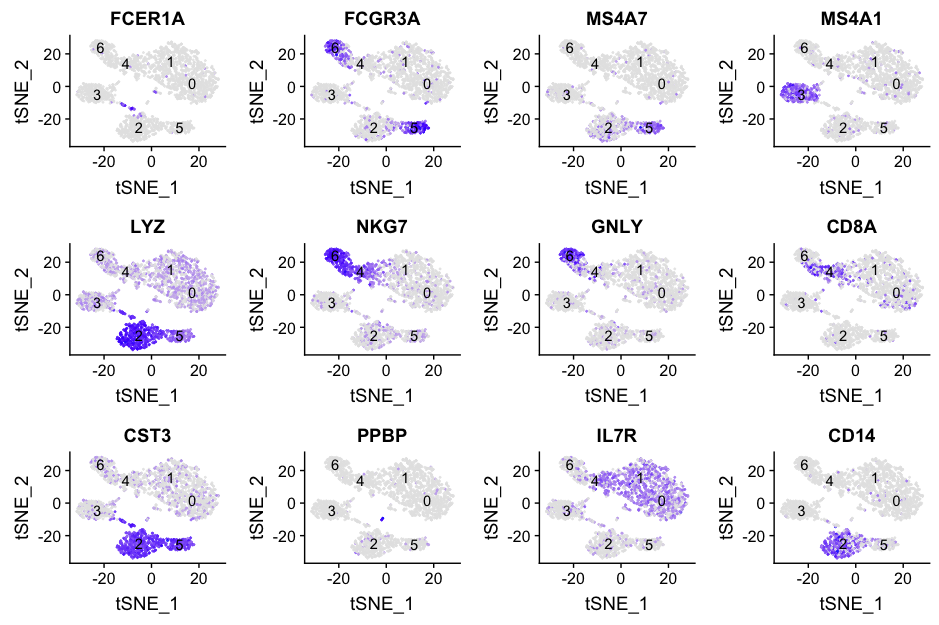

Based on these markers, we can conjecture the identity of each of the clusters based on the canonical cell type markers:

| Cluster|Marker| Cell Type|
|:---:|:---:|:---:|
| 0-1|IL7R	|CD4 T cells|
| 2|CD14, LYZ|	CD14+ Monocytes|
| 3|MS4A1|	B cells|
| 4|CD8A|	CD8 T cells|
| 5|FCGR3A, MS4A7	|FCGR3A+ Monocytes|
| 6|GNLY, NKG7|	NK cells|
| Unidentified |FCER1A, CST3	|Dendritic Cells|
| Unidentified |PPBP|	Megakaryocytes|

Based on these results, it indicates that there are some clusters that we are not identifying that appear to be separate cell types. The megakaryocytes and the dendritic cells appear clustered with other cell type clusters, so what do we do with them? 

We would generally want to go back through the clustering, but change parameters. Did we use too few principal components that we are just not separating out these cells? We can look at our PC gene expression overlapping the tSNE plots and see these cell populations separate by PC6 and PC8, so the variation seems to be captured by our PCs. However, we might not have had a high enough resolution for our tSNE when we performed the clustering. We would want to try to re-run the tSNE with higher resolution. 

After we have identified our desired clusters, we can move on to marker identification, which will allow us to verify the identity of certain clusters and help surmise the identity of any unknown clusters. Since we have two clusters identified as CD4 T cells, we may also want to know which genes are differentially expressed between these two clusters.

> **Re-running at a different resolution**
> ```r
> # Choose a resolution
> seurat_res1.2 <- SetAllIdent(object = seurat, id = "res.1.2")
> 
> # Run the TSNE to determine the clusters
> seurat_res1.2 <- RunTSNE(
>   seurat_res1.2,
>   dims.use = 1:pcs,
>   do.fast = TRUE)
> 
> # Plot the TSNE
> DimPlot(seurat_res1.2,
>         "tsne",
>         do.label = TRUE,
>         do.return = TRUE,
>         label.size = 6,
>         plot.title = "tSNE") 
> ```

> **NOTE:** Most single-cell RNA-seq datasets are too big to work with on a personal laptop, so you will need to use R on O2. To do this requires establishing a personal R library with the appropriate libraries installed. More information about setting up personal libraries [is available](https://wiki.rc.hms.harvard.edu/display/O2/Personal+R+Packages) from HMS RC. In addition to a personal R library, the analysis on O2 can be difficult if you cannot view the results. To view plots/images output on O2 requires X11 forwarding, and how to enable X11 configuration on your computer [is also detailed](https://wiki.rc.hms.harvard.edu/display/O2/Using+X11+Applications+Remotely) by HMS RC.

***

*This lesson has been developed by members of the teaching team at the [Harvard Chan Bioinformatics Core (HBC)](http://bioinformatics.sph.harvard.edu/). These are open access materials distributed under the terms of the [Creative Commons Attribution license](https://creativecommons.org/licenses/by/4.0/) (CC BY 4.0), which permits unrestricted use, distribution, and reproduction in any medium, provided the original author and source are credited.*

* *A portion of these materials and hands-on activities were adapted from the [Satija Lab's](https://satijalab.org/) [Seurat - Guided Clustering Tutorial](https://satijalab.org/seurat/pbmc3k_tutorial.html)*
