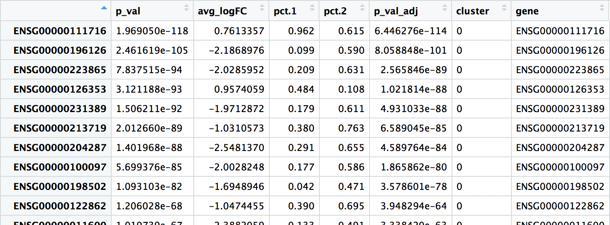
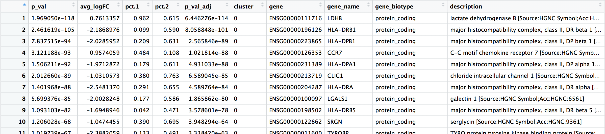
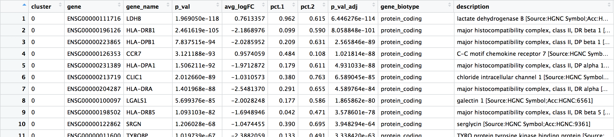
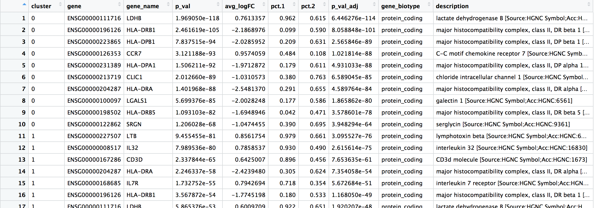
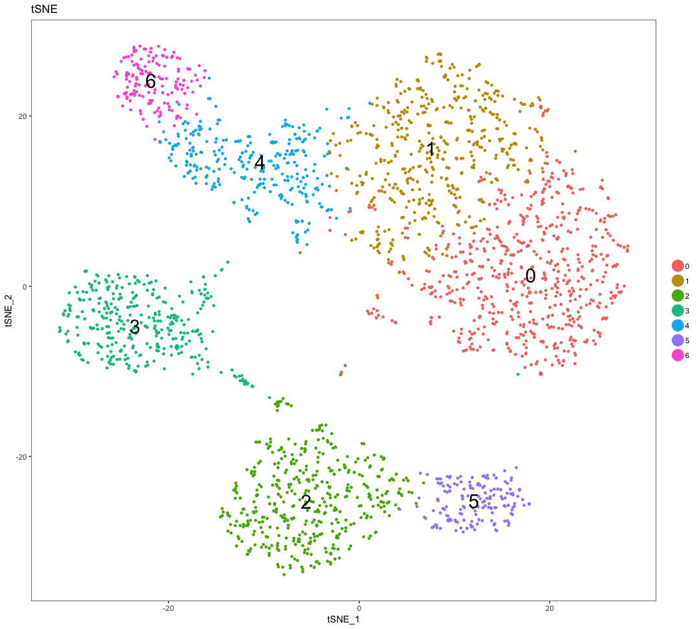
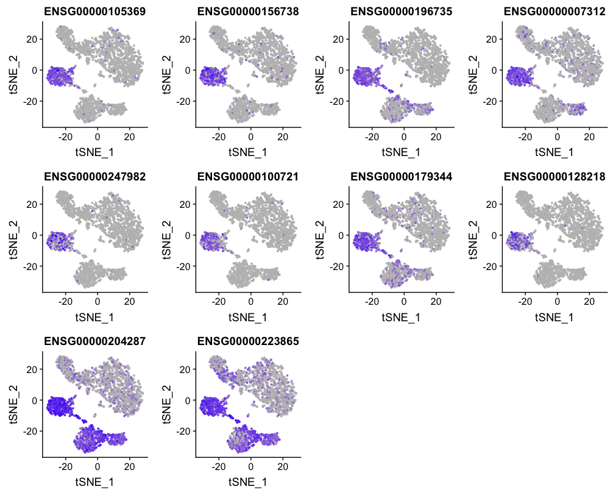
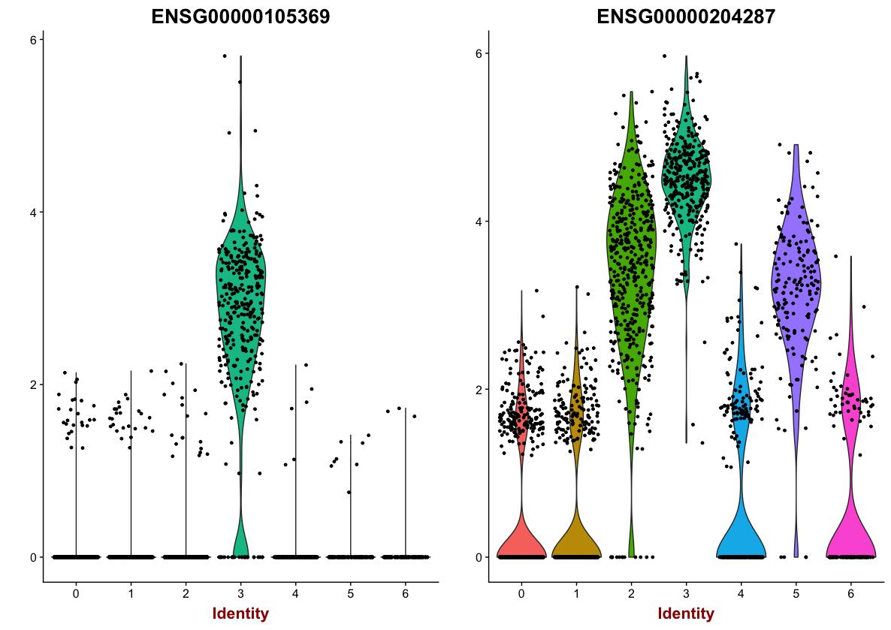
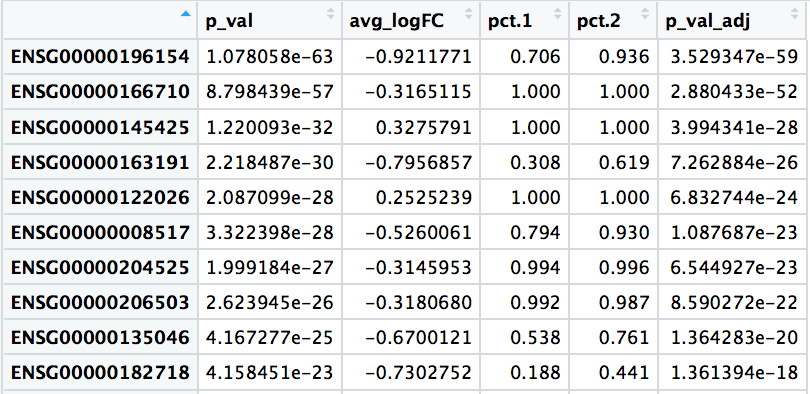
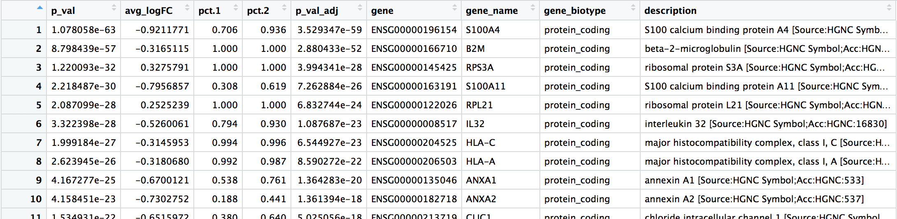
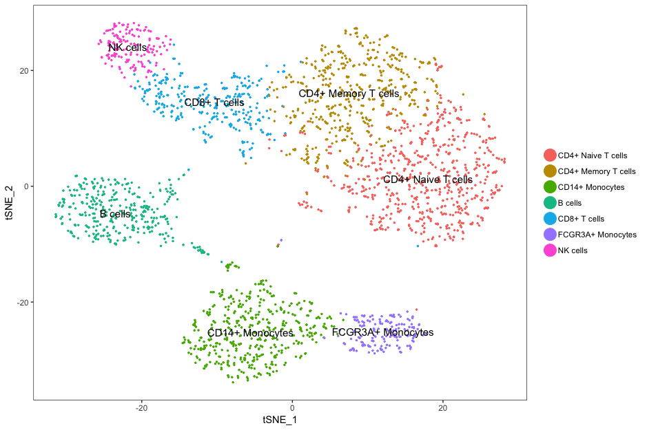

Approximate time: 45 minutes

## Learning Objectives:

* Understand how to determine markers of individual clusters
* Understand the iterative processes of clustering and marker identification

# Single-cell RNA-seq marker identification

Now that we have the single cells clustered based on different cell types,  we are ready to move forward with identifying cluster markers. 


## Identifying gene markers for each cluster

Seurat has the functionality to perform a variety of analyses for marker identification; for instance, we can identify markers of each cluster relative to all other clusters by using the `FindAllMarkers()` function. This function essentially performs a differential expression test of the expression level in a single cluster versus the average expression in all other clusters.

To be identified as a cluster or cell type marker, within the `FindAllMarkers()` function, we can specify thresholds for the minimum percentage of cells expressing the gene in either of the two groups of cells (`min.pct`) and minimum difference in expression between the two groups (`min.dff.pct`). 


```r
# Identify gene markers
all_markers <-FindAllMarkers(seurat, 
                             min.pct =  0.25, 
                             min.diff.pct = 0.25)
```

The results table output contains the following columns:

- **`p_val`:** p-value not adjusted for multiple test correction
- **`avg_logFC`:** average log2 fold change. Positive values indicate that the gene is more highly expressed in the cluster.
- **`pct.1`**: The percentage of cells where the gene is detected in the cluster
- **`pct.2`**: The percentage of cells where the gene is detected on average in the other clusters
- **`p_val_adj`:** Adjusted p-value, based on bonferroni correction using all genes in the dataset, used to determine significance
- **`cluster`:** identity of cluster
- **`gene`:** Ensembl gene ID
- **`symbol`:** gene symbol
- **`biotype`:** type of gene
- **`description`:** gene description

```
View(all_markers)
```


## Interpretation of the marker results

Using Seurat for marker identification is a rather quick and dirty way to identify markers. Usually the top markers are relatively trustworthy; however, because of inflated p-values, many of the less significant genes are not so trustworthy as markers. 

When looking at the output, we suggest looking for marker genes with large differences in expression between `pct.1` and `pct.2` and larger fold changes. For instance if `pct.1` = 0.90 and `pct.2` = 0.80 and had lower log2 fold changes, that marker might not be as exciting. However, if `pct.2` = 0.1 instead, then it would be a lot more exciting. 

When trying to understand the biology of the marker results it's helpful to have the gene names instead of the Ensembl IDs, so we can merge our results with our annotations acquired previously:

```r
# Merge gene annotations to marker results
all_markers <- left_join(all_markers, 
                         annotations[, c(1:2, 3, 5)], 
                         by = c("gene" = "gene_id"))

View(all_markers)                         
```


After the merge, the order of the columns is not as intuitive, so we will reorder the columns to make the results table more readable.

```r
# Rearrange order of columns to make clearer
all_markers <- all_markers[, c(6:8, 1:5, 9:10)]

View(all_markers)
```


Usually, we would want to save all of the identified markers to file.

```r
# Write results to file
write.csv(all_markers, "results/all_markers.csv", quote = F)
```

In addition to all of the markers, it can be helpful to explore the most significant marker genes. Let's return the top 10 marker genes per cluster.

```r
# Return top 10 markers for cluster specified 'x'
gen_marker_table <- function(x){
  all_markers[all_markers$cluster == x, ] %>%
  head(n=10)
}

# Create a data frame of results for clusters 0-6
top10_markers <- map_dfr(0:6, gen_marker_table)

View(top10_markers)
```


We can write these results to file as well:

```r
# Write results to file
write.csv(top10_markers, "results/top10_markers.csv", quote = F)
```

# Assigning cell type identity to clusters

We can often go through the top markers to identify the cell types. We have to use what we know about the biology of the expected cells to determine the cell populations represented by each cluster. 

Let's remind ourselves of the different clusters:

```r
DimPlot(
  seurat,
  "tsne",
  do.label = TRUE,
  do.return = TRUE, 
  label.size = 8) +
  ggtitle("tSNE")
```



To get a better idea of cell type identity we can explore the expression of different identified markers by cluster using the `FeaturePlot()` function. For example, we can look at the cluster 3 markers by cluster:

```r
FeaturePlot(object = seurat, 
            features.plot = c(top10_markers[top10_markers$cluster == 3, "gene"]), 
            cols.use = c("grey", "blue"), 
            reduction.use = "tsne")
```



We can also explore the range in expression of specific markers by using violin plots:

```r
# Vln plot - cluster 3
VlnPlot(object = seurat, 
        features.plot = c("ENSG00000105369", "ENSG00000204287"))
```        



These results and plots can help us determine the identity of these clusters or verify what we hypothesize the identity to be after exploring the canonical markers of expected cell types previously.

Sometimes the list of markers returned don't sufficiently separate some of the clusters. For instance, we had previously identified clusters 0 and 1 , if we would like to determine the genes that are differentially expressed between these specific clusters, we can use the `FindMarkers()` function. 

```r
# Determine differentiating markers for CD4 T cell clusters 0 versus 1
markers_0vs1 <- FindMarkers(object = seurat, ident.1 = 0, ident.2 = 1)

View(markers_0vs1)
```



```r
# Add gene symbols to the DE table
markers_0vs1$gene <- rownames(markers_0vs1)
markers_0vs1 <- left_join(markers_0vs1, 
                         annotations[, c(1:2, 3, 5)], 
                         by = c("gene" = "gene_id"))

View(markers_0vs1)
```



When looking through the results, the most significant marker is `ENSG00000196154`, which corresponds to **S100A4**, a gene exclusively expressed by memory T cells of CD4+ or CD8+ subpopulations. Other markers listed also indicate that cluster 0 represents naive T cells, while cluster 1 represents memory T cells.

While we are not going to explore these genes in more depth, you would probably want to explore the expression of these genes in more depth visually using feature plots and violin plots.

Now taking all of this information, we can surmise the cell types of the different clusters. Some of the canonical markers for the different cell types were found to be differentially expressed for certain clusters as detailed below.

| Cluster ID	| Markers	| Cell Type |
|:-----:|:-----:|:-----:|
|0	|IL7R	|CD4+ Naive T cells|
|1	|IL7R	|CD4+ Memory T cells|
|2	|CD14, LYZ	|CD14+ Monocytes|
|3	|MS4A1	|B cells|
|4	|CD8A	|CD8+ T cells|
|5	|FCGR3A, MS4A7	|FCGR3A+ Monocytes|
|6	|GNLY, NKG7	|NK cells|

We can then reassign the identity of the clusters to these cell types:

```r
# List of current cluster IDs
current_cluster_ids <- c(0, 1, 2, 3, 4, 5, 6)

# List of new cluster IDs
new_cluster_ids <- c("CD4+ Naive T cells", "CD4+ Memory T cells", "CD14+ Monocytes", "B cells", "CD8+ T cells", "FCGR3A+ Monocytes", "NK cells")

# Changing IDs to cell type
seurat@ident <- plyr::mapvalues(x = seurat@ident, 
                                from = current_cluster_ids, 
                                to = new_cluster_ids)
# Re-run TSNE with cell types
TSNEPlot(object = seurat, 
         do.label = TRUE, 
         pt.size = 0.5)
```



***

*This lesson has been developed by members of the teaching team at the [Harvard Chan Bioinformatics Core (HBC)](http://bioinformatics.sph.harvard.edu/). These are open access materials distributed under the terms of the [Creative Commons Attribution license](https://creativecommons.org/licenses/by/4.0/) (CC BY 4.0), which permits unrestricted use, distribution, and reproduction in any medium, provided the original author and source are credited.*

* *A portion of these materials and hands-on activities were adapted from the [Satija Lab's](https://satijalab.org/) [Seurat - Guided Clustering Tutorial](https://satijalab.org/seurat/pbmc3k_tutorial.html)*
