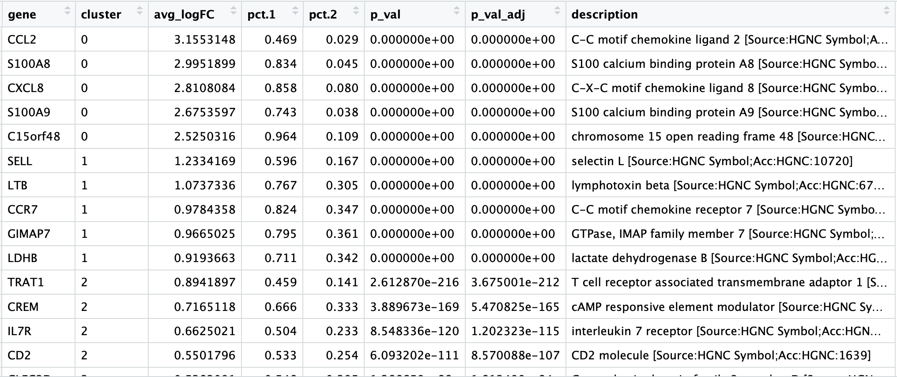

Approximate time: 45 minutes

## Learning Objectives:

* Understand how to determine markers of individual clusters
* Understand the iterative processes of clustering and marker identification

# Single-cell RNA-seq marker identification

Now that we have identified our desired clusters, we can move on to marker identification, which will allow us to verify the identity of certain clusters and help surmise the identity of any unknown clusters. 


_**Goals:**_ 
 
 - _To **determine the gene markers** for each of the clusters_
 - _To **identify cell types** of each cluster using markers_
 - _To determine whether need to **re-cluster based on cell type markers**, perhaps clusters need to be merged or split_

_**Challenges:**_
 
 - _Over-interpretation of the results_
 - _Combining different types of marker identification_

_**Recommendations:**_
 
 - _Think of the results as hypotheses that need verification. Inflated p-values can lead to over-interpretation of results (essentially each cell is used as a replicate). Top markers are most trustworthy._
 _Identify all markers conserved between conditions for each cluster_
 - _Identify markers that are differentially expressed between specific clusters_


There are a few different types of marker identification that we can explore using Seurat. Each with their own benefits and drawbacks:

1. **Identification of all markers for each cluster:** this analysis compares each cluster against all others and outputs the genes that are differentially expressed/present. 
	- *Useful for identifying unkown clusters and improving confidence in hypothesized cell types.*

2. **Identification of conserved markers for each cluster regardless of condition:** This analysis looks for those genes that are conserved in the cluster across all conditions. This analysis will output genes that are consistently differentially expressed/present for all of the sample groups. These genes can help to figure out the identity for the cluster. Often, this analysis is performed only for those clusters whose identity is uncertain or novel.
	- *Useful when more than one condition to identify cell type markers that are conserved across conditions.*  	
3. **Marker identification between specific clusters:** this analysis explores differentially expressed genes between specific clusters. 
	- *Useful for determining differences in gene expression between clusters with markers that are similar in the above analyses.*

Since we only are exploring a single sample, we do not need to explore conserved markers, but we will investigate all markers for each cluster and tease out markers differentiating specific clusters.

## Identification of all markers for each cluster

For this analysis we are comparing each cluster against all other clusters to identify cluster markers using the ` FindAllMarkers()` function. This function has two important arguments which provide thresholds for determining whether a gene is a marker:

- `logfc.threshold`: minimum log2 foldchange for average expression of gene in cluster relative to the average expression in all other clusters combined
	- **Cons:** 
		- could miss those cell markers that are expressed in the cluster being compared, but not in the other clusters, if the average log2FC doesn't meet the threshold
		- could return a lot of metabolic/ribosomal genes due to slight differences in metabolic output by different cell types, which are not as useful to distinguish cell type identities
- `min.diff.pct`: minimum percent difference between the percent of cells expressing the gene in the cluster and the percent of cells expressing gene in all other clusters combined
	- **Cons:** could miss those cell markers that are expressed in all cells, but are highly up-regulated in this specific cell type
	
You could use one or the other of these arguments or both. We will be a bit lenient and use only the log2 fold change threshold greater than 0.25. We will also specify to return only the positive markers for each cluster

```r
# Find markers for every cluster compared to all remaining cells, report only the positive ones
markers <- FindAllMarkers(object = seurat_control, 
                          only.pos = TRUE,
                          logfc.threshold = 0.25)
                          
View(markers)                          
```

The order of the columns doesn't seem the most intuitive, so we will reorder the columns with the `cluster` first followed by the `gene`.

```r
# Combine markers with gene descriptions 
ann_markers <- inner_join(x = markers, 
                          y = annotations[, c("gene_name", "description")],
                          by = c("gene" = "gene_name")) %>%
        unique()

# Rearrange the columns to be more intuitive
ann_markers <- ann_markers[ , c(6, 7, 2:4, 1, 5,8)]

# Order the rows by p-adjusted values
ann_markers <- ann_markers %>%
        dplyr::arrange(cluster, p_val_adj)

View(ann_markers)
```

<p align="center">

</p>

**Usually the top markers are relatively trustworthy, but because of inflated p-values, many of the less significant genes are not so trustworthy as markers.**

When looking at the output, we suggest looking for markers with large differences in expression between `pct.1` and `pct.2` and larger fold changes. For instance if `pct.1` = 0.90 and `pct.2` = 0.80, I might not be as excited about that marker. However, if `pct.2` = 0.1 instead, then I would be much more excited about it. Also, I look for the majority of cells expressing marker in my cluster of interest. If `pct.1` is low, such as 0.3, I again might not be as interested in it.

- **cluster:** number corresponding to cluster
- **gene:** gene id
- **avg_logFC:** average log2 fold change. Positive values indicate that the gene is more highly expressed in the cluster.
- **pct.1**: The percentage of cells where the gene is detected in the cluster
- **pct.2**: The percentage of cells where the gene is detected on average in the other clusters
- **p_val:** p-value not adjusted for multiple test correction
- **p_val_adj:** Adjusted p-value, based on bonferroni correction using all genes in the dataset, used to determine significance


If the format looks good, we can save our marker analysis results to file and output the top 5 markers by log2 fold change for each cluster for a quick perusal.

```r
# Save markers to file
write.csv(ann_markers, 
          file = "results/control_all_markers.csv", 
          quote = FALSE, 
          row.names = FALSE)

# Extract top 5 markers per cluster
top5 <- ann_markers %>% 
        group_by(cluster) %>% 
        top_n(n = 5, 
              wt = avg_logFC)

# Visualize top 5 markers per cluster
View(top5)

```

<p align="center">

</p>

Based on my marker results, if there were any questions about the identity of any clusters, exploring the cluster's markers would be the first step. If we look at the markers of cluster 9,


## Identifying gene markers for each cluster

Seurat has the functionality to perform a variety of analyses for marker identification; for instance, we can identify markers of each cluster relative to all other clusters by using the `FindAllMarkers()` function. This function essentially performs a differential expression test of the expression level in a single cluster versus the average expression in all other clusters.

To be identified as a cluster or cell type marker, within the `FindAllMarkers()` function, we can specify thresholds for the minimum percentage of cells expressing the gene in either of the two groups of cells (`min.pct`) and minimum difference in expression between the two groups (`min.dff.pct`). 


```r
# Identify gene markers
all_markers <-FindAllMarkers(seurat, 
                             min.pct =  0.25, 
                             min.diff.pct = 0.25)
```

The results table output contains the following columns:

- **`p_val`:** p-value not adjusted for multiple test correction
- **`avg_logFC`:** average log2 fold change. Positive values indicate that the gene is more highly expressed in the cluster.
- **`pct.1`**: The percentage of cells where the gene is detected in the cluster
- **`pct.2`**: The percentage of cells where the gene is detected on average in the other clusters
- **`p_val_adj`:** Adjusted p-value, based on bonferroni correction using all genes in the dataset, used to determine significance
- **`cluster`:** identity of cluster
- **`gene`:** Ensembl gene ID
- **`symbol`:** gene symbol
- **`biotype`:** type of gene
- **`description`:** gene description

```
View(all_markers)
```


## Interpretation of the marker results

Using Seurat for marker identification is a rather quick and dirty way to identify markers. Usually the top markers are relatively trustworthy; however, because of inflated p-values, many of the less significant genes are not so trustworthy as markers. 

When looking at the output, we suggest looking for marker genes with large differences in expression between `pct.1` and `pct.2` and larger fold changes. For instance if `pct.1` = 0.90 and `pct.2` = 0.80 and had lower log2 fold changes, that marker might not be as exciting. However, if `pct.2` = 0.1 instead, then it would be a lot more exciting. 

When trying to understand the biology of the marker results it's helpful to have the gene names instead of the Ensembl IDs, so we can merge our results with our annotations acquired previously:

```r
# Merge gene annotations to marker results
all_markers <- left_join(all_markers, 
                         annotations[, c(1:2, 3, 5)], 
                         by = c("gene" = "gene_id"))

View(all_markers)                         
```


After the merge, the order of the columns is not as intuitive, so we will reorder the columns to make the results table more readable.

```r
# Rearrange order of columns to make clearer
all_markers <- all_markers[, c(6:8, 1:5, 9:10)]

View(all_markers)
```


Usually, we would want to save all of the identified markers to file.

```r
# Write results to file
write.csv(all_markers, "results/all_markers.csv", quote = F)
```

In addition to all of the markers, it can be helpful to explore the most significant marker genes. Let's return the top 10 marker genes per cluster.

```r
# Return top 10 markers for cluster specified 'x'
gen_marker_table <- function(x){
  all_markers[all_markers$cluster == x, ] %>%
  head(n=10)
}

# Create a data frame of results for clusters 0-6
top10_markers <- map_dfr(0:6, gen_marker_table)

View(top10_markers)
```


We can write these results to file as well:

```r
# Write results to file
write.csv(top10_markers, "results/top10_markers.csv", quote = F)
```

# Assigning cell type identity to clusters

We can often go through the top markers to identify the cell types. We have to use what we know about the biology of the expected cells to determine the cell populations represented by each cluster. 

Let's remind ourselves of the different clusters:

```r
DimPlot(
  seurat,
  "tsne",
  do.label = TRUE,
  do.return = TRUE, 
  label.size = 8) +
  ggtitle("tSNE")
```


To get a better idea of cell type identity we can explore the expression of different identified markers by cluster using the `FeaturePlot()` function. For example, we can look at the cluster 3 markers by cluster:

```r
FeaturePlot(object = seurat, 
            features.plot = c(top10_markers[top10_markers$cluster == 3, "gene"]), 
            cols.use = c("grey", "blue"), 
            reduction.use = "tsne")
```


We can also explore the range in expression of specific markers by using violin plots:

```r
# Vln plot - cluster 3
VlnPlot(object = seurat, 
        features.plot = c("ENSG00000105369", "ENSG00000204287"))
```        


These results and plots can help us determine the identity of these clusters or verify what we hypothesize the identity to be after exploring the canonical markers of expected cell types previously.

Sometimes the list of markers returned don't sufficiently separate some of the clusters. For instance, we had previously identified clusters 0 and 1 , if we would like to determine the genes that are differentially expressed between these specific clusters, we can use the `FindMarkers()` function. 

```r
# Determine differentiating markers for CD4 T cell clusters 0 versus 1
markers_0vs1 <- FindMarkers(object = seurat, ident.1 = 0, ident.2 = 1)

View(markers_0vs1)
```


```r
# Add gene symbols to the DE table
markers_0vs1$gene <- rownames(markers_0vs1)
markers_0vs1 <- left_join(markers_0vs1, 
                         annotations[, c(1:2, 3, 5)], 
                         by = c("gene" = "gene_id"))

View(markers_0vs1)
```


When looking through the results, the most significant marker is `ENSG00000196154`, which corresponds to **S100A4**, a gene exclusively expressed by memory T cells of CD4+ or CD8+ subpopulations. Other markers listed also indicate that cluster 0 represents naive T cells, while cluster 1 represents memory T cells.

While we are not going to explore these genes in more depth, you would probably want to explore the expression of these genes in more depth visually using feature plots and violin plots.

Now taking all of this information, we can surmise the cell types of the different clusters. Some of the canonical markers for the different cell types were found to be differentially expressed for certain clusters as detailed below.

| Cluster ID	| Markers	| Cell Type |
|:-----:|:-----:|:-----:|
|0	|IL7R	|CD4+ Naive T cells|
|1	|IL7R	|CD4+ Memory T cells|
|2	|CD14, LYZ	|CD14+ Monocytes|
|3	|MS4A1	|B cells|
|4	|CD8A	|CD8+ T cells|
|5	|FCGR3A, MS4A7	|FCGR3A+ Monocytes|
|6	|GNLY, NKG7	|NK cells|

We can then reassign the identity of the clusters to these cell types:

```r
# List of current cluster IDs
current_cluster_ids <- c(0, 1, 2, 3, 4, 5, 6)

# List of new cluster IDs
new_cluster_ids <- c("CD4+ Naive T cells", "CD4+ Memory T cells", "CD14+ Monocytes", "B cells", "CD8+ T cells", "FCGR3A+ Monocytes", "NK cells")

# Changing IDs to cell type
seurat@ident <- plyr::mapvalues(x = seurat@ident, 
                                from = current_cluster_ids, 
                                to = new_cluster_ids)
# Re-run TSNE with cell types
TSNEPlot(object = seurat, 
         do.label = TRUE, 
         pt.size = 0.5)
```


***

*This lesson has been developed by members of the teaching team at the [Harvard Chan Bioinformatics Core (HBC)](http://bioinformatics.sph.harvard.edu/). These are open access materials distributed under the terms of the [Creative Commons Attribution license](https://creativecommons.org/licenses/by/4.0/) (CC BY 4.0), which permits unrestricted use, distribution, and reproduction in any medium, provided the original author and source are credited.*

* *A portion of these materials and hands-on activities were adapted from the [Satija Lab's](https://satijalab.org/) [Seurat - Guided Clustering Tutorial](https://satijalab.org/seurat/pbmc3k_tutorial.html)*
