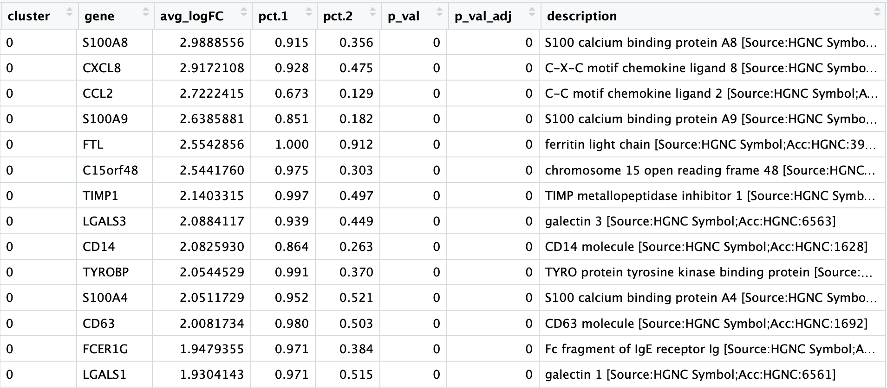
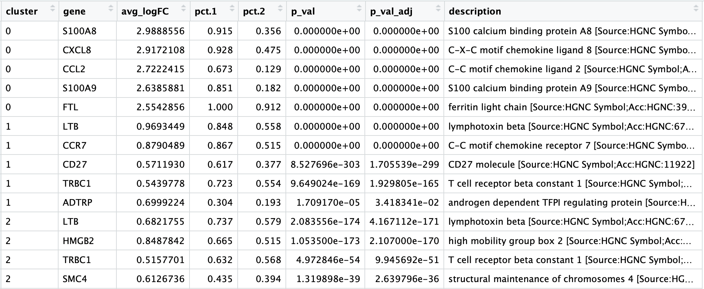
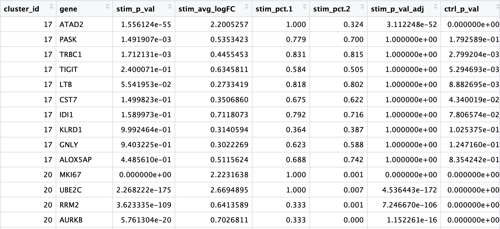

Approximate time: 45 minutes

## Learning Objectives:

* Understand how to determine markers of individual clusters
* Understand the iterative processes of clustering and marker identification

# Single-cell RNA-seq marker identification

Now that we have identified our desired clusters, we can move on to marker identification, which will allow us to verify the identity of certain clusters and help surmise the identity of any unknown clusters. 


_**Goals:**_ 
 
 - _To **determine the gene markers** for each of the clusters_
 - _To **identify cell types** of each cluster using markers_
 - _To determine whether need to **re-cluster based on cell type markers**, perhaps clusters need to be merged or split_

_**Challenges:**_
 
 - _Over-interpretation of the results_
 - _Combining different types of marker identification_

_**Recommendations:**_
 
 - _Think of the results as hypotheses that need verification. Inflated p-values can lead to over-interpretation of results (essentially each cell is used as a replicate). Top markers are most trustworthy._
 _Identify all markers conserved between conditions for each cluster_
 - _Identify markers that are differentially expressed between specific clusters_


Remember that we had the following questions from the clustering analysis:

1. *What is the cell type identity of clusters 16, 17, and 20?*
3. *Do the clusters corresponding to the same cell types have biologically meaningful differences? Are there subpopulations of these cell types?*
4. *Can we acquire higher confidence in these cell type identities by identifying other marker genes for these clusters?*

Remember that we have a few different types of marker identification, each with their own benefits and drawbacks:

1. **Identification of all markers for each cluster:** this analysis compares each cluster against all others and outputs the genes that are differentially expressed/present. 
	- *Useful for identifying unknown clusters and improving confidence in hypothesized cell types.*

2. **Identification of conserved markers for each cluster regardless of condition:** this analysis looks for those genes that are conserved in the cluster across all conditions. This analysis will output genes that are consistently differentially expressed/present for all of the sample groups. These genes can help to figure out the identity for the cluster. Often, this analysis is performed only for those clusters whose identity is uncertain or novel.
	- *Useful for identifying unknown clusters and improving confidence in cell type identities when more than one condition. Returns fewer, but higher confidence markers of cell type. Tends to take much longer to run.*  	

3. **Marker identification between specific clusters:** this analysis explores differentially expressed genes between specific clusters. 
	- *Useful for determining differences in gene expression between clusters with markers that are similar in the above analyses.*

Since we have more than a single condition, we can explore conserved markers for identifying unknown clusters, in addition to identifying all markers for each cluster and exploring differences between clusters.

## Identification of all markers for each cluster

For this analysis we are comparing each cluster against all other clusters to identify cluster markers using the ` FindAllMarkers()` function, similar to previously. 

```r
# Find markers for every cluster compared to all remaining cells, report only the positive ones
combined_markers <- FindAllMarkers(object = combined, 
                          only.pos = TRUE,
                          logfc.threshold = 0.25)                       
```

The order of the columns doesn't seem the most intuitive, so we will reorder the columns with the `cluster` first followed by the `gene`.

```r
# Combine markers with gene descriptions 
ann_comb_markers <- inner_join(x = combined_markers, 
                               y = annotations[, c("gene_name", "description")],
                               by = c("gene" = "gene_name")) %>%
        unique()

# Rearrange the columns to be more intuitive
ann_comb_markers <- ann_comb_markers[ , c(6, 7, 2:4, 1, 5,8)]

# Order the rows by p-adjusted values
ann_comb_markers <- ann_comb_markers %>%
        dplyr::arrange(cluster, p_val_adj)

View(ann_comb_markers)
```

<p align="center">

</p>

**Usually the top markers are relatively trustworthy, but because of inflated p-values, many of the less significant genes are not so trustworthy as markers.**

Save our marker analysis results to file.

```r
# Save markers to file
write.csv(ann_comb_markers, 
          file = "results/combined_all_markers.csv", 
          quote = FALSE, 
          row.names = FALSE)
```

We can also output the top 5 markers by log2 fold change for each cluster for a quick perusal.

```r
# Extract top 5 markers per cluster
top5_comb <- ann_comb_markers %>%
        group_by(cluster) %>%
        top_n(n = 5,
              wt = avg_logFC)

# Visualize top 5 markers per cluster
View(top5_comb)

```

<p align="center">

</p>

Based on these marker results, we can determine whether the markers make sense for our hypothesized identities for each cluster:


If there were any questions about the identity of any clusters, exploring the cluster's markers would be the first step. Let's look at the `ann_comb_markers`, filtering for cluster 17.

<p align="center">

</p>

We also had questions regarding the identity of cluster 7. Is cluster 7 a CD8+ T cell, an NK cell, or an NK T cell?

We can look at the markers of cluster 7 to try to resolve the identity:

<p align="center">

</p>


To get a better idea of cell type identity we can explore the expression of different identified markers by cluster using the `FeaturePlot()` function. For example, we can look at the cluster 7 markers:

```r
# Plot top 5 markers for cluster 7
FeaturePlot(object = seurat_control, 
            features = top5[top5$cluster == 7, "gene"] %>%
                    pull(gene))
```

<p align="center">

</p>

We can also explore the range in expression of specific markers by using violin plots:

```r
# Vln plot - cluster 7
VlnPlot(object = seurat_control, 
        features = top5[top5$cluster == 7, "gene"] %>%
                    pull(gene))
```        

<p align="center">

</p>


## Identification of conserved markers in all conditions

Identifying conserved markers allows for identifying only those genes the are significantly differentially expressed relative to the other clusters for all conditions. This function is most useful to run if unsure of the identity for a cluster after running the `FindAllMarkers()`. You could run it on all clusters if you wanted to, but it takes a while to run, so we are just going to run it on the unknown clusters 17 and 20.

The function we will use is the `FindConservedMarkers()`, which has the following structure:

**`FindConservedMarkers()` syntax:**

```r
FindConservedMarkers(seurat_obj,
                     ident.1 = cluster,
                     grouping.var = "group",
                     only.pos = TRUE)
```

The function **accepts a single cluster at a time**, so if we want to have the function run on all clusters, then we can use the `map` family of functions to iterate across clusters. 

Since these functions will **remove our row names** (gene names), we need to transfer the row names to columns before mapping across clusters. We also need a column specifying **to which cluster the significant genes correspond**.

To do that we will create our own function to:

1. Run the `FindConservedMarkers()` function
2. Transfer row names to a column using `rownames_to_column()` function
3. Create the column of cluster IDs using the `cbind()` function

```r
# Create function to get conserved markers for any given cluster
get_conserved <- function(cluster){
        FindConservedMarkers(combined,
                             ident.1 = cluster,
                             grouping.var = "sample",
                             only.pos = TRUE) %>%
                rownames_to_column(var = "gene") %>%
                cbind(cluster_id = cluster, .)
}
```

Since we want the output of the `map` family of functions to be a **dataframe with each cluster output bound together by rows**, we will use the `map_dfr()` function.

Remember the map family of functions uses the following syntax:

**`map` family syntax:**

```r
map_dfr(inputs_to_function, name_of_function)
```

Now, let's find the conserved markers for clusters 16, 17, and 20.

```r
# Iterate function across desired clusters
conserved_markers <- map_dfr(c(17,20), get_conserved)
```

To better analyze the output, we can include the gene descriptions as well.

```r
# Extract the gene descriptions for each gene
gene_descriptions <- unique(annotations[, c("gene_name", "description")])

# Merge gene descriptions with markers
ann_conserved_markers <- left_join(x = conserved_markers,
                                   y = gene_descriptions,
                                   by = c("gene" = "gene_name"))
```

<p align="center">

</p>

For clusters 17 and 20, we see many of the conserved enriched genes encode inhibitory receptors, such as TIGIT and LAG3, which can be indicative of exhausted T cells.

## Identifying gene markers for each cluster

The last set of questions we had regarding the analysis involved whether the clusters corresponding to the same cell types have biologically meaningful differences. Sometimes the list of markers returned don't sufficiently separate some of the clusters. For instance, we had previously identified clusters 0 and 5 as CD14+ monocytes, but are there biologically relevant differences between these two clusters of cells? We can use the `FindMarkers()` function to determine the genes that are differentially expressed between these specific clusters. 

```r
# Determine differentiating markers for CD8+ T cells - clusters 6 versus 10
cd8_t <- FindMarkers(combined,
                     ident.1 = 6,
                     ident.2 = 10)                     

# KLRG1 means cluster 6 is more differentiated / effector?

# Add gene descriptions to the DE table
cd8_t_markers <- cd8_t %>%
        rownames_to_column("gene") %>%
        inner_join(y = gene_descriptions,
                   by = c("gene" = "gene_name")) %>%
        unique()

# Reorder columns and sort by log2 fold change        
cd8_t_markers <- cd8_t_markers[, c(1, 3:5,2,6:7)]

cd8_t_markers <- cd8_t_markers %>%
        dplyr::arrange(avg_logFC)
        
# View data
View(cd8_t_markers)
```

<p align="center">

</p>

Now taking all of this information, we can surmise the cell types of the different clusters and plot the cells with cell type labels. We would have done comparisons between all of the clusters that represent the same cell type (i.e. between clusters 1, 2, and 3 for CD4+ T cells); however, for this lesson, we will merge all of the clusters of the same cell type.


| Cluster ID	| Cell Type |
|:-----:|:-----:|
|0	| CD14+ Monocytes|
|1	| CD4+ T cells |
|2	| CD4+ T cells|
|3	| CD4+ T cells|
|4	| B cells |
|5	| CD14+ Monocytes|
|6	| NK cells |
|7	| CD8+ T cells (activated)|
|8	| CD8+ T cells |
|9	| Stressed / dying cells |
|10	| Dendritic cells |
|11	| FCGR3A+ Monocytes |
|12	| Megakaryocytes |
|13	| B cells |
|14	| CD4+ T cells |
|15| CD4+ T cells |

We can then reassign the identity of the clusters to these cell types:

```r
seurat_control <- RenameIdents(object = seurat_control, 
                                "0" = "CD14+ monocytes",
                                "1" = "CD4+ T cells",
                                "2" = "CD4+ T cells",
                                "3" = "CD4+ T cells",
                                "4" = "B cells",
                                "5" = "CD14+ monocytes",
                                "6" = "NK cells",
                                "7" = "CD8+ T cells",
                                "8" = "CD8+ T cells",
                                "9" = "Stressed/dying cells",
                                "10" = "Dendritic cells",
                                "11" = "FCGR3A+ monocytes",
                                "12" = "Megakaryocytes",
                                "13" = "B cells",
                                "14" = "CD4+ T cells",
                                "15" = "CD4+ T cells")

DimPlot(object = seurat_control, 
        reduction = "umap", 
        label = TRUE,
        label.size = 6)
```

<p align="center">

</p>

If we wanted to remove the stressed cells, we could use the `SubsetData()` function:

```r
# Remove the stressed or dying cells
control_labelled <- SubsetData(seurat_control,
                               ident.remove = "Stressed/dying cells")

# Re-visualize the clusters
DimPlot(object = control_labelled, 
        reduction = "umap", 
        label = TRUE,
        label.size = 6)
```

<p align="center">

</p>

Now we would want to save our final labelled Seurat object:

```r        
# Save final R object
write_rds(control_labelled,
          path = "results/seurat_control_labelled.rds")       
```

We have completed the first round of the analysis for the `control` sample. Based on our results, we may need to proceed back to prior steps to optimize our parameters:

- Clusters were not separated well enough (i.e. CD4+ and CD8+ T cells were in same cluster):  adjust the clustering resolution or number of PCs used.
- Too many low quality cells observed: go back and perform more stringent QC by filtering out the low quality cells. 

If we validated the stressed/dying cells were indeed low quality, we may want to remove those cells in the QC and re-cluster. However, we are going to just leave those cells removed and move on to include the `stimulated` sample.

***


*This lesson has been developed by members of the teaching team at the [Harvard Chan Bioinformatics Core (HBC)](http://bioinformatics.sph.harvard.edu/). These are open access materials distributed under the terms of the [Creative Commons Attribution license](https://creativecommons.org/licenses/by/4.0/) (CC BY 4.0), which permits unrestricted use, distribution, and reproduction in any medium, provided the original author and source are credited.*

* *A portion of these materials and hands-on activities were adapted from the [Satija Lab's](https://satijalab.org/) [Seurat - Guided Clustering Tutorial](https://satijalab.org/seurat/pbmc3k_tutorial.html)*
