Approximate time: 90 minutes

## Learning Objectives:

* Understand how to bring in data from single-cell RNA-seq experiments
* Construct QC metrics to explore visually
* Evaluate the QC metrics to filter out low quality cells

# Single-cell RNA-seq: Quality control


## Dataset

The dataset we will be working with is comprised of 2,700  Peripheral Blood Mononuclear Cells (PBMC) taken from a healthy donr, sequenced on  the Illumina NextSeq 500. This dataset is freely available from 10X Genomics and is used as part of the [Seurat tutorial](https://satijalab.org/seurat/pbmc3k_tutorial.html). 

We are going to go through the analysis workflow for quality control through marker identification; however, **this dataset has already been filtered for poor quality cells**. Therefore, don't be surprised if any data from the sequencing facility looks a bit worse for the metrics we will be exploring.


## Setting up the R environment

Before we can start our analysis, we need to make sure we have an organized directory structure. Create a new R project entitled `single_cell_rnaseq`. Then, create the following directories:

```
single_cell_rnaseq/
├── data
├── results
└── figures

```

### Download data

**Right-click** the link [here](https://s3-us-west-2.amazonaws.com/10x.files/samples/cell/pbmc3k/pbmc3k_filtered_gene_bc_matrices.tar.gz) and download the data into the `data` folder.

We will need to navigate to the `data` folder and **click on the file `pbmc3k_filtered_gene_bc_matrices.tar.gz`** to decompress it. 

Finally, create an Rscript and type the following note:

```r
# Single-cell RNA-seq analysis - QC
```

Save the Rscript as `quality_control.R`. Your working directory should look something like this:

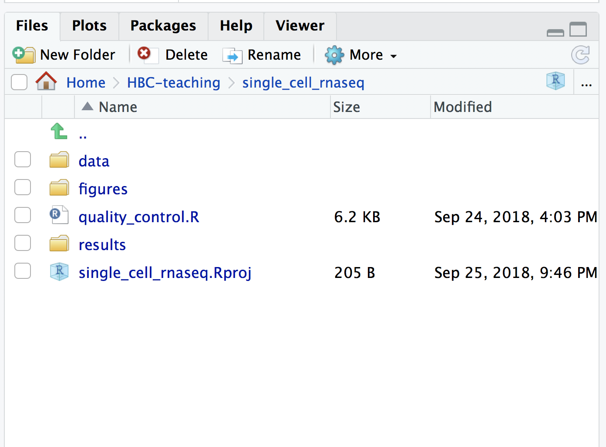


### Loading libraries 

Now, we can load the necessary libraries:

```r
# Load libraries
library(Seurat)
library(tidyverse)
library(SingleCellExperiment)
library(Matrix)
library(AnnotationHub)
library(ensembldb)
library(cowplot)
library(ggplot2)
library(scales)
```

## Obtaining quality metrics for assessment

Throughout the analysis workflow post-QC, we will rely heavily on the Seurat package; however, **Seurat has few functions to explore the QC in depth**. Therefore, we will be extracting the data from the Seurat object to perform our own quality assessment.

### Creating count data object

Generally, all single-cell RNA-seq datasets, regardless of technology or pipeline, will contain **three files**:

1. a file with the **gene IDs**, representing all genes quantified
2. a file with the **cell IDs**, representing all cells quantified
3. a **matrix of counts** per gene for every cell


We can explore these files by clicking on the `data/filtered_gene_bc_matrices/hg19` folder:

- **`barcodes.tsv`:** cellular barcodes present in dataset

  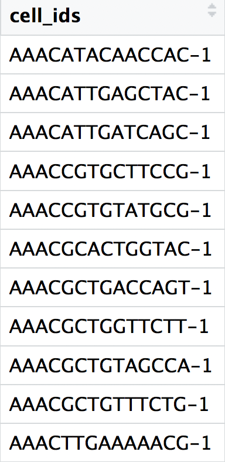
  
- **`genes.tsv`:** IDs of quantified genes

  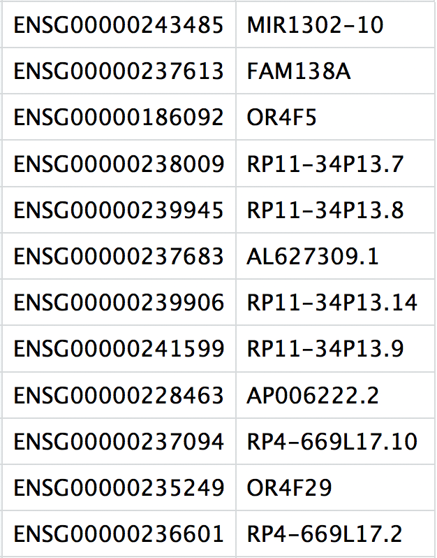

- **`matrix.mtx`:** a matrix of count values, where rows are associated with the gene IDs above and columns correspond to the cellular barcodes. Note that there are many zero values in this matrix.

  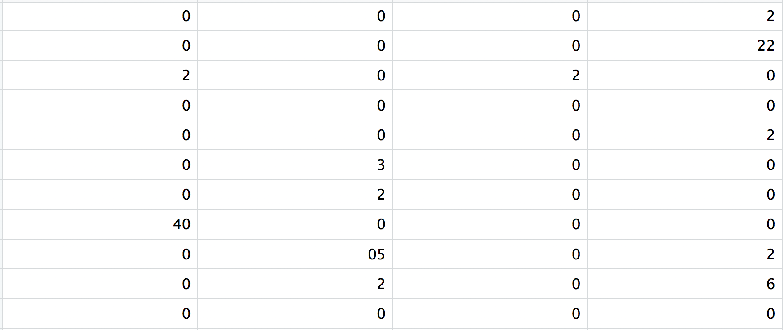

Let's read these files into R to generate our quality metrics.

```r
# Read in `matrix.mtx`
counts <- readMM("data/filtered_gene_bc_matrices/hg19/matrix.mtx")

# Read in `genes.tsv`
genes <- read_tsv("data/filtered_gene_bc_matrices/hg19/genes.tsv", col_names = FALSE)
gene_ids <- genes$X1

# Read in `barcodes.tsv`
cell_ids <- read_tsv("data/filtered_gene_bc_matrices/hg19/barcodes.tsv", col_names = FALSE)$X1
```

To improve the amount of space, memory and CPU required to work with our huge count matrix, we are going to turn it into a [sparse matrix](https://en.wikipedia.org/wiki/Sparse_matrix#Compressed_sparse_row_(CSR,_CRS_or_Yale_format)), which collapses the zeros in the data:

```r
# Create a sparse matrix for more efficient computation
counts <- as(counts, "dgCMatrix")
```

Then we can add row names to the count matrix to be the gene IDs and the column names of the count matrix to be the cell IDs.

```r
# Make the column names as the cell IDs and the row names as the gene IDs
rownames(counts) <- gene_ids
colnames(counts) <- cell_ids
```

### Creating metadata object with some QC metrics

Now that we have a counts matrix with the genes as row names and cells as columns, we can create our metadata with information about the different metrics to evaluate during quality control assessment.

We will create the metadata with only the cell IDs: 

```r
# Create metadata containing only the cell IDs
metadata <- data.frame(row.names = cell_ids, cells = cell_ids, stringsAsFactors = F)
```

Then, we can add information about the number of UMIs per cell,

```r
# Add number of UMIs for each gene per cell to metadata
metadata$nUMI <- Matrix::colSums(counts)
```

the number of genes identified per cell,

```r
# Add number of genes detected per cell to metadata
metadata$nGene <- Matrix::colSums(counts > 0)
```

the number of genes per UMI for each cell,

```r
# Add number of UMIs per gene for each cell to metadata
metadata$log10GenesPerUMI <- log10(metadata$nGene) / log10(metadata$nUMI)
```

and the sample names. However, with this dataset we only have a single sample.

```r
# Add sample name associated with each cell to metadata (we only have one sample, so more important when you have multiple samples)
metadata$sample <- "pbmcs"
```

## Using annotations file to generate additional QC metrics

We will be using [AnnotationHub](https://bioconductor.org/packages/release/bioc/vignettes/AnnotationHub/inst/doc/AnnotationHub.html), which allows accession to a wide variety of online databases and other resources, to query Ensembl annotations made available through [ensembldb](https://bioconductor.org/packages/release/bioc/vignettes/ensembldb/inst/doc/ensembldb.html). Ensembldb is a package that retrieves annotation for the databases directly from the Ensembl Perl API.

### Downloading database for organism of interest

To access the various annotations available from Ensembl for human, we need to first connect to AnnotationHub, then specify the organism and database we are interested in.
 
```r
# Connect to AnnotationHub
ah <- AnnotationHub()

# Access the Ensembl database for organism
ahDb <- query(ah, 
              pattern = c("Homo sapiens", "EnsDb"), 
              ignore.case = TRUE)

```

Next, we acquire the latest annotation files from this Ensembl database. 

We can first check which annotation versions are available:

```r
# Check versions of databases available
ahDb %>% 
  mcols()
```

Since we want the most recent, we will return the AnnotationHub ID for this database:

```r
# Acquire the latest annotation files
id <- ahDb %>%
  mcols() %>%
  rownames() %>%
  tail(n = 1)
```
  
Finally, we can use the AnnotationHub connection to download the appropriate Ensembl database, which should be version GRCh38.92.

```r
# Download the appropriate Ensembldb database
edb <- ah[[id]]
```

And to extract gene-level information we can use the Ensembldb function `genes()` to return a data frame of annotations.

```r
# Extract gene-level information from database
annotations <- genes(edb, 
                     return.type = "data.frame")
                     
View(annotations)                    
```

### Exracting IDs for mitochondrial genes

We aren't interested in all of the information present in this `annotations` file, so we are going to extract that which is useful to us.

```r
# Select annotations of interest
annotations <- annotations %>%
  dplyr::select(gene_id, gene_name, gene_biotype, seq_name, description, entrezid)
```

Since we are looking for genes associated with mitochondrial gene expression, the `biotype` information is the field we should query. Let's explore the options:

```r
# Explore biotypes
annotations$gene_biotype %>%
  factor() %>%
  levels()
```

Now we can retrieve the genes associated with the different biotypes of interest:

```r
# Extract IDs for mitochondrial genes
mt <- annotations %>% 
  dplyr::filter(seq_name == "MT") %>%
  dplyr::pull(gene_id)
```

### Adding metrics to metadata

Now that we have information about which genes are mitochondrial, we can quanitify whether we have contamination.

```r
# Number of UMIs assigned to mitochondrial genes
metadata$mtUMI <- Matrix::colSums(counts[which(rownames(counts) %in% mt),], na.rm = T)

# Ensure all NAs receive zero counts
metadata$mtUMI[is.na(metadata$mtUMI)] <- 0

# Calculate of mitoRatio per cell
metadata$mitoRatio <- metadata$mtUMI/metadata$nUMI
```

Now you are **all setup with the metrics you need to assess the quality of your data**! Your final metadata table will have rows that correspond to each cell, and columns with information about those cells:

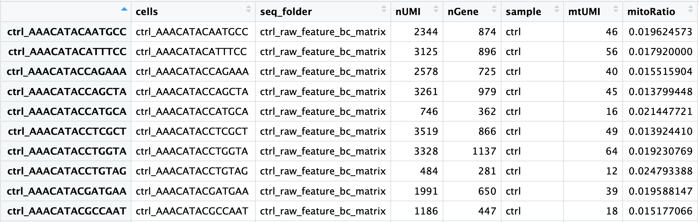


## Initial filtering

Prior to assessing our metrics, we are going to perform a very minimal filtering of those cells with less than 100 UMIs to get rid of the  cells that are clearly junk, containing less than 100 UMIs.

```r
# Keep cells with nUMI greater than 100
idx <- which(metadata$nUMI > 100)

# Extract the counts for those cells
counts_c <- counts[, idx]

# Extract the metadata for those cells
metadata_c <- metadata[idx,]
```

## Saving metrics to single cell experiment 

Before we assess our metrics we are going to save all of the work we have done thus far to a single cell experiment object, which is a standard object for single cell data in R.

```r
# Save data to single cell experiment variable
se <- SingleCellExperiment(assays=list(counts=counts_c), 
                           colData = metadata_c)
                           
# Create .RData object to load at any time
saveRDS(se, "data/raw_se.rds")
```

# Assessing the quality metrics

Now that we have generated the various metrics to assess, we can explore them with visualizations. We will create our metrics file from the metadata stored in the single cell experiments.

```r
# Create a data frame containing the metrics for visualizations
metrics <- colData(se) %>%
  as.data.frame

```

We will explore the following metrics through visualizations to decide on which cells are low quality and should be removed from the analysis:

- Cell counts
- UMI counts per cell
- Genes detected per cell
- UMIs vs. genes detected
- Mitochondrial counts ratio
- Novelty


## Cell counts

The cell counts are determined by the number of unique cellular barcodes detected. 

You expect the number of unique cellular barcodes to be around the number of sequenced cells or greater. In single-cell protocols using hydrogels, like inDrops, some hydrogels may have more than one cellular barcode (see details in note below). After we remove the low quality cells by filtering, we will expect the number of cells to be at or a bit below the number of sequenced cells.

> **NOTE:** During the **inDrop** protocol, the cellular barcodes are present in the hydrogels, which are encapsulated in the droplets with a single cell and lysis/reaction mixture. Upon treatment of UV and cell lysis, all components mix together inside the droplet and reverse transcription proceeds, followed by droplet breakup and linear amplification for library preparation. While each hydrogel should have a single cellular barcode associated with it, occasionally a hydrogel can have more than one cellular barcode. We often see all possible combinations of cellular barcodes at a low level, leading to a higher number of cellular barcodes than cells.

```r
# Visualize the number of cell counts per cell
metrics %>% 
  ggplot(aes(x=sample, fill=sample)) + 
  geom_bar() + 
  ggtitle("NCells")
```


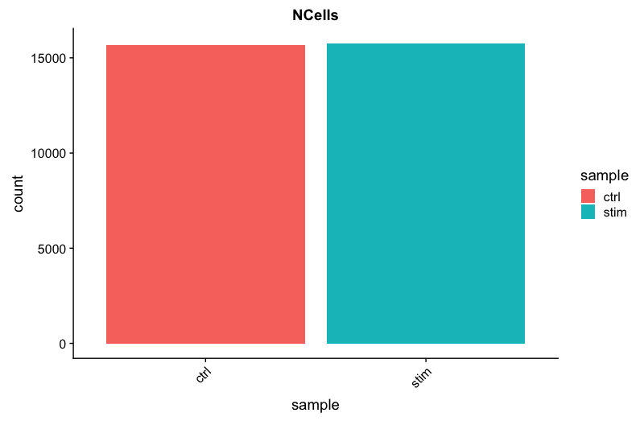


## UMI counts (transcripts) per cell

The UMI counts per cell should generally be above 500, although usable, it's still low if between 500-1000 counts. If UMIs per cell is 500-1000 counts, then the cells probably should have been sequenced more deeply. 

```r
# Visualize the number UMIs/transcripts per cell
metrics %>% 
        ggplot(aes(color=sample, x=nUMI, fill= sample)) + 
        geom_density() + 
        scale_x_log10() + 
        ylab("log10 cell density") +
        geom_vline(xintercept = 500)
```

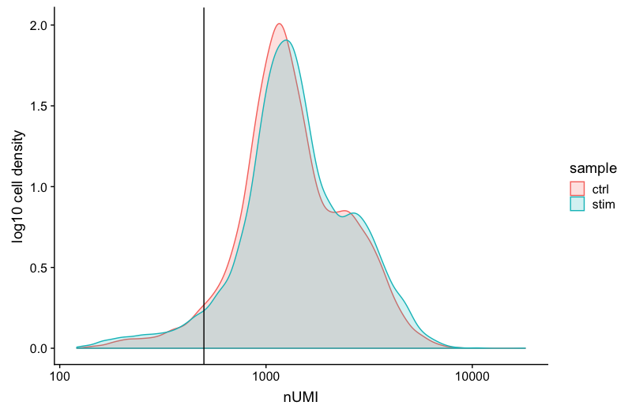
   
## Genes detected per cell

Seeing gene detection in the range of 500-5000 is normal for **inDrop** analysis. Similar expectations for gene detection as for UMI detection, although may be a bit lower than UMIs.

```r
# Visualize the distribution of genes detected per cell via histogram
metrics %>% 
        ggplot(aes(color=sample, x=nGene, fill= sample)) + 
        geom_density() + 
        scale_x_log10() + 
        geom_vline(xintercept = 200)

# Visualize the distribution of genes detected per cell via boxplot
metrics %>% 
        ggplot(aes(x=sample, y=log10(nGene), fill=sample)) + 
        geom_boxplot() + 
        ggtitle("NCells vs NGenes")
```

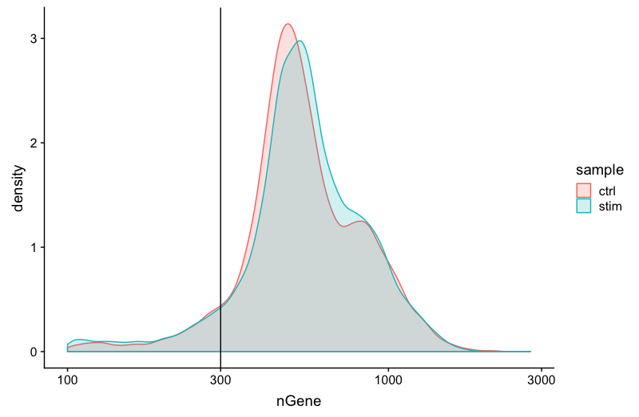

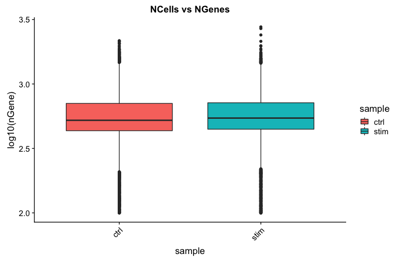

## UMIs vs. genes detected

Poor quality cells are likely to have low genes and UMIs per cell. Therefore, a poor sample is likely to have cells in the lower left of the graph. Good cells should exhibit both higher number of genes per cell and higher numbers of UMIs. We also expect similar lines with similar slopes for all samples.

```r
# Visualize the correlation between genes detected and number of UMIs and determine whether strong presence of cells with low numbers of genes/UMIs
metrics %>% 
  ggplot(aes(x=nUMI, y=nGene, color=mitoRatio)) + 
  geom_point() + 
  stat_smooth(method=lm) +
  scale_x_log10() + 
  scale_y_log10() + 
  geom_vline(xintercept = 800) +
  facet_wrap(~sample)
```

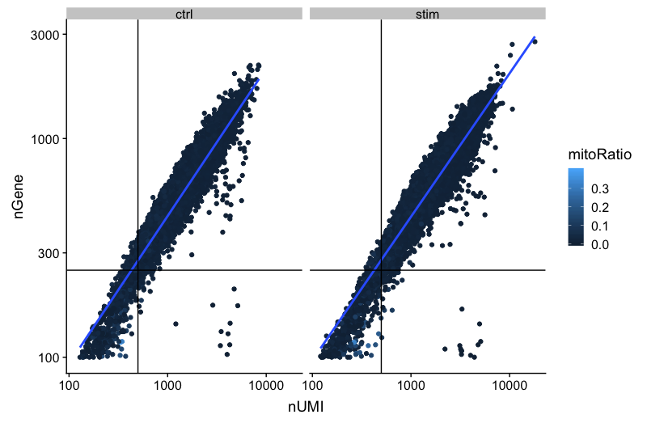

## Mitochondrial counts ratio

This metric can identify whether there is a large amount of mitochondrial contamination from dead or dying cells. Poor quality samples for mitochondrial counts would have larger peaks above the 0.1 mitochondrial ratio mark, unless it is expected based on sample type.

```r
# Visualize the distribution of mitochondrial gene expression detected per cell
metrics %>% 
        ggplot(aes(color=sample, x=mitoRatio, fill=sample)) + 
        geom_density() + 
        scale_x_log10() + 
        geom_vline(xintercept = 0.1)
```
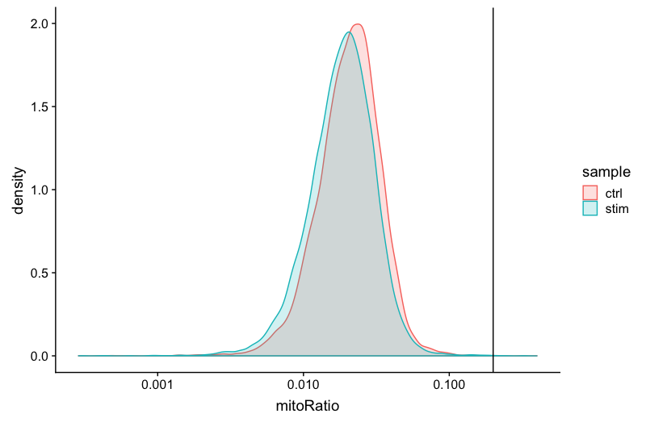

## Novelty

We can see the samples where we sequenced each cell less have a higher overall novelty, that is because we have not started saturating the sequencing for any given gene for these samples. Outlier cells in these samples might be cells that have a less complex RNA species than other cells. Sometimes we can detect contamination with low complexity cell types like red blood cells via this metric. Generally, we expect the novelty score to be above 0.80.

```r
# Visualize the overall novelty of the gene expression by visualizing the genes detected per UMI
metrics %>%
        ggplot(aes(x=log10GenesPerUMI, color = sample, fill=sample)) +
        geom_density()
```

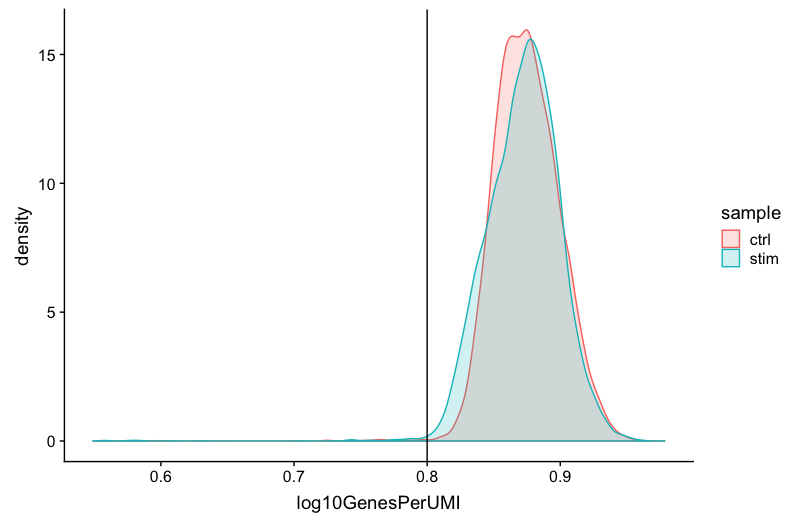

> **NOTE:** **Reads per cell** is another metric that can be useful to explore; however, the workflow used would need to save this information to assess. Generally, with this metric you hope to see all of the samples with peaks in relatively the same location between 10,000 and 100,000 reads per cell. 

# Filtering

Now that we have visualized the various metrics, we can decide on the thresholds to use to remoe the low quality. Often the recommendations mentioned earlier are a rough guideline, but the specific experiment needs to inform the exact thresholds chosen. We will use the following thresholds:

- nUMI > 500
- nGene > 500
- log10GenesPerUMI > 0.8
- mitoRatio < 0.1

```r
# Filter out low quality reads using selected thresholds - these will change with experiment
keep <- metrics %>%
  dplyr::filter(nUMI > 500 , 
                nGene > 500,
                log10GenesPerUMI > 0.8,
                mitoRatio < 0.1,
                ) %>% 
  pull(cells)

# Subset the cells to only include those that meet the thresholds specified
se_c <- se[ ,keep]

# Save subset to new metrics variable
metrics_clean <- colData(se_c) %>%
 as.data.frame()

# Save cleaned single-cell experimnet as .RData to load at any time
saveRDS(se_c, file = "data/se_filtered.rds")
```

## Re-assess QC metrics

After performing the filtering, it's recommended to look back over the metrics to make sure that your data matches your expectations and is good for downstream analysis.

### Cell counts

After filtering, we should not have more cells than we sequenced. Generally we aim to have about the number we sequenced or a bit less. With 2,700 cells sequenced, we would expect to return around this number of cells. We have about 2,480 returned after filtering, which is pretty good. 

```r
## Cell counts
metrics_clean %>% 
  ggplot(aes(x=sample, fill = sample)) + 
  geom_bar() + 
  ggtitle("NCells")
```

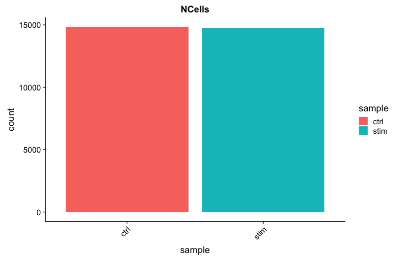

## Cells versus genes

``` 
# Cells versus genes
metrics_clean %>% 
  ggplot(aes(x=sample, y=log10(nGene), fill = sample)) + 
  geom_boxplot() + 
  ggtitle("NCells vs NGenes")
  
```

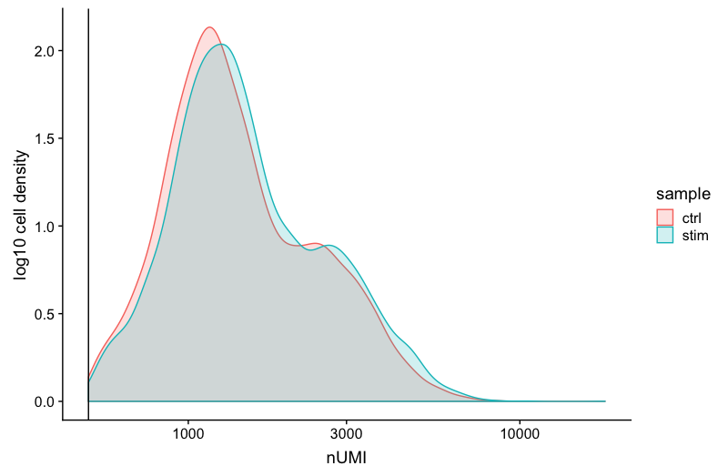


## UMI counts

The filtering using a threshold of 500 has removed the cells with low numbers of UMIs from the analysis.

```r
# UMI counts
metrics_clean %>% 
  ggplot(aes(fill=sample, x=nUMI)) + 
  geom_density() + 
  scale_x_log10() + 
  ylab("log10 cell density") +
  geom_vline(xintercept = 500)
```

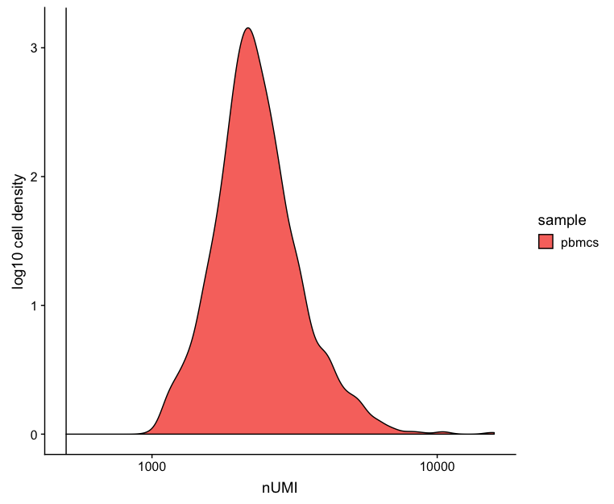


## Genes detected

```r
# Genes detected
metrics_clean %>% 
  ggplot(aes(fill=sample, x=nGene)) + 
  geom_density() + 
  scale_x_log10() + 
  geom_vline(xintercept = 200)
```

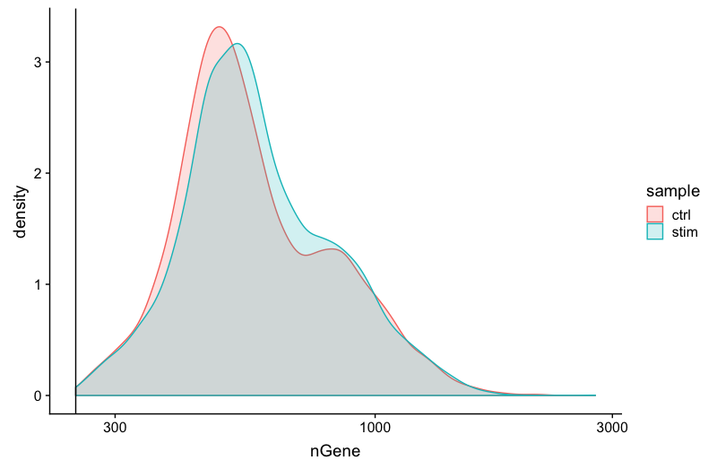

## UMIs vs genes
```r
# UMIs vs genes
metrics_clean %>% 
  ggplot(aes(x=nUMI, y=nGene, color=mitoRatio)) + 
  geom_point() + 
  stat_smooth(method=lm) +
  scale_x_log10() + 
  scale_y_log10() + 
  geom_vline(xintercept = 800) +
  facet_wrap(~sample)
```

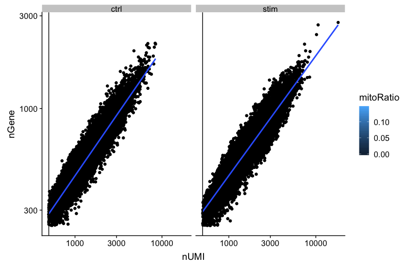

## Mitochondrial counts ratio
```r
# Mitochondrial counts ratio
metrics_clean %>% 
  ggplot(aes(fill=sample, x=mitoRatio)) + 
  geom_density() + 
  scale_x_log10() + 
  geom_vline(xintercept = 0.1)
```

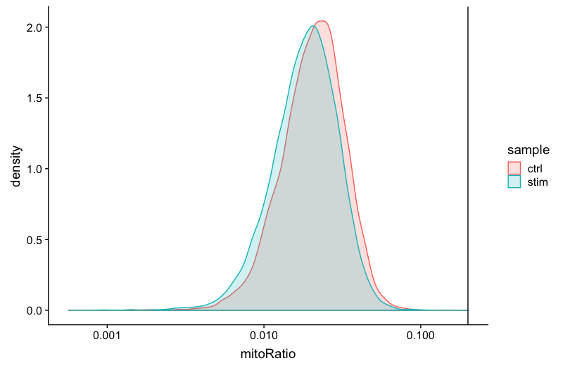

## Novelty
```r
# Novelty
metrics_clean %>%
  ggplot(aes(x=log10GenesPerUMI, fill = sample)) +
  geom_density()
```

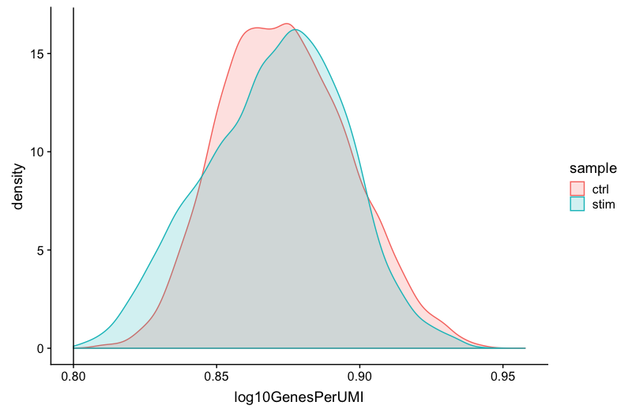

> ### Evaluating QC in another dataset
> It can be hard to get an idea of quality steps with this data since for the most part the data appears to be pretty good quality. To get an idea of how the QC might look if we had more than one sample and non-perfect data, we have [this HTML](https://github.com/hbctraining/In-depth-NGS-Data-Analysis-Course/blob/master/sessionIV/lessons/QC_report.html) linked for you . to look through.

---
*This lesson has been developed by members of the teaching team at the [Harvard Chan Bioinformatics Core (HBC)](http://bioinformatics.sph.harvard.edu/). These are open access materials distributed under the terms of the [Creative Commons Attribution license](https://creativecommons.org/licenses/by/4.0/) (CC BY 4.0), which permits unrestricted use, distribution, and reproduction in any medium, provided the original author and source are credited.*
