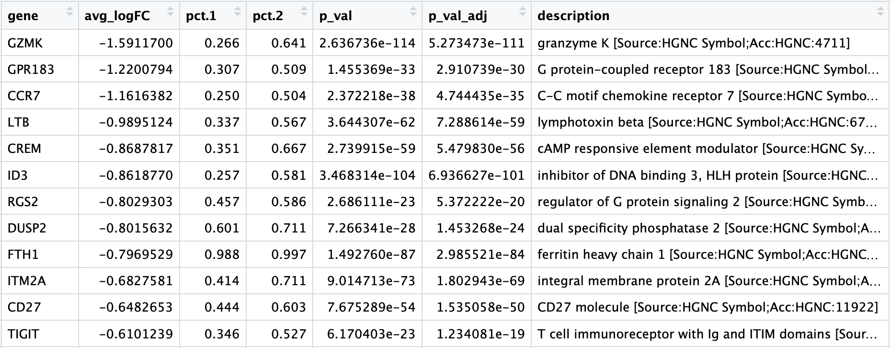

Approximate time: 45 minutes

## Learning Objectives:

* Understand how to determine markers of individual clusters
* Understand the iterative processes of clustering and marker identification

# Single-cell RNA-seq marker identification

Now that we have identified our desired clusters, we can move on to marker identification, which will allow us to verify the identity of certain clusters and help surmise the identity of any unknown clusters. 


***

_**Goals:**_ 
 
 - _To **determine the gene markers** for each of the clusters_
 - _To **identify cell types** of each cluster using markers_
 - _To determine whether there's a need to **re-cluster based on cell type markers**, perhaps clusters need to be merged or split_

_**Challenges:**_
 
 - _Over-interpretation of the results_
 - _Combining different types of marker identification_

_**Recommendations:**_
 
 - _Think of the results as hypotheses that need verification. Inflated p-values can lead to over-interpretation of results (essentially each cell is used as a replicate). Top markers are most trustworthy._
 _Identify all markers conserved between conditions for each cluster_
 - _Identify markers that are differentially expressed between specific clusters_

***

Our clustering analysis resulted in the following clusters: (**ADD NEW CLUSTERING FIGURE HERE**)

<p align="center">

</p>

Remember that we had the following questions from the clustering analysis: (**These questions will change!**)

1. *What is the cell type identity of cluster 7?*
2. *Is cluster 6 a CD8+ T cell or an NK cell?* *Is cluster 13 a T cell or an NK cell?*
3. *Do the clusters corresponding to the same cell types have biologically meaningful differences? Are there subpopulations of these cell types?*
4. *Can we acquire higher confidence in these cell type identities by identifying other marker genes for these clusters?*

There are a few different types of marker identification that we can explore using Seurat to get to the answer of these questions. Each with their own benefits and drawbacks:

1. **Identification of all markers for each cluster:** this analysis compares each cluster against all others and outputs the genes that are differentially expressed/present. 
	- *Useful for identifying unknown clusters and improving confidence in hypothesized cell types.*

2. **Identification of conserved markers for each cluster:** This analysis looks for genes that are differentially expressed/present within each condition first, and then reports those genes that are conserved in the cluster across all conditions. These genes can help to figure out the identity for the cluster. 
	- *Useful with more than one condition to identify cell type markers that are conserved across conditions.*  	
 
3. **Marker identification between specific clusters:** this analysis explores differentially expressed genes between specific clusters. 
	- *Useful for determining differences in gene expression between clusters that appear to be representing the same celltype (i.e with markers that are similar) from the above analyses.*

## Identification of all markers for each cluster

This type of analysis is typically recommended for when evaluating a single sample group/condition. We are comparing each cluster against all other clusters to identify marker genes using the ` FindAllMarkers()` function. The cells in each cluster are treated as replicates, and a differential expression analysis is performed with the specified statistical test. The default is a Wilcoxon Rank Sum test, but there are other options available. 

The `FindAllMarkers()` function has three important arguments which provide thresholds for determining whether a gene is a marker:

- `logfc.threshold`: minimum log2 foldchange for average expression of gene in cluster relative to the average expression in all other clusters combined. Default is 0.25.
	- **Cons:** 
		- could miss those cell markers that are expressed in the cluster being compared, but not in the other clusters, if the average log2FC doesn't meet the threshold
		- could return a lot of metabolic/ribosomal genes due to slight differences in metabolic output by different cell types, which are not as useful to distinguish cell type identities
- `min.diff.pct`: minimum percent difference between the percent of cells expressing the gene in the cluster and the percent of cells expressing gene in all other clusters combined.
	- **Cons:** could miss those cell markers that are expressed in all cells, but are highly up-regulated in this specific cell type
- `min.pct`: only test genes that are detected in a minimum fraction of cells in either of the two populations. Meant to speed up the function by not testing genes that are very infrequently expressed. Default is 0.1.
	- **Cons:** if set to a very high value could incur many false negatives due to the fact that not all genes are detected in all cells (even if it is expressed) 
	
You could use any combination of these arguments depending on how stringent/lenient you want to be. Also, by default this function will return to you genes that exhibit both positive and negative expression changes. Typically, we add an argument `only.pos` to opt for keeping only the positive changes. The code to find markers for each cluster is shown below. **We will not run this code, however we will revisit this function a little bit later in the lesson.**

```r
## DO NOT RUN THIS CODE ##
# Find markers for every cluster compared to all remaining cells, report only the positive ones
markers <- FindAllMarkers(object = seurat_control, 
                          only.pos = TRUE,
                          logfc.threshold = 0.25)                     
```

> **NOTE:** This command can quite take long to run, as it is processing each inidividual cluster against all other cells.

**The output from the `FindAllMarkers()` function**, is a matrix containing a ranked list of putative markers, and associated statistics. The order of the columns isn't the most intuitive, so it can be helpful to reorder the columns with the `cluster` first followed by the `gene`, and add columns with gene annotation information:

```r
## DO NOT RUN THIS CODE ##

# Combine markers with gene descriptions 
ann_markers <- inner_join(x = markers, 
                          y = annotations[, c("gene_name", "description")],
                          by = c("gene" = "gene_name")) %>%
        unique()

# Rearrange the columns to be more intuitive
ann_markers <- ann_markers[ , c(6, 7, 2:4, 1, 5,8)]

# Order the rows by p-adjusted values
ann_markers <- ann_markers %>%
        dplyr::arrange(cluster, p_val_adj)

View(ann_markers)
```

<p align="center">

</p>

- **cluster:** number corresponding to cluster
- **gene:** gene id
- **avg_logFC:** average log2 fold change. Positive values indicate that the gene is more highly expressed in the cluster.
- **pct.1**: The percentage of cells where the gene is detected in the cluster
- **pct.2**: The percentage of cells where the gene is detected on average in the other clusters
- **p_val:** p-value not adjusted for multiple test correction
- **p_val\_adj:** Adjusted p-value, based on bonferroni correction using all genes in the dataset, used to determine significance


**Note, since each cell is being treated as a replicate this will result in inflated p-values!** A gene may have an incredibly low p-value < 1e-50 but that doesn't translate as a highly reliable marker gene. 

When looking at the output, **we suggest looking for markers with large differences in expression between `pct.1` and `pct.2` and larger fold changes**. For instance if `pct.1` = 0.90 and `pct.2` = 0.80, it may not be as exciting of a marker. However, if `pct.2` = 0.1 instead, the bigger difference would be more convincing. Also, of interest is if the majority of cells expressing the marker is in my cluster of interest. If `pct.1` is low, such as 0.3, it may not be as interesting. Both of these are also possible parameters to include when running the function, as described above.


## Identification of conserved markers in all conditions

Since we have samples representing different conditions in our dataset, **our best option is to find conserved markers**. This function internally separates out cells by sample group/condition, and then performs differential gene expression testing for a single specified cluster against all other clusters (or a second cluster, if specified). Gene-level p-values are computed for each condition and then combined across groups using meta-analysis methods from the MetaDE R package.

Before we start our marker identification will explicitly set our default assay, we will want to use the **original counts and not the integrated data**.

```r
DefaultAssay(combined) <- "RNA"
```

> **NOTE:** Although the default setting for this function is to fetch data from the "RNA" slot, we encourage you to run this line of code above to be absolutely sure in case the active slot was changed somewhere upstream in your analysis.

The function `FindConservedMarkers()`, has the following structure:

**`FindConservedMarkers()` syntax:**

```r
FindConservedMarkers(seurat_obj,
                     ident.1 = cluster,
                     grouping.var = "group",
                     only.pos = TRUE,
		     min.diff.pct = 0.25,
                     min.pct = 0.25,
		     logfc.threshold = 0.25)
```

You will recognize some of the arguments described previously for the `FindAllMarkers()` function; this is because internally it is using that function to first find markers within each group. Here, we list **some additional arguments** which provide for when using `FindConservedMarkers()`:

- `ident.1`: this function only evaluates one cluster at a time; here you would specify the cluster of interest.
- `grouping.var`: the variable (column header) in your metadata which specifies the separation of cells into groups


For our analysis we will **only implement which parameters from above??** We will be a bit lenient and use only the log2 fold change threshold greater than 0.25. We will also specify to return only the positive markers for each cluster.


Let's **test it out on one cluster**:

```r
cluster0_conserved_markers <- FindConservedMarkers(seurat_obj,
                              ident.1 = 0,
                     	      grouping.var = "group",
                              only.pos = TRUE,
		              logfc.threshold = 0.25)
```

**ADD A SCREENSHOT OF WHAT THE OUTPUT TABLE LOOKS LIKE**


### Running on multiple samples

The function `FindConservedMarkers()` **accepts a single cluster at a time**, and we could run this function as many times as we have clusters. However, this is not very efficient. Instead we will first create a function to find the conserved markers including all the parameters we want to include. We will also **add a few lines of code to modify the output**. Our function will:

1. Run the `FindConservedMarkers()` function
2. Transfer row names to a column using `rownames_to_column()` function
3. Create the column of cluster IDs using the `cbind()` function


```r
# Create function to get conserved markers for any given cluster
get_conserved <- function(cluster){
        FindConservedMarkers(combined,
                             ident.1 = cluster,
                             grouping.var = "sample",
                             only.pos = TRUE) %>%
                rownames_to_column(var = "gene") %>%
                cbind(cluster_id = cluster, .)
}
```

Now that we have this function created  we can use it as an argument to the appropriate `map` function. We want the output of the `map` family of functions to be a **dataframe with each cluster output bound together by rows**, we will use the `map_dfr()` function.

**`map` family syntax:**

```r
map_dfr(inputs_to_function, name_of_function)
```

Now, let's try this function to find the conserved markers for clusters 17 and 20 (**Change these clusters??**). 

```r
# Iterate function across desired clusters
conserved_markers <- map_dfr(c(17,20), get_conserved)
```

To better analyze the output we get from `FindConservedMarkers()`, we can **include the gene descriptions as well**.

```r
# Extract the gene descriptions for each gene
gene_descriptions <- unique(annotations[, c("gene_name", "description")])

# Merge gene descriptions with markers
ann_conserved_markers <- left_join(x = conserved_markers,
                                   y = gene_descriptions,
                                   by = c("gene" = "gene_name"))
```

<p align="center">

</p>

For your data, you will want to run this on all clusters, you could input `0:20` instead of `c(17,20)`; however, it would take quite a while to run. Also, it is possible that when you run this function on all clusters, in **some cases you will have clusters that do not have enough cells for a particular group** - in which case your function will fail. For these clusters you will need to use `FindAllMarkers()`.

We have gone through and identified all cluster marker genes for you, and have provided them [as a file for you to download]().


### Evaluating marker genes

After loading in the marker file, we can view the top 5 markers by log2 fold change for each cluster for a quick perusal.

```r

# Add a load file code here


# Extract top 5 markers per cluster
top5 <- ann_markers %>% 
        group_by(cluster) %>% 
        top_n(n = 5, 
              wt = avg_logFC)

# Visualize top 5 markers per cluster
View(top5)

```

<p align="center">

</p>

Based on these marker results, we can determine whether the markers make sense for our hypothesized identities for each cluster:

| Cell Type | Clusters |
|:---:|:---:|
| CD14+ monocytes | 0, 15 | 
| FCGR3A+ monocytes | 8 |
| Conventional dendritic cells | 12 |
| Plasmacytoid dendritic cells | 12 |
| B cells | 4, 11 |
| T cells | 1, 2, 3, 6, 9, 10, 13, 14 |
| CD4+ T cells | 1, 2, 3, 9, 10, 13, 14 |
| CD8+ T cells| 6 |
| NK cells | 5,6, 13 |
| Megakaryocytes | 10 |
| Erythrocytes | - |
| Unknown | 7 |

If there were any questions about the identity of any clusters, exploring the cluster's markers would be the first step. Let's look at the `ann_markers`, filtering for cluster 7 and see if we can **obtain any hints about our unknown cluster**.

<p align="center">

</p>

We see a lot of heat shock and DNA damage genes appear. Based on these markers, it is likely that these are **stressed or dying cells**. However, we also see T cell-associated genes and markers of activation. It is possible that these could be activated (cytotoxic) T cells. We could explore the quality metrics for these cells in more detail before removing just to support that argument.

We also had questions regarding the identity of cluster 6. Is cluster 6 a CD8+ T cell, an NK cell, or an NK T cell?

We can look at the markers of **cluster 6 to try to resolve the identity**:

<p align="center">

</p>

There are definitely T cell receptors that are enriched among cluster 6. Since NK cells cannot have expression of the T cell receptor genes we can therefore conclude that these cannot be NK cells. On the other hand CD8+ T cells can have expression of killer cell receptors. So, could these be NK T cells? Probably not, since NK T cells are usually a rare population and in our case we have many cells here. Thus, we **hypothesize that cluster 6 represents activated CD8+ T cells (cytotoxic T cells)**.

To get a better idea of cell type identity we can explore the expression of different identified markers by cluster using the `FeaturePlot()` function. For example, we can look at the cluster 6 markers:

```r
# Plot top 5 markers for cluster 6
FeaturePlot(object = seurat_control, 
            features = top5[top5$cluster == 6, "gene"] %>%
                    pull(gene))
```

<p align="center">

</p>

We can also explore the range in expression of specific markers by using violin plots:

> **Violin plots** are similar to box plots, except that they also show the probability density of the data at different values, usually smoothed by a kernel density estimator. A violin plot is more informative than a plain box plot. While a box plot only shows summary statistics such as mean/median and interquartile ranges, the violin plot shows the full distribution of the data. The difference is particularly useful when the data distribution is multimodal (more than one peak). In this case a violin plot shows the presence of different peaks, their position and relative amplitude.

```r
# Vln plot - cluster 6
VlnPlot(object = seurat_control, 
        features = top5[top5$cluster == 6, "gene"] %>%
                    pull(gene))
```        

<p align="center">

</p>

These results and plots can help us determine the identity of these clusters or verify what we hypothesize the identity to be after exploring the canonical markers of expected cell types previously.


## Identifying gene markers for each cluster

The last set of questions we had regarding the analysis involved whether the clusters corresponding to the same cell types have biologically meaningful differences. Sometimes the list of markers returned don't sufficiently separate some of the clusters. 

Again, we performed this analysis with the single samples, so we are going to perform it by completing the exercises below.

***

**Exercises**

1. Determine differentiating markers for CD8+ T cells - clusters 6 versus 10 - using the `FindMarkers()` function.
2. **Annotate** the markers with gene descriptions.
3. **Reorder the columns** to be in the order shown below.

	<p align="center">
	
	</p>

4. **Arrange rows** by `avg_logFC` values
5. **Save** our rearranged marker analysis results to a file called `cluster6vs10_markers.csv` in the `results` folder.
6. Based on these marker results, **determine whether we need to separate** clusters 6 and 10 as their own clusters.
7. **Extra credit:** Repeat above steps for the clusters assigned to `Naive CD4+ T cells`, in addition to repeating for `Naive B cells`.

***

[Click here for next lesson]()

***


*This lesson has been developed by members of the teaching team at the [Harvard Chan Bioinformatics Core (HBC)](http://bioinformatics.sph.harvard.edu/). These are open access materials distributed under the terms of the [Creative Commons Attribution license](https://creativecommons.org/licenses/by/4.0/) (CC BY 4.0), which permits unrestricted use, distribution, and reproduction in any medium, provided the original author and source are credited.*

* *A portion of these materials and hands-on activities were adapted from the [Satija Lab's](https://satijalab.org/) [Seurat - Guided Clustering Tutorial](https://satijalab.org/seurat/pbmc3k_tutorial.html)*
