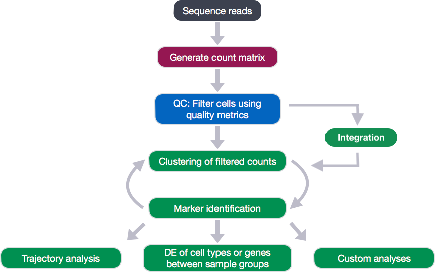
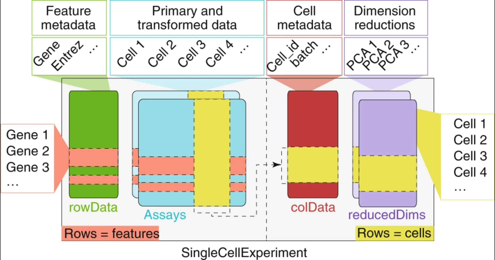
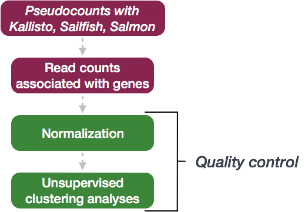
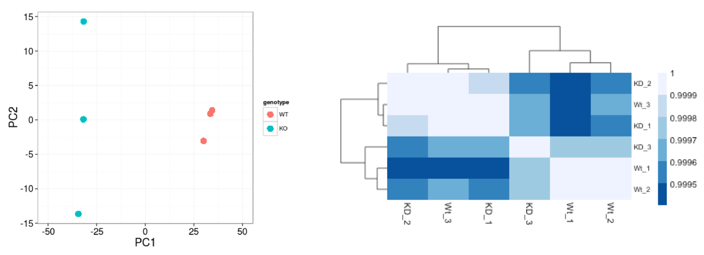
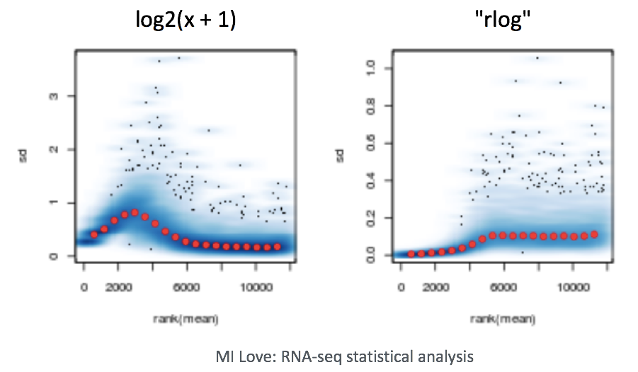

Approximate time: 90 minutes

## Learning Objectives:

* Understand how to prepare single-cell RNA-seq raw count data for differential expression analysis
* Utilize the DESeq2 tool to perform differential expression analysis a specific cell type cluster
* Create functions to iterate the differential expression analysis across different cell types

_The [2019 Bioconductor tutorial on scRNA-seq pseudobulk DE analysis](http://biocworkshops2019.bioconductor.org.s3-website-us-east-1.amazonaws.com/page/muscWorkshop__vignette/) was used as a fundamental resource for the development of this lesson. In particular, many of the data wrangling steps were derived from this tutorial._

# Differential expression analysis with DESeq2

<p align="center">

</p>

After identification of the cell type identities of the scRNA-seq clusters, we often would like to perform differential expression analysis between conditions within particular cell types. While functions exist within Seurat to perform this analysis, the p-values from these analyses are often inflated as each cell is treated as a sample. We know that single cells within a sample are not independent of each other, since they are isolated from the same animal/sample from the same environment. If we treat cells as samples, then we are not truly investigating variation across a population, but variation among an individual. Therefore, we could only make conclusions at the level of the individual, not the population. Usually, we want to infer which genes might be important for a condition at the population level (not the individual level), so we need our samples to be acquired from different organisms/samples, not different cells. To do this, the current best practice is using a pseudobulk approach, which involves the following steps:

1. Subsetting to the cells for the cell type(s) of interest to perform the DE analysis.
2. Extracting the raw counts after QC filtering to be used for the DE analysis
3. Aggregating the counts and metadata to the sample level. Need at least two biological replicates per condition to perform the analysis.
4. Performing the DE analysis

We will be using a the same dataset as what we had used for the rest of the workflow, but it has now been demultiplexed into the individual samples to use the replicates allowing for differential expression analysis. We will be importing it as a `SingleCellExperiment` object.

>_**NOTE:** To subset and extract the cells from a Seurat object, which we had created at the end of the single-cell analysis workflow, we could use code similar to that below:_
>
>```r
># Bring in Seurat object
>seurat <- readRDS("path/to/seurat.rds")
>
># Extract raw counts and metadata to create SingleCellExperiment object
>counts <- seurat@assays$RNA@counts 
>
>metadata <- seurat@meta.data
>
># Set up metadata as desired for aggregation and DE analysis
>metadata$cluster_id <- factor(seurat@active.ident)
>
># Create single cell experiment object
>sce <- SingleCellExperiment(assays = list(counts = counts), 
>                            colData = metadata)
>
># Identify groups for aggregation of counts
>groups <- colData(sce)[, c("cluster_id", "sample_id")]
```


## Exploring the dataset

For this workshop we will be working with the same single-cell RNA-seq dataset from [Kang et al, 2017](https://www.nature.com/articles/nbt.4042) that we had used for the rest of the single-cell RNA-seq analysis workflow. However, for differential expression analysis, we are using the non-pooled count data with eight control samples and eight interferon stimulated samples. This is in contrast to the rest of the scRNA-seq analysis that used the **pooled** Peripheral Blood Mononuclear Cells (PBMCs) taken from eight lupus patients, split into a single pooled control and a single pooled interferon-stimulated condition. 

_**NOTE:** You should always work with non-pooled samples from the beginning of the scRNA-seq workflow, if possible._

We acquired the raw counts dataset split into the individual eight samples from the ExperimentHub R package, as described [here](http://biocworkshops2019.bioconductor.org.s3-website-us-east-1.amazonaws.com/page/muscWorkshop__vignette/).


### Metadata

In addition to the raw data, we also need to collect **information about the data**; this is known as **metadata**. There is often a temptation to just start exploring the data, but it is not very meaningful if we know nothing about the samples that this data originated from.

Some relevant metadata for our dataset is provided below:

* The libraries were prepared using 10X Genomics version 2 chemistry
* The samples were sequenced on the Illumina NextSeq 500
* PBMC samples from eight individual lupus patients were separated into two aliquots each, then demultiplexed. 
  * One aliquot of PBMCs was activated by 100 U/mL of recombinant IFN-β for 6 hours. 
  * The second aliquot was left untreated. 
  * After 6 hours, the eight samples for each condition were pooled together in two final pools (stimulated cells and control cells). 
  * 12,138 and 12,167 cells were identified (after removing doublets) for control and stimulated pooled samples, respectively.
  * The samples were demultiplexed using the tool Demuxlet

* After clustering and marker identification, the following cell types were identified:
  * B cells
  * CD4 T cells
  * CD8 T cells
  * NK cells
  * FCGR3A+ Monocytes
  * CD14+ Monocytes
  * Dendritic cells
  * Megakaryocytes


## Setting up the R environment

To prepare for differential expression analysis, we need to set up the project and directory structure, load the necessary libraries and bring in the **raw count** single-cell RNA-seq gene expression data.


Open up RStudio and create a new R project entitled `DE_analysis_scrnaseq`. Then, create the following directories:

```
DE_analysis_scrnaseq/
├── data
├── results
└── figures
```

### Download data

**Right-click** the links below to download the RData object into the `data` folder:

- [scRNA-seq raw counts]()


### New script

Next, open a new Rscript file, and start with some comments to indicate what this file is going to contain:

```r
# May 2020

# Single-cell RNA-seq analysis - Pseudobulk DE analysis with DESeq2
```

Save the Rscript as `DE_analysis_scrnaseq.R`. Your working directory should look something like this:

<p align="center">

</p>


### Load libraries

After bringing in the raw counts data for a particular cell type, we will use tools from various packages to wrangle our data to the format needed, followed by aggregation of the raw counts across the single cells to the sample level. Then, we will use DESeq2 to perform the differential expression analysis across conditions of interest. To learn more about the DESeq2 method and deconstruction of the steps in the analysis, we have [additional materials available](https://hbctraining.github.io/DGE_workshop_salmon/schedule/).

Let's load the libraries that we will be using for the analysis.

```r
library(scater)
library(Seurat)
library(tidyverse)
library(cowplot)
library(Matrix.utils)
library(edgeR)
library(dplyr)
library(magrittr)
library(Matrix)
library(purrr)
library(reshape2)
library(S4Vectors)
library(tibble)
library(SingleCellExperiment)
library(pheatmap)
library(apeglm)
library(png)
library(DESeq2)
```

### Load the RData (RDS) object
  
The dataset that we are working with has been saved as an RData object to an RDS file. We can read it in using the `readRDS()` function.

```r 
sce <- readRDS("data/scRNA-seq_input_data_for_DE.rds")
```

The RData object is a single-cell experiment object, which is a type of specialized list, generated using the SingleCellExperiment package. These objects have the following structure:

<p align="center">

</p>

_**Image credit:** [Amezquita, R.A., Lun, A.T.L., Becht, E. et al. Orchestrating single-cell analysis with Bioconductor. Nat Methods 17, 137–145 (2020). https://doi-org.ezp-prod1.hul.harvard.edu/10.1038/s41592-019-0654-x](https://www.nature.com/articles/s41592-019-0654-x?draft=collection)_

We can use the functions from the SingleCellExperiment package to extract the different components. Let's explore the counts and metadata for the experimental data.

```r
# Explore the raw counts for the dataset

## Check the assays present
assays(sce)

## Explore the raw counts for the dataset
dim(counts(sce))

counts(sce)[1:6, 1:6]
```

We see the raw counts data is a cell by gene sparse matrix with over 35,000 rows (genes) and nearly 30,000 columns (cells). 

>_**NOTE:** We don't want to run `head()` on this dataset, since it will still show the thousands of columns, so we just looked at the first six rows and columns._

Next, we can get an idea of the metadata that we have for every cell.

```r
## Explore the cellular metadata for the dataset
dim(colData(sce))

head(colData(sce))
```

For every cell, we have information about the associated condition (ctrl or stim), sample ID, and cell type. We will use this information to perform the differential expression analysis between conditions for any particular cell type of interest.

## Acquiring necessary metrics for aggregation across cells in a sample

First, we need to determine the number of clusters and the cluster names present in our dataset.

```r
# Named vector of cluster names
kids <- purrr::set_names(levels(sce$cluster_id))
kids

# Total number of clusters
nk <- length(kids)
nk

# Named vector of sample names
sids <- purrr::set_names(levels(sce$sample_id))

# Total number of samples 
ns <- length(sids)
ns
```

To perform sample-level differential expression analysis, we need to generate sample-level metadata. To do this, we will reorder samples in the single cell metadata to match the

```r
# Generate sample level metadata

## Determine the number of cells per sample
table(sce$sample_id)

## Turn named vector into a numeric vector of number of cells per sample
n_cells <- as.numeric(table(sce$sample_id))

## Determine how to reoder the samples (rows) of the metadata to match the order of sample names in sids vector
m <- match(sids, sce$sample_id)

## Create the sample level metadata by combining the reordered metadata with the number of cells corresponding to each sample.
ei <- data.frame(colData(sce)[m, ], 
                  n_cells, row.names = NULL) %>% 
                select(-"cluster_id")
ei
```

Prior to performing the aggregation of cells to the sample level, we want to make sure that the poor quality cells are removed if this step hasn't already been performed. Generally, we would recommend a more stringent and hands-on exploration of the quality control metrics and more nuanced picking of filtering thresholds, as detailed [here](https://hbctraining.github.io/scRNA-seq/lessons/04_SC_quality_control.html); however, to proceed more quickly to the differential expression analysis, we are only going to remove count outliers and low count genes using functions from the `scater` package.

```r
# Perform QC if not already performed
dim(sce)

# Calculate quality control (QC) metrics
sce <- calculateQCMetrics(sce)

# Get cells w/ few/many detected genes
sce$is_outlier <- isOutlier(
        metric = sce$total_features_by_counts,
        nmads = 2, type = "both", log = TRUE)

# Remove outlier cells
sce <- sce[, !sce$is_outlier]
dim(sce)

## Remove lowly expressed genes which have less than 10 cells with any counts
sce <- sce[rowSums(counts(sce) > 1) >= 10, ]

dim(sce)
```

Now, we are ready for aggregation of counts to the sample level. Essentially, we are taking the sum of counts for each sample within each cell type.

## Count aggregation to sample level

```r
# Aggregate the counts per sample_id and cluster_id

# Subset metadata to only include the cluster and sample IDs to aggregate across
groups <- colData(sce)[, c("cluster_id", "sample_id")]

# Aggregate across cluster-sample groups
pb <- aggregate.Matrix(t(counts(sce)), 
                       groupings = groups, fun = "sum") 

class(pb)

dim(pb)

pb[1:6, 1:6]
```

The output of this aggregation is a sparse matrix, and when we take a quick look, we can see that it is a gene by cell type-sample matrix.

For example, within B cells, sample `ctrl101` has 12 counts associated with gene NOC2L. 

To perform DE analysis on a per cell type basis, we need to wrangle our data in a couple ways. We need to do the following steps:

1. Split our data by cell type
2. Transform the matrix so that the genes are the row names and the samples are the column names

We will split our data by cell type; however, not always do all samples contain cells of every cell type. To determine which samples are present for each cell type we can run the following:


```r
# Not every cluster is present in all samples; create a vector that represents how to split samples
splitf <- sapply(stringr::str_split(rownames(pb), 
                                    pattern = "_",  
                                    n = 2), 
                 `[`, 1)
```

Now we can turn the matrix into a list that is split into count matrices for each cluster, then transform each data frame so that rows are genes and columns are the samples.

```r
# Turn into a list and split the list into components for each cluster and transform, so rows are genes and columns are samples and make rownames as the sample IDs
pb <- split.data.frame(pb, 
                       factor(splitf)) %>%
        lapply(function(u) 
                set_colnames(t(u), 
                             stringr::str_extract(rownames(u), "(?<=_)[:alnum:]+")))

class(pb)

# Explore the different components of list
str(pb)

# Print out the table of cells in each cluster-sample group
options(width = 100)
table(sce$cluster_id, sce$sample_id)
```

## Differential gene expression with DESeq2

**We will be using [DESeq2](https://genomebiology.biomedcentral.com/articles/10.1186/s13059-014-0550-8) for the DE analysis, and the analysis steps with DESeq2 are shown in the flowchart below in green**. DESeq2 first normalizes the count data to account for differences in library sizes and RNA composition between samples. Then, we will use the normalized counts to make some plots for QC at the gene and sample level. The final step is to use the appropriate functions from the DESeq2 package to perform the differential expression analysis. We will go in-depth into each of these steps in the following lessons, but additional details and helpful suggestions regarding DESeq2 can be found in our materials detailing the workflow on [bulk RNA-seq data]() and the [DESeq2 vignette](http://bioconductor.org/packages/devel/bioc/vignettes/DESeq2/inst/doc/DESeq2.html).


### Sample-level metadata

To perform the DE analysis, we need metadata for all samples, including cluster ID, sample ID and the condition(s) of interest (`group_id`), in addition to any other sample-level metadata (e.g. batch, sex, age, etc.). The `ei` data frame holds the sample ID and condition information, but we need to combine this information with the cluster IDs.

First, we will create a vector of sample names combined for each of the cell type clusters.

```r
# prep. data.frame for plotting
get_sample_ids <- function(x){
        pb[[x]] %>%
                colnames()
}

de_samples <- map(1:length(kids), get_sample_ids) %>%
        unlist()
```

Then we can get the cluster IDs corresponding to each of the samples in the vector.

```r

samples_list <- map(1:length(kids), get_sample_ids)

get_cluster_ids <- function(x){
        rep(names(pb)[x], 
            each = length(samples_list[[x]]))
}

de_cluster_ids <- map(1:length(kids), get_cluster_ids) %>%
        unlist()
```

Finally, let's create a data frame with the cluster IDs and the corresponding sample IDs. We will merge together the condition information.

```r
gg_df <- data.frame(cluster_id = de_cluster_ids,
                    sample_id = de_samples)

gg_df <- left_join(gg_df, ei[, c("sample_id", "group_id")]) 


metadata <- gg_df %>%
        dplyr::select(cluster_id, sample_id, group_id) 
```

### Subsetting dataset to cluster(s) of interest

Now that we have the sample-level metadata, we can run the differential expression analysis with DESeq2. Oftentimes, we would like to perform the analysis on multiple different clusters, so we  can set up the workflow to run easily on any of our clusters.

To do this we can create a `clusters` vector of all of the cluster cell type IDs in our dataset. Then we can select the cell type we wish to perform the DE analysis on.

Let's take a look at the cluster cell type IDs:

```r
# Generate vector of cluster IDs
clusters <- levels(metadata$cluster_id)
clusters
```

```r
[1] "B cells"           "CD14+ Monocytes"   "CD4 T cells"       "CD8 T cells"      
[5] "Dendritic cells"   "FCGR3A+ Monocytes" "Megakaryocytes"    "NK cells"    
```

We see multiple different immune cell types in our dataset. Let's perform the DE analysis on B cells, which represent the first element in our vector. Let's extract the B cells from the vector:

```r
clusters[1]
```

We can use this output to run the DE analysis on the B cells. First we can subset the metadata and the counts to only the B cells.

```r
# Subset the metadata to only the B cells
cluster_metadata <- metadata[which(metadata$cluster_id == clusters[1]), ]
head(cluster_metadata)

# Assign the rownames of the metadata to be the sample IDs
rownames(cluster_metadata) <- cluster_metadata$sample_id
head(cluster_metadata)

# Subset the counts to only the B cells
counts <- pb[[clusters[1]]]

cluster_counts <- data.frame(counts[, which(colnames(counts) %in% rownames(cluster_metadata))])

# Check that all of the row names of the metadata are the same and in the same order as the column names of the counts in order to use as input to DESeq2
all(rownames(cluster_metadata) == colnames(cluster_counts))        
```

### Create DESeq2 object

Now we can create our DESeq2 object to prepare to run the DE analysis. We need to include the counts, metadata, and design formula for our comparison of interest. In the design formula we should also include any other columns in the metadata for which we want to regress out the variation (e.g. batch, sex, age, etc.). We only have our comparison of interest, which is stored as the `group_id` in our metadata data frame.

More information about the DESeq2 workflow and design formulas can be found in our [DESeq2 materials](https://hbctraining.github.io/DGE_workshop_salmon/schedule/).

```r         
dds <- DESeqDataSetFromMatrix(cluster_counts, 
                              colData = cluster_metadata, 
                              design = ~ group_id)
```


### Quality Control - sample level

The next step in the DESeq2 workflow is QC, which includes sample-level and gene-level steps to perform QC checks on the count data to help us ensure that the samples/replicates look good. 



A useful initial step in an RNA-seq analysis is to assess overall similarity between samples: 

- Which samples are similar to each other, which are different? 
- Does this fit the expectation from the experiment’s design? 
- What are the major sources of variation in the dataset?

To explore the similarity of our samples, we will be performing sample-level QC using Principal Component Analysis (PCA) and hierarchical clustering methods. Sample-level QC allows us to see how well our replicates cluster together, as well as, observe whether our experimental condition represents the major source of variation in the data. Performing sample-level QC can also identify any sample outliers, which may need to be explored further to determine whether they need to be removed prior to DE analysis. 



When using these unsupervised clustering methods, normalization and log2-transformation of the counts improves the distances/clustering for visualization. DESeq2 uses median of ratios method for count normalization and a **regularized log transform** (rlog) of the normalized counts for sample-level QC as it moderates the variance across the mean, improving the clustering.



>_**NOTE:** The [DESeq2 vignette](http://bioconductor.org/packages/devel/bioc/vignettes/DESeq2/inst/doc/DESeq2.html) suggests large datasets (100s of samples) to use the variance-stabilizing transformation (vst) instead of rlog for transformation of the counts, since the rlog function might take too long to run and the `vst()` function is faster with similar properties to rlog._


#### Principal component analysis

Principal Component Analysis (PCA) is a technique used to emphasize variation and bring out strong patterns in a dataset (dimensionality reduction). Details regarding PCA are given in our [additional materials](https://hbctraining.github.io/DGE_workshop_salmon/schedule/).

We can run the `rlog()` function from DESeq2 to normalize and rlog transform the raw counts. Then, we can use the `plotPCA()` function to plot the first two principal components.

```r
# Transform counts for data visualization
rld <- rlog(dds, blind=TRUE)

# Plot PCA

DESeq2::plotPCA(rld, intgroup = "group_id")
ggsave(paste0("results/", clusters[1], "_specific_PCAplot.png"))
```

We see a nice separation between our samples on PC1 by our condition of interest, which is great; this suggests that our condition of interest is the largest source of variation in our dataset. We also see some separation of the samples by PC2; however, it is uncertain what this might be due to since we lack additional metadata to explore.

#### Hierarchical clustering

Similar to PCA, hierarchical clustering is another, complementary method for identifying strong patterns in a dataset and potential outliers. The heatmap displays the correlation of gene expression for all pairwise combinations of samples in the dataset. Since the majority of genes are not differentially expressed, samples generally have high correlations with each other (values higher than 0.80). Samples below 0.80 may indicate an outlier in your data and/or sample contamination.

The hierarchical tree can indicate which samples are more similar to each other based on the normalized gene expression values. The color blocks indicate substructure in the data, and you would expect to see your replicates cluster together as a block for each sample group. Additionally, we expect to see samples clustered similar to the groupings observed in a PCA plot.


```r
# Extract the rlog matrix from the object and compute pairwise correlation values
rld_mat <- assay(rld)
rld_cor <- cor(rld_mat)

# Plot heatmap
png(paste0("results/", clusters[1], "_specific_heatmap.png"))

pheatmap(rld_cor, annotation = cluster_metadata[, c("group_id"), drop=F])

dev.off()
```

Now we determine whether we have any outliers that need removing or additional sources of variation that we might want to regress out in our design formula. Since we detected no outliers by PCA or hierarchical clustering, nor do we have any additional sources of variation to regress, we can proceed with running the differential expression analysis.

### Running DESeq2

Differential expression analysis with DESeq2 involves multiple steps as displayed in the flowchart below in blue. Briefly, DESeq2 will model the **raw counts**, using normalization factors (size factors) to account for differences in library depth. Then, it will estimate the gene-wise dispersions and shrink these estimates to generate more accurate estimates of dispersion to model the counts. Finally, DESeq2 will fit the negative binomial model and perform hypothesis testing using the Wald test or Likelihood Ratio Test. All of these steps are explained in detail in our [additional materials](https://hbctraining.github.io/DGE_workshop_salmon/schedule/).


All of these steps are performed by running the single `DESeq()` function on our DESeq2 object created earlier.

```r        
# Run DESeq2 differential expression analysis
dds <- DESeq(dds)
```

We can check the fit of the model to our data by looking at the plot of dispersion estimates. 

```r
# Plot dispersion estimates
plotDispEsts(dds)
```

The plot is encouraging, since we expect our dispersions to decrease with increasing mean and follow the line of best fit.

## Results

Now that we have performed the differential expression analysis, we can explore our results for a particular comparison. To denote our comparison of interest, we need to specify the contrast and perform shrinkage of the log2 fold changes. 

Let's compare the stimulated group relative to the control:

```r
# Output results of Wald test for contrast for stim vs ctrl

stim <- levels(cluster_metadata$group_id)[2]
ctrl <- levels(cluster_metadata$group_id)[1]

contrast <- c("group_id", stim, ctrl)

# resultsNames(dds)
res <- results(dds, 
               contrast = contrast,
               alpha = 0.05)

res <- lfcShrink(dds, 
                 contrast =  contrast,
                 res=res)
```

We will output our significant genes and perform a few different visualization techniques to explore our results:

- Table of results for all genes
- Table of results for significant genes (padj < 0.05)
- Scatterplot of normalized expression of top 20 most significant genes
- Heatmap of all significant genes
- Volcano plot of results

### Table of results for all genes

First let's generate the results table for all of our results:

```r
# Turn the results object into a tibble for use with tidyverse functions
res_tbl <- res %>%
        data.frame() %>%
        rownames_to_column(var="gene") %>%
        as_tibble()

write.csv(res_tbl,
          paste0("results/", clusters[1], "_", levels(cluster_metadata$sample)[2], "_vs_", levels(cluster_metadata$sample)[1], "_all_genes.csv"),
          quote = FALSE, 
          row.names = FALSE)
```
 
### Table of results for significant genes

Next, we can filter our table for only the significant genes using a p-adjusted threshold of 0.05
 
 ```r
 # Set thresholds
padj_cutoff <- 0.05

 # Subset the significant results
 sig_res <- dplyr::filter(res_tbl, padj < padj_cutoff) %>%
         dplyr::arrange(padj)
 
 write.csv(sig_res,
           paste0("results", clusters[1], "_", levels(cluster_metadata$sample)[2], "_vs_", levels(cluster_metadata$sample)[1], "_sig_genes.csv"),
          quote = FALSE, 
          row.names = FALSE)
```

### Scatterplot of normalized expression of top 20 most significant genes

Now that we have identified the significant genes, we can plot a scatterplot of the top 20 significant genes. This plot is a good check to make sure that we are interpreting our fold change values correctly, as well.

```r
## ggplot of top genes
normalized_counts <- counts(dds, 
                            normalized = TRUE)

## Order results by padj values
top20_sig_genes <- sig_res %>%
        dplyr::arrange(padj) %>%
        dplyr::pull(gene) %>%
        head(n=20)


top20_sig_norm <- data.frame(normalized_counts) %>%
        rownames_to_column(var = "gene") %>%
        dplyr::filter(gene %in% top20_sig_genes)

gathered_top20_sig <- top20_sig_norm %>%
        gather(colnames(top20_sig_norm)[2:length(colnames(top20_sig_norm))], key = "samplename", value = "normalized_counts")
        
gathered_top20_sig <- inner_join(ei[, c("sample_id", "group_id" )], gathered_top20_sig, by = c("sample_id" = "samplename"))

## plot using ggplot2
ggplot(gathered_top20_sig) +
        geom_point(aes(x = gene, 
                       y = normalized_counts, 
                       color = group_id), 
                   position=position_jitter(w=0.1,h=0)) +
        scale_y_log10() +
        xlab("Genes") +
        ylab("log10 Normalized Counts") +
        ggtitle("Top 20 Significant DE Genes") +
        theme_bw() +
        theme(axis.text.x = element_text(angle = 45, hjust = 1)) + 
        theme(plot.title = element_text(hjust = 0.5))


```

### Heatmap of all significant genes

We can also explore the clustering of the significant genes using the heatmap.

```r
# Extract normalized counts for only the significant genes
sig_norm <- data.frame(normalized_counts) %>%
        rownames_to_column(var = "gene") %>%
        dplyr::filter(gene %in% sig_res$gene)
        
# Set a color palette
heat_colors <- brewer.pal(6, "YlOrRd")

# Run pheatmap using the metadata data frame for the annotation
pheatmap(sig_norm[ , 2:length(colnames(sig_norm))], 
    color = heat_colors, 
    cluster_rows = T, 
    show_rownames = F,
    annotation = cluster_metadata, 
    border_color = NA, 
    fontsize = 10, 
    scale = "row", 
    fontsize_row = 10, 
    height = 20)        
```

### Volcano plot of results

```r
## Obtain logical vector where TRUE values denote padj values < 0.05 and fold change > 1.5 in either direction
res_table_thres <- res_tbl %>% 
                  mutate(threshold = padj < 0.05 & abs(log2FoldChange) >= 0.58)
                  
## Volcano plot
ggplot(res_table_thres) +
    geom_point(aes(x = log2FoldChange, y = -log10(padj), colour = threshold_OE)) +
    ggtitle("Volcano plot of stimulated B cells relative to control") +
    xlab("log2 fold change") + 
    ylab("-log10 adjusted p-value") +
    #scale_y_continuous(limits = c(0,50)) +
    theme(legend.position = "none",
          plot.title = element_text(size = rel(1.5), hjust = 0.5),
          axis.title = element_text(size = rel(1.25)))                    
```

***

# Useful scripts for running analyses on many different cell type clusters using Wald test for pairwise comparisons or Likelihood Ratio Test for multi-group comparisons

## Script to run DESeq2 on all cell type clusters - Wald test

The following script will run DESeq2 on all cell type clusters, while contrasting each level of the condition of interest to all other levels using the Wald test. This script can easily be run on the cluster for fast and efficient execution and storage of results.


```r
# Function to run DESeq2 and get results for all clusters
## x is index of cluster in clusters vector on which to run function
## A is the sample group to compare
## B is the sample group to compare against (base level)

get_dds_resultsAvsB <- function(x, A, B){
        cluster_metadata <- metadata[which(metadata$cluster_id == clusters[x]), ]
        rownames(cluster_metadata) <- cluster_metadata$sample_id
        counts <- pb[[clusters[x]]]
        cluster_counts <- data.frame(counts[, which(colnames(counts) %in% rownames(cluster_metadata))])
        
        #all(rownames(cluster_metadata) == colnames(cluster_counts))        
        
        dds <- DESeqDataSetFromMatrix(cluster_counts, 
                                      colData = cluster_metadata, 
                                      design = ~ group_id)
        
        # Transform counts for data visualization
        rld <- rlog(dds, blind=TRUE)
        
        # Plot PCA
        
        DESeq2::plotPCA(rld, intgroup = "sample")
        ggsave(paste0("results/", clusters[x], "_specific_PCAplot.png"))
        
        
        # Extract the rlog matrix from the object and compute pairwise correlation values
        rld_mat <- assay(rld)
        rld_cor <- cor(rld_mat)
        
        # Plot heatmap
        png(paste0("results/", clusters[x], "_specific_heatmap.png"))
        pheatmap(rld_cor, annotation = cluster_metadata[, c("sample"), drop=F])
        dev.off()
        
        # Run DESeq2 differential expression analysis
        dds <- DESeq(dds)
        
        # Plot dispersion estimates
        png(paste0("results/", clusters[x], "_dispersion_plot.png"))
        plotDispEsts(dds)
        dev.off()

        # Output results of Wald test for contrast for A vs B
        contrast <- c("sample", levels(cluster_metadata$sample)[A], levels(cluster_metadata$sample)[B])
        
        # resultsNames(dds)
        res <- results(dds, 
                       contrast = contrast,
                       alpha = 0.05)
        
        res <- lfcShrink(dds, 
                         contrast =  contrast,
                         res=res)
        # Set thresholds
        padj_cutoff <- 0.05
        
        # Turn the results object into a tibble for use with tidyverse functions
        res_tbl <- res %>%
                data.frame() %>%
                rownames_to_column(var="gene") %>%
                as_tibble()
        
        write.csv(res_tbl,
                  paste0("DESeq2/pairwise/", clusters[x], "_", levels(cluster_metadata$sample)[A], "_vs_", levels(cluster_metadata$sample)[B], "_all_genes.csv"),
                  quote = FALSE, 
                  row.names = FALSE)
        
        # Subset the significant results
        sig_res <- dplyr::filter(res_tbl, padj < padj_cutoff) %>%
                dplyr::arrange(padj)
        
        write.csv(sig_res,
                  paste0("DESeq2/pairwise/", clusters[x], "_", levels(cluster_metadata$sample)[A], "_vs_", levels(cluster_metadata$sample)[B], "_sig_genes.csv"),
                  quote = FALSE, 
                  row.names = FALSE)
        
        ## ggplot of top genes
        normalized_counts <- counts(dds, 
                                    normalized = TRUE)
        
        ## Order results by padj values
        top20_sig_genes <- sig_res %>%
                dplyr::arrange(padj) %>%
                dplyr::pull(gene) %>%
                head(n=20)
        
        
        top20_sig_norm <- data.frame(normalized_counts) %>%
                rownames_to_column(var = "gene") %>%
                dplyr::filter(gene %in% top20_sig_genes)
        
        gathered_top20_sig <- top20_sig_norm %>%
                gather(colnames(top20_sig_norm)[2:length(colnames(top20_sig_norm))], key = "samplename", value = "normalized_counts")
        
        gathered_top20_sig <- inner_join(ei[, c("sample_id", "sample" )], gathered_top20_sig, by = c("sample_id" = "samplename"))
        
        ## plot using ggplot2
        ggplot(gathered_top20_sig) +
                geom_point(aes(x = gene, 
                               y = normalized_counts, 
                               color = sample), 
                           position=position_jitter(w=0.1,h=0)) +
                scale_y_log10() +
                xlab("Genes") +
                ylab("log10 Normalized Counts") +
                ggtitle("Top 20 Significant DE Genes") +
                theme_bw() +
                theme(axis.text.x = element_text(angle = 45, hjust = 1)) + 
                theme(plot.title = element_text(hjust = 0.5))
        ggsave(paste0("DESeq2/pairwise/", clusters[x], "_", levels(cluster_metadata$sample)[A], "_vs_", levels(cluster_metadata$sample)[B], "_top20_DE_genes.png"))
        
}
#map(1:1, get_dds_resultsAvsB, A = 4, B = 3)

map(1:length(clusters), get_dds_resultsAvsB, A = 4, B = 3)
map(1:length(clusters), get_dds_resultsAvsB, A = 4, B = 2)
map(1:length(clusters), get_dds_resultsAvsB, A = 4, B = 1)
map(1:length(clusters), get_dds_resultsAvsB, A = 3, B = 2)
map(1:length(clusters), get_dds_resultsAvsB, A = 3, B = 1)
map(1:length(clusters), get_dds_resultsAvsB, A = 2, B = 1)
```

## Script to run DESeq2 on all cell type clusters - Likelihood Ratio Test

The following script will run the DESeq2 Likelihood Ratio Test (LRT) on all cell type clusters. This script can easily be run on the cluster for fast and efficient execution and storage of results.


```r
# Likelihood ratio test

# Create DESeq2Dataset object
clusters <- levels(metadata$cluster_id)

metadata <- gg_df %>%
        select(cluster_id, sample_id, sample) 

metadata$group <- paste0(metadata$cluster_id, "_", metadata$sample) %>%
        factor()


# DESeq2
library(DEGreport)
get_dds_LRTresults <- function(x){
        
        cluster_metadata <- metadata[which(metadata$cluster_id == clusters[x]), ]
        rownames(cluster_metadata) <- cluster_metadata$sample_id
        counts <- pb[[clusters[x]]]
        cluster_counts <- data.frame(counts[, which(colnames(counts) %in% rownames(cluster_metadata))])
        
        #all(rownames(cluster_metadata) == colnames(cluster_counts))        
        
        dds <- DESeqDataSetFromMatrix(cluster_counts, 
                                      colData = cluster_metadata, 
                                      design = ~ sample)
        
        dds_lrt <- DESeq(dds, test="LRT", reduced = ~ 1)
        
        # Extract results
        res_LRT <- results(dds_lrt)
        
        # Create a tibble for LRT results
        res_LRT_tb <- res_LRT %>%
                data.frame() %>%
                rownames_to_column(var="gene") %>% 
                as_tibble()
        
        # Save all results
        write.csv(res_LRT_tb,
                  paste0("DESeq2/lrt/", clusters[x], "_LRT_all_genes.csv"),
                  quote = FALSE, 
                  row.names = FALSE)
        
        # Subset to return genes with padj < 0.05
        sigLRT_genes <- res_LRT_tb %>% 
                filter(padj < 0.05)
        
        # Save sig results
        write.csv(sigLRT_genes,
                  paste0("DESeq2/lrt/", clusters[x], "_LRT_sig_genes.csv"),
                  quote = FALSE, 
                  row.names = FALSE)
        
        # Transform counts for data visualization
        rld <- rlog(dds_lrt, blind=TRUE)
        
        # Extract the rlog matrix from the object and compute pairwise correlation values
        rld_mat <- assay(rld)
        rld_cor <- cor(rld_mat)
        
        
        # Obtain rlog values for those significant genes
        cluster_rlog <- rld_mat[sigLRT_genes$gene, ]
        
        cluster_meta_sig <- cluster_metadata[which(rownames(cluster_metadata) %in% colnames(cluster_rlog)), ]
        
        # # Remove samples without replicates
        # cluster_rlog <- cluster_rlog[, -1]
        # cluster_metadata <- cluster_metadata[which(rownames(cluster_metadata) %in% colnames(cluster_rlog)), ]
        
        
        # Use the `degPatterns` function from the 'DEGreport' package to show gene clusters across sample groups
        cluster_groups <- degPatterns(cluster_rlog, metadata = cluster_meta_sig, time = "sample", col=NULL)
        ggsave(paste0("DESeq2/lrt/", clusters[x], "_LRT_DEgene_groups.png"))
        
        # Let's see what is stored in the `df` component
        write.csv(cluster_groups$df,
                  paste0("DESeq2/lrt/", clusters[x], "_LRT_DEgene_groups.csv"),
                  quote = FALSE, 
                  row.names = FALSE)
        
        saveRDS(cluster_groups, paste0("DESeq2/lrt/", clusters[x], "_LRT_DEgene_groups.rds"))
        save(dds_lrt, cluster_groups, res_LRT, sigLRT_genes, file = paste0("DESeq2/lrt/", clusters[x], "_all_LRTresults.Rdata"))
        
}

map(1:2, get_dds_LRTresults)
```
