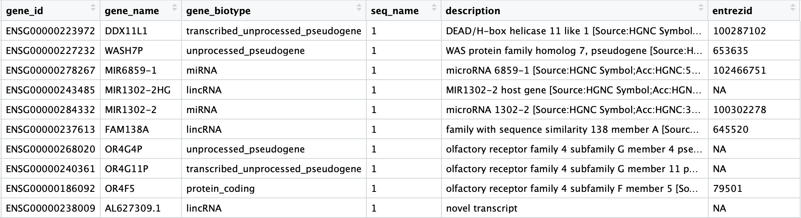

Approximate time: 90 minutes

## Learning Objectives:

* Understand how to bring in data from single-cell RNA-seq experiments
* Construct QC metrics and associated plots to visually explore the quality of the data
* Evaluate the QC metrics and set filters to remove low quality cells

# Single-cell RNA-seq: Quality control


<p align="center">

</p>

***

Each step of this workflow has its own goals and challenges. For QC of our raw count data, they include:

_**Goals:**_ 
 
 - _To **filter the data to only include true cells that are of high quality**, so that when we cluster our cells it is easier to identify distinct cell type populations_
 - _To **identify any failed samples** and either try to salvage the data or remove from analysis, in addition to, trying to understand why the sample failed_

_**Challenges:**_
 
 - _Delineating cells that are **poor quality from less complex cells**_
 - _Choosing appropriate thresholds for filtering, so as to **keep high quality cells without removing biologically relevant cell types**_

_**Recommendations:**_
 
 - _Have a good idea of your expectations for the **cell types to be present** prior to performing the QC. For instance, do you expect to have low complexity cells or cells with higher levels of mitochondrial expression in your sample? If so, then we need to account for this biology when assessing the quality of our data._

***

## Exploring the example dataset

For this workshop we will be working with a single-cell RNA-seq dataset which is part of a larger study from [Kang et al, 2017](https://www.nature.com/articles/nbt.4042). In this paper, the authors present a a computational algorithm that harnesses genetic variation (eQTL) to determine the genetic identity of each droplet containing a single cell (singlet) and identify droplets containing two cells from different individuals (doublets).

The data used to test their algorithm and is comprised of **pooled Peripheral Blood Mononuclear Cells (PBMCs) taken from eight lupus patients split into control and interferon beta-treated conditions**. 


### Raw data

This dataset is available on GEO ([GSE96583](https://www.ncbi.nlm.nih.gov/geo/query/acc.cgi?acc=GSE96583)), however the available counts matrix lacked mitochondrial reads, so we downloaded the BAM files from the SRA ([SRP102802](https://www-ncbi-nlm-nih-gov.ezp-prod1.hul.harvard.edu/sra?term=SRP102802)). These BAM files were converted back to FASTQ files, then run through Cell Ranger to obtain the count data that we will be using. 

> **NOTE:**  This dataset is also freely available from 10X Genomics and is used as part of the [Seurat tutorial](https://satijalab.org/seurat/v3.0/immune_alignment.html). 

### Metadata

In addition to the raw data we also need to collect **information about the data**; this is known as metadata. We are usually quick to start exploring our data, but how useful is it if we know nothing about the samples that this data originated from? 

Some relevant metadata for our dataset is provided below:

* The libraries were prepared using 10X Genomics version 2 chemistry
* The samples were sequenced on the Illumina NextSeq 500
* PBMC samples from eight individual lupus patients were separated into two aliquots each. One aliquot of PBMCs was activated by 100 U/mL of recombinant IFN-β for 6 hours. The second aliquot was left untreated. After 6 hours, the eight samples for each condition were pooled together in two final pools (stimulated cells and control cells).

* Since the samples are PBMCs, we will expect immune cells, such as:
  * B cells
  * T cells
  * NK cells
  * monocytes
  * macrophages
  * possibly megakaryocytes

None of these cell types are low complexity or anticipated to have high mitochondrial content.


## Setting up the R environment

One of the most important parts of research that involves large amounts of data, is how best to manage it. We tend to prioritize the analysis, but there are many other important aspects of **data management that are often overlooked** in the excitement to get a first look at new data. The [HMS Data Management Working Group](https://datamanagement.hms.harvard.edu/hms-data-management-working-group), discusses in-depth some things to consider beyond the data creation and analysis.

One important aspect of data management is organization. For each experiment you work on and analyze data for, it is considered best practice to get organized by creating **a planned storage space (directory structure)**. We will do that for our single-cell analysis. 

Create a new R project entitled `single_cell_rnaseq`. Then, create the following directories:

```
single_cell_rnaseq/
├── data
├── results
└── figures

```

### Download data

**Right-click** the links below to download the output folders from Cell Ranger for each sample into the `data` folder:

- [Control sample](https://www.dropbox.com/sh/73drh0ipmzfcrb3/AADMlKXCr5QGoaQN13-GbeKSa?dl=1)
- [Stimulated sample](https://www.dropbox.com/sh/cii4j356moc08w5/AAC2c3jfvh2hHWPmEaVsZKRva?dl=1) 

Finally, create an Rscript and type the following note:

```r
# Single-cell RNA-seq analysis - QC
```

Save the Rscript as `quality_control.R`. Your working directory should look something like this:

<p align="center">

</p>

### Loading libraries 

Now, we can load the necessary libraries:

```r
# Load libraries
library(Matrix.utils)
library(SingleCellExperiment)
library(Seurat)
library(knitr)
library(rmarkdown)
library(tidyverse)
library(Matrix)
library(AnnotationHub)
library(ensembldb)
library(scales)
```

## Loading single-cell RNA-seq count data 

Regardless of the technology or pipeline used to process your single-cell RNA-seq sequence data, the output will generallu be the same. That is, for each individual sample you will have the following **three files**:

1. a file with the **gene IDs**, representing all genes quantified
2. a file with the **cell IDs**, representing all cells quantified
3. a **matrix of counts** per gene for every cell


We can explore these files in our own dataset by clicking on the `data/ctrl_raw_feature_bc_matrix` folder:

### `barcodes.tsv` 
This is a text file which contains all cellular barcodes present for that sample. Barcodes are listed in the order of data presented in the matrix file (i.e. these are the column names). 

  <p align="center">
  
  </p>
  

### `genes.tsv`
This is a text file which contains the identifiers of the quantified genes. The source of the identifier can vary depending on what reference (i.e. Ensembl, NCBI, UCSC) you use in the quantification methods, but most often these are official gene symbols. The order of these genes corresponds to the order of the rows in the matrix file (i.e. these are the row names).

  <p align="center">
  
  </p>


### `matrix.mtx`
This is a text file which contains a matrix of count values. The rows are associated with the gene IDs above and columns correspond to the cellular barcodes. Note that there are **many zero values** in this matrix.

  <p align="center">
  
  </p>


Loading this data into R **requires us to use functions that allow us to efficiently combine these three files into a single count matrix.*** However, instead of creating a standard count matrix, we will create a **sparse matrix** to improve the amount of space, memory and CPU required to work with our huge count matrix. 

In this workshop we will discuss two different methods for reading in data:

1. **`readMM()`**: This function is from the **Matrix** package and will turn our standard matrix into a sparse matrix. The `genes.tsv` file and `barcodes.tsv` must first be individually loaded into R and then they are combined. For specific code and instructions on how to do this please see [our additional material]().
2. **`Read10X()`**: This function is from the **Seurat** package and will use the Cell Ranger output directory as input. In this way individual files do not need to be loaded in, instead the function will load and combine them into a sparse matrix for you. *We will be using this function to load in our data!*


### Reading in a single sample (`read10X()`)

When working with 10X data and it's proprietary software Cell Ranger, you will always have an `outs` directory. Within this directory you will find a number of different files including:

- **`web_summary.html`:** report that explores different QC metrics, including the mapping metrics, filtering thresholds, estimated number of cells after filtering, and information on the number of reads and genes per cell after filtering.
- **BAM alignment files:** files used for visualization of the mapped reads and for re-creation of FASTQ files, if needed
- **`filtered_feature_bc_matrix`:** folder containing all files needed to construct the count matrix using data filtered by Cell Ranger
- **`raw_feature_bc_matrix`:** folder containing all files needed to construct the count matrix using the raw unfiltered data

We are mainly interested in the `raw_feature_bc_matrix` as we wish to perform our own QC and filtering while accounting about the biology of our experiment.

If we had a single sample, we could generate the count matrix and then subsequently create a Seurat object:

```r
# How to read in 10X data for a single sample
ctrl_counts <- Read10X(data.dir = "data/ctrl_raw_feature_bc_matrix")

# Turn count matrix into a Seurat object
ctrl <- CreateSeuratObject(counts = ctrl_counts,
                           min.features = 100)
```

> **NOTE**: The `min.features` argument specifies the minimum number of genes that need to be detected per cell. This argument will filter out poor quality cells that likely just have random barcodes encapsulated without any cell present. We would not be interested in analyzing any cells with less than 100 genes detected.


### Reading in multiple samples with a `for loop`

A `for loop` interates over a series of commands for each of the inputs given. In R, it has the structure:

```r
for (variable in input){
	command1
	command2
	command3
}
```

The `for loop` we plan to use will iterate over our two samples (`input`) and execute two commands for each sample (read in the count data and create a Seurat objects):

```r
# Create each individual Seurat object for every sample
for (file in c("ctrl_raw_feature_bc_matrix", "stim_raw_feature_bc_matrix")){
        seurat_data <- Read10X(data.dir = paste0("data/", file))
        seurat_obj <- CreateSeuratObject(counts = seurat_data, 
                                         min.features = 100, 
                                         project = file)
        sample <- file
        assign(sample, seurat_obj)
}
```

Now, let's break down the `for loop` to describe the different steps:

#### Step 1: Specify inputs

For our experiment, we have two samples that we would like to read into R using the `Read10X()` function:

- `ctrl_raw_feature_bc_matrix` 
- `stim_raw_feature_bc_matrix`

We can specify these samples in the *input* part for our `for loop`. The *variable* we can call anything we would like, just try to make it intuitive. In this example, we called the *variable* `file`:

```r
# Create each individual Seurat object
for (file in c("ctrl_raw_feature_bc_matrix", "stim_raw_feature_bc_matrix")){
```

#### Step 2: Create command to read in data for the input

We can continue our `for loop` by:

- Creating a variable with the name of our sample called `sample`. We will be using this variable for naming purposes downstream. 
- Using the path to the files for input to the `Read10X()` function. We need to specify the path to the file, so we will prepend the `data/` directory to our sample folder name using the `paste0()` function.

```r
# Create each individual Seurat object
for (file in c("ctrl_raw_feature_bc_matrix", "stim_raw_feature_bc_matrix")){
        seurat_data <- Read10X(data.dir = paste0("data/", file))
```

#### Step 3: Create Seurat object from the 10X data

Now, we can create the Seurat object by using the `CreateSeuratObject()` function, adding in the argument `project`, where we can add the sample name into the `orig.ident` slot of the metadata.

```r
for (file in c("ctrl_raw_feature_bc_matrix", "stim_raw_feature_bc_matrix")){
        seurat_data <- Read10X(data.dir = paste0("data/", file))
        seurat_obj <- CreateSeuratObject(counts = seurat_data, 
                                         min.features = 100, 
                                         project = file)        
```

#### Step 4: Assign Seurat object to a new variable based on sample

The last command assigns the Seurat object created (`seurat_obj`) to a variable called by the sample name (`sample`). We need to assign the Seurat object to a variable with a new name, otherwise we would overwrite our `seurat_obj` every iteration through the loop.

```r
for (file in c("ctrl_raw_feature_bc_matrix", "stim_raw_feature_bc_matrix")){
        seurat_data <- Read10X(data.dir = paste0("data/", file))
        seurat_obj <- CreateSeuratObject(counts = seurat_data, 
                                         min.features = 100, 
                                         project = file)        
        sample <- file
        assign(sample, seurat_obj)
}
```

Now that we have our Seurat objects for each sample, we need to merge them together to run QC on them at the same time. We can use the `merge()` function to do this:

```r
# Create a merged Seurat object
merged_seurat <- merge(x = ctrl_raw_feature_bc_matrix, 
                       y = stim_raw_feature_bc_matrix, 
                       add.cell.id = c("ctrl", "stim"))
```

Because the same cell IDs are used for different samples, we add a sample-specific prefix to each of our cell IDs using the `add.cell.id` argument. Let's take a look at the metadata:

```r
# Explore merged metadata
View(merged_seurat@meta.data)
```

<p align="center">

</p>

You should see each cell has a `ctrl_` or `stim_` prefix and an `orig.ident` matching the sample.

Now, we need to extract the counts for this merged object:

```r
# Extract counts for merged data
counts <- GetAssayData(object = merged_seurat, slot = "counts")

```

## Obtaining quality metrics for assessment

Throughout the analysis workflow post-QC, we will rely heavily on the Seurat package; however, **Seurat doesn't have all of the functions for exploring the QC in depth**. Therefore, we will perform our own quality assessment outside of Seurat.

### Creating metadata object with some QC metrics

Now that we have a counts matrix with the genes as row names and cells as columns, we can create our metadata with information about the different metrics to evaluate during quality control assessment.

We will create the metadata dataframe by extracting the `meta.data` slot from the Seurat object: 

```r
# Create metadata containing only the cell IDs
metadata <- merged_seurat@meta.data
```

This should contain information about the sample (`orig.ident`), number of UMIs (`nCount_RNA`), and number of genes detected (`nFeature_RNA`) for each cell. We can add metrics to this object for QC purposes.

First, let's add a column with our cell IDs and change the column names to be more intuitive:

```r
# Add cell IDs to metadata
metadata$cells <- rownames(metadata)

# Rename columns
metadata <- metadata %>%
        dplyr::rename(seq_folder = orig.ident,
                      nUMI = nCount_RNA,
                      nGene = nFeature_RNA)
```

Now, let's get sample names for each of the cells based on the cell prefix:

```r
# Create sample column
metadata$sample <- NA
metadata$sample[which(str_detect(metadata$cells, "^ctrl_"))] <- "ctrl"
metadata$sample[which(str_detect(metadata$cells, "^stim_"))] <- "stim"
```

Now we need to calculate some metrics for plotting:

- **number of genes detected per UMI:** this metric with give us an idea of the complexity of our dataset (more genes detected per UMI, more complex our data)
- **mitochondrial ratio:** this metric will give us a percentage of cell reads originating from the mitochondrial genes

The number of genes per UMI for each cell is quite easy to calculate, and we will log10 transform the result for better comparison between samples.

```r
# Add number of UMIs per gene for each cell to metadata
metadata$log10GenesPerUMI <- log10(metadata$nGene) / log10(metadata$nUMI)
```

The determination of mitochondrial ratios is a bit more complex and requires us to use genome annotations to determine which genes originated from the mitochondrial DNA.

### Using annotation file to generate mitochondrial count metrics

We will be using [AnnotationHub](https://bioconductor.org/packages/release/bioc/vignettes/AnnotationHub/inst/doc/AnnotationHub.html), which allows accession to a wide variety of online databases and other resources, to query Ensembl annotations made available through [ensembldb](https://bioconductor.org/packages/release/bioc/vignettes/ensembldb/inst/doc/ensembldb.html). Ensembldb is a package that retrieves annotation for the databases directly from Ensembl.

### Downloading database for organism of interest

To access the various annotations available from Ensembl for human, we need to first connect to AnnotationHub, then specify the organism and database we are interested in.
 
```r
# Connect to AnnotationHub
ah <- AnnotationHub()

# Access the Ensembl database for organism
ahDb <- query(ah, 
              pattern = c("Homo sapiens", "EnsDb"), 
              ignore.case = TRUE)

```

Next, we acquire the latest annotation files from this Ensembl database. 

We can first check which annotation versions are available:

```r
# Check versions of databases available
ahDb %>% 
  mcols()
```

Since we want the most recent, we will return the AnnotationHub ID for this database:

```r
# Acquire the latest annotation files
id <- ahDb %>%
  mcols() %>%
  rownames() %>%
  tail(n = 1)
```
  
Finally, we can use the AnnotationHub connection to download the appropriate Ensembl database, which should be version GRCh38.92.

```r
# Download the appropriate Ensembldb database
edb <- ah[[id]]
```

And to extract gene-level information we can use the Ensembldb function `genes()` to return a data frame of annotations.

```r
# Extract gene-level information from database
annotations <- genes(edb, 
                     return.type = "data.frame")                
```

### Exracting IDs for mitochondrial genes

We aren't interested in all of the information present in this `annotations` file, so we are going to extract that which is useful to us.

```r
# Select annotations of interest
annotations <- annotations %>%
  dplyr::select(gene_id, gene_name, gene_biotype, seq_name, description, entrezid)
                         
View(annotations)    
```

<p align="center">

</p>

Now we can retrieve the genes associated with the different biotypes of interest:

```r
# Extract IDs for mitochondrial genes
mt <- annotations %>%
        dplyr::filter(seq_name == "MT") %>%
        dplyr::pull(gene_name)
```

### Adding metrics to metadata

Now that we have information about which genes are mitochondrial, we can quanitify whether we have contamination.

```r
# Number of UMIs assigned to mitochondrial genes
metadata$mtUMI <- Matrix::colSums(counts[which(rownames(counts) %in% mt),], na.rm = T)

# Calculate of mitoRatio per cell
metadata$mitoRatio <- metadata$mtUMI/metadata$nUMI
```

Now you are **all setup with the metrics you need to assess the quality of your data**! Your final metadata table will have rows that correspond to each cell, and columns with information about those cells:

<p align="center">

</p>


### Saving metrics to single cell experiment 

Before we assess our metrics we are going to save all of the work we have done thus far to a single cell experiment object, which is a standard object for single cell data in R.

```r
# Save data to single cell experiment variable
se <- SingleCellExperiment(assays=list(counts=counts), 
                           colData = metadata)
                           
# Create .RData object to load at any time
saveRDS(se, "data/raw_se.rds")
```

## Assessing the quality metrics

Now that we have generated the various metrics to assess, we can explore them with visualizations. We will create our metrics file from the metadata stored in the single cell experiments.

```r
# Create a data frame containing the metrics for visualizations
metrics <- colData(se) %>%
  as.data.frame
```

We will explore the following metrics through visualizations to decide on which cells are low quality and should be removed from the analysis:

- Cell counts
- UMI counts per cell
- Genes detected per cell
- UMIs vs. genes detected
- Mitochondrial counts ratio
- Novelty


### Cell counts

The cell counts are determined by the number of unique cellular barcodes detected. 

You expect the number of unique cellular barcodes to be around the number of sequenced cells or greater. In single-cell protocols using hydrogels, like inDrops, some hydrogels may have more than one cellular barcode (see details in note below). After we remove the low quality cells by filtering, we will expect the number of cells to be at or a bit below the number of sequenced cells.

> **NOTE:** During the **inDrops** protocol, the cellular barcodes are present in the hydrogels, which are encapsulated in the droplets with a single cell and lysis/reaction mixture. Upon treatment of UV and cell lysis, all components mix together inside the droplet and reverse transcription proceeds, followed by droplet breakup and linear amplification for library preparation. While each hydrogel should have a single cellular barcode associated with it, occasionally a hydrogel can have more than one cellular barcode. We often see all possible combinations of cellular barcodes at a low level, leading to a higher number of cellular barcodes than cells.

```r
# Visualize the number of cell counts per cell
metrics %>% 
  ggplot(aes(x=sample, fill=sample)) + 
  geom_bar() + 
  ggtitle("NCells")
```


<p align="center">

</p>


### UMI counts (transcripts) per cell

The UMI counts per cell should generally be above 500, although usable, it's still low if between 500-1000 counts. If UMIs per cell is 500-1000 counts, then the cells probably should have been sequenced more deeply. 

```r
# Visualize the number UMIs/transcripts per cell
metrics %>% 
        ggplot(aes(color=sample, x=nUMI, fill= sample)) + 
        geom_density(alpha = 0.2) + 
        scale_x_log10() + 
        ylab("log10 cell density") +
        geom_vline(xintercept = 500)
```

<p align="center">

</p>
   
### Genes detected per cell

Seeing gene detection in the range of 500-5000 is normal for **inDrop** analysis. Similar expectations for gene detection as for UMI detection, although may be a bit lower than UMIs.

```r
# Visualize the distribution of genes detected per cell via histogram
metrics %>% 
        ggplot(aes(color=sample, x=nGene, fill= sample)) + 
        geom_density(alpha = 0.2) + 
        scale_x_log10() + 
        geom_vline(xintercept = 200)

# Visualize the distribution of genes detected per cell via boxplot
metrics %>% 
        ggplot(aes(x=sample, y=log10(nGene), fill=sample)) + 
        geom_boxplot() + 
        ggtitle("NCells vs NGenes")
```

<p align="center">

</p>

<p align="center">

</p>

### UMIs vs. genes detected

Poor quality cells are likely to have low genes and UMIs per cell. Therefore, a poor sample is likely to have cells in the lower left of the graph. Good cells should exhibit both higher number of genes per cell and higher numbers of UMIs. We also expect similar lines with similar slopes for all samples.

```r
# Visualize the correlation between genes detected and number of UMIs and determine whether strong presence of cells with low numbers of genes/UMIs
metrics %>% 
        ggplot(aes(x=nUMI, y=nGene, color=mitoRatio)) + 
        geom_point() + 
        stat_smooth(method=lm) +
        scale_x_log10() + 
        scale_y_log10() + 
        geom_vline(xintercept = 500) +
        geom_hline(yintercept = 250) +
        facet_wrap(~sample)
```

<p align="center">

</p>

### Mitochondrial counts ratio

This metric can identify whether there is a large amount of mitochondrial contamination from dead or dying cells. Poor quality samples for mitochondrial counts would have larger peaks above the 0.1 mitochondrial ratio mark, unless it is expected based on sample type.

```r
# Visualize the distribution of mitochondrial gene expression detected per cell
metrics %>% 
        ggplot(aes(color=sample, x=mitoRatio, fill=sample)) + 
        geom_density(alpha = 0.2) + 
        scale_x_log10() + 
        geom_vline(xintercept = 0.1)
```
<p align="center">

</p>

### Novelty

We can see the samples where we sequenced each cell less have a higher overall novelty, that is because we have not started saturating the sequencing for any given gene for these samples. Outlier cells in these samples might be cells that have a less complex RNA species than other cells. Sometimes we can detect contamination with low complexity cell types like red blood cells via this metric. Generally, we expect the novelty score to be above 0.80.

```r
# Visualize the overall novelty of the gene expression by visualizing the genes detected per UMI
metrics %>%
        ggplot(aes(x=log10GenesPerUMI, color = sample, fill=sample)) +
        geom_density(alpha = 0.2)
```

<p align="center">

</p>

> **NOTE:** **Reads per cell** is another metric that can be useful to explore; however, the workflow used would need to save this information to assess. Generally, with this metric you hope to see all of the samples with peaks in relatively the same location between 10,000 and 100,000 reads per cell. 

## Filtering

Now that we have visualized the various metrics, we can decide on the thresholds to use to remoe the low quality. Often the recommendations mentioned earlier are a rough guideline, but the specific experiment needs to inform the exact thresholds chosen. We will use the following thresholds:

- nUMI > 500
- nGene > 250
- log10GenesPerUMI > 0.8
- mitoRatio < 0.2

```r
# Filter out low quality reads using selected thresholds - these will change with experiment
keep_cells <- metrics %>%
  dplyr::filter(nUMI >= 500 , 
                nGene >= 250,
                log10GenesPerUMI > 0.8,
                mitoRatio < 0.2,
                ) %>% 
  pull(cells)

# Subset the cells to only include those that meet the thresholds specified
se_c <- se[ ,keep_cells]

# Output a logical vector for every gene on whether the more than zero counts per cell
nonzero <- counts(se_c) > 0L

# Sums all TRUE values and returns TRUE if more than 10 TRUE values per gene
keep_genes <- rowSums(as.matrix(nonzero)) >= 10

# Only keeping those genes expressed in more than 10 cells
se_c <- se_c[keep_genes, ]

# Save subset to new metrics variable
metrics_clean <- colData(se_c) %>%
 as.data.frame()
```

## Re-assess QC metrics

After performing the filtering, it's recommended to look back over the metrics to make sure that your data matches your expectations and is good for downstream analysis.

### Cell counts

After filtering, we should not have more cells than we sequenced. Generally we aim to have about the number we sequenced or a bit less. With 2,700 cells sequenced, we would expect to return around this number of cells. We have about 2,480 returned after filtering, which is pretty good. 

```r
## Cell counts
metrics_clean %>% 
        ggplot(aes(x=sample, fill=sample)) + 
        geom_bar() + 
        theme(axis.text.x = element_text(angle = 45, vjust = 1, hjust=1)) +
        ggtitle("NCells")
```

<p align="center">

</p>


### UMI counts

The filtering using a threshold of 500 has removed the cells with low numbers of UMIs from the analysis.

```r
# UMI counts
metrics_clean %>% 
        ggplot(aes(color=sample, x=nUMI, fill= sample)) + 
        geom_density(alpha = 0.2) + 
        scale_x_log10() + 
        ylab("log10 cell density") +
        geom_vline(xintercept = 500)
```

<p align="center">

</p>


### Genes detected

```r
# Genes detected
metrics_clean %>% 
        ggplot(aes(color=sample, x=nGene, fill= sample)) + 
        geom_density(alpha = 0.2) + 
        scale_x_log10() + 
        geom_vline(xintercept = 250)
```

<p align="center">

</p>

### UMIs vs genes
```r
# UMIs vs genes
metrics_clean %>% 
        ggplot(aes(x=nUMI, y=nGene, fill = mitoRatio)) + 
        geom_point() + 
        stat_smooth(method=lm) +
        scale_x_log10() + 
        scale_y_log10() + 
        geom_vline(xintercept = 500) +
        facet_wrap(~sample)
```

<p align="center">

</p>

### Mitochondrial counts ratio
```r
# Mitochondrial counts ratio
metrics_clean %>% 
  ggplot(aes(fill=sample, x=mitoRatio, color=sample)) + 
  geom_density(alpha = 0.2) + 
  scale_x_log10() + 
  geom_vline(xintercept = 0.2)
```

<p align="center">

</p>

### Novelty
```r
# Novelty
metrics_clean %>%
        ggplot(aes(x=log10GenesPerUMI, color = sample, fill=sample)) +
        geom_density(alpha = 0.2)  + 
  geom_vline(xintercept = 0.8)
```

<p align="center">

</p>

## Saving filtered cells

Based on these QC metrics we would identify any failed samples and move forward with our filtered cells. Often we iterate through the QC metrics using different filtering criteria; it is not necessarily a linear process. When satisfied with the filtering criteria, we would save our filtered cell object for clustering and marker identification.

```r
# Save cleaned single-cell experimnet as .RData to load at any time
saveRDS(se_c, file = "data/se_filtered.rds")
```

[Click here for next lesson]()

---
*This lesson has been developed by members of the teaching team at the [Harvard Chan Bioinformatics Core (HBC)](http://bioinformatics.sph.harvard.edu/). These are open access materials distributed under the terms of the [Creative Commons Attribution license](https://creativecommons.org/licenses/by/4.0/) (CC BY 4.0), which permits unrestricted use, distribution, and reproduction in any medium, provided the original author and source are credited.*
