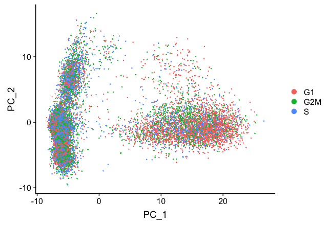
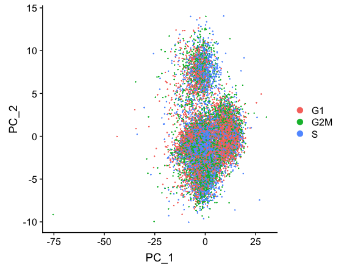
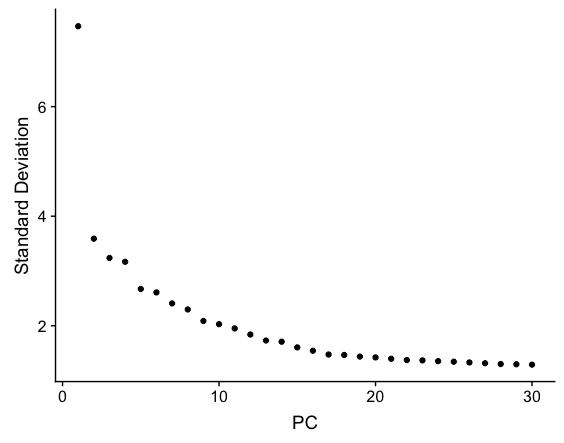
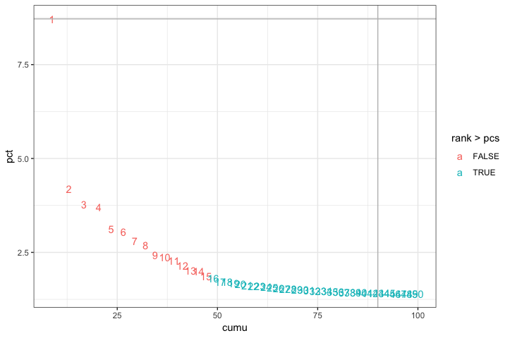
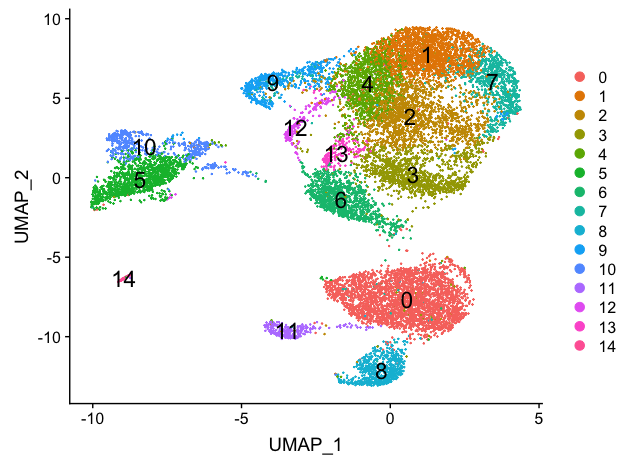

# Answer key - Clustering workflow


To identify clusters, the following steps will be performed:

1. **Normalization** and **identification of high variance genes** in each sample
2. **Integration** of the samples using shared highly variable genes (optional, but recommended to align cells from different samples)
3. **Scaling** and **regression** of sources of unwanted variation (e.g. number of UMIs per cell, mitochondrial transcript abundance, cell cycle phase)
4. **Clustering cells** based on top PCs (metagenes)
5. Exploration of **quality control metrics**: determine whether clusters unbalanced wrt UMIs, genes, cell cycle, mitochondrial content, samples, etc.
6. Searching for expected cell types using **known markers**
7. **Marker identification** for each cluster

## Extract `stim` cells


We are interested in only analyzing the `stim` sample by itself as a first pass. To do this we need to subset the Seurat object. We can use the `subset()` function to extract a subset of samples, cells, or genes. To extract only the cells from the `stim` sample we can run the following:

```r
# Get cell IDs for stim cells
stim_cell_ids <- rownames(seurat_raw@meta.data[which(seurat_raw@meta.data$sample == "stim"), ])

head(stim_cell_ids)

# Subset Seurat object to only contain stim cells
seurat_stim <- subset(seurat_raw, 
                         cells = stim_cell_ids)
```

To perform clustering of our data, we must identify the sources of variation present in our data based on the most variable genes. The assumption being that the most variable genes will determine the principal components (PCs) distinguishing the differences between cell types. After normalization of the expression values, we extract the 2000 most variable genes to determine the major sources of variation in the data, or significant PCs.

## **Normalization** and **identification of high variance genes** in each sample

The first step in the analysis is to normalize the raw counts to account for differences in sequencing depth per cell **for each sample**. By default, the raw counts are normalized using global-scaling normalization by performing the following:

1. normalizing the gene expression measurements for each cell by the total expression 
2. multiplying this by a scale factor (10,000 by default)
3. log-transforming the result

```r
# Normalize the data for read depth
seurat_stim <- NormalizeData(seurat_stim,
                                normalization.method = "LogNormalize",
                                scale.factor = 10000)
```

Following normalization, we want to **identify the most variable genes** (highly expressed in some cells and lowly expressed in others) to use for downstream clustering analyses. 

The mean-variance relationship of the data is modeled, and the 2,000 most variable genes are returned.

```r
# Identify the 2000 most variable genes
seurat_stim <- FindVariableFeatures(object = seurat_stim,
                                       selection.method = "vst",
                                       nfeatures = 2000)
```

We can plot these most variable genes highlighting the 20 most highly variable. The labeled genes should look familiar given the experiment.

```r
# Identify the 20 most highly variable genes
top20 <- head(x = VariableFeatures(object = seurat_stim), 
              n =20)

# Plot variable features with labels
plot1 <- VariableFeaturePlot(object = seurat_stim)

LabelPoints(plot = plot1, 
            points = top20, 
            repel = TRUE)
```

<p align="center">

</p>

Our sample contains PBMCs, so we would expect to see immune-related cells, and many of the top 20 variable genes do appear to be immune-related.

After identification of variable genes for each dataset, we will scale the data and regress out sources of unwanted variation. If we had more than a single sample, we would likely integrate our data at this step.

> **NOTE:** Seurat has just incorporated the `sctransform` tool for better normalization, scaling, and finding of variable genes. There is a new [vignette](https://satijalab.org/seurat/v3.0/sctransform_vignette.html) and [preprint](https://www.biorxiv.org/content/biorxiv/early/2019/03/18/576827.full.pdf) available to explore this new methodology.

## Scaling and regression of sources of unwanted variation

In addition to the interesting variation in your dataset that separates the different cell types, there is also "uninteresting" sources of variation present that can obscure the cell type-specific differences. This can include technical noise, batch effects, and/or uncontrolled biological variation (e.g. cell cycle). 

To identify sources of uninteresting variation, we can explore the possible sources using PCA. Prior to performing any dimensionality reduction visualization, it is a good idea to scale your data. Since highly expressed genes exhibit the highest amount of variation and we don't want our 'highly variable genes' only to reflect high expression, we need to scale the data to scale variation with expression level. The Seurat `ScaleData()` function will scale the data by:

- adjusting the expression of each gene to give a mean expression across cells to be 0
- scaling expression of each gene to give a variance across cells to be 1


```r
# Scale data
all_genes <- rownames(x = seurat_stim)

seurat_stim <- ScaleData(object = seurat_stim,
                            features = all_genes)
```


### Cell cycle scoring

Cell cycle variation is a common source of uninteresting variation in single-cell RNA-seq data. To examine cell cycle variation in our data, we assign each cell a score, based on its expression of G2/M and S phase markers. 

After scoring each gene for cell cycle phase, we can perform PCA using the expression of cell cycle genes. If the cells group by cell cycle in the PCA, then we would want to regress out cell cycle variation, **unless cells are differentiating**. 

Taking the gene names for the cell cycle genes we can score each cell based which stage of the cell cycle it is most likely to be in.

```r        
# Perform cell cycle scoring
seurat_stim <- CellCycleScoring(seurat_stim,
                                   g2m.features = g2m_genes,
                                   s.features = s_genes)

# Perform PCA and color by cell cycle phase
seurat_stim <- RunPCA(seurat_stim)

# Visualize the PCA, grouping by cell cycle phase
DimPlot(seurat_stim,
        reduction = "pca",
        group.by= "Phase")
```

<p align="center">

</p>

We do see differences on PC1, with the G1 cells to the right of the other cells on PC1. Based on this plot, we would regress out the variation due to cell cycle. 

### Apply regression variables

**Regressing variation due to uninteresting sources can improve downstream identification of principal components and clustering.** To mitigate the effects of these signals, Seurat constructs linear models to predict gene expression based on the variables to regress.

We generally recommend regressing out **number of UMIs, mitochondrial ratio, and possibly cell cycle** if needed, as a standard first-pass approach. However, if the differences in mitochondrial gene expression represent a biological phenomenon that may help to distinguish cell clusters, then we advise not regressing the mitochondrial expression.

When regressing out the effects of cell-cycle variation, include S-phase score and G2M-phase score for regression.

```r
# Define variables in metadata to regress
vars_to_regress <- c("nUMI", "S.Score", "G2M.Score", "mitoRatio")

# Regress out the uninteresting sources of variation in the data
seurat_stim <- ScaleData(object = seurat_stim,
                            vars.to.regress = vars_to_regress, 
                            verbose = FALSE)

# Re-run the PCA
seurat_stim <- RunPCA(object = seurat_stim)

DimPlot(object = seurat_stim, 
        reduction = "pca",
        group.by = "Phase")

```

<p align="center">

</p>


Regressing out cell cycle has resulted in more overlap of cells in the different phases of the cell cycle.

## Clustering cells based on top PCs (metagenes)

### Identify significant PCs

To overcome the extensive technical noise in the expression of any single gene for scRNA-seq data, Seurat clusters cells based on their PCA scores, with each PC essentially representing a "metagene" that combines information across a correlated gene set. Determining how many PCs to include downstream is therefore an important step. Often it is useful to explore the PCs prior to identifying the significant principal components to include for the downstream clustering analysis.

The elbow plot is helpful when determining how many PCs to use for the downstream analysis. The elbow plot visualizes the standard deviation of each PC, and where the elbow appears is usually the threshold for identifying the significant PCs. However, this method can be a bit subjective about where the elbow is located.

```r
# Plot the elbow plot
ElbowPlot(object = seurat_stim, 
          ndims = 30)
```

<p align="center">

</p>


Based on this plot, we could choose where the elbow occurs (touches the ground) to be between PC12-PC16. While this gives us a good rough idea of the number of PCs to include, a **more quantitative approach** may be a bit more reliable. We will identify a PC threshold by calculating where the principal components start to elbow by **taking the larger value of**:

1. The point where the principal components only contribute 5% of standard deviation and the principal components cumulatively contribute 90% of the standard deviation.
2. The point where the percent change in variation between the consequtive PCs is less than 0.1%.

We will start by calculating the first metric:

```r
# Determine percent of variation associated with each PC
pct <- seurat_stim[["pca"]]@stdev / sum(seurat_stim[["pca"]]@stdev) * 100

# Calculate cumulative percents for each PC
cumu <- cumsum(pct)

# Determine which PC exhibits cumulative percent greater than 90% and % variation associated with the PC as less than 5
co1 <- which(cumu > 90 & pct < 5)[1]

co1
```
The first metric returns PC43 as the PC matching these requirements. Let's check the second metric, which identifies the PC where the percent change in variation between consequtive PCs is less than 0.1%:

```r
# Determine the difference between variation of PC and subsequent PC
co2 <- sort(which((pct[1:length(pct) - 1] - pct[2:length(pct)]) > 0.1), decreasing = T)[1] + 1

# last point where change of % of variation is more than 0.1%.

co2
```

The second metric returned PC15. Now, to determine the selection of PCs, we will use the minimum of the two metrics:

```r
# Minimum of the two calculation
pcs <- min(co1, co2)

pcs
```

Based on these metrics, for the clustering of cells in Seurat we will use the first **fifteen PCs** to generate the clusters. We can plot the elbow plot again and overlay the information determined using our metrics:

```r
# Create a dataframe with values
plot_df <- data.frame(pct = pct, 
           cumu = cumu, 
           rank = 1:length(pct))

# Elbow plot to visualize 
  ggplot(plot_df, aes(cumu, pct, label = rank, color = rank > pcs)) + 
  geom_text() + 
  geom_vline(xintercept = 90, color = "grey") + 
  geom_hline(yintercept = min(pct[pct > 5]), color = "grey") +
  theme_bw()
 
```


<p align="center">

</p>

However, it's often a good idea to check the genes associated with some higher PCs to make sure that other PCs shouldn't be included due to association with some rarer cell populations.

```r
# Printing out the most variable genes driving PCs
print(x = seurat_stim[["pca"]], 
      dims = 1:25, 
      nfeatures = 5)
```

If we saw the highest positive and negative PCA scores for genes associated with a particular PC corresponding to known marker genes for a rare cell type, then we would include all PCs up to that one. 

### Cluster the cells

We can now use these significant PCs to determine which cells exhibit similar expression patterns for clustering. To do this, Seurat uses a graph-based clustering approach, which embeds cells in a graph structure, using a K-nearest neighbor (KNN) graph (by default), with edges drawn between cells with similar gene expression patterns. Then, it attempts to partition this graph into highly interconnected ‘quasi-cliques’ or ‘communities’ [[Seurat - Guided Clustering Tutorial](https://satijalab.org/seurat/v3.0/pbmc3k_tutorial.html)].

We will use the `FindClusters()` function to perform the graph-based clustering. The `resolution` is an important argument that sets the "granularity" of the downstream clustering and will need to be optimized to the experiment.  For datasets of 3,000 - 5,000 cells, the `resolution` set between `0.4`-`1.4` generally yields good clustering. Increased resolution values lead to a greater number of clusters, which is often required for larger datasets. 

We often provide a series of resolution options during clustering, which can be used downstream to choose the best resolution.


```r
# Determine the K-nearest neighbor graph
seurat_stim <- FindNeighbors(object = seurat_stim, 
                                dims = 1:15)
                                
# Determine the clusters for various resolutions                                
seurat_stim <- FindClusters(object = seurat_stim,
                               resolution = c(0.4, 0.6, 0.8, 1.0, 1.2, 1.8))
```

We will start with a resolution of 0.8 by assigning the identity of the clusters using the `Idents()` function.

```r
# Assign identity of clusters
Idents(object = seurat_stim) <- "RNA_snn_res.0.8"
```

To visualize the cell clusters, there are a few different dimensionality reduction techniques that can be helpful. 

```r
# Calculation of UMAP
seurat_stim <- RunUMAP(seurat_stim, 
                  reduction = "pca", 
                  dims = 1:15)

# Plot the UMAP
DimPlot(seurat_stim,
        reduction = "umap",
        label = TRUE,
        label.size = 6,
        plot.title = "UMAP")
```

<p align="center">

</p>


[Click here for next lesson]()

***

*This lesson has been developed by members of the teaching team at the [Harvard Chan Bioinformatics Core (HBC)](http://bioinformatics.sph.harvard.edu/). These are open access materials distributed under the terms of the [Creative Commons Attribution license](https://creativecommons.org/licenses/by/4.0/) (CC BY 4.0), which permits unrestricted use, distribution, and reproduction in any medium, provided the original author and source are credited.*

* *A portion of these materials and hands-on activities were adapted from the [Satija Lab's](https://satijalab.org/) [Seurat - Guided Clustering Tutorial](https://satijalab.org/seurat/pbmc3k_tutorial.html)*
