# Exploration of quality control metrics

To determine whether our clusters might be due to artifacts such as cell cycle phase or mitochondrial expression, it can be useful to explore these metrics visually to see if any clusters exhibit enrichment or are different from the other clusters. However, if enrichment or differences are observed for particular clusters it may not be worrisome if it can be explained by the cell type. 

First we will check the number of cells per cluster in each sample.

```r
# Extract identity and sample information from seurat object to determine the number of cells per cluster per sample
n_cells <- FetchData(combined, 
                     vars = c("ident", "sample")) %>%
        group_by(sample) %>%
        dplyr::count(ident) %>% 
        spread(ident, n) 

# View table
View(n_cells)
```

<p align="center">
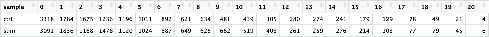
</p>

We can additionally visualize whether we have any sample-specific clusters by using the `split.by` argument:

```r
# Plot UMAP split by sample
DimPlot(combined,
        reduction = "umap",
        split.by = "sample",
        label = TRUE,
        label.size = 6,
        plot.title = "UMAP")

```

<p align="center">
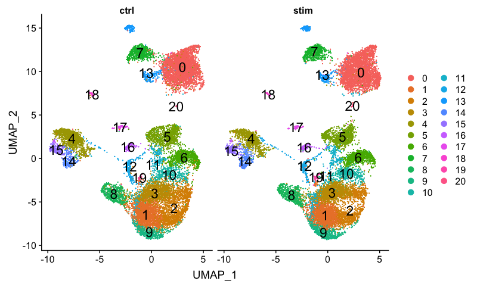
</p>

There doesn't appear to be any sample-specific clusters present. 

We can also perform the standard QC that we had gone through previously with the control sample.


We can explore cell cycle by cluster by splitting by `Phase`. 

```r
DimPlot(combined,
        reduction = "umap",
        split.by = "Phase",
        label = TRUE,
        label.size = 6,
        plot.title = "UMAP")
```
<p align="center">
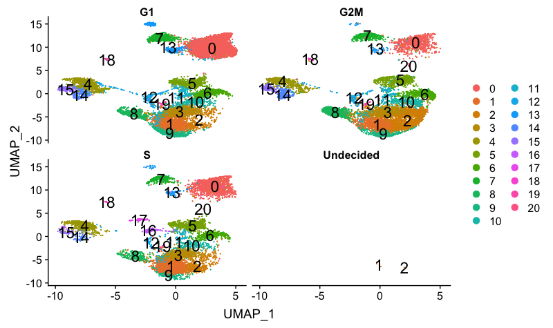
</p>

We can see that cluster 20 is primarily in S-phase and clusters 16 and 17 are in G2M phase. If we hadn't regressed out cell cycle previously, we would do so after seeing these clusters segregrate. Since we did regress out cell cycle, it is quite likely that there is a biological reason for the segregation.

Next, we will explore additional metrics, such as the number of UMIs and genes per cell, S-phase and G2M-phase markers, and mitochondrial gene expression:

```r
# Determine metrics to plot present in seurat_control@meta.data
metrics <-  c("nUMI", "nGene", "S.Score", "G2M.Score", "mitoRatio")

# Extract the UMAP coordinates for each cell and include information about the metrics to plot
qc_data <- FetchData(combined, 
                     vars = c(metrics, "ident", "UMAP_1", "UMAP_2"))

# Adding cluster label to center of cluster on UMAP
umap_label <- FetchData(combined, 
                        vars = c("ident", "UMAP_1", "UMAP_2"))  %>%
        as.data.frame() %>% 
        group_by(ident) %>%
        summarise(x=mean(UMAP_1), y=mean(UMAP_2))

# Plot a UMAP plot for each metric
map(metrics, function(qc){
        ggplot(qc_data,
               aes(UMAP_1, UMAP_2)) +
                geom_point(aes_string(color=qc), 
                           alpha = 0.7) +
                scale_color_gradient(guide = FALSE, 
                                     low = "grey90", 
                                     high = "blue")  +
                geom_text(data=umap_label, 
                          aes(label=ident, x, y)) +
                ggtitle(qc)
}) %>%
        plot_grid(plotlist = .)

```

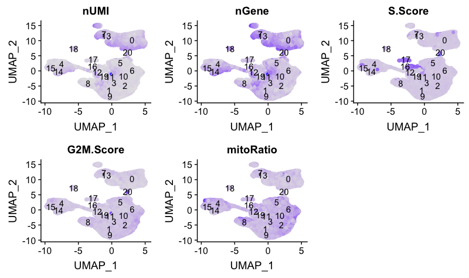

We can also explore how well our clusters separate by the different PCs; we hope that the defined PCs separate the cell types well. 

```r
# Defining the information in the seurat object of interest
columns <- c(paste0("PC_", 1:30),
             "ident",
             "UMAP_1", "UMAP_2")

# Extracting this data from the seurat object
pc_data <- FetchData(combined, 
                     vars = columns)

# Plotting a UMAP plot for each of the PCs
map(paste0("PC_", 1:30), function(pc){
        ggplot(pc_data, 
               aes(UMAP_1, UMAP_2)) +
                geom_point(aes_string(color=pc), 
                           alpha = 0.7) +
                scale_color_gradient(guide = FALSE, 
                                     low = "grey90", 
                                     high = "blue")  +
                geom_text(data=umap_label, 
                          aes(label=ident, x, y)) +
                ggtitle(pc)
}) %>% 
        plot_grid(plotlist = .)

```

<p align="center">
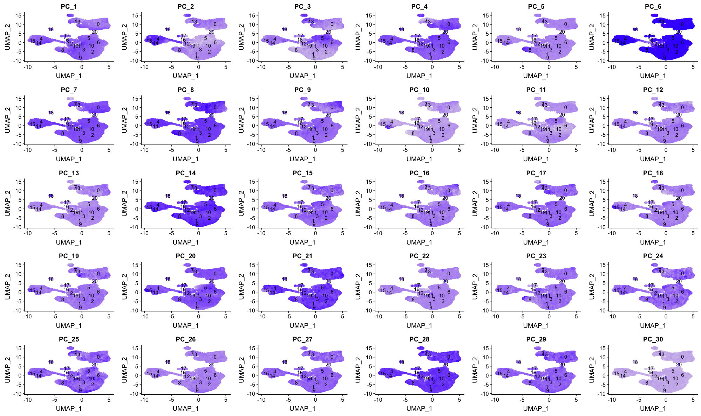
</p>

# Evaluating clustering

To determine whether our clustering and resolution are appropriate for our experiment, it is helpful to explore a handful of markers for each of the major cell types that we expect to be in our data and see how they segregate.

We will explore known immune cell markers for expected clusters:

| Cell Type | Marker |
|:---:|:---:|
| CD14+ monocytes | CD14, LYZ | 
| FCGR3A+ monocytes | FCGR3A, MS4A7 |
| Conventional dendritic cells | FCER1A, CST3 |
| Plasmacytoid dendritic cells | IL3RA, GZMB, SERPINF1, ITM2C |
| B cells | CD79A, MS4A1 |
| T cells | CD3D |
| CD4+ T cells | CD3D, IL7R, CCR7 |
| CD8+ T cells| CD3D, CD8A |
| NK cells | GNLY, NKG7 |
| Megakaryocytes | PPBP |
| Erythrocytes | HBB, HBA2 |


Let's remind ourselves of our clusters:

```r
# Plot UMAP
DimPlot(combined,
        reduction = "umap",
        label = TRUE,
        label.size = 6,
        plot.title = "UMAP")
```


<p align="center">

</p>


**CD14+ monocyte markers**

```r
FeaturePlot(combined, 
            reduction = "umap", 
            features = c("CD14", "LYZ"))
```

<p align="center">
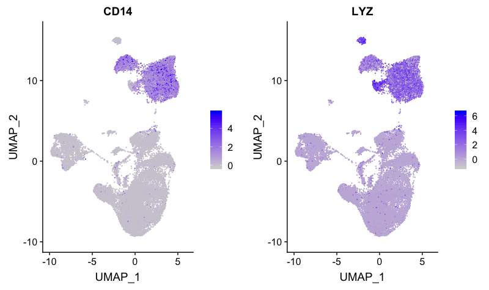
</p>

Cluster 0 appears to have expression of both CD14 and LYZ. Cluster 7 also appears to express both markers, but at a lower level.

**FCGR3A+ monocyte markers**

```r
FeaturePlot(combined, 
            reduction = "umap", 
            features = c("FCGR3A", "MS4A7"))
```

<p align="center">
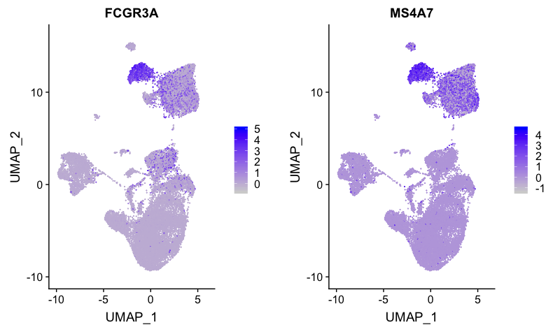
</p>

Expression is strong for only cluster 7. Therefore, we will surmise that cluster 0 is CD14+ monocytes, while cluster 7 represents FCGR3A+ (CD16+) monocytes.

**Dendritic cell (DC) markers**

```r
FeaturePlot(combined, 
            reduction = "umap", 
            features = c("FCER1A", "CST3"))
```

<p align="center">
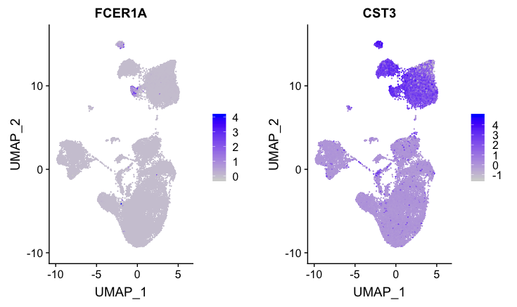
</p>

Although the expression is not that impressive, the only cluster to exhibit expression of both markers is cluster 13. Since these markers are weak, we would likely want to explore the marker identification markers in more detail for this cell type.

**Plasmacytoid DCs**

```r
FeaturePlot(combined, 
            reduction = "umap", 
            features = c("IL3RA", "GZMB", "SERPINF1", "ITM2C"))
```

<p align="center">
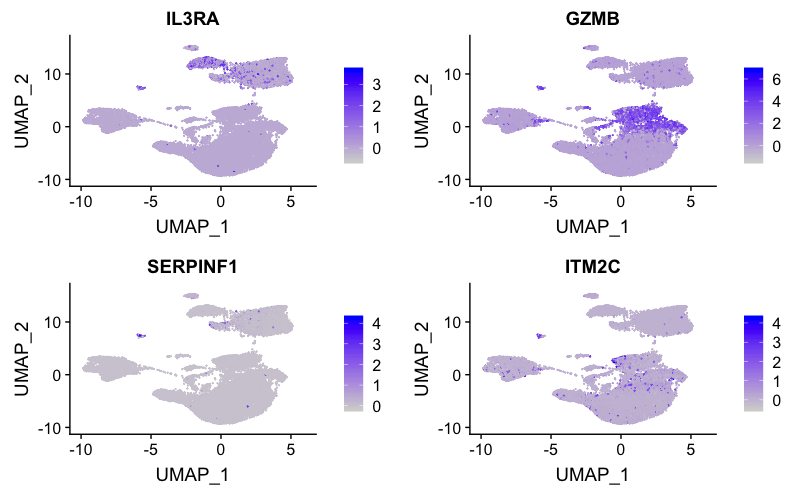
</p>

The expression of several markers suggest cluster 18 corresponds to plasmacytoid DCs.
            
**B cell markers**

```r
FeaturePlot(combined, 
            reduction = "umap", 
            features = c("CD79A", "MS4A1"))
```

<p align="center">
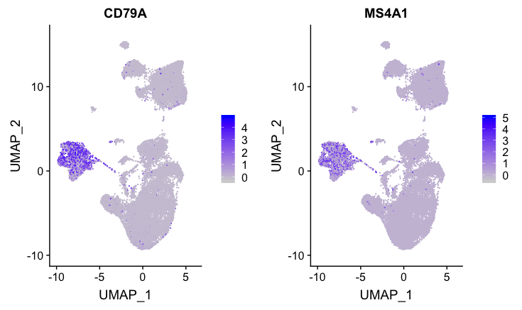
</p>

These B cell markers have a good amount of expression for both markers for clusters 4, 14, and 15.

**T cell markers**

```r
FeaturePlot(combined, 
            reduction = "umap", 
            features = c("CD3D"))
```

<p align="center">
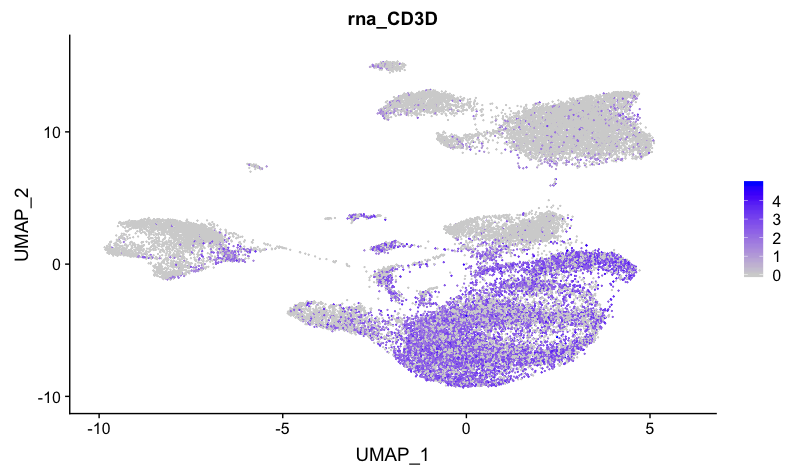
</p>

The T cell marker maps to many clusters, including 1, 2, 3, 6, 9, 10, 12, 16, 17, and 19.

**CD4+ T cell markers**

```r
FeaturePlot(combined, 
            reduction = "umap", 
            features = c("CD3D", "IL7R"))
```

<p align="center">
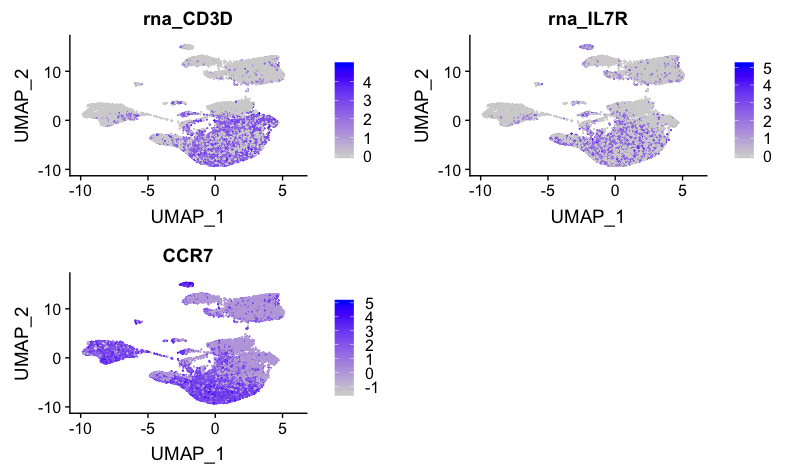
</p>

These markers correspond to clusters 1, 2, 3, 9 and 16. IL7R appears to map to cluster 10.

**CD8+ T cell markers**

```r
FeaturePlot(combined, 
            reduction = "umap", 
            features = c("CD3D", "CD8A"))
```

<p align="center">
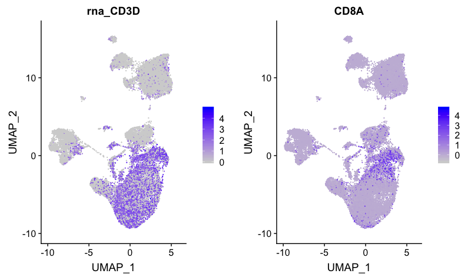
</p>

Markers for CD8+ T cells map to clusters 6, 10 and 11.

**NK cell markers**

```r
FeaturePlot(combined, 
            reduction = "umap", 
            features = c("GNLY", "NKG7"))
```

<p align="center">
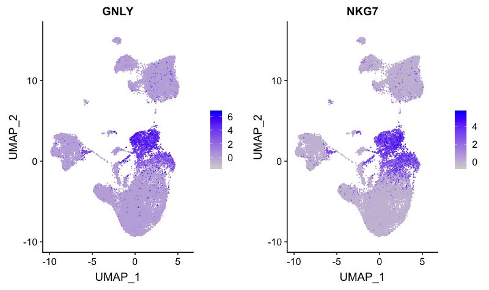
</p>

The NK cell markers correspond to clusters 5 and 6. However, we know that cluster 6 has T cell markers, therefore, this cluster is not representing NK cells. Likely cluster 6 represents activated CD8+ T cells.

**Megakaryocyte markers**

```r
FeaturePlot(combined, 
            reduction = "umap", 
            features = c("PPBP"))
```

<p align="center">
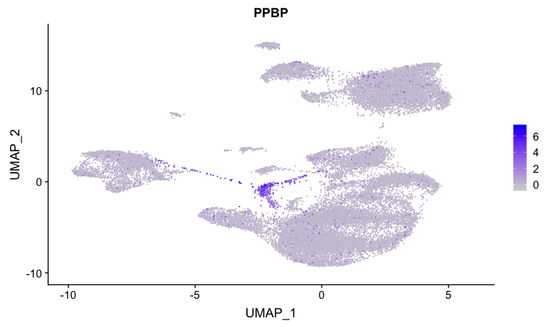
</p>

This marker distinguishes cluster 12 as megakaryocytes.

**Erythrocyte markers**

```r
FeaturePlot(combined, 
            reduction = "umap", 
            features = c("HBB", "HBA2"))
```
<p align="center">
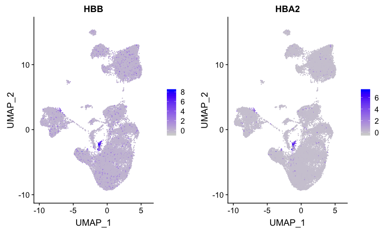
</p>

Erythocytes correspond to cluster 19.

We identified in the Control analysis that we had markers differentiating the naive from the activated T cells. We can look whether specific clusters correspond to these subsets.

### Cell state exploration

Based on the analysis with the `Control` sample, we have some additional cell markers to determine **immune cell activation status** and **stressed/dying** cells:

| Cell State | Marker |
|:---:|:---:|
| Naive T cells | CCR7, SELL | 
| Activated B and T cells | CREM, CD69 |
| Stressed/dying cells | HSPB1, DNAJB6, HSPH1, GADD45B |

**Naive or memory T cells**

```r
FeaturePlot(combined, 
            reduction = "umap", 
            features = c( "CCR7", "SELL"))
```

<p align="center">
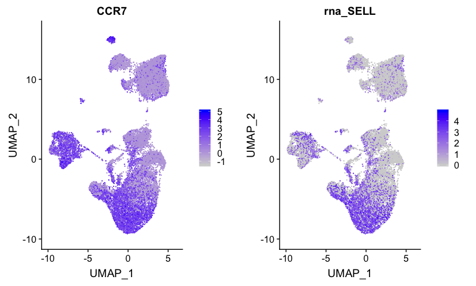
</p>

The naive CD4+ T cells correspond to clusters 1, 2, 9, and 11.

**Activated T and B cells**

```r
FeaturePlot(combined, 
            reduction = "umap", 
            features = c("CREM", "CD69"))
```            

<p align="center">
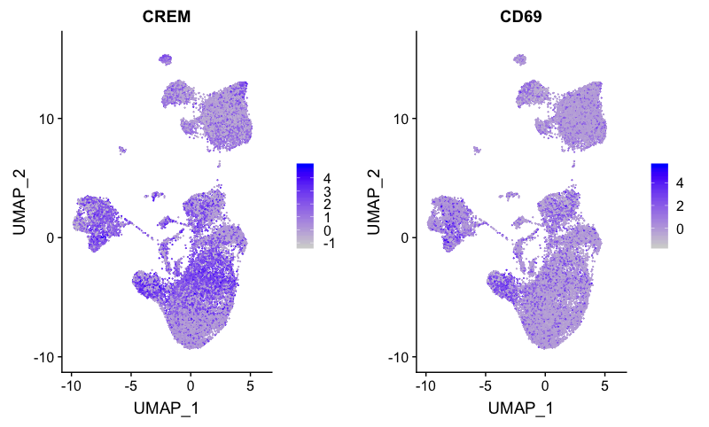
</p>

Activated CD4+ T cells correspond to cluster 3, while activated B cells correspond to cluster 14.

**Stressed or dying cells**

Based on our previous analysis with the control sample, we know there should be a cluster containing the stressed or dying cells with heat shock genes, cell cycle arrest genes, and DNA damage genes overexpressed. We can determine which cluster corresponds to these cells using the identified markers from the previous analysis.

```r
FeaturePlot(combined, 
            reduction = "umap", 
            features = c("HSPB1", "DNAJB6", "HSPH1", "GADD45B"))
```           
        
<p align="center">
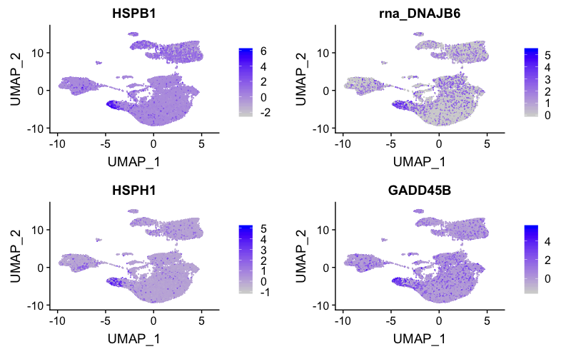
</p>

This cluster of stressed cells corresponds to cluster 8.
            
Based on these results, we can associate the majority of the clusters with cell types. However, we would like to perform a deeper analysis using marker identification before performing a final assignment of the clusters. 

| Cell Type | Clusters |
|:---:|:---:|
| CD14+ Monocytes | 0 | 
| FCGR3A+ Monocytes | 7 |
| Conventional dendritic cells | 13 |
| Plasmacytoid dendritic cells | 18 |
| Naive B cells | 4, 15 |
| Activated B cells | 14 |
| Naive CD4+ T cells | 1, 2, 9, 16 |
| Activated CD4+ T cells | 3 |
| Naive CD8+ T cells| 11 |
| Activated (cytotoxic) CD8+ T cells| 6, 10 |
| NK cells | 5 |
| Megakaryocytes | 12 |
| Erythrocytes | 19 |
| Stressed / dying cells | 8 |
| Unknown | 17, 20 |

While we have a good idea of the cell types for the different clusters, it's always a good idea to perform marker identification to ensure the hypothesized cell identities make sense with the enriched genes. Also, we can explore identities for the unknown clusters 17 and 20.

***

*This lesson has been developed by members of the teaching team at the [Harvard Chan Bioinformatics Core (HBC)](http://bioinformatics.sph.harvard.edu/). These are open access materials distributed under the terms of the [Creative Commons Attribution license](https://creativecommons.org/licenses/by/4.0/) (CC BY 4.0), which permits unrestricted use, distribution, and reproduction in any medium, provided the original author and source are credited.*

* *A portion of these materials and hands-on activities were adapted from the [Satija Lab's](https://satijalab.org/) [Seurat - Guided Clustering Tutorial](https://satijalab.org/seurat/pbmc3k_tutorial.html)*

