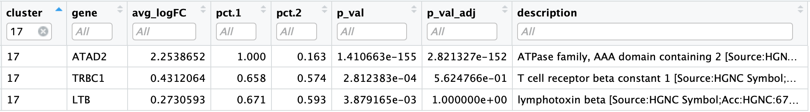
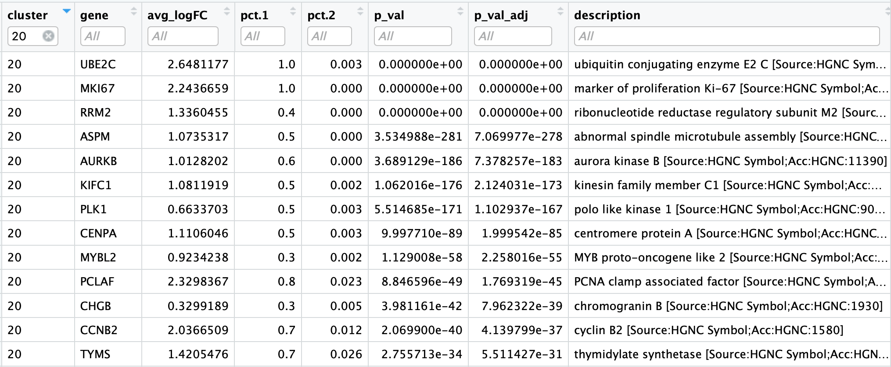
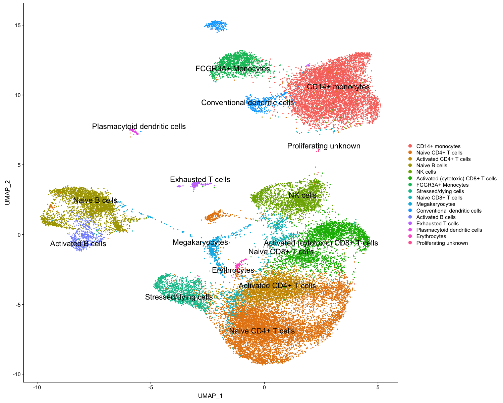

# Answer Key 

## Identification of all markers for each cluster

This analysis compares each cluster against all others and outputs the genes that are differentially expressed/present using the `FindAllMarkers()` function. 


```r
# Find markers for every cluster compared to all remaining cells, report only the positive ones
combined_markers <- FindAllMarkers(object = combined, 
                          only.pos = TRUE,
                          logfc.threshold = 0.25)  

View(combined_markers)                                               
```

The order of the columns doesn't seem the most intuitive, so we will reorder the columns with the `cluster` first followed by the `gene`.

```r
# Combine markers with gene descriptions 
ann_comb_markers <- inner_join(x = combined_markers, 
                               y = annotations[, c("gene_name", "description")],
                               by = c("gene" = "gene_name")) %>%
        unique()

# Rearrange the columns to be more intuitive
ann_comb_markers <- ann_comb_markers[ , c(6, 7, 2:4, 1, 5,8)]

# Order the rows by p-adjusted values
ann_comb_markers <- ann_comb_markers %>%
        dplyr::arrange(cluster, p_val_adj)

View(ann_comb_markers)
```

<p align="center">

</p>

**Usually the top markers are relatively trustworthy, but because of inflated p-values, many of the less significant genes are not so trustworthy as markers.**

Save our marker analysis results to file.

```r
# Save markers to file
write.csv(ann_comb_markers, 
          file = "results/combined_all_markers.csv", 
          quote = FALSE, 
          row.names = FALSE)
```

We can also output the top 5 markers by log2 fold change for each cluster for a quick perusal.

```r
# Extract top 5 markers per cluster
top5_comb <- ann_comb_markers %>%
        group_by(cluster) %>%
        top_n(n = 5,
              wt = avg_logFC)

# Visualize top 5 markers per cluster
View(top5_comb)

```

<p align="center">

</p>

Based on these marker results, we can determine whether the markers make sense for our hypothesized identities for each cluster:

| Cell Type | Clusters |
|:---:|:---:|
| CD14+ Monocytes | 0 | 
| FCGR3A+ Monocytes | 7 |
| Conventional dendritic cells | 13 |
| Plasmacytoid dendritic cells | 18 |
| Naive B cells | 4, 15 |
| Activated B cells | 14 |
| Naive CD4+ T cells | 1, 2, 9, 16 |
| Activated CD4+ T cells | 3 |
| Naive CD8+ T cells| 11 |
| Activated (cytotoxic) CD8+ T cells| 6, 10 |
| NK cells | 5 |
| Megakaryocytes | 12 |
| Erythrocytes | 19 |
| Stressed / dying cells | 8 |
| Unknown | 17, 20 |

If there were any questions about the identity of any clusters, exploring the cluster's markers would be the first step. Let's look at the `ann_comb_markers`, filtering for cluster 17. ATAD2 can be associated with activation, so maybe cluster 17 corresponds to activated CD4+ T cells.

<p align="center">

</p>

We also had questions regarding the identity of cluster 20. We can look at the markers of cluster 20 to try to resolve the identity:

<p align="center">

</p>

The enriched genes appear to be markers of proliferation. In addition, we see expression of genes encoding T cell inhibitory receptors. However, cluster 20 had low levels of the T cell markers CD3D, CD4 and CD8. So this cluster is still a bit of a mystery.


## Identification of conserved markers in all conditions

Identifying conserved markers allows for identifying only those genes the are significantly differentially expressed relative to the other clusters for all conditions. This function is most useful to run if unsure of the identity for a cluster after running the `FindAllMarkers()`. You could run it on all clusters if you wanted to, but it takes a while to run, so we are just going to run it on the unknown clusters 17 and 20.

The function we will use is the `FindConservedMarkers()`, which has the following structure:

**`FindConservedMarkers()` syntax:**

```r
FindConservedMarkers(seurat_obj,
                     ident.1 = cluster,
                     grouping.var = "group",
                     only.pos = TRUE)
```

The function **accepts a single cluster at a time**, so if we want to have the function run on all clusters, then we can use the `map` family of functions to iterate across clusters. 

Since these functions will **remove our row names** (gene names), we need to transfer the row names to columns before mapping across clusters. We also need a column specifying **to which cluster the significant genes correspond**.

To do that we will create our own function to:

1. Run the `FindConservedMarkers()` function
2. Transfer row names to a column using `rownames_to_column()` function
3. Create the column of cluster IDs using the `cbind()` function

```r
# Create function to get conserved markers for any given cluster
get_conserved <- function(cluster){
        FindConservedMarkers(combined,
                             ident.1 = cluster,
                             grouping.var = "sample",
                             only.pos = TRUE) %>%
                rownames_to_column(var = "gene") %>%
                cbind(cluster_id = cluster, .)
}
```

Since we want the output of the `map` family of functions to be a **dataframe with each cluster output bound together by rows**, we will use the `map_dfr()` function.

Remember the map family of functions uses the following syntax:

**`map` family syntax:**

```r
map_dfr(inputs_to_function, name_of_function)
```

Now, let's find the conserved markers for clusters 16, 17, and 20.

```r
# Iterate function across desired clusters
conserved_markers <- map_dfr(c(17,20), get_conserved)
```

To better analyze the output, we can include the gene descriptions as well.

```r
# Extract the gene descriptions for each gene
gene_descriptions <- unique(annotations[, c("gene_name", "description")])

# Merge gene descriptions with markers
ann_conserved_markers <- left_join(x = conserved_markers,
                                   y = gene_descriptions,
                                   by = c("gene" = "gene_name"))
```

<p align="center">

</p>

For clusters 17 and 20, we see many of the conserved enriched genes encode inhibitory receptors, such as TIGIT and LAG3, which can be indicative of exhausted T cells.

## Identifying gene markers for each cluster

The last set of questions we had regarding the analysis involved whether the clusters corresponding to the same cell types have biologically meaningful differences. Sometimes the list of markers returned don't sufficiently separate some of the clusters. 

Again, we performed this analysis with the single samples, so we are going to perform it by completing the exercises below.

***

**Exercises**

1. Determine differentiating markers for CD8+ T cells - clusters 6 versus 10 - using the `FindMarkers()` function.
2. **Annotate** the markers with gene descriptions.
3. **Reorder the columns** to be in the order shown below.

	<p align="center">
	
	</p>

4. **Arrange rows** by `avg_logFC` values
5. **Save** our rearranged marker analysis results to a file called `cluster6vs10_markers.csv` in the `results` folder.
6. Based on these marker results, **determine whether we need to separate** clusters 6 and 10 as their own clusters.
7. **Extra credit:** Repeat above steps for the clusters assigned to `Naive CD4+ T cells`, in addition to repeating for `Naive B cells`.

***


```r
# Determine differentiating markers for CD8+ T cells - clusters 6 versus 10
cd8_t <- FindMarkers(combined,
                     ident.1 = 6,
                     ident.2 = 10)                     

# Add gene descriptions
cd8_t_markers <- cd8_t %>%
        rownames_to_column("gene") %>%
        inner_join(y = gene_descriptions,
                   by = c("gene" = "gene_name")) %>%
        unique()

# Reorder columns and sort by log2 fold change        
cd8_t_markers <- cd8_t_markers[, c(1, 3:5,2,6:7)]

# Arrange rows
cd8_t_markers <- cd8_t_markers %>%
        dplyr::arrange(avg_logFC)

# Save markers
write.csv(cd8_t_markers, "results/cluster6vs10_markers.csv", quote = F, row.names= F)        
        
# View data
View(cd8_t_markers)
```

<p align="center">

</p>


Now taking in all of this information, we can surmise the cell types of the different clusters and plot the cells with cell type labels. 

| Cell Type | Clusters |
|:---:|:---:|
| CD14+ Monocytes | 0 | 
| FCGR3A+ Monocytes | 7 |
| Conventional dendritic cells | 13 |
| Plasmacytoid dendritic cells | 18 |
| Naive B cells | 4, 15 |
| Activated B cells | 14 |
| Naive CD4+ T cells | 1, 2, 9, 16 |
| Activated CD4+ T cells | 3 |
| Naive CD8+ T cells| 11 |
| Activated (cytotoxic) CD8+ T cells| 6, 10 |
| NK cells | 5 |
| Megakaryocytes | 12 |
| Erythrocytes | 19 |
| Stressed/dying cells | 8 |
| Exhausted T cells | 17
| Proliferating unknown | 20 |

We can then reassign the identity of the clusters to these cell types:

```r
combined_labelled <- RenameIdents(object = combined,
                         "0" = "CD14+ monocytes",
                         "1" = "Naive CD4+ T cells",
                         "2" = "Naive CD4+ T cells",
                         "3" = "Activated CD4+ T cells",
                         "4" = "Naive B cells",
                         "5" = "NK cells",
                         "6" = "Activated (cytotoxic) CD8+ T cells",
                         "7" = "FCGR3A+ Monocytes",
                         "8" = "Stressed/dying cells",
                         "9" = "Naive CD4+ T cells",
                         "10" = "Activated (cytotoxic) CD8+ T cells",
                         "11" = "Naive CD8+ T cells",
                         "12" = "Megakaryocytes",
                         "13" = "Conventional dendritic cells",
                         "14" = "Activated B cells",
                         "15" = "Naive B cells",
                         "16" = "Naive CD4+ T cells",
                         "17" = "Exhausted T cells",
                         "18" = "Plasmacytoid dendritic cells",
                         "19" = "Erythrocytes",
                         "20" = "Proliferating unknown")

DimPlot(object = combined_labelled, 
        reduction = "umap", 
        label = TRUE,
        pt.size = 0.5,
        repel = T,
        label.size = 6)
```

<p align="center">

</p>

***

**Exercises**

1. Remove the stressed cells using the `subset()` function.
2. Visualize the clusters using `DimPlot()`.
3. Use the `write_rds()` function to save the final labelled `combined` object to the `results` folder, called `combined_labelled_res0.8.rds`.

***

If we wanted to remove the stressed cells, we could use the `subset()` function:

```r
# Remove the stressed or dying cells
combined_labelled <- subset()

# Re-visualize the clusters
DimPlot(object = combined_labelled, 
        reduction = "umap", 
        label = TRUE,
        label.size = 6)
```

To save our final labelled Seurat object:

```r        
# Save final R object
write_rds(combined_labelled,
          path = "results/combined_labelled_res0.8.rds")       
```

Now that we have our clusters defined and the markers for each of our clusters, we have a few different options:

- Experimentally validate intriguing markers for our identified cell types.
- Perform differential expression analysis between conditions `ctrl` and `stim`
	- Biological replicates are **necessary** to proceed with this analysis.
- Trajectory analysis, or lineage tracing, could be performed if trying to determine the progression between cell types or cell states. For example, we could explore any of the following using this type of analysis:
	- Differentiation processes
	- Expression changes over time
	- Cell state changes in expression
***


*This lesson has been developed by members of the teaching team at the [Harvard Chan Bioinformatics Core (HBC)](http://bioinformatics.sph.harvard.edu/). These are open access materials distributed under the terms of the [Creative Commons Attribution license](https://creativecommons.org/licenses/by/4.0/) (CC BY 4.0), which permits unrestricted use, distribution, and reproduction in any medium, provided the original author and source are credited.*

* *A portion of these materials and hands-on activities were adapted from the [Satija Lab's](https://satijalab.org/) [Seurat - Guided Clustering Tutorial](https://satijalab.org/seurat/pbmc3k_tutorial.html)*
