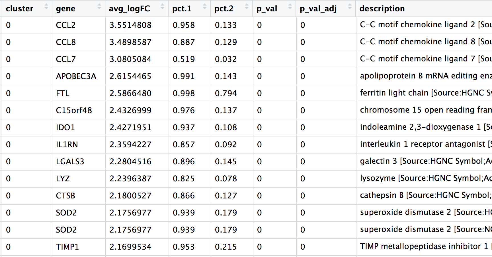
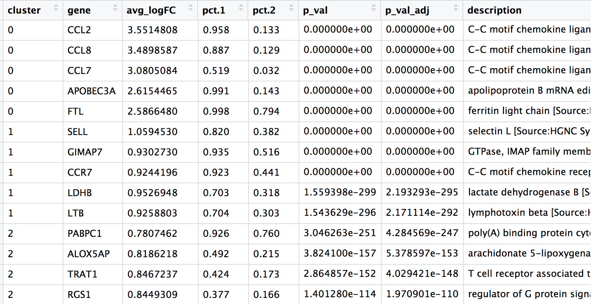
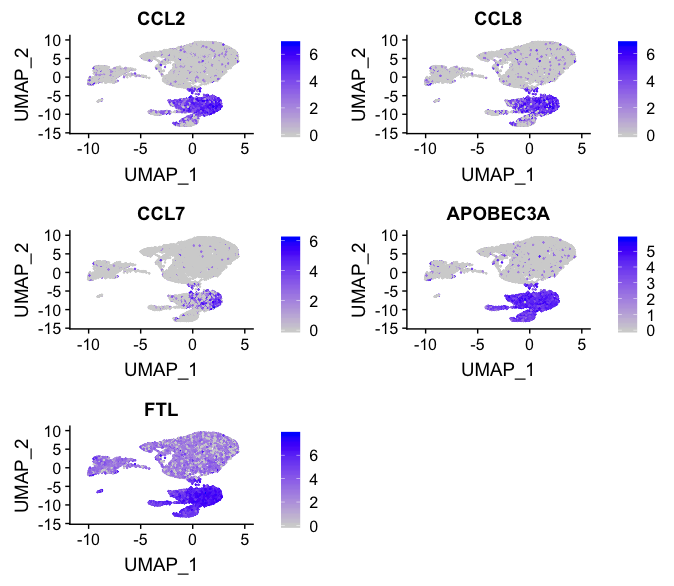
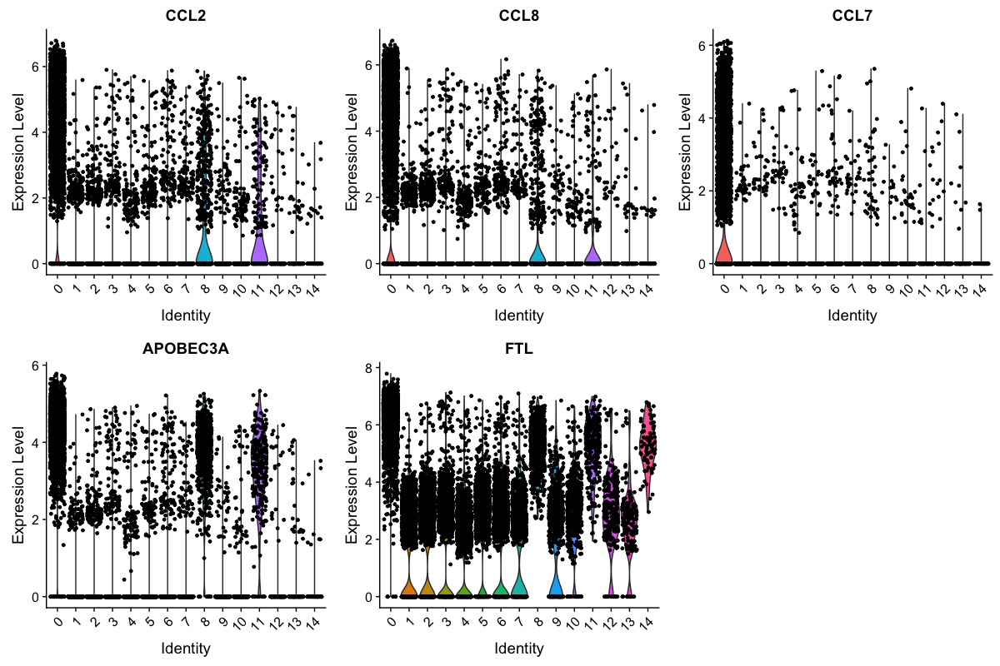

# Answer key - Clustering workflow

## Identification of all markers for each cluster

Find all markers for the seurat_stim data using the FindAllMarkers() function with arguments to return only the positive markers and those markers with log2 fold-change greater than 0.25. **Do not run the code below.**

```r
## DO NOT RUN THIS CODE ##
# Find markers for every cluster compared to all remaining cells, report only the positive ones
markers_stim <- FindAllMarkers(object = seurat_stim, 
                          only.pos = TRUE,
                          logfc.threshold = 0.25)
                                                   
```

In your own analysis you can run the code above, but it can take quite long to run. As such we have created the markers data frame for you to **download and load into your R session**.


```r
markers_stim <- read.csv("results/stim_all_markers.csv")

```


## Annotate the markers with gene descriptions

The order of the columns doesn't seem the most intuitive, so we will reorder the columns with the `cluster` first followed by the `gene`.

```r
# Combine markers with gene descriptions 
ann_markers_stim <- inner_join(x = markers_stim, 
                          y = annotations[, c("gene_name", "description")],
                          by = c("gene" = "gene_name")) %>%
        unique()

```


## Reorder the columns to be in the order shown below

```r

# Rearrange the columns to be more intuitive
ann_markers_stim <- ann_markers_stim[ , c(6, 7, 2:4, 1, 5,8)]

```

## Arrange rows by cluster, then by p-adjusted values

```r
# Order the rows by p-adjusted values
ann_markers_stim <- ann_markers_stim %>%
        dplyr::arrange(cluster, p_val_adj)

# Take a look a the new data frame
View(ann_markers_stim)
 ```
 
 <p align="center">

</p>

## Save our results to file

Save our rearranged marker analysis results to a file called `stim_all_markers_annotated.csv` in the results folder.

```r
# Save markers to file
write.csv(ann_markers_stim, 
          file = "results/stim_all_markers_annotated.csv", 
          quote = FALSE, 
          row.names = FALSE)
```


## Extract the top 5 markers by log2 fold change for each cluster.

```r
# Extract top 5 markers per cluster
top5_stim <- ann_markers_stim %>% 
        group_by(cluster) %>% 
        top_n(n = 5, 
              wt = avg_logFC)

# Visualize top 5 markers per cluster
View(top5_stim)

```

<p align="center">

</p>


## Visualize top 5 markers for cluster 0 

To get a better idea of cell type identity we can explore the expression of different identified markers by cluster **using the `FeaturePlot()` function**. For example, we can look at the cluster 0 markers:

```r
# Plot top 5 markers for cluster 0
FeaturePlot(object = seurat_stim, 
            features = top5_stim[top5_stim$cluster == 0, "gene"] %>%
                    pull(gene))
```

<p align="center">

</p>


### Violin plot

```r
# Vln plot - cluster 0
VlnPlot(object = seurat_stim, 
        features = top5_stim[top5_stim$cluster == 0, "gene"] %>%
                    pull(gene))
```        

<p align="center">

</p>


***


*This lesson has been developed by members of the teaching team at the [Harvard Chan Bioinformatics Core (HBC)](http://bioinformatics.sph.harvard.edu/). These are open access materials distributed under the terms of the [Creative Commons Attribution license](https://creativecommons.org/licenses/by/4.0/) (CC BY 4.0), which permits unrestricted use, distribution, and reproduction in any medium, provided the original author and source are credited.*

* *A portion of these materials and hands-on activities were adapted from the [Satija Lab's](https://satijalab.org/) [Seurat - Guided Clustering Tutorial](https://satijalab.org/seurat/pbmc3k_tutorial.html)*
