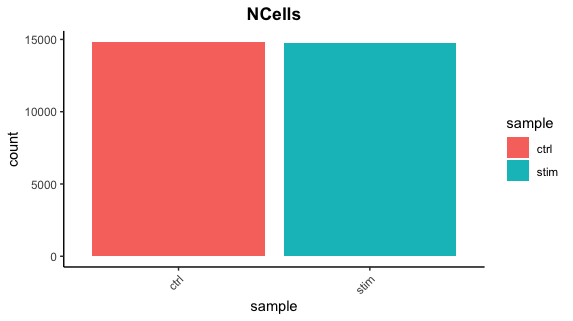
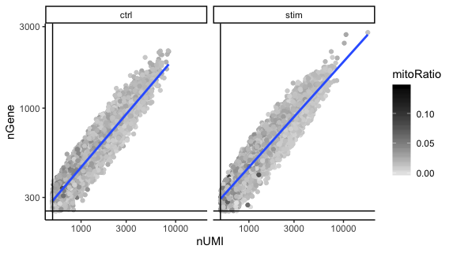

# Answer key - Quality Control Analysis

### Cell counts

After filtering, we should not have more cells than we sequenced. Generally we aim to have about the number we sequenced or a bit less. 

```r
## Cell counts
metadata_clean %>% 
  	ggplot(aes(x=sample, fill=sample)) + 
  	geom_bar() +
  	theme_classic() +
  	theme(axis.text.x = element_text(angle = 45, vjust = 1, hjust=1)) +
  	theme(plot.title = element_text(hjust=0.5, face="bold")) +
  	ggtitle("NCells")
```

<p align="center">

</p>


### UMI counts

The filtering using a threshold of 500 has removed the cells with low numbers of UMIs from the analysis.

```r
# UMI counts
metadata_clean %>% 
  	ggplot(aes(color=sample, x=nUMI, fill= sample)) + 
  	geom_density(alpha = 0.2) + 
  	scale_x_log10() + 
  	theme_classic() +
  	ylab("log10 cell density") +
  	geom_vline(xintercept = 500)
```

<p align="center">

</p>


### Genes detected

```r
# Genes detected
metadata_clean %>% 
  	ggplot(aes(color=sample, x=nGene, fill= sample)) + 
  	geom_density(alpha = 0.2) + 
  	theme_classic() +
  	scale_x_log10() + 
  	geom_vline(xintercept = 250)
```

<p align="center">

</p>

### UMIs vs genes
```r
# UMIs vs genes
metadata_clean %>% 
  ggplot(aes(x=nUMI, y=nGene, color=mitoRatio)) + 
  geom_point() + 
  scale_colour_gradient(low = "gray90", high = "black") +
  stat_smooth(method=lm) +
  scale_x_log10() + 
  scale_y_log10() + 
  theme_classic() +
  geom_vline(xintercept = 500) +
  geom_hline(yintercept = 250) +
  facet_wrap(~sample)
```

<p align="center">

</p>

### Mitochondrial counts ratio
```r
# Mitochondrial counts ratio
metadata_clean %>% 
  	ggplot(aes(color=sample, x=mitoRatio, fill=sample)) + 
  	geom_density(alpha = 0.2) + 
  	scale_x_log10() + 
  	theme_classic() +
  	geom_vline(xintercept = 0.2)
```

<p align="center">

</p>

### Novelty
```r
# Novelty
metadata_clean %>%
  	ggplot(aes(x=log10GenesPerUMI, color = sample, fill=sample)) +
  	geom_density(alpha = 0.2) +
  	theme_classic() +
  	geom_vline(xintercept = 0.8)
```

<p align="center">

</p>
