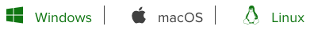

# Installing and using UMAP

_**These materials were modified from https://unidata.github.io/online-python-training/conda-windows.html.**_

To visualize the cell clusters, there are a few different dimensionality reduction techniques that can be helpful. The most popular methods include t-distributed stochastic neighbor embedding (t-SNE) and **Uniform Manifold Approximation and Projection (UMAP)** techniques.

In the Seurat package there is a function to use the UMAP visualization (`RunUMAP()`), however it does require the user to  **first install the `umap-learn` python package.**  To install this package follow the instructions below.

# Getting Going with Python

The aim of this web page is to help you get started with Python. We will explain what a package management tool is, how to download `conda` package management tool via the Anaconda installer, and guide you on the Mac/Windows Command Prompt so that you can use `conda` from the command line. Finally, we will wrap up by installing one library with `conda`.

## What Is a Package Management Tool?

A package management tool is a software application that helps you manage software libraries that enable you to get your work done. These software libraries may relate to plotting for scientific publication or accessing certain kinds of data, for example.

When you start using Python, you will want use software libraries that are not part of the standard Python installation. For example, we wish to use the [umap-learn](https://pypi.org/project/umap-learn/) for cluster visualization. Anaconda from Continuum Analytics will help you install `umap-learn` easily.

## Installing the `conda` Package Management Tool

Before we install `conda`, **close your R and RStudio**.

The `conda` package management tool is part of the Anaconda software package. Install `conda` by navigating to the [Anaconda download page](https://www.anaconda.com/distribution/). Scroll down to choose a tab for the OS of your computer portion of the web page:

Download Python by clicking on the "64-bit Graphical Installer" link. It is a big download, so it is best to be on fast network. Open the installer file you just downloaded. It should be named something like `Anaconda[version]-Windows-x86_64`.

This action will guide you through the conda installation. The last step of the installation process will ask you if you want to add Anaconda to my the PATH environment variable and whether you would like to make this your default Python. **Ensure both options are checked.**

## Command prompt

### Mac command prompt

Use spotlight to search for the `Terminal` program. It would look something like: **`Janes-iMac:~ janedoe$`**. This is known as the **command line**. The command line is where you give text instructions to your computer. 

### Windows Command Prompt

The Windows Command Prompt installed by the Anaconda program that is a software program giving you the ability to give text based instructions to your computer. 

To open the Windows Command Prompt, left-click on the Windows Start menu located in the lower left portion  of the desktop and search for 'Command Prompt' in the search box located at the bottom of the menu.

In the Windows Command Prompt, you will see some text such as **`C:\Users\Jane>`**. This is known as the **command line**. The command line is where you give text instructions to your computer.

## Interacting with `conda`

Let's make sure conda is installed by entering this instruction on the command line:

    conda list

yields

    # packages in environment at C:\Users\Jane\AppData\Local\Continuum\Anaconda3:
    #
    alabaster                 0.7.7                    py35_0  
    anaconda                  4.0.0               np110py35_0  
    anaconda-client           1.4.0                    py35_0  
    ...
    numexpr                   2.5                 np110py35_0  
    numpy                     1.10.4                   py35_0  
    odo                       0.4.2                    py35_0  
    ...
    yaml                      0.1.6                         0  
    zeromq                    4.1.3                         0  
    zlib                      1.2.8                         0

which will list linked packages in a conda environment. You’ll notice libraries such as the scientific computing library [numpy](http://www.numpy.org/) that you will probably be making use of.

## Install `umap-learn` with `conda`

We first have to give `conda` an instruction on where to find `umap-learn` on the `conda-forge` channel.

    conda config --add channels conda-forge

We can now install `umap-learn`:

    conda install -c conda-forge umap-learn

Let's verify we installed `umap-learn` with the following command:

    conda list

should yield amongst other libraries:

    # packages in environment at /Users/Jane/anaconda:
    #
    ...
    umap-learn                     ####                   py    conda-forge
    ...

Now we can restart our R session, load our libraries, and continue with running the `RunUMAP()` function.

